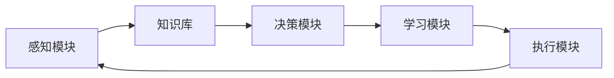

# AI Agent: AI的下一个风口 智能体的五种超能力

## 1. 背景介绍
### 1.1 问题的由来
人工智能(Artificial Intelligence, AI)技术的快速发展，正在深刻改变着我们的生活和工作方式。从语音助手、智能客服到自动驾驶汽车，AI无处不在。然而，当前的AI系统大多是专用于特定任务的"狭义AI"，缺乏通用智能和自主学习能力。为了实现更加智能、自主、高效的AI系统，业界和学界开始将目光投向了一个新的研究方向——AI Agent(智能体)。

### 1.2 研究现状
近年来，AI Agent成为了人工智能领域的研究热点。谷歌DeepMind、OpenAI、微软等科技巨头纷纷投入巨资，研发新一代的AI Agent系统。DeepMind的AlphaGo、OpenAI的GPT-3、微软的Tay聊天机器人等，都是AI Agent技术的代表性成果。学术界方面，AAAI、IJCAI、NeurIPS等顶级会议也将AI Agent列为重点议题，吸引了大量优秀论文投稿。

### 1.3 研究意义  
AI Agent代表了人工智能技术的新方向和新高度。与传统的AI系统相比，AI Agent具有更强的自主性、适应性和泛化能力。它能够主动感知环境，自主学习新知识，动态调整策略以适应不同任务。AI Agent有望在智能助理、智能教育、自动驾驶、智慧城市等领域取得重大突破，极大提升AI系统的实用价值。因此，深入研究AI Agent的核心原理和关键技术，对于推动人工智能的进一步发展具有重要意义。

### 1.4 本文结构
本文将围绕AI Agent的核心概念、原理、方法、应用等方面展开深入探讨。第2部分介绍AI Agent的核心概念和特点。第3部分重点阐述AI Agent的核心算法原理和实现步骤。第4部分从数学角度对AI Agent的模型和公式进行详细推导和举例说明。第5部分给出AI Agent的代码实例和详细解读。第6部分讨论AI Agent在实际场景中的应用案例。第7部分推荐AI Agent相关的学习资源和开发工具。第8部分总结全文并展望AI Agent的未来发展方向。

## 2. 核心概念与联系

AI Agent，即人工智能体，是能够感知环境并采取行动以实现特定目标的自主实体。它集成了感知、决策、学习、执行等多种人工智能能力，可以在动态复杂的环境中自主运行。与传统的AI系统相比，AI Agent具有以下鲜明特点:

- 自主性：Agent能够根据自身的感知和知识，自主地制定和执行行动策略，无需人工干预。
- 社会性：多个Agent可以在同一环境下协作或竞争，表现出群体智能。  
- 适应性：面对环境的变化，Agent能够及时调整策略，快速适应新情况。
- 泛化性：Agent掌握的知识和技能可以迁移到相似的新任务中，具有一定的通用智能。

从技术架构上看，一个典型的AI Agent系统通常包含以下关键组件:

- 感知模块：负责接收来自环境的各种信息输入，如图像、语音、文本等。
- 知识库：存储Agent已有的领域知识、规则策略等内容。
- 决策模块：根据感知信息和已有知识，进行推理分析，生成行动决策。
- 学习模块：通过数据或经验，对知识库和决策模型进行更新优化。
- 执行模块：根据决策结果，控制Agent在环境中采取相应行动。

总的来说，AI Agent代表了一种更加智能化、自动化、人性化的人工智能新范式。它的核心在于，如何通过机器学习等技术，让计算机系统具备主动感知、自主决策、持续学习的能力，从而更好地理解和服务于人类。这需要在认知科学、人工智能、大数据分析等多学科知识的交叉融合中不断探索前行。

## 3. 核心算法原理 & 具体操作步骤
### 3.1 算法原理概述
AI Agent的核心算法主要基于强化学习(Reinforcement Learning, RL)的思想。RL是一种让Agent通过与环境的交互来学习最优行为策略的机器学习范式。具体来说，Agent在每个时间步接收环境的状态(State)，根据当前策略(Policy)采取一个行动(Action)，环境对该行动给出即时奖励(Reward)，并更新到下一个状态。Agent的目标是最大化长期累积奖励，通过不断尝试和优化来学习最佳策略。

主流的RL算法可分为以下三类:

- 值函数(Value-based)方法：通过学习状态价值函数(如Q-learning)来选择行动。
- 策略梯度(Policy Gradient)方法：直接学习最优策略函数的参数(如REINFORCE)。 
- 演员-评论家(Actor-Critic)方法：结合值函数和策略函数(如A3C)。

此外，为了提升Agent的泛化学习能力，还引入了一些前沿的RL技术，如多任务学习、迁移学习、元学习、逆向RL等。这些方法能够让Agent在多个任务间复用知识，从少量样本中快速学习，主动设计奖励函数等。

### 3.2 算法步骤详解
下面以经典的Q-learning算法为例，详细说明RL的基本步骤:

1. 初始化Q表格 $Q(s,a)$，存储各个状态-行动对的价值估计，一般初始化为0。

2. 重复下列步骤，直到达到终止条件(如最大训练轮数):
   
   - 根据$\epsilon$-贪婪策略选择行动$a_t$: 以$\epsilon$的概率随机选择，否则选择$Q(s_t,a)$最大的$a$。
   
   - 执行行动$a_t$，观察环境反馈的奖励$r_t$和下一状态$s_{t+1}$。
   
   - 更新$Q(s_t,a_t)$的估计值:
     $$Q(s_t,a_t) \leftarrow Q(s_t,a_t) + \alpha [r_t + \gamma \max_a Q(s_{t+1},a) - Q(s_t,a_t)]$$
     其中，$\alpha$是学习率，$\gamma$是折扣因子。
   
   - $s_t \leftarrow s_{t+1}$，开始下一轮迭代。

3. 输出最终学到的Q表格，即为最优策略。

为了提高Q-learning的稳定性和效率，一般还会引入经验回放(Experience Replay)机制，即把每轮的$(s_t, a_t, r_t, s_{t+1})$存入回放缓冲区，之后从中随机抽取小批量数据进行Q值更新。这样可以打破数据的相关性，避免更新的震荡。

### 3.3 算法优缺点
Q-learning的主要优点是:
- 简单易实现，适合离散状态和行动空间。
- 能够收敛到最优策略，有理论保证。
- 通过值函数估计，可以平衡探索和利用。

但它也存在一些局限性:
- 状态和行动空间过大时，Q表格难以存储和更新。
- 难以处理连续状态和行动空间。
- 数据利用效率低，更新速度慢。

为了克服这些问题，后续出现了一系列改进算法，如DQN、DDPG、PPO、SAC等。它们通过深度神经网络、策略梯度、熵最大化等技术，大幅提升了RL算法在复杂环境下的表现。未来RL算法的重点是进一步提高样本效率、稳定性和泛化能力，以实现更加智能和自主的Agent。

### 3.4 算法应用领域
RL及其变种算法被广泛应用于以下领域:

- 游戏AI：如Go、Chess、Atari、StarCraft等。
- 机器人控制：强化学习使机器人能够自主学习运动技能。
- 自然语言处理：对话系统、机器翻译、文本生成等任务。  
- 推荐系统：根据用户反馈动态优化推荐策略。
- 智能交通：自动驾驶、交通信号控制等。
- 金融投资：股票交易、投资组合优化等。

未来，RL有望在更多领域实现智能自主系统的突破，让AI Agent成为推动生产生活变革的关键力量。

## 4. 数学模型和公式 & 详细讲解 & 举例说明
### 4.1 数学模型构建
RL问题可以用马尔可夫决策过程(Markov Decision Process, MDP)来建模。一个MDP由以下元素组成:

- 状态集合 $\mathcal{S}$
- 行动集合 $\mathcal{A}$ 
- 状态转移概率 $\mathcal{P}(s'|s,a)$
- 奖励函数 $\mathcal{R}(s,a)$
- 折扣因子 $\gamma \in [0,1]$

其中，$\mathcal{P}(s'|s,a)$表示在状态$s$下采取行动$a$后转移到状态$s'$的概率。$\mathcal{R}(s,a)$表示在状态$s$下采取行动$a$能获得的即时奖励。$\gamma$表示未来奖励的折算率，$\gamma$越大，则Agent越重视长远利益。

RL的目标是寻找一个最优策略$\pi^*: \mathcal{S} \rightarrow \mathcal{A}$，使得长期期望奖励最大化:

$$\pi^* = \arg\max_{\pi} \mathbb{E}\left[\sum_{t=0}^{\infty} \gamma^t \mathcal{R}(s_t,\pi(s_t)) \right]$$

直觉上，最优策略倾向于选择能带来高累积奖励(即高价值)的行动。因此，RL的核心是学习价值函数，即状态价值函数$V^{\pi}(s)$和行动价值函数$Q^{\pi}(s,a)$:

$$V^{\pi}(s) = \mathbb{E}\left[\sum_{t=0}^{\infty} \gamma^t \mathcal{R}(s_t,\pi(s_t)) | s_0=s \right]$$

$$Q^{\pi}(s,a) = \mathbb{E}\left[\sum_{t=0}^{\infty} \gamma^t \mathcal{R}(s_t,\pi(s_t)) | s_0=s, a_0=a \right]$$

直观地，$V^{\pi}(s)$表示从状态$s$开始，遵循策略$\pi$能获得的期望累积奖励。$Q^{\pi}(s,a)$表示从状态$s$开始，先采取行动$a$，再遵循策略$\pi$能获得的期望累积奖励。两者满足贝尔曼方程(Bellman Equation):

$$V^{\pi}(s) = \sum_{a \in \mathcal{A}} \pi(a|s) \left[ \mathcal{R}(s,a) + \gamma \sum_{s' \in \mathcal{S}} \mathcal{P}(s'|s,a) V^{\pi}(s') \right]$$

$$Q^{\pi}(s,a) = \mathcal{R}(s,a) + \gamma \sum_{s' \in \mathcal{S}} \mathcal{P}(s'|s,a) \sum_{a' \in \mathcal{A}} \pi(a'|s') Q^{\pi}(s',a')$$

最优价值函数$V^*(s)$和$Q^*(s,a)$满足最优贝尔曼方程:

$$V^*(s) = \max_{a \in \mathcal{A}} \left[ \mathcal{R}(s,a) + \gamma \sum_{s' \in \mathcal{S}} \mathcal{P}(s'|s,a) V^*(s') \right]$$

$$Q^*(s,a) = \mathcal{R}(s,a) + \gamma \sum_{s' \in \mathcal{S}} \mathcal{P}(s'|s,a) \max_{a' \in \mathcal{A}} Q^*(s',a')$$

因此，只要学到最优Q函数$Q^*(s,a)$，就可以导出最优策略:

$$\pi^*(s) = \arg\max_{a \in \mathcal{A}} Q^*(s,a)$$

即总是选择Q值最大的行动。这就是Q-learning算法的理论基础。

### 4.