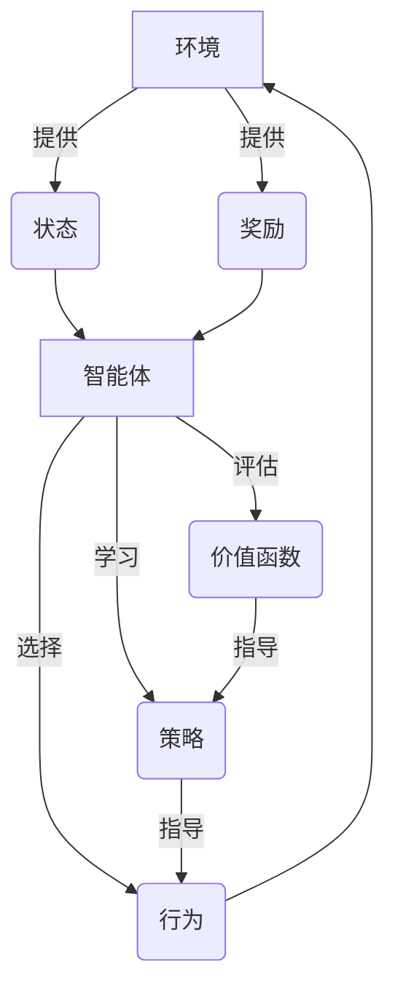

以下是标题为《AI Agent: AI的下一个风口 自主决策的重要性》的技术博客文章正文内容：

# AI Agent: AI的下一个风口 自主决策的重要性

## 1. 背景介绍

### 1.1 问题的由来

随着人工智能(AI)技术的不断发展和应用领域的扩展,AI系统的自主决策能力变得越来越重要。传统的AI系统通常被设计为执行特定任务或遵循预定义的规则,但在复杂动态环境中,它们往往难以做出最优决策。为了使AI系统能够适应不断变化的环境并提供更智能的解决方案,赋予它们自主决策的能力变得至关重要。

### 1.2 研究现状  

目前,自主决策AI系统的研究主要集中在以下几个领域:

1. **强化学习(Reinforcement Learning)**: 通过与环境的交互,AI系统学习做出最优决策以获得最大回报。
2. **多智能体系统(Multi-Agent Systems)**: 多个AI智能体通过协作或竞争来完成任务,需要做出协调一致的决策。
3. **决策理论(Decision Theory)**: 研究如何在不确定性和风险下做出理性决策。
4. **规划与调度(Planning and Scheduling)**: 为实现特定目标制定行动计划和资源分配方案。

### 1.3 研究意义

赋予AI系统自主决策能力,可以带来诸多好处:

1. **提高效率**: AI系统可以根据实时情况做出最优决策,无需人工干预,提高工作效率。
2. **降低风险**: 在危险环境中,自主AI系统可以替代人工,降低人员伤亡风险。
3. **扩展应用范围**: 自主决策使AI系统能够应用于更多复杂动态的领域,如无人驾驶、机器人控制等。
4. **提升智能水平**: 自主决策是通向通用人工智能(AGI)的关键一步。

### 1.4 本文结构

本文将首先介绍自主决策AI系统的核心概念,然后深入探讨其算法原理、数学模型和实现方法。接着,我们将分析实际应用场景,并就未来发展趋势和挑战展开讨论。最后,我们将推荐一些有用的工具和资源,以帮助读者进一步学习和实践。

## 2. 核心概念与联系

自主决策AI系统的核心概念包括:

1. **智能体(Agent)**: 能够感知环境、做出决策并执行行为的自主实体。
2. **环境(Environment)**: 智能体所处的外部世界,包括状态和奖惩机制。
3. **状态(State)**: 描述环境当前情况的一组观测值。
4. **行为(Action)**: 智能体对环境采取的操作。
5. **奖励(Reward)**: 环境对智能体行为的反馈,用于指导智能体学习。
6. **策略(Policy)**: 智能体在每个状态下选择行为的规则或函数。
7. **价值函数(Value Function)**: 评估一个状态或状态-行为对的长期回报。

这些概念之间的关系如下所示:



智能体通过与环境交互,不断优化其策略和价值函数,从而做出更好的决策。这个过程是自主决策AI系统的核心。

## 3. 核心算法原理 & 具体操作步骤  

### 3.1 算法原理概述

自主决策AI系统的核心算法主要包括强化学习和基于模型的规划算法。

**强化学习算法**通过与环境交互,学习到一个优化的策略,使得智能体在该策略指导下的期望累积奖励最大化。主要算法包括:

- Q-Learning
- Sarsa
- Policy Gradient
- Actor-Critic

**基于模型的规划算法**则是基于对环境的模型,通过模拟推演计算出最优行为序列。主要算法有:

- 价值迭代(Value Iteration)
- 策略迭代(Policy Iteration)
- 蒙特卡罗树搜索(Monte Carlo Tree Search)

无论是强化学习还是规划算法,都需要权衡探索(Exploration)和利用(Exploitation)之间的平衡。

### 3.2 算法步骤详解

以Q-Learning算法为例,其核心步骤如下:

1. **初始化**: 初始化Q值函数Q(s,a)为任意值(如全为0)。
2. **选择行为**: 在当前状态s下,根据某种策略(如ε-贪婪)选择行为a。
3. **执行行为**: 执行选择的行为a,获得奖励r和下一状态s'。
4. **更新Q值**: 根据下式更新Q(s,a):

$$Q(s,a) \leftarrow Q(s,a) + \alpha[r + \gamma\max_{a'}Q(s',a') - Q(s,a)]$$

其中,α是学习率,γ是折扣因子。
5. **迭代**: 重复步骤2-4,直到收敛或达到停止条件。

通过不断更新Q值函数,最终可以得到一个近似最优的策略π*(s) = argmax_a Q(s,a)。

### 3.3 算法优缺点

**优点**:

- 无需事先了解环境的转移概率模型,可以通过试错学习。
- 算法相对简单,易于实现和理解。
- 适用于连续和离散的状态空间。

**缺点**:  

- 收敛速度较慢,需要大量的样本数据。
- 可能陷入局部最优,无法找到全局最优解。
- 维数灾难问题,当状态空间过大时计算代价高昂。

### 3.4 算法应用领域

自主决策算法在诸多领域有着广泛应用:

- **机器人控制**: 使机器人能够自主导航、操作等。
- **游戏AI**: 训练AI智能体在游戏中做出最优决策。  
- **资源管理**: 优化资源分配和调度。
- **投资决策**: 根据市场行情做出买卖决策。
- **无人驾驶**: 控制车辆在复杂交通环境中安全行驶。

## 4. 数学模型和公式 & 详细讲解 & 举例说明

### 4.1 数学模型构建  

自主决策问题通常建模为**马尔可夫决策过程(Markov Decision Process, MDP)**。一个MDP可以用元组<S, A, P, R, γ>来表示:

- S是状态空间的集合
- A是行为空间的集合  
- P是状态转移概率函数P(s'|s,a)
- R是奖励函数R(s,a,s')
- γ∈[0,1]是折扣因子

在MDP中,智能体的目标是找到一个策略π:S→A,使得期望累积折扣奖励最大化:

$$\max_\pi E\left[\sum_{t=0}^\infty \gamma^t R(s_t, a_t, s_{t+1})\right]$$

其中,s_t和a_t分别表示时刻t的状态和行为。

我们还可以定义状态价值函数V^π(s)和状态-行为价值函数Q^π(s,a),分别表示在策略π下从状态s开始,以及从状态s执行行为a开始的期望累积奖励:

$$V^\pi(s) = E_\pi\left[\sum_{t=0}^\infty \gamma^t R(s_t, a_t, s_{t+1})\mid s_0=s\right]$$
$$Q^\pi(s,a) = E_\pi\left[\sum_{t=0}^\infty \gamma^t R(s_t, a_t, s_{t+1})\mid s_0=s, a_0=a\right]$$

这些价值函数满足贝尔曼方程:

$$V^\pi(s) = \sum_{a\in A}\pi(a|s)Q^\pi(s,a)$$
$$Q^\pi(s,a) = R(s,a) + \gamma\sum_{s'\in S}P(s'|s,a)V^\pi(s')$$

求解MDP就是找到一个使V^π(s)最大化的最优策略π*。

### 4.2 公式推导过程

以Q-Learning算法为例,我们推导其更新公式的过程。

定义最优Q值函数为:

$$Q^*(s,a) = \max_\pi E_\pi\left[\sum_{t=0}^\infty \gamma^t R(s_t, a_t, s_{t+1})\mid s_0=s, a_0=a\right]$$

根据贝尔曼最优方程,有:

$$\begin{aligned}
Q^*(s,a) &= R(s,a) + \gamma\sum_{s'\in S}P(s'|s,a)\max_{a'}Q^*(s',a')\\
          &= R(s,a) + \gamma\max_{a'}\sum_{s'\in S}P(s'|s,a)Q^*(s',a')
\end{aligned}$$

我们用Q(s,a)来估计Q*(s,a),并在每次迭代时更新Q(s,a)使其逼近Q*(s,a)。假设当前状态为s,执行行为a,获得奖励r并转移到状态s',则更新公式为:

$$Q(s,a) \leftarrow Q(s,a) + \alpha\left[r + \gamma\max_{a'}Q(s',a') - Q(s,a)\right]$$

其中,α是学习率,控制更新幅度。可以证明,在满足一定条件下,Q(s,a)将收敛到Q*(s,a)。

### 4.3 案例分析与讲解

考虑一个简单的网格世界,智能体的目标是从起点到达终点。


设置如下奖励:

- 到达终点获得+10的奖励
- 其他状态获得-1的奖励(惩罚)

我们用Q-Learning算法训练一个智能体找到最优路径。初始时,Q值函数全为0。假设学习率α=0.1,折扣因子γ=0.9。

在状态A下,智能体可选择向右(动作a1)或向下(动作a2)移动。假设它选择a1,转移到B状态,获得-1的奖励。则Q(A,a1)的更新为:

$$Q(A,a1) \leftarrow Q(A,a1) + 0.1[-1 + 0.9\max_{a'}Q(B,a') - Q(A,a1)]$$

经过多次试错,Q值函数将逐渐收敛,智能体可以学会选择最优路径到达终点。

### 4.4 常见问题解答  

**1. 为什么需要折扣因子γ?**

折扣因子γ的作用是对未来的奖励进行折扣,使得智能体更关注当前的即时奖励,而不会过度追求遥远的奖励。这样可以加速收敛,并避免累积奖励发散。

**2. 如何权衡探索与利用?**

这是强化学习中的一个核心问题。过多探索会导致效率低下,而过多利用则可能陷入局部最优。常见的解决方法包括ε-贪婪策略、软max策略等,在探索和利用之间寻求平衡。

**3. 如何解决维数灾难问题?**

当状态空间过大时,传统的表格型Q-Learning将变得低效。解决方案包括:

- 使用函数逼近,如神经网络,来估计Q值函数。
- 采用基于模型的规划算法,如蒙特卡罗树搜索。
- 利用状态抽象、层次化等技术降低问题的复杂度。

**4. 自主决策AI系统如何确保安全?**

安全性是自主决策AI的一个重要考虑因素。常见的解决方法包括:

- 设置奖惩机制,惩罚不安全行为。
- 引入约束条件,限制行为在安全范围内。  
- 监督学习,人工干预纠正不安全决策。
- 建立安全模型,预测并避免潜在风险。

## 5. 项目实践:代码实例和详细解释说明

### 5.1 开发环境搭建

我们将使用Python和强化学习库Stable Baselines实现一个简单的自主决策AI系统。首先,需要安装相关依赖库:

```bash
pip install stable-baselines[mpi]==2.10.0 gym==0.17.2 numpy==1.18.5
```

### 5.2 源代码详细实现 

我们以经典