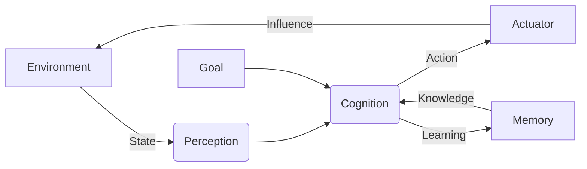

# AI Agent: AI的下一个风口 解决方案与研究方向

关键词：人工智能、智能Agent、深度学习、强化学习、多Agent系统、知识图谱、可解释AI、AI安全

## 1. 背景介绍
### 1.1 问题的由来
人工智能(Artificial Intelligence, AI)在过去的几十年中取得了长足的进步。从早期的专家系统,到如今基于深度学习的AI系统,AI正在深刻地改变着我们的生活和工作方式。然而,当前的AI系统大多是专用于特定任务的,缺乏通用智能和自主学习的能力。为了进一步推动AI的发展,我们需要研究更加智能、自主、安全的AI Agent。

### 1.2 研究现状 
目前,AI领域的研究主要集中在以下几个方向:

1. 深度学习:利用深度神经网络从大规模数据中学习特征和模型,在计算机视觉、自然语言处理等领域取得了显著成果。
2. 强化学习:通过与环境的交互,使Agent学会自主地采取行动以最大化累积奖励。DeepMind的AlphaGo就是一个典型的例子。
3. 多Agent系统:研究多个智能体之间的协作与竞争,解决分布式决策、资源分配等问题。在智能交通、电子商务等领域有广泛应用。
4. 知识图谱:通过构建实体及其关系的语义网络,赋予AI系统以知识理解和推理的能力。
5. 可解释AI:让AI系统的决策过程透明化,增强其可解释性和可信度。
6. AI安全:研究AI系统的鲁棒性、隐私保护和伦理道德问题,确保AI造福人类。

### 1.3 研究意义
智能Agent作为连接现实世界与AI系统的纽带,在推动AI落地应用中扮演着关键角色。通过研究AI Agent,我们可以:

1. 探索通用人工智能的实现路径,创造出具备多种认知和决策能力的智能系统。
2. 提升AI系统的自主性和适应性,使其能够在动态复杂的真实环境中高效运行。  
3. 促进人机协作,开发出更加智能、友好、可信的人机交互系统。
4. 推动AI在各行各业的应用,助力传统产业的智能化升级。

### 1.4 本文结构
本文将围绕AI Agent的研究现状、关键技术、应用场景等方面展开论述。第2节介绍AI Agent的核心概念;第3节重点阐述几种主流的Agent构建算法;第4节建立Agent的数学模型并给出求解方法;第5节通过代码实例演示如何开发一个智能Agent;第6节展望AI Agent的应用前景;第7节推荐相关学习资源;第8节总结全文并分析未来的机遇与挑战。

## 2. 核心概念与联系
AI Agent是一种能够感知环境、自主行动,并通过学习不断提升性能的人工智能系统。它包含以下核心要素:

- 感知(Perception):通过传感器获取外界信息。
- 认知(Cognition):对信息进行理解、推理和决策。
- 行动(Action):执行动作,对环境产生影响。
- 学习(Learning):根据反馈优化认知和决策模型。
- 目标(Goal):Agent的行为受特定目标函数驱动。

这些要素相互关联,共同构成了一个完整的感知-决策-行动闭环。Agent通过不断与环境交互,利用获得的反馈信号学习和进化,以期实现既定目标。

AI Agent的研究涉及多个AI分支领域。其中,机器学习为Agent提供了学习能力,使其能够从数据中总结规律;深度学习则利用多层神经网络增强了Agent的感知和认知能力;强化学习则教会Agent如何采取最优行动以获得最大化回报;知识图谱则为Agent注入了外部知识,提升了其理解和决策的准确性;多Agent系统则让多个Agent协同工作,完成单个Agent无法胜任的复杂任务。

下图展示了一个典型AI Agent的系统架构和信息流:



## 3. 核心算法原理 & 具体操作步骤
### 3.1 算法原理概述
构建AI Agent的核心是设计高效的学习和决策算法。当前主流的方法包括:

1. 深度强化学习(Deep Reinforcement Learning):将深度学习与强化学习相结合,使Agent学会自主决策。
2. 多智能体学习(Multi-agent Learning):研究多个Agent在同一环境下的学习和博弈问题。
3. 逆强化学习(Inverse Reinforcement Learning):通过观察专家的行为,推导出其优化的目标函数。
4. 模仿学习(Imitation Learning):让Agent通过模仿专家示范的行为来快速掌握技能。
5. 元学习(Meta Learning):训练一个Agent学会如何快速学习新任务的通用技能。

### 3.2 算法步骤详解
以深度强化学习为例,其主要步骤如下:

1. 状态表示:将Agent接收到的原始感知信号转换为一个紧凑的状态向量。常用的方法有卷积神经网络、循环神经网络等。
2. 策略网络:根据状态向量,输出每个可选动作的概率分布。可以用深度神经网络来拟合策略函数。 
3. 价值网络:评估每个状态下Agent的期望长期收益。同样用神经网络来拟合价值函数。
4. 经验回放:将Agent与环境交互产生的数据组织成状态-动作-奖励-下一状态的四元组,用于离线训练。
5. 目标网络:为了提高学习稳定性,固定一个旧的价值网络用于计算学习目标。
6. 探索与利用:在学习初期多采取探索性动作,在后期则要利用已有知识最大化奖励。

算法流程可以用下面的伪代码表示:

```
Initialize policy network π and value network Q
Initialize target value network Q'
Initialize experience replay buffer B

For each episode:
    Reset environment and get initial state s
    While not done:
        Sample action a from π(s) with exploration
        Execute a and observe reward r and next state s'
        Store (s, a, r, s') in B
        Sample a batch of (s, a, r, s') from B
        Compute target value y = r + γ max_a' Q'(s', a')
        Update Q by minimizing (y - Q(s, a))^2
        Update π by policy gradient ascent
        Update Q' by soft update
        s = s'
```

### 3.3 算法优缺点
深度强化学习的优点在于:

1. 端到端学习,直接从原始数据中学习策略,不需要人工提取特征。
2. 在高维、连续状态和动作空间中表现良好。
3. 通过深度神经网络实现强大的函数拟合能力。

但它也存在一些缺陷:

1. 样本效率低,需要大量的与环境交互数据。
2. 对超参数敏感,调参困难。
3. 学到的策略不具备可解释性。
4. 在稀疏奖励和长期回报的任务上表现不佳。

### 3.4 算法应用领域
深度强化学习在以下领域取得了瞩目成就:

1. 游戏:AI在围棋、国际象棋、星际争霸等复杂游戏中达到甚至超越人类顶尖水平。
2. 机器人控制:学会灵巧操纵和动态运动技能,如开门、抓取、行走、跳跃等。
3. 自动驾驶:端到端学习驾驶策略,实现车道保持、避障、交通信号检测等。
4. 推荐系统:根据用户反馈动态优化推荐策略,提升用户体验。
5. 资源管理:在数据中心、电网、通信网络中实现智能调度和动态分配。

## 4. 数学模型和公式 & 详细讲解 & 举例说明
### 4.1 数学模型构建
强化学习可以用马尔可夫决策过程(Markov Decision Process, MDP)来建模。一个MDP由以下元素组成:

- 状态空间 $\mathcal{S}$:Agent可能处于的所有状态的集合。
- 动作空间 $\mathcal{A}$:Agent可以采取的所有动作的集合。
- 转移概率 $\mathcal{P}(s'|s,a)$:在状态 $s$ 下执行动作 $a$ 后转移到状态 $s'$ 的概率。
- 奖励函数 $\mathcal{R}(s,a)$:在状态 $s$ 下执行动作 $a$ 后获得的即时奖励。
- 折扣因子 $\gamma \in [0,1]$:未来奖励的衰减率,用于平衡短期和长期收益。

Agent的目标是学习一个策略 $\pi(a|s)$,使得期望累积奖励最大化:

$$
\pi^* = \arg\max_{\pi} \mathbb{E} \left[ \sum_{t=0}^{\infty} \gamma^t \mathcal{R}(s_t,a_t) | a_t \sim \pi(\cdot|s_t) \right]
$$

其中, $\pi^*$ 表示最优策略, $\mathbb{E}$ 表示期望, $t$ 为时间步。

### 4.2 公式推导过程
为了求解最优策略,我们引入价值函数 $V^{\pi}(s)$ 和动作价值函数 $Q^{\pi}(s,a)$:

$$
V^{\pi}(s) = \mathbb{E} \left[ \sum_{t=0}^{\infty} \gamma^t \mathcal{R}(s_t,a_t) | s_0=s, a_t \sim \pi(\cdot|s_t) \right]
$$

$$
Q^{\pi}(s,a) = \mathbb{E} \left[ \sum_{t=0}^{\infty} \gamma^t \mathcal{R}(s_t,a_t) | s_0=s, a_0=a, a_t \sim \pi(\cdot|s_t) \right]
$$

$V^{\pi}(s)$ 表示从状态 $s$ 开始,遵循策略 $\pi$ 的期望累积奖励。 $Q^{\pi}(s,a)$ 表示从状态 $s$ 开始,先执行动作 $a$,再遵循策略 $\pi$ 的期望累积奖励。

两者满足贝尔曼方程(Bellman Equation):

$$
V^{\pi}(s) = \sum_{a} \pi(a|s) \left[ \mathcal{R}(s,a) + \gamma \sum_{s'} \mathcal{P}(s'|s,a) V^{\pi}(s') \right]
$$

$$
Q^{\pi}(s,a) = \mathcal{R}(s,a) + \gamma \sum_{s'} \mathcal{P}(s'|s,a) \sum_{a'} \pi(a'|s') Q^{\pi}(s',a')
$$

最优价值函数 $V^*(s)$ 和 $Q^*(s,a)$ 满足最优贝尔曼方程:

$$
V^*(s) = \max_{a} \left[ \mathcal{R}(s,a) + \gamma \sum_{s'} \mathcal{P}(s'|s,a) V^*(s') \right]
$$

$$
Q^*(s,a) = \mathcal{R}(s,a) + \gamma \sum_{s'} \mathcal{P}(s'|s,a) \max_{a'} Q^*(s',a')
$$

求解最优贝尔曼方程即可得到最优策略:

$$
\pi^*(a|s) = \arg\max_{a} Q^*(s,a)
$$

### 4.3 案例分析与讲解
考虑一个简单的网格世界环境,如下图所示:

```
+---+---+---+
| S |   |   |
+---+---+---+
|   |   | G |
+---+---+---+
```

其中, S 表示起始状态, G 表示目标状态。Agent可以执行上下左右四个动作。每走一步奖励为-1,到达目标奖励为+10。

我们可以用价值迭代(Value Iteration)算法求解这个MDP:

1. 初始化每个状态的价值为0。
2. 重复直到收敛:
   - 对每个状态,根据贝尔曼最优方程更新其价值:

     $V(s) \leftarrow \max_{a} \left[ \mathcal{R}(s,a) + \gamma \sum_{s'} \mathcal{P}(s'|s,a) V(s') \right]$