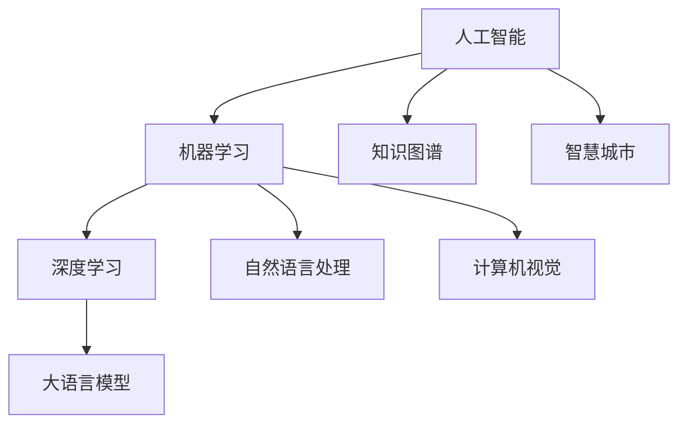

# AI LLM在公共安全领域的应用：预测与预防

关键词：人工智能、大语言模型、公共安全、预测预防、智慧城市

## 1. 背景介绍
### 1.1 问题的由来
随着人工智能技术的快速发展,特别是大语言模型(Large Language Models, LLMs)的出现,AI开始在越来越多的领域发挥重要作用。公共安全是一个关乎国计民生的重大问题,传统的公共安全管理主要依靠人力资源,存在效率低下、响应不及时等问题。利用AI技术来辅助甚至替代人工,对公共安全事件进行预测和预防,已经成为智慧城市建设中的重要课题。

### 1.2 研究现状
目前,国内外已经开始利用机器学习、深度学习等AI技术在公共安全领域进行了初步的研究和应用。比如利用计算机视觉技术对监控视频进行智能分析,通过异常行为检测算法识别潜在的治安隐患;利用自然语言处理技术对网上舆情进行监测,及时发现可能引发社会动荡的苗头;利用知识图谱技术对各类数据进行关联分析,挖掘犯罪分子的社交网络。但总的来说,当前AI在公共安全领域的应用还处于起步阶段,大语言模型等前沿技术的潜力尚未得到充分挖掘。

### 1.3 研究意义 
将先进的AI技术,尤其是强大的大语言模型应用到公共安全管理中,对提升社会治理水平、维护社会稳定具有重要意义:

1. 通过对海量数据的学习,LLMs可以建立起对社会运行规律的深度理解,从而对可能发生的公共安全事件进行预测预警,为相关部门提供决策依据。
2. 利用LLMs强大的语义理解和信息抽取能力,可以高效处理各种非结构化数据如文本、语音、视频等,大幅提升数据分析效率。
3. LLMs可以同时支持对话、问答、数据分析等多种功能,为公共安全管理人员提供智能辅助,提高工作效率。
4. 基于LLMs构建的智能系统可7x24小时运转,及时响应各类突发事件,弥补人力资源的不足。

### 1.4 本文结构
本文将重点探讨大语言模型在公共安全领域的应用。第2部分介绍相关的核心概念;第3部分讲解LLMs的工作原理;第4部分进一步通过数学建模来刻画LLMs的行为特征;第5部分给出基于LLMs的智能预警系统的代码实现;第6部分展望LLMs在公共安全实际场景中的应用前景;第7部分推荐一些工具和资源;第8部分对全文进行总结并指出未来的挑战;第9部分的附录解答一些常见问题。

## 2. 核心概念与联系
- 人工智能(Artificial Intelligence): 研究、开发用于模拟、延伸和扩展人的智能的理论、方法、技术及应用系统的一门新的技术科学。
- 机器学习(Machine Learning): AI的核心,使计算机具有自我学习和自我完善的能力,无需人工编程即可获得新知识。
- 深度学习(Deep Learning):机器学习的一个分支,通过构建多层神经网络,使计算机能够从数据中学习多层次的特征表示。  
- 自然语言处理(Natural Language Processing):研究计算机处理人类语言的一门学科,旨在实现人机之间用自然语言进行有效通信。
- 大语言模型(Large Language Models): 基于深度学习,利用海量语料训练得到的强大的语言理解和生成模型,代表了NLP技术的前沿。
- 知识图谱(Knowledge Graph):用图的方式描述实体及其关联关系的语义网络,是人工智能的重要知识库。
- 计算机视觉(Computer Vision):研究如何使计算机能够"看懂"图像和视频的一门学科。
- 智慧城市(Smart City): 运用物联网、云计算、大数据、AI等新一代信息技术,为城市发展提供智慧化解决方案。

这些概念之间的关系如下图所示:



可以看出,大语言模型是深度学习这一前沿机器学习技术在NLP领域的集大成者。将LLMs与知识图谱、计算机视觉等AI技术相结合,有望在智慧城市的公共安全管理中发挥重要作用。

## 3. 核心算法原理 & 具体操作步骤

### 3.1 算法原理概述
大语言模型的核心是深度神经网络。通过海量语料的训练,LLMs学习到了自然语言的底层规律,可以将文本映射到一个高维语义空间。基于语义向量,LLMs可以进行语义匹配、文本生成、问答对话等灵活的自然语言处理任务。

### 3.2 算法步骤详解
LLMs的训练和应用主要包括以下步骤:

1. 语料收集:从网络、图书、语音等各种渠道收集大规模的文本数据。 
2. 数据清洗:对原始语料进行去重、去噪、格式化等预处理操作。
3. 分词和词向量化:将文本切分成基本词汇单元,并将每个词映射为一个稠密向量。
4. 搭建神经网络:构建多层的Transformer编码器-解码器结构。
5. 模型预训练:用无监督的方式在海量语料上训练LLMs,让其学习通用语言知识。 
6. 模型微调:针对特定任务如文本分类、问答等,在预训练模型的基础上进行监督学习。
7. 模型推理:将训练好的模型部署上线,接收用户输入并给出相应的智能输出。
8. 持续学习:通过人工反馈、主动学习等方式,让LLMs不断从新数据中学习和进化。

### 3.3 算法优缺点
LLMs的主要优点有:
- 强大的语义理解和语言生成能力,可支持多种NLP任务
- 通过预训练学习到的通用语言知识,可以较容易地迁移到新任务
- 端到端的建模方式,减少了人工特征工程

LLMs的局限性包括:
- 需要大规模高质量的语料进行训练,对计算资源要求高
- 模型参数量巨大,推理速度较慢,不适合实时场景
- 容易产生幻觉,生成的内容可能与事实不符
- 难以应对一些强逻辑性、推理性的任务

### 3.4 算法应用领域
得益于其强大的语言理解和生成能力,LLMs可以应用于以下公共安全场景:
- 智能舆情监测:分析互联网信息,及时发现负面言论、谣言等苗头
- 智能情报分析:从海量非结构化数据中抽取关键信息,挖掘不法分子的社交网络
- 智能辅助决策:为公安、应急管理等部门提供智能问答、方案推荐等辅助
- 智能安全巡检:通过文本、语音、视频等多模态分析,对各类场所进行隐患排查

## 4. 数学模型和公式 & 详细讲解 & 举例说明

### 4.1 数学模型构建
LLMs的核心是Transformer模型。设输入文本序列为 $X=(x_1,\ldots,x_n)$,Transformer的编码器将其映射到一个语义表示 $\mathbf{z} \in \mathbb{R}^d$:

$$\mathbf{z} = \text{Encoder}(x_1, \ldots, x_n)$$

解码器根据 $\mathbf{z}$ 生成目标文本 $Y=(y_1,\ldots,y_m)$:

$$P(y_1, \ldots, y_m | \mathbf{z}) = \prod_{i=1}^m P(y_i | y_1, \ldots, y_{i-1}, \mathbf{z})$$

其中 $P(y_i | y_1, \ldots, y_{i-1}, \mathbf{z})$ 由解码器的输出概率分布给出。

Transformer的编码器和解码器都由多个相同的Transformer Block堆叠而成。每个Block包含两个子层:Multi-Head Self-Attention和Feed Forward Network。

Multi-Head Attention的计算公式为:

$$\text{MultiHead}(Q, K, V) = \text{Concat}(\text{head}_1, \ldots, \text{head}_h)W^O$$

其中,

$$\text{head}_i = \text{Attention}(QW_i^Q, KW_i^K, VW_i^V)$$

$$\text{Attention}(Q, K, V) = \text{softmax}(\frac{QK^T}{\sqrt{d_k}})V$$

$Q$,$K$,$V$分别表示query,key,value矩阵,$W_i^Q$,$W_i^K$,$W_i^V$,$W^O$为学习参数矩阵。

Feed Forward Network包含两个线性变换和一个ReLU激活:

$$\text{FFN}(x) = \max(0, xW_1 + b_1)W_2 + b_2$$

### 4.2 公式推导过程
为了让Transformer能够处理序列信息,在输入Token的嵌入向量中加入位置编码(Positional Encoding):

$$\text{PE}(pos, 2i) = \sin(pos/10000^{2i/d_{model}})$$
$$\text{PE}(pos, 2i+1) = \cos(pos/10000^{2i/d_{model}})$$

其中$pos$为Token在序列中的位置,$i$为嵌入向量的维度索引。

在训练时,Transformer的目标是最大化正确目标序列 $Y$ 的对数似然概率:

$$\mathcal{L} = -\sum_{i=1}^m \log P(y_i | y_1, \ldots, y_{i-1}, \mathbf{z})$$

通过随机梯度下降等优化算法最小化损失函数 $\mathcal{L}$ ,可以学习到Transformer的模型参数。

### 4.3 案例分析与讲解
下面我们以一个公共安全领域的智能舆情监测任务为例,来说明LLMs的应用。

假设某社交媒体平台上出现了如下一则谣言:

"昨晚市中心发生重大暴力事件,有不法分子在街头打砸抢烧,大量无辜市民受伤,请大家提高警惕!"

我们希望训练一个基于LLMs的谣言检测模型,判断这则消息是否属于谣言。主要步骤如下:

1. 收集常见谣言和非谣言的语料,构建训练数据集。
2. 在海量网络文本上预训练一个通用的LLM。
3. 在谣言检测数据集上微调预训练好的LLM。
4. 将上述消息输入到微调后的模型,得到其为谣言的概率。
5. 如果谣言概率超过一定阈值,则判定其为谣言,并及时向相关部门预警。

### 4.4 常见问题解答
Q: LLMs需要多大规模的语料才能训练出一个强大的模型?
A: 当前主流的LLMs如GPT-3、PaLM等都是在上百GB甚至上TB的高质量文本语料上训练得到的。语料规模越大,模型的泛化能力就越强。

Q: LLMs的训练需要什么样的计算资源?
A: 训练一个大规模的LLM通常需要数百块高端GPU,耗时数周甚至数月。但预训练好的LLMs可以方便地应用到下游任务中,不需要重新训练。

Q: 如何避免LLMs生成的内容出现事实性错误?
A: 可以考虑将LLMs与知识图谱等结构化知识库相结合,对生成的内容进行事实校验。此外,对模型生成的内容进行人工审核也是必要的。

## 5. 项目实践：代码实例和详细解释说明

### 5.1 开发环境搭建
我们以PyTorch为例,搭建一个基于Transformer的LLM。

首先安装必要的依赖包:

```bash
pip install torch transformers datasets
```

### 5.2 源代码详细实现

定义Transformer模型类:

```python
import torch
import torch.nn as nn
from transformers