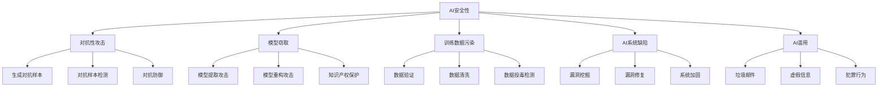

好的,我会严格按照您提供的要求和模板结构来撰写这篇技术博客文章。以下是正文部分:

# AI Security原理与代码实例讲解

## 1. 背景介绍

### 1.1 问题的由来

随着人工智能(AI)技术的快速发展和广泛应用,AI系统的安全性问题也日益受到关注。AI系统不仅面临着传统软件系统所面临的安全威胁,如病毒、木马、黑客攻击等,还存在一些独有的安全风险。

主要来自以下几个方面:

1. **训练数据污染**: 训练数据被恶意篡改或投毒,导致AI模型学习到错误的知识,做出不当的决策和预测。

2. **对抗性攻击**: 通过对输入数据添加细微的扰动,使AI模型产生明显的错误输出,从而达到攻击目的。

3. **模型窃取**: 攻击者试图重建或复制AI模型,窃取其中包含的知识产权和商业机密。

4. **AI系统缺陷**: AI算法、模型和系统中存在的漏洞和缺陷,可被攻击者利用实施攻击。

5. **AI滥用**: 恶意使用AI技术从事违法犯罪活动,如生成虚假信息、发送垃圾邮件等。

这些安全问题如果得不到有效解决,将严重阻碍AI技术的发展和应用。因此,AI安全性研究是当前AI领域一个极其重要且紧迫的课题。

### 1.2 研究现状

近年来,AI安全性研究取得了一些进展,主要集中在以下几个方面:

1. **对抗性攻击与防御**: 研究生成对抗性样本的方法,并提出检测和缓解对抗性攻击的防御机制。

2. **AI系统漏洞挖掘**: 通过模糊测试、符号执行等方法发现AI算法、模型和系统中的安全漏洞。

3. **隐私保护**: 设计可以保护训练数据和模型隐私的AI技术,防止隐私泄露和模型窃取。

4. **可信AI**: 提出AI系统的可靠性、可解释性、公平性和安全性评估标准,增强人们对AI的信任。

5. **AI安全验证**: 借鉴软件正式验证方法,对AI系统进行形式化建模和验证,保证其满足安全性要求。

6. **AI安全工具链**: 开发用于AI系统安全性分析、测试和加固的工具集。

但总的来说,AI安全性研究还处于起步阶段,现有的防御方案大多针对性强、效果有限。随着AI技术的不断发展和应用领域的扩大,AI安全问题将变得更加复杂和严峻。

### 1.3 研究意义 

加强AI安全性研究,提出有效的AI安全防护理论和技术方案,对于保障AI系统的可靠性和安全性、维护社会稳定和国家安全具有重大意义:

1. **促进AI技术健康发展**: 解决AI安全性问题是AI技术可持续发展的前提,有助于消除公众对AI的不信任心理,推动AI技术在各行业的广泛应用。

2. **维护网络空间安全**: AI技术正被广泛应用于网络空间,如果AI系统遭到攻击和滥用,将严重威胁网络基础设施和数据安全。

3. **保障国家安全利益**: AI技术在国防、情报、金融等国家重点领域的应用,其安全性直接关系到国家安全和核心利益。

4. **促进AI伦理和可信发展**: 加强AI安全性研究有助于提高AI系统的可靠性、可解释性和公平性,推动AI技术朝着人类可控、可信赖的方向发展。

5. **培养AI安全人才**: 开展AI安全性教育培训,培养复合型AI安全人才,为AI安全防护提供智力支持。

总之,AI安全性是人工智能可持续发展的关键性课题,具有重大的理论价值和现实意义,需要持续深入的研究和探索。

### 1.4 本文结构

本文将全面介绍AI安全领域的核心理论和技术,主要内容包括:

1. 阐述AI安全的核心概念和重要性。

2. 详细讲解核心AI安全算法原理及实现步骤。 

3. 介绍AI安全数学模型及公式推导过程。

4. 提供AI安全实战项目的代码实例及解释说明。

5. 分析AI安全技术在实际场景中的应用。

6. 推荐AI安全学习资源、开发工具和相关论文。

7. 总结AI安全领域的发展趋势并指出面临的挑战。

8. 解答AI安全常见问题。

希望通过本文的介绍,能够帮助读者全面深入地理解AI安全的本质,掌握核心技术方法,并能将所学知识应用于实践中。

## 2. 核心概念与联系

AI安全性是一个涵盖面很广的概念,其核心内容包括:

1. **对抗性攻击**: 指通过对输入数据添加细微的扰动,使AI模型产生明显错误输出的攻击方式。主要包括生成对抗样本、对抗样本检测和对抗防御等技术。

2. **模型窃取**: 指攻击者试图重建或复制AI模型,窃取其中包含的知识产权和商业机密。主要包括模型提取攻击、模型重构攻击和知识产权保护等技术。

3. **训练数据污染**: 指训练数据被恶意篡改或投毒,导致AI模型学习到错误知识。主要包括数据验证、数据清洗和数据投毒检测等技术。

4. **AI系统缺陷**: 指AI算法、模型和系统中存在的漏洞和缺陷,可被攻击者利用。主要包括漏洞挖掘、漏洞修复和系统加固等技术。

5. **AI滥用**: 指恶意使用AI技术从事违法犯罪活动,如生成虚假信息、发送垃圾邮件等。

这些概念相互关联、环环相扣。比如,对抗性攻击可能导致模型被窃取;训练数据污染可能引发AI系统缺陷;AI系统缺陷又可能被用于AI滥用等。因此,从根本上解决AI安全性问题,需要在上述各个方面采取全方位的防护措施。

## 3. 核心算法原理 & 具体操作步骤

### 3.1 算法原理概述

AI安全领域的核心算法主要包括以下几类:

1. **对抗样本生成算法**: 通过优化输入数据,使其在人眼难以察觉的情况下,对AI模型的输出产生显著影响。常见算法有FGSM、BIM、JSMA等。

2. **对抗样本检测算法**: 检测输入数据是否存在对抗性扰动,从而识别对抗样本。常见算法有基于统计的检测、基于机器学习的检测等。

3. **对抗防御算法**: 提高AI模型对抗性攻击的鲁棒性,避免受到对抗样本的影响。常见算法有对抗训练、防御蒸馏、TRADES等。

4. **模型提取攻击算法**: 通过查询模型的输出,推断出模型的参数和结构。常见算法有方程求解法、基于优化的攻击等。

5. **模型重构攻击算法**: 利用模型的预测结果,训练一个功能相似的替代模型。常见算法有基于知识蒸馏的攻击、基于生成对抗网络的攻击等。

6. **知识产权保护算法**: 通过添加水印、指纹等方式为模型标记所有权,防止模型被窃取。常见算法有基于激活值的水印、基于梯度的水印等。

7. **数据验证算法**: 检测训练数据是否存在污染或投毒,保证数据的完整性和可信度。常见算法有基于统计的检测、基于深度学习的检测等。

8. **AI系统漏洞挖掘算法**: 发现AI算法、模型和系统中存在的安全漏洞和缺陷。常见算法有模糊测试、符号执行、形式化验证等。

这些算法各自针对AI安全的不同方面,但又存在一定的交叉和联系。比如,对抗防御算法可以抵御对抗样本攻击,同时也能提高模型对抗窃取的鲁棒性;知识产权保护算法可以防止模型被窃取,也能一定程度上防止对抗样本攻击等。

### 3.2 算法步骤详解

接下来,我们以**对抗样本生成算法**为例,详细介绍其核心原理和具体实现步骤。

对抗样本生成算法的目标是:对给定的清洁样本数据 $x$,通过添加一个扰动 $\eta$,生成对抗样本 $x^{adv} = x + \eta$,使得:

$$
f(x^{adv}) \neq f(x)
$$

其中, $f(\cdot)$ 表示机器学习模型,即期望生成的对抗样本 $x^{adv}$ 能够使模型 $f$ 的输出发生改变。

常见的对抗样本生成算法包括FGSM(Fast Gradient Sign Method)、BIM(Basic Iterative Method)等,下面以FGSM为例讲解算法步骤:

**FGSM算法步骤**:

1. 输入: 
    - 原始样本 $x$
    - 机器学习模型 $f$
    - 损失函数 $J(x, y)$
    - 扰动大小 $\epsilon$

2. 计算损失函数 $J$ 关于输入 $x$ 的梯度:

$$
\nabla_x J(x, y)
$$

3. 根据梯度符号计算扰动:

$$
\eta = \epsilon \cdot \text{sign}(\nabla_x J(x, y))
$$

4. 生成对抗样本:

$$
x^{adv} = x + \eta
$$

5. 输出: 对抗样本 $x^{adv}$

其中,步骤3是FGSM算法的核心,通过计算损失函数梯度的符号,并乘以一个扰动大小 $\epsilon$,即可得到对抗性扰动 $\eta$。这种方法简单高效,但扰动强度有限。

BIM算法是FGSM的改进版,通过迭代的方式,逐步增大扰动强度,生成更强的对抗样本。其基本思路是:

1. 初始化对抗样本 $x^{adv}_0 = x$

2. 对 $i = 1, 2, \dots, N$:
    - 计算梯度 $\nabla_x J(x^{adv}_{i-1}, y)$  
    - 更新对抗样本:
        $$
        x^{adv}_i = x^{adv}_{i-1} + \alpha \cdot \text{sign}(\nabla_x J(x^{adv}_{i-1}, y))
        $$
    - 裁剪 $x^{adv}_i$ 使其在合法范围内

3. 输出最终对抗样本 $x^{adv}_N$

通过多次迭代,BIM算法可以生成更强的对抗样本,但计算量也更大。

上述算法的实现细节还涉及到诸多问题,如扰动范围的限制、目标模型的选择、针对性攻击等,在实际应用中需要根据具体情况进行调整和改进。

### 3.3 算法优缺点

**优点**:

- 