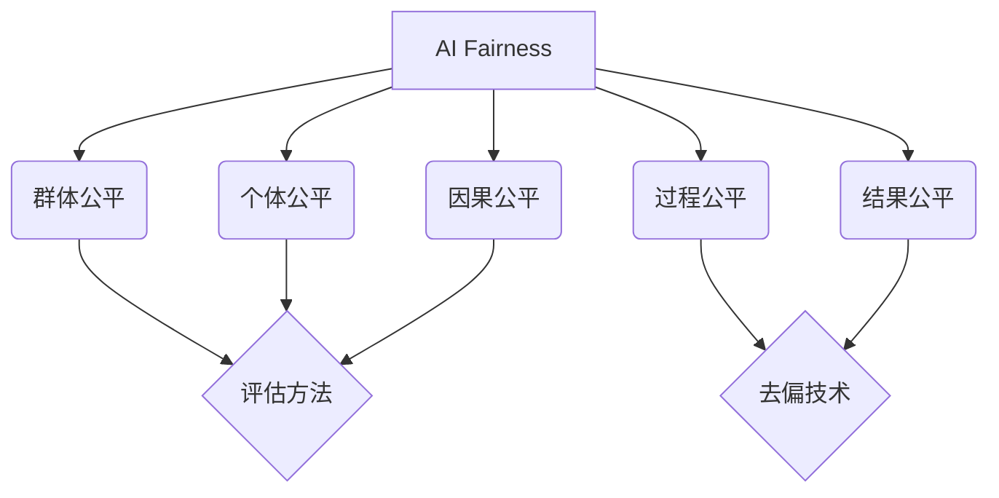

# AIFairness:理论基础与重要性

关键词：AI公平性, 机器学习偏差, 算法歧视, 公平性度量, 去偏技术

## 1. 背景介绍
### 1.1 问题的由来
随着人工智能(AI)技术的快速发展,AI系统在各行各业中得到了广泛应用,如信贷评估、招聘筛选、司法量刑等。然而,人们逐渐发现,AI系统可能会产生偏差和歧视,导致不公平的决策结果。例如,面部识别系统对于深色皮肤的识别准确率较低;信贷评估模型可能会因性别、种族等因素产生歧视性结果。这些问题引起了学界和业界对AI公平性的广泛关注。

### 1.2 研究现状 
目前,AI公平性已成为机器学习和AI伦理领域的重要研究方向。学者们从不同角度对AI公平性进行了探索,主要包括:
1. 从技术角度,研究AI系统产生偏差的原因,提出各种去偏技术,如对抗去偏、因果推理等,以减少模型偏差。
2. 从社会学角度,探讨AI系统中的歧视问题对不同群体的影响,提出公平性的社会学定义和度量指标。
3. 从法律和伦理角度,讨论AI系统的决策应该遵循的公平原则,以及如何通过法律法规和伦理准则来规范AI系统的开发和应用。

### 1.3 研究意义
AI公平性研究对于保障AI系统的公平性和防止歧视具有重要意义:
1. 有助于提高AI系统的决策质量,避免因偏差导致的错误决策。
2. 促进社会公平正义,保护弱势群体权益,防止AI系统加剧社会不平等。
3. 增强公众对AI系统的信任,推动AI技术的健康发展和应用普及。

### 1.4 本文结构
本文将从以下几个方面对AI Fairness进行探讨:
- 介绍AI Fairness的核心概念和研究内容
- 阐述AI系统偏差的成因和表现
- 介绍几种主流的AI去偏技术原理
- 讨论AI Fairness的评估方法和指标 
- 总结AI Fairness领域的发展趋势和挑战

## 2. 核心概念与联系
AI Fairness核心概念包括:
- 群体公平(Group Fairness):要求不同群体在AI系统中获得相似的结果分布。如同等条件下,不同性别的信贷通过率应该相近。
- 个体公平(Individual Fairness):要求相似的个体应该获得相似的结果。个体的相似性可基于特征距离等度量。
- 因果公平(Counterfactual Fairness):要求个体的结果不应受到敏感属性(如性别、种族)的因果影响。
- 过程公平(Procedural Fairness):要求AI系统的决策过程透明、可解释、可质疑。
- 结果公平(Outcome Fairness):关注AI系统产生的结果在不同群体中是否均衡。

这些概念相互关联,共同构成了AI Fairness的理论体系。如下图所示:



## 3. 核心算法原理 & 具体操作步骤
### 3.1 算法原理概述
常见的AI去偏技术可分为三类:
1. 预处理去偏(Pre-processing):在模型训练前对数据进行去偏,如对敏感属性进行均衡化采样。
2. 训练中去偏(In-processing):在模型训练过程中引入公平性约束或正则项,使模型学习到公平的特征表示。
3. 后处理去偏(Post-processing):在模型训练后对模型输出进行校正,如对不同群体设置不同的决策阈值。

### 3.2 算法步骤详解
以对抗去偏(Adversarial Debiasing)为例,其核心思想是在模型训练中引入对抗机制,通过学习一个对抗网络来迫使主模型学习公平的特征表示。步骤如下:

1. 将原始数据集划分为三部分:训练集、验证集和测试集。
2. 搭建模型结构,包括特征提取器、分类器和对抗网络。对抗网络旨在根据特征预测敏感属性。
3. 设计损失函数,包括分类损失和对抗损失。分类损失衡量模型的预测准确性,对抗损失衡量特征表示对敏感属性的依赖性。
4. 训练模型,交替优化三个目标:最小化分类损失、最小化对抗损失、最大化对抗网络的预测损失。通过最小最大博弈,使特征提取器学习公平的特征表示。
5. 在验证集上评估模型性能和公平性,并调整超参数。
6. 在测试集上评估模型的泛化性能和公平性。

### 3.3 算法优缺点
优点:
- 无需对原始数据进行修改,避免了信息损失
- 可以同时兼顾模型性能和公平性
- 适用于多种类型的模型和任务

缺点:  
- 对抗训练不够稳定,容易受到超参数和训练技巧的影响
- 引入对抗机制增加了模型复杂度和训练时间
- 过度去除敏感属性的影响可能损害模型性能

### 3.4 算法应用领域
对抗去偏等AI去偏技术可广泛应用于各种存在公平性需求的领域,如:
- 信贷评估:消除模型对申请人性别、种族等因素的歧视
- 招聘筛选:确保模型对不同背景的求职者一视同仁
- 医疗诊断:避免模型因患者的人口统计学特征产生偏差
- 刑事司法:防止模型在量刑、假释等决策中存在偏见

## 4. 数学模型和公式 & 详细讲解 & 举例说明
### 4.1 数学模型构建
以二分类任务为例,考虑使用对数几率回归模型。记$X$为特征向量,$A$为敏感属性,$Y$为二分类标签。我们优化目标由三部分组成:
1. 最小化分类损失:
$$ \mathcal{L}_{cls}=\mathbb{E}_{(x,y)\sim \mathcal{D}}[y\log(\hat{y})+(1-y)\log(1-\hat{y})]$$
其中$\hat{y}=\sigma(w^Tx)$为模型预测,$\sigma$为sigmoid函数。

2. 最小化对抗损失:
$$ \mathcal{L}_{adv}=\mathbb{E}_{(x,a)\sim \mathcal{D}}[a\log(\hat{a})+(1-a)\log(1-\hat{a})]$$
其中$\hat{a}=\sigma(v^Tz)$为对抗网络的预测,$z$为特征提取器的输出。

3. 最大化对抗网络的预测损失:
$$ \mathcal{L}_{adv\_pred} = -\mathcal{L}_{adv}$$

综合三个损失,我们的优化目标为:
$$\min_{w,u} \max_v \mathcal{L}_{cls} + \lambda \mathcal{L}_{adv} + \mathcal{L}_{adv\_pred}$$
其中$\lambda$为平衡因子,控制公平性和性能的权衡。

### 4.2 公式推导过程
对抗去偏的训练过程可表示为如下的最小最大博弈问题:
$$\min_{w,u} \max_v \mathcal{L}(w,u,v) = \mathcal{L}_{cls}(w,u) + \lambda \mathcal{L}_{adv}(u,v)$$

其中$w$为分类器参数,$u$为特征提取器参数,$v$为对抗网络参数。

根据梯度下降法,参数更新公式为:
$$
\begin{aligned}
w &\leftarrow w - \eta \frac{\partial \mathcal{L}_{cls}}{\partial w} \\
u &\leftarrow u - \eta (\frac{\partial \mathcal{L}_{cls}}{\partial u} + \lambda \frac{\partial \mathcal{L}_{adv}}{\partial u}) \\ 
v &\leftarrow v + \eta \lambda \frac{\partial \mathcal{L}_{adv}}{\partial v}
\end{aligned}
$$
其中$\eta$为学习率。通过交替优化三个参数,使模型学习到公平的特征表示。

### 4.3 案例分析与讲解
以信贷评估任务为例。假设我们有一个包含申请人特征(如收入、信用记录等)和敏感属性(如性别)的数据集。我们的目标是训练一个信贷风险评估模型,在准确预测风险的同时,确保模型对不同性别的申请人一视同仁。

我们可以搭建一个包含特征提取器、风险评估器和性别预测器的神经网络模型。其中,特征提取器负责学习申请人特征的公平表示;风险评估器根据特征表示预测违约风险;性别预测器则尝试根据特征表示预测申请人性别。

在模型训练过程中,我们同时优化三个目标:
1. 最小化风险评估器的预测损失,提高模型的预测准确性;
2. 最小化性别预测器的预测损失,减少特征表示对性别的依赖; 
3. 最大化性别预测器的预测损失,防止其过拟合。

通过这种对抗学习机制,使特征提取器学习到公平的申请人表示,从而使风险评估器的预测结果不受性别的影响。

### 4.4 常见问题解答
Q: 对抗去偏能否彻底消除模型偏差?
A: 对抗去偏虽然能在一定程度上减轻模型偏差,但并非银弹。模型偏差可能源自数据收集、特征选择等多个环节。去偏技术需要与其他措施(如数据脱敏、人工审核)结合使用。

Q: 如何权衡模型的性能和公平性?
A: 这是一个难题。提高公平性往往会损失一定的模型性能。我们可以通过超参数调优来平衡两者,如调节对抗损失的权重。但最终还需要根据具体任务的需求来确定二者的优先级。

## 5. 项目实践：代码实例和详细解释说明
### 5.1 开发环境搭建
本项目基于Python 3和PyTorch实现。首先安装所需依赖:
```
pip install numpy pandas sklearn matplotlib torch
```

### 5.2 源代码详细实现
下面给出对抗去偏的PyTorch实现代码:

```python
import torch
import torch.nn as nn
import torch.optim as optim
from sklearn.metrics import accuracy_score, balanced_accuracy_score

class FeatureExtractor(nn.Module):
    def __init__(self, input_dim, hidden_dim):
        super().__init__()
        self.fc1 = nn.Linear(input_dim, hidden_dim)
        self.fc2 = nn.Linear(hidden_dim, hidden_dim)
        
    def forward(self, x):
        x = torch.relu(self.fc1(x))
        x = torch.relu(self.fc2(x))
        return x

class Classifier(nn.Module):
    def __init__(self, hidden_dim, num_classes):
        super().__init__()
        self.fc = nn.Linear(hidden_dim, num_classes)
        
    def forward(self, x):
        return torch.sigmoid(self.fc(x))

class AdversaryPredictor(nn.Module):
    def __init__(self, hidden_dim, num_groups):
        super().__init__()
        self.fc = nn.Linear(hidden_dim, num_groups)
        
    def forward(self, x):
        return torch.sigmoid(self.fc(x))

def train_epoch(feat_extractor, classifier, adv_predictor, data, target, sensitive, optimizer_c, optimizer_f, optimizer_a, lambda_):
    feat_extractor.train()
    classifier.train()
    adv_predictor.train()
    
    feat = feat_extractor(data)
    y_pred = classifier(feat)
    a_pred = adv_predictor(feat)
    
    loss_c = nn.BCELoss()(y_pred, target)
    loss_a = nn.BCELoss()(a_pred, sensitive)
    
    # Train classifier and feature extractor
    optimizer_c.zero_grad()
    optimizer_f.zero_grad()
    (loss_c + lambda_ * loss_a).backward(retain_graph=True)
    optimizer_f.step()
    optimizer_c.step()
    
    # Train adversary predictor
    optimizer_a.zero_grad()
    (-lambda_ * loss_a).backward()
    optimizer_a.