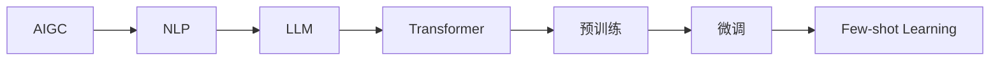

# AIGC从入门到实战：ChatGPT 为什么能生成代码，背后的原理是什么？

作者：禅与计算机程序设计艺术 / Zen and the Art of Computer Programming

## 1. 背景介绍

### 1.1 问题的由来

近年来,人工智能生成内容(AIGC)技术取得了突破性进展,尤其是自然语言处理(NLP)领域的大语言模型(LLM)如 GPT-3、ChatGPT 等,展现出了惊人的内容生成能力,引发业界广泛关注。这些模型不仅能够生成流畅自然的文本,甚至还能根据用户输入的需求生成相应的代码片段。那么,ChatGPT 等大语言模型为什么能生成代码?背后的原理是什么?本文将对此进行深入探讨。

### 1.2 研究现状

目前,业界主流的大语言模型主要基于 Transformer 架构和自监督预训练方法。通过在海量文本数据上进行预训练,模型能够学习到丰富的语言知识和编码规律。在此基础上,再通过特定任务的微调,模型可以适应不同的应用场景,如对话、问答、文本生成等。

代码生成作为 AIGC 的一个重要应用,近年来受到学术界和工业界的广泛关注。微软、OpenAI、DeepMind 等知名机构纷纷推出了自己的代码生成模型和工具,如 GitHub Copilot、OpenAI Codex、AlphaCode 等,展现出了良好的代码补全和生成效果。

### 1.3 研究意义

探究 ChatGPT 等大语言模型生成代码的原理,对于理解 AIGC 技术的内在机制、把握其能力边界具有重要意义。一方面,它有助于我们认识 AIGC 的优势和局限,合理评估其应用前景;另一方面,深入剖析其技术原理,可以为后续的算法改进和模型优化提供思路。同时,将 AIGC 与软件开发相结合,有望极大提升程序员的开发效率,为软件工程领域带来变革性影响。

### 1.4 本文结构

本文将分为以下几个部分展开论述:

- 第2部分介绍 AIGC 中的一些核心概念,厘清它们之间的联系。  
- 第3部分重点阐述 ChatGPT 生成代码的核心算法原理和操作步骤。
- 第4部分从数学角度对算法背后的模型和公式进行推导讲解。
- 第5部分给出具体的代码实例,并逐行解释说明。
- 第6部分分析 AIGC 代码生成在实际场景中的应用情况。
- 第7部分推荐相关的学习资源、开发工具和文献。
- 第8部分总结全文,展望 AIGC 代码生成技术的未来发展趋势和挑战。
- 第9部分的附录解答一些常见问题。

## 2. 核心概念与联系

在正式探讨 ChatGPT 代码生成原理之前,我们有必要先了解 AIGC 领域的一些核心概念:

- **AIGC**: 人工智能生成内容(Artificial Intelligence Generated Content)的简称,指应用人工智能技术自动生成文本、图像、音频、视频等内容的方法。它是人工智能在内容创作领域的延伸应用。

- **NLP**: 自然语言处理(Natural Language Processing)的简称,是人工智能的一个重要分支,旨在赋予计算机理解、生成和处理人类语言的能力。NLP 为 AIGC 提供了重要的技术支撑。

- **LLM**: 大语言模型(Large Language Model)的简称,是 NLP 领域的一类强大模型,通过在海量文本数据上进行预训练,能够学习语言的统计规律和深层语义。GPT 系列就是典型的大语言模型。

- **Transformer**: 一种基于注意力机制的神经网络架构,广泛应用于 NLP 任务。Transformer 通过自注意力机制建模输入序列中元素之间的依赖关系,极大提升了模型并行性和长程依赖捕获能力。主流的大语言模型如 BERT、GPT 等都基于 Transformer 架构。

- **预训练**: 指在大规模无标注数据上对模型进行自监督学习,使其掌握语言的基本规律和表示。预训练是构建大语言模型的关键步骤。常见的预训练任务有语言模型、掩码语言模型等。

- **微调**: 在预训练的基础上,针对特定任务(如对话、问答、摘要等)对模型进行进一步训练,使其适应任务的输入输出格式和目标函数。微调可显著提升模型在下游任务上的表现。

- **Few-shot Learning**: 指模型在很少或零训练样本的情况下完成新任务的能力。大语言模型通过预训练积累的海量知识,具备一定的 few-shot 学习能力,可以根据少量示例或指令生成相关内容。

下图展示了这些概念之间的关系:

由上图可见,AIGC 是 NLP 在内容生成领域的应用延伸,而 NLP 的发展很大程度上得益于 LLM 的突破。LLM 主要基于 Transformer 架构,通过预训练和微调等技术,不断增强语言理解和生成能力,使 few-shot learning 成为可能。这为 AIGC 的发展奠定了坚实的技术基础。

## 3. 核心算法原理 & 具体操作步骤

### 3.1 算法原理概述

ChatGPT 等大语言模型之所以能生成代码,核心在于其强大的语言建模能力。语言模型的目标是学习语言的概率分布,即根据上下文预测下一个词出现的概率。将代码视为一种特殊的语言,大语言模型通过学习海量代码数据中的统计规律和模式,掌握了编程语言的语法、语义和惯用法,从而具备了生成合理、自然代码的能力。

具体来说,ChatGPT 生成代码主要分为两个阶段:预训练和微调。

在预训练阶段,模型在大规模无标注文本语料上进行自监督学习。常见的预训练任务包括:

- **语言模型**: 给定前 n 个词,预测第 n+1 个词。通过最大化文本序列的似然概率,模型可以学习语言的基本规律和统计特性。
- **掩码语言模型**: 随机掩盖输入序列中的部分词,让模型根据上下文预测被掩盖的词。这可以增强模型对深层语义的理解。
- **Next Sentence Prediction**: 判断两个句子在原文中是否相邻。这有助于模型学习语句间的逻辑关系。

通过预训练,模型学习到了语言的通用表示,具备了初步的语言理解和生成能力。

在微调阶段,模型在特定领域的代码数据上进一步训练,学习编程语言的专业知识和编码风格。微调的目标是根据输入的需求描述、函数签名、注释等信息,生成符合要求的代码片段。常见的微调方法有:

- **Code Completion**: 根据已有的代码上下文,预测下一个合适的代码片段,实现代码自动补全。
- **Docstring Generation**: 根据函数签名和注释,生成符合要求的函数实现代码。
- **Bug Fixing**: 根据错误信息和代码上下文,生成修复 bug 的代码片段。

经过在大量代码上的微调,模型进一步强化了编程领域知识,可以根据需求灵活生成代码。

### 3.2 算法步骤详解

接下来,我们以代码补全任务为例,详细说明 ChatGPT 生成代码的步骤:

**Step 1: 构建训练集**

从 GitHub 等开源代码仓库中收集大量高质量的代码文件,涵盖主流的编程语言(如 Python、Java、C++等)和应用领域(如 Web、移动、游戏等)。对代码进行必要的清洗和过滤,确保数据质量。

**Step 2: 代码标记化**

将代码文件转化为模型可以处理的数字化表示。具体地,通过词法分析将代码切分为一系列 token(如关键字、标识符、字面量、特殊符号等),然后将每个 token 映射为唯一的整数 ID。

**Step 3: 构建模型输入**

将标记化后的代码序列划分为固定长度的子序列,每个子序列包含一定数量的 token。为了让模型学习代码的上下文信息,我们通常会在每个子序列的开头添加一些特殊标记,如编程语言、代码功能等。

**Step 4: 模型预训练**

使用 Transformer 等架构构建大规模语言模型,在海量无标注代码数据上进行预训练。以 GPT 为例,预训练的目标是最大化如下的对数似然函数:

$$
\mathcal{L}(\theta)=\sum_{i=1}^{n} \log p_{\theta}\left(x_{i} \mid x_{1}, \ldots, x_{i-1}\right)
$$

其中 $\theta$ 为模型参数,$x_i$ 为第 $i$ 个 token,$n$ 为序列长度。通过不断迭代优化,模型可以学习到代码的统计规律和生成模式。

**Step 5: 模型微调**

在预训练的基础上,使用标注的代码补全数据对模型进行微调。微调数据的格式为 (code_context, code_completion) 对,其中 code_context 为不完整的代码片段,code_completion 为根据上下文生成的后续代码。模型的目标是最小化如下的交叉熵损失:

$$
\mathcal{L}(\theta)=-\sum_{i=1}^{m} \log p_{\theta}\left(y_{i} \mid c_{i}\right)
$$

其中 $c_i$ 为第 $i$ 个训练样本的 code_context,$y_i$ 为对应的 code_completion,$m$ 为训练样本数。经过微调,模型可以更好地适应代码补全任务。

**Step 6: 生成代码**

给定一段不完整的代码作为 prompt,模型可以根据上下文自回归地生成后续代码。具体地,模型将 prompt 编码为隐向量,然后通过解码器逐 token 地预测后续代码片段,直到生成结束标记或达到最大长度。生成过程可以描述为:

$$
\hat{y}=\underset{y}{\operatorname{argmax}} \prod_{i=1}^{k} p_{\theta}\left(y_{i} \mid c, y_{1}, \ldots, y_{i-1}\right)
$$

其中 $c$ 为输入的 code_context,$\hat{y}$ 为生成的 code_completion,$k$ 为生成的最大长度。

### 3.3 算法优缺点

ChatGPT 等大语言模型用于代码生成具有以下优点:

- 泛化能力强,可以根据不同的需求灵活生成代码。
- 生成的代码质量高,可读性和可维护性好。
- 支持多种主流编程语言和应用领域。
- 通过持续学习,可以不断扩充知识和能力。

但同时也存在一些局限性:

- 生成的代码可能存在语法错误或逻辑漏洞,需要人工检查和修改。
- 对于复杂的系统设计和架构问题,生成的代码可能不够完善。 
- 缺乏对代码功能和意图的深度理解,难以生成高度抽象和模块化的代码。
- 训练和推理成本高,对算力和存储要求较高。

### 3.4 算法应用领域

AIGC 代码生成技术可以应用于以下领域:

- 软件开发辅助:通过代码补全、代码搜索、代码推荐等功能,提高开发者的编码效率。
- 编程教育:自动生成编程练习题和参考答案,辅助初学者学习编程。
- 代码安全分析:通过学习大量安全漏洞相关的代码,自动发现和修复代码中的安全隐患。
- 低代码开发平台:根据用户的需求描述,自动生成可视化的应用程序原