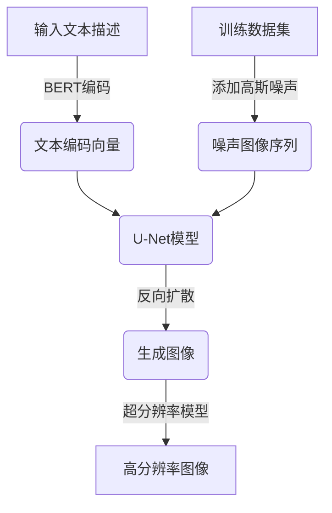

# AIGC从入门到实战：专注：Stable Diffusion，更专业的人物绘画 AI

## 1. 背景介绍

### 1.1 问题的由来

在人工智能时代的到来,图像生成技术正在经历一场革命性的变革。传统的图像生成方法往往需要大量的人工干预和专业技能,这不仅效率低下,而且成本高昂。因此,如何利用人工智能技术自动生成高质量的图像一直是研究人员追求的目标。

随着深度学习技术的不断发展,生成对抗网络(Generative Adversarial Networks, GAN)应运而生,为图像生成领域带来了新的契机。GAN能够从随机噪声中生成逼真的图像,在图像生成、图像翻译、图像超分辨率等领域取得了卓越的成就。然而,GAN也存在着训练不稳定、模式崩溃等问题,限制了其在实际应用中的发展。

### 1.2 研究现状

为了克服GAN的缺陷,扩散模型(Diffusion Models)作为一种新兴的生成模型框架,近年来受到了广泛关注。扩散模型通过学习从高斯噪声到真实数据的反向过程,能够生成高质量、多样化的图像,并且训练过程更加稳定。

Stable Diffusion是一种基于扩散模型的文本到图像生成模型,由Stability AI公司开发。它利用了自回归模型(如BERT)和U-Net等技术,能够根据给定的文本描述生成对应的图像。Stable Diffusion不仅可以生成高质量的图像,而且还具有出色的语义理解能力,能够捕捉文本中的细节和情感。

### 1.3 研究意义

Stable Diffusion的出现为图像生成领域带来了新的机遇,特别是在人物绘画方面,它展现出了巨大的潜力。相比于传统的人物绘画方式,Stable Diffusion具有以下优势:

1. **效率高**:无需专业绘画技能,只需输入文本描述即可快速生成人物图像,大大提高了绘画效率。
2. **质量好**:生成的人物图像质量高,细节丰富,能够捕捉人物的表情、动作和场景等细节。
3. **多样性**:可以生成各种风格、姿态、场景的人物图像,满足不同需求。
4. **可控性**:通过调整文本描述,可以精细控制生成图像的内容和风格。

因此,研究Stable Diffusion在人物绘画领域的应用具有重要的理论和实践意义,有助于推动人工智能技术在艺术创作领域的发展,为艺术家和设计师提供高效的辅助工具。

### 1.4 本文结构

本文将全面介绍Stable Diffusion在人物绘画领域的应用,内容安排如下:

1. 背景介绍:介绍问题由来、研究现状和研究意义。
2. 核心概念与联系:阐述Stable Diffusion的核心概念,并与相关技术进行对比。
3. 核心算法原理与具体操作步骤:详细解释Stable Diffusion的算法原理和操作流程。
4. 数学模型和公式:推导Stable Diffusion所采用的数学模型和公式,并进行案例分析。
5. 项目实践:介绍如何搭建开发环境,展示源代码实现细节,并分析运行结果。
6. 实际应用场景:探讨Stable Diffusion在人物绘画领域的实际应用场景。
7. 工具和资源推荐:推荐相关的学习资源、开发工具、论文和其他资源。
8. 总结:总结研究成果,展望未来发展趋势和面临的挑战。
9. 附录:解答常见问题。

## 2. 核心概念与联系

在深入探讨Stable Diffusion的算法原理之前,我们先来了解一些核心概念,并将其与相关技术进行对比,以加深理解。

### 2.1 扩散模型(Diffusion Models)

扩散模型是一种新兴的生成模型框架,它通过学习从高斯噪声到真实数据的反向过程来生成新的样本。与传统的生成模型(如GAN)不同,扩散模型的训练过程更加稳定,能够生成高质量、多样化的图像。

扩散模型的基本思想是:首先将真实数据(如图像)添加一定量的高斯噪声,得到一系列噪声图像;然后,训练一个反向扩散模型,从噪声图像中逐步去除噪声,最终生成与原始数据接近的新样本。这个过程可以看作是一个马尔可夫链,每一步都会减少一定量的噪声,直到最终生成无噪声的样本。

扩散模型的优点在于:

1. 训练过程稳定,不存在模式崩溃等问题。
2. 生成的样本质量高,细节丰富,多样性强。
3. 可以通过调整噪声水平来控制生成样本的多样性。

缺点是:

1. 训练和推理过程计算量大,效率较低。
2. 对于复杂的数据分布,可能需要更大的模型容量。

### 2.2 Stable Diffusion

Stable Diffusion是一种基于扩散模型的文本到图像生成模型,由Stability AI公司开发。它利用了自回归模型(如BERT)和U-Net等技术,能够根据给定的文本描述生成对应的图像。

Stable Diffusion的核心思想是:首先将文本描述编码为一个潜在空间向量,然后将这个向量与高斯噪声图像输入到一个U-Net模型中,经过多次迭代,最终生成与文本描述相符的图像。

Stable Diffusion的优点在于:

1. 生成的图像质量高,细节丰富,能够捕捉文本中的细节和情感。
2. 具有出色的语义理解能力,可以根据文本描述精确控制生成图像的内容和风格。
3. 训练过程相对稳定,不存在模式崩溃等问题。

缺点是:

1. 推理过程计算量大,生成一张图像需要较长时间。
2. 对于复杂的场景或多个主体,生成效果可能不太理想。
3. 存在一定的偏差和不确定性,生成的图像可能与文本描述不完全吻合。

### 2.3 与相关技术的对比

除了Stable Diffusion,还有一些其他的文本到图像生成模型,如DALL-E、CogView等。这些模型虽然也能根据文本描述生成图像,但与Stable Diffusion相比,存在一些差异:

1. **模型架构**:DALL-E和CogView采用的是基于Transformer的自回归模型,而Stable Diffusion则基于扩散模型和U-Net。
2. **生成质量**:Stable Diffusion生成的图像质量更高,细节更丰富,尤其在人物绘画方面表现出色。
3. **语义理解能力**:Stable Diffusion具有更强的语义理解能力,能够更好地捕捉文本描述中的细节和情感。
4. **训练稳定性**:Stable Diffusion的训练过程更加稳定,不存在模式崩溃等问题。
5. **可控性**:Stable Diffusion可以通过调整文本描述来精细控制生成图像的内容和风格,具有更好的可控性。

总的来说,Stable Diffusion在生成质量、语义理解能力、训练稳定性和可控性方面表现出了优势,因此在人物绘画等领域具有广阔的应用前景。

## 3. 核心算法原理与具体操作步骤

### 3.1 算法原理概述

Stable Diffusion的核心算法原理基于扩散模型和U-Net,可以概括为以下几个主要步骤:

1. **文本编码**:将输入的文本描述编码为一个潜在空间向量,通常采用预训练的自回归模型(如BERT)进行编码。
2. **噪声添加**:将真实图像添加一定量的高斯噪声,得到一系列噪声图像。
3. **反向扩散**:训练一个U-Net模型,从噪声图像中逐步去除噪声,最终生成与文本描述相符的图像。这个过程可以看作是一个马尔可夫链,每一步都会减少一定量的噪声。
4. **条件扩散**:在反向扩散的过程中,将文本编码向量作为条件输入到U-Net模型中,以引导生成与文本描述相符的图像。

算法的关键在于通过条件扩散,将文本信息融入到反向扩散的过程中,从而实现了文本到图像的生成。同时,U-Net模型的卷积和上采样操作能够很好地捕捉图像的空间信息和细节,从而生成高质量的图像。

### 3.2 算法步骤详解

Stable Diffusion算法的具体步骤如下:

1. **文本编码**:使用预训练的BERT模型将输入的文本描述编码为一个768维的向量。
2. **噪声添加**:从训练数据集中随机采样一张图像,并添加不同程度的高斯噪声,得到一系列噪声图像。噪声的程度由一个从0到1的噪声水平参数控制,0表示无噪声(原始图像),1表示完全噪声(高斯噪声图像)。
3. **反向扩散**:使用U-Net模型从噪声图像中逐步去除噪声,生成与文本描述相符的图像。U-Net模型包括一个编码器和一个解码器,编码器将输入图像编码为一个潜在空间向量,解码器则从这个向量重构出图像。
4. **条件扩散**:在反向扩散的每一步,将文本编码向量与当前噪声图像的潜在空间向量进行拼接,作为U-Net模型的输入。这样,U-Net模型不仅可以利用图像的空间信息,还可以利用文本信息,从而生成与文本描述相符的图像。
5. **采样**:在反向扩散的过程中,需要对每一步的输出进行采样,以引入一定的随机性。常用的采样方法包括:
   - 欧几里得采样:根据当前噪声图像和U-Net模型输出的均值和方差进行采样。
   - DDPM采样:基于扩散过程的反向过程进行采样。
6. **超分辨率**:由于U-Net模型的输出分辨率有限,因此需要使用超分辨率模型(如Real-ESRGAN)将生成的图像进行上采样,得到更高分辨率的图像。

整个算法过程可以用以下流程图进行说明:

### 3.3 算法优缺点

Stable Diffusion算法具有以下优点:

1. **生成质量高**:利用U-Net模型和条件扩散机制,能够生成细节丰富、质量较高的图像。
2. **语义理解能力强**:通过将文本编码向量融入到反向扩散过程中,能够很好地捕捉文本描述中的语义信息。
3. **可控性好**:通过调整文本描述、噪声水平等参数,可以精细控制生成图像的内容和风格。
4. **训练稳定**:基于扩散模型的训练过程相对稳定,不存在模式崩溃等问题。

缺点包括:

1. **计算量大**:反向扩散和超分辨率过程计算量较大,推理效率较低。
2. **偏差和不确定性**:生成的图像可能与文本描述存在一定的偏差和不确定性。
3. **复杂场景生成效果一般**:对于复杂的场景或多个主体,生成效果可能不太理想。

### 3.4 算法应用领域

Stable Diffusion算法主要应用于文本到图像生成领域,尤其在人物绘画方面表现出色。具体应用场景包括:

1. **艺术创作辅助**:艺术家可以使用Stable Diffusion快速生成人物草图或参考图像,辅助创作过程。
2. **插画设计**:设计师可以根据文本描述生成各种风格的人物插画,