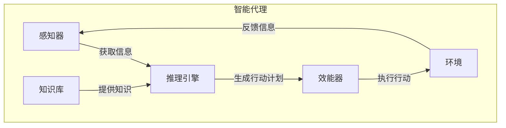
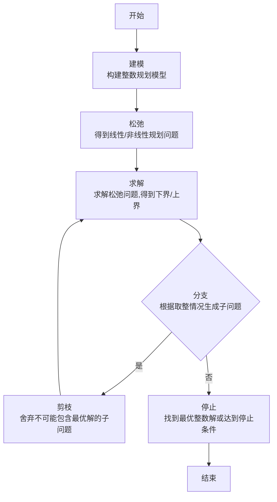

# AI人工智能 Agent：在分享经济中的应用

## 1. 背景介绍

### 1.1 问题的由来

随着互联网和移动技术的快速发展，分享经济模式正在改变着人们的生活方式和消费习惯。分享经济允许个人或组织通过共享资源和服务来创造经济价值,而不需要完全拥有这些资源。这种新兴的经济模式为消费者提供了更多的选择,同时也为企业带来了新的商业机会。

然而,分享经济的快速发展也带来了一些挑战。例如,如何确保共享资源的质量和安全性?如何建立有效的信任机制?如何实现供需匹配和优化资源利用率?这些问题都需要创新的解决方案。

### 1.2 研究现状

为了应对这些挑战,研究人员和企业开始探索人工智能(AI)技术在分享经济中的应用。AI可以通过机器学习、自然语言处理、计算机视觉等技术来提高分享经济平台的智能化水平,从而优化用户体验、提高运营效率和降低成本。

目前,一些分享经济领域的领先公司已经开始采用AI技术,如Uber利用AI进行实时定价和路线优化,Airbnb使用AI进行房源推荐和评论分析。但是,AI在分享经济中的应用还处于初级阶段,存在着诸多挑战和机遇有待探索。

### 1.3 研究意义

AI在分享经济中的应用具有重要的理论和实践意义。从理论层面上,它需要将AI技术与分享经济的商业模式和用户需求相结合,探索新的算法和模型。从实践层面上,它可以帮助分享经济平台提高运营效率、优化资源利用率、改善用户体验,从而促进整个行业的可持续发展。

### 1.4 本文结构

本文将全面探讨AI在分享经济中的应用。首先介绍相关的核心概念和技术,包括智能代理、机器学习、自然语言处理等。然后详细阐述AI在分享经济中的核心算法原理和数学模型,并通过案例分析和代码实现进行说明。接下来,讨论AI在分享经济中的实际应用场景,以及未来的发展趋势和挑战。最后,提供相关的工具、资源和常见问题解答。

## 2. 核心概念与联系

在探讨AI在分享经济中的应用之前,我们需要先了解一些核心概念和技术。

### 2.1 智能代理(Intelligent Agent)

智能代理是一种自主的软件实体,能够感知环境、处理信息、做出决策并采取行动,以实现特定目标。在分享经济中,智能代理可以扮演不同的角色,如匹配供需双方、管理资源、协调交易等。

智能代理通常由以下几个关键组件构成:

1. **感知器(Sensors)**: 用于从环境中获取信息,如用户偏好、资源状态等。
2. **效能器(Actuators)**: 用于在环境中执行行动,如分配资源、发送通知等。
3. **知识库(Knowledge Base)**: 存储代理所掌握的知识,如规则、事实、模型等。
4. **推理引擎(Inference Engine)**: 根据知识库和感知信息,推理出合理的行动计划。

智能代理的设计需要考虑多个方面,如自主性、响应性、主动性、社会能力等。在分享经济中,智能代理需要具备高度的自主性和社会能力,以便与多个参与者进行协作和交互。

### 2.2 机器学习

机器学习是AI的一个重要分支,它赋予计算机从数据中自动学习和改进的能力,而无需显式编程。在分享经济中,机器学习可以应用于多个场景,如需求预测、个性化推荐、异常检测等。

常见的机器学习算法包括:

- **监督学习**: 从标注数据中学习映射函数,用于分类、回归等任务。
- **无监督学习**: 从未标注数据中发现隐藏模式,用于聚类、降维等任务。
- **强化学习**: 通过与环境的交互,学习获取最大累积奖励的策略。
- **深度学习**: 基于多层神经网络,自动从数据中学习特征表示。

在分享经济中,机器学习可以用于构建智能推荐系统、动态定价模型、供需预测模型等,提高平台的智能化水平。

### 2.3 自然语言处理

自然语言处理(NLP)是AI的另一个重要分支,它研究计算机与人类语言之间的相互作用,包括文本理解、语音识别、机器翻译等任务。在分享经济中,NLP可以用于处理用户评论、聊天机器人交互、语音助手等场景。

常见的NLP技术包括:

- **词向量表示**: 将词语映射到连续的向量空间,捕捉语义和语法信息。
- **序列标注**: 对文本序列进行标注,如命名实体识别、词性标注等。
- **文本分类**: 将文本归类到预定义的类别,如情感分析、主题分类等。
- **机器翻译**: 将一种自然语言转换为另一种自然语言。
- **对话系统**: 与用户进行自然语言对话,理解意图并给出适当回复。

通过NLP技术,分享经济平台可以更好地理解用户需求,提供个性化服务和增强用户体验。

### 2.4 计算机视觉

计算机视觉是AI的另一个重要分支,它研究如何使计算机能够获取、处理和理解数字图像或视频中的信息。在分享经济中,计算机视觉可以应用于图像识别、物体检测、视频监控等场景。

常见的计算机视觉技术包括:

- **图像分类**: 将图像归类到预定义的类别,如场景识别、物体识别等。
- **目标检测**: 在图像中定位并识别特定目标的位置和类别。
- **语义分割**: 将图像中的每个像素归类到预定义的类别,实现像素级别的分类。
- **视频跟踪**: 在视频序列中跟踪和识别运动目标的位置和轨迹。
- **3D重建**: 从2D图像或视频中重建3D场景或物体的几何结构。

通过计算机视觉技术,分享经济平台可以实现自动化的资源监控和质量检测,提高运营效率和服务质量。

这些核心概念和技术为AI在分享经济中的应用奠定了基础。接下来,我们将深入探讨具体的算法原理和数学模型。

## 3. 核心算法原理 & 具体操作步骤

### 3.1 算法原理概述

在分享经济中,AI算法需要解决一系列挑战,如供需匹配、资源优化、个性化推荐等。这些挑战可以抽象为一个通用的优化问题,即如何在满足各种约束条件下,最大化或最小化某个目标函数。

具体来说,我们可以将分享经济系统建模为一个包含多个参与者(供给方、需求方)和资源的环境。每个参与者都有自己的偏好和约束条件,如位置、时间、预算等。我们的目标是找到一种最优的资源分配方案,使得系统的总体效用(如收益、满意度等)最大化或成本最小化。

为了解决这个优化问题,我们可以借助多种AI算法,包括:

1. **约束优化算法**: 用于在满足各种约束条件下寻找最优解,如整数规划、约束编程等。
2. **元启发式算法**: 用于在大规模搜索空间中高效寻找近似最优解,如遗传算法、模拟退火等。
3. **机器学习算法**: 用于从历史数据中学习模型,预测未来需求或偏好,如回归、分类、聚类等。
4. **多智能体系统**: 用于模拟多个参与者之间的互动和协作,寻找分布式的最优解。

这些算法可以单独使用,也可以相互结合,形成混合智能系统。下面我们将详细介绍其中几种核心算法的原理和具体操作步骤。

### 3.2 算法步骤详解

#### 3.2.1 整数规划算法

整数规划是一种常用的约束优化算法,它可以用于解决分享经济中的资源分配问题。假设我们有一组供给方 $S$,一组需求方 $D$,以及一组可共享资源 $R$。我们的目标是找到一种资源分配方案 $x$,使得总体效用 $f(x)$ 最大化,同时满足一系列约束条件 $g(x) \leq 0$。

这个问题可以形式化为一个整数规划模型:

$$
\begin{align*}
\max_{x} &\quad f(x) \\
\text{s.t.} &\quad g(x) \leq 0 \\
&\quad x \in \mathbb{Z}^n
\end{align*}
$$

其中 $x$ 是一个整数向量,表示资源分配方案。$f(x)$ 是目标函数,可以是收益、满意度或其他效用指标。$g(x)$ 是约束条件,可以包括供需匹配、资源可用性、时间窗口等限制。

整数规划问题通常是 NP-难的,我们可以使用分支定界算法或切割平面算法等方法来求解。算法的基本步骤如下:

1. **建模**: 根据问题场景,构建整数规划模型,确定目标函数和约束条件。
2. **松弛**: 将整数约束松弛为连续约束,得到对应的线性规划或非线性规划问题。
3. **求解**: 使用简化算法(如单纯形法)求解松弛问题,得到一个下界或上界。
4. **分支**: 根据松弛解的取整情况,对问题进行分支,生成子问题。
5. **剪枝**: 利用有效的剪枝策略,舍弃不可能包含最优解的子问题。
6. **重复**: 重复步骤3-5,直到找到最优整数解或达到停止条件。

整数规划算法可以有效解决资源分配等组合优化问题,但计算复杂度较高,适用于中小规模场景。对于大规模问题,我们可以考虑使用启发式或近似算法。

#### 3.2.2 遗传算法

遗传算法是一种常用的元启发式优化算法,它模拟自然进化过程,通过选择、交叉和变异等操作,在搜索空间中逐渐进化出近似最优解。在分享经济中,遗传算法可以用于解决大规模的组合优化问题,如车辆路径规划、工作调度等。

假设我们需要为一组订单安排最优的服务路径,使得总行驶距离最小。这个问题可以建模为一个旅行商问题(TSP),是一个 NP-难问题。我们可以使用遗传算法来求解。

算法的基本步骤如下:

1. **初始化**: 随机生成一个初始种群,每个个体表示一种可行解(即一条服务路径)。
2. **评估**: 计算每个个体的适应度(即路径长度的倒数),作为选择的依据。
3. **选择**: 根据适应度值,从当前种群中选择一些个体,作为下一代种群的父代。
4. **交叉**: 随机选择两个父代个体,在某个交叉点