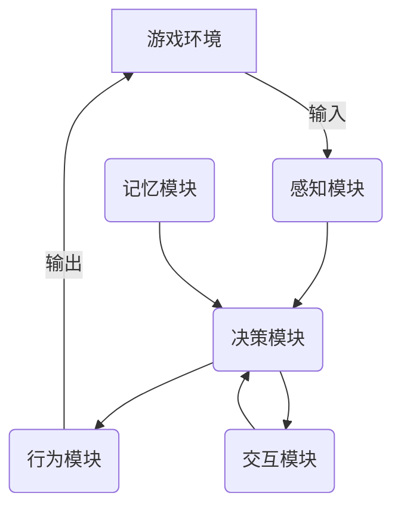

# AI人工智能代理工作流 AI Agent WorkFlow：在游戏设计中的应用

## 1. 背景介绍

### 1.1 问题的由来

在游戏设计领域,创造出富有挑战性、吸引人且行为自然的非玩家角色(NPCs)一直是一个重要的目标。传统的有限状态机和行为树等方法虽然可以实现基本的NPC行为,但往往缺乏灵活性和智能性,难以模拟复杂的人类行为。随着人工智能(AI)技术的不断发展,将AI代理引入游戏设计成为了一种有前景的解决方案。

### 1.2 研究现状  

目前,已有一些研究探索了在游戏中应用AI代理的可能性。例如,使用强化学习训练AI代理控制游戏角色,或者利用深度学习模型生成NPC对话等。然而,这些研究大多集中在特定的游戏任务上,缺乏一个通用的AI代理工作流程来指导游戏设计。

### 1.3 研究意义

设计一个通用的AI代理工作流程对于提高游戏AI的智能性和可扩展性至关重要。它可以帮助游戏开发者更好地整合各种AI技术,并根据具体需求灵活地调整和优化AI代理的行为。此外,一个成熟的AI代理工作流程也将促进游戏AI领域的理论研究和实践应用。

### 1.4 本文结构

本文将首先介绍AI代理工作流的核心概念和关键组成部分,然后详细阐述其核心算法原理和数学模型。接下来,我们将通过一个实际项目案例,展示如何在游戏设计中应用AI代理工作流。最后,我们将探讨AI代理工作流在游戏设计中的实际应用场景,并对其未来发展趋势和挑战进行总结和展望。

## 2. 核心概念与联系

AI代理工作流(AI Agent Workflow)是一个综合了感知(Perception)、决策(Decision Making)和行为(Action)等多个模块的通用框架,旨在为游戏中的NPC提供智能化的行为控制。它的核心概念包括:

1. **感知模块(Perception Module)**: 负责从游戏环境中获取相关信息,如视觉、听觉、位置等数据,并对这些信息进行预处理和特征提取。

2. **决策模块(Decision Making Module)**: 根据感知模块提供的信息,利用各种AI算法(如规划、强化学习等)做出行为决策。

3. **行为模块(Action Module)**: 执行决策模块生成的行为命令,控制NPC在游戏世界中的行动。

4. **记忆模块(Memory Module)**: 存储NPC过去的经验和知识,为决策模块提供参考依据。

5. **交互模块(Interaction Module)**: 处理NPC与玩家或其他NPC之间的交互,如对话、协作等。

这些模块相互协作,形成一个闭环的AI代理工作流程,如下图所示:

通过不断地感知、决策和行为,AI代理可以根据游戏情况动态调整策略,展现出智能化和自适应的行为。

## 3. 核心算法原理 & 具体操作步骤

### 3.1 算法原理概述

AI代理工作流的核心算法原理是将感知、决策和行为等不同模块有机结合,并在它们之间建立高效的信息流动。具体来说:

1. **感知模块**通常采用计算机视觉、信号处理等技术,对游戏环境中的原始数据(如图像、声音等)进行预处理和特征提取,得到高级别的环境表示。

2. **决策模块**接收感知模块的输出,并利用规划算法(如A*、RRT等)、强化学习算法(如Q-Learning、Policy Gradient等)或其他AI算法,生成行为决策。

3. **行为模块**执行决策模块的命令,控制NPC在游戏世界中移动、攻击、对话等行为。

4. **记忆模块**存储NPC过去的状态、行为和奖惩信息,作为决策模块的参考。常用的技术包括经验重放(Experience Replay)、神经拓扑结构等。

5. **交互模块**通过自然语言处理、多智能体系统等技术,实现NPC与玩家或其他NPC之间的交互。

上述各模块通过反馈机制相互影响,形成一个动态的闭环系统。

### 3.2 算法步骤详解

AI代理工作流的具体算法步骤如下:

1. **初始化**:设置游戏环境、NPC属性等初始参数。

2. **感知**:从游戏环境获取原始数据,并在感知模块中进行预处理和特征提取,得到环境表示$s_t$。

3. **决策**:将环境表示$s_t$和记忆模块中的历史信息$h_t$输入到决策模块,利用AI算法(如Q-Learning)得到行为决策$a_t$:

$$a_t = \pi(s_t, h_t; \theta)$$

其中$\pi$是决策策略函数,由参数$\theta$确定。

4. **执行**:在行为模块中执行决策$a_t$,产生实际行为,并将行为结果反馈给游戏环境。

5. **奖惩**:根据行为结果,计算奖惩值$r_t$。

6. **记忆**:将当前状态$s_t$、行为$a_t$和奖惩$r_t$存储到记忆模块,更新历史信息$h_{t+1}$。

7. **交互**:如果涉及NPC交互,则在交互模块中处理交互逻辑。

8. **迭代**:重复步骤2-7,直到达到终止条件(如游戏结束)。

9. **优化**:利用记忆模块中存储的经验,优化决策模块中的策略参数$\theta$。

通过上述步骤,AI代理可以不断地从环境中获取信息、做出决策并执行行为,同时根据反馈信号调整策略,最终实现智能化的行为控制。

### 3.3 算法优缺点

AI代理工作流算法的主要优点包括:

1. **通用性强**:可以灵活地集成各种AI算法,适用于不同类型的游戏场景。

2. **智能性高**:能够根据环境动态调整策略,模拟出智能化的行为。

3. **可扩展性好**:模块化设计,方便添加新的功能模块。

4. **交互性强**:支持NPC与玩家或其他NPC之间的自然交互。

但同时也存在一些缺点和挑战:

1. **训练难度大**:需要大量的数据和计算资源来训练决策模块中的AI模型。

2. **鲁棒性不足**:面对未知的环境,可能表现不佳。

3. **可解释性差**:决策过程往往是一个黑箱,难以理解和调试。

4. **实时性要求高**:需要在有限的时间内做出决策,对算法效率有较高要求。

### 3.4 算法应用领域

AI代理工作流算法可以应用于游戏设计的多个领域,包括但不限于:

1. **非玩家角色控制(NPC Control)**: 控制NPC的移动、战斗、对话等行为。

2. **过程内容生成(Procedural Content Generation)**: 自动生成游戏关卡、任务、故事情节等内容。

3. **智能对手(Intelligent Opponent)**: 创建具有一定水平的AI对手,提高游戏的挑战性。

4. **智能辅助(Intelligent Assistance)**: 为玩家提供智能化的提示和建议,增强游戏体验。

5. **模拟训练(Simulation Training)**: 在虚拟环境中训练AI代理,为真实场景做准备。

总的来说,AI代理工作流为游戏设计带来了新的可能性,有望推动游戏AI的发展和创新。

## 4. 数学模型和公式 & 详细讲解 & 举例说明

### 4.1 数学模型构建

在AI代理工作流中,我们可以将决策问题建模为一个**马尔可夫决策过程(Markov Decision Process, MDP)**,用数学模型来刻画游戏环境、NPC状态和行为决策之间的关系。

一个MDP可以用元组$\langle \mathcal{S}, \mathcal{A}, \mathcal{P}, \mathcal{R} \rangle$来表示,其中:

- $\mathcal{S}$是状态集合,表示NPC可能处于的所有状态。
- $\mathcal{A}$是行为集合,表示NPC可执行的所有行为。
- $\mathcal{P}$是状态转移概率,即$\mathcal{P}(s' | s, a) = \Pr(s_{t+1}=s' | s_t=s, a_t=a)$表示在状态$s$执行行为$a$后,转移到状态$s'$的概率。
- $\mathcal{R}$是奖励函数,即$\mathcal{R}(s, a, s')$表示从状态$s$执行行为$a$并转移到状态$s'$时获得的即时奖励。

在MDP框架下,NPC的目标是找到一个最优策略$\pi^*$,使得在遵循该策略时,可以最大化预期的累积奖励:

$$\pi^* = \arg\max_\pi \mathbb{E}\left[\sum_{t=0}^\infty \gamma^t R(s_t, a_t, s_{t+1}) | \pi\right]$$

其中$\gamma \in [0, 1]$是折现因子,用于权衡即时奖励和长期奖励的重要性。

### 4.2 公式推导过程

为了求解上述最优化问题,我们可以引入**状态值函数(State-Value Function)** $V^\pi(s)$和**状态-行为值函数(State-Action Value Function)** $Q^\pi(s, a)$,它们分别表示在策略$\pi$下,从状态$s$开始执行,期望能获得的累积奖励:

$$V^\pi(s) = \mathbb{E}_\pi\left[\sum_{t=0}^\infty \gamma^t R(s_t, a_t, s_{t+1}) | s_0=s\right]$$

$$Q^\pi(s, a) = \mathbb{E}_\pi\left[\sum_{t=0}^\infty \gamma^t R(s_t, a_t, s_{t+1}) | s_0=s, a_0=a\right]$$

利用贝尔曼方程(Bellman Equations),我们可以将$V^\pi(s)$和$Q^\pi(s, a)$分解为两个部分:即时奖励和来自下一状态的期望值,从而得到如下递推公式:

$$V^\pi(s) = \sum_{a \in \mathcal{A}} \pi(a|s) \sum_{s' \in \mathcal{S}} \mathcal{P}(s'|s, a) \left[ \mathcal{R}(s, a, s') + \gamma V^\pi(s') \right]$$

$$Q^\pi(s, a) = \sum_{s' \in \mathcal{S}} \mathcal{P}(s'|s, a) \left[ \mathcal{R}(s, a, s') + \gamma \sum_{a' \in \mathcal{A}} \pi(a'|s') Q^\pi(s', a') \right]$$

基于上述方程,我们可以使用**值迭代(Value Iteration)**或**策略迭代(Policy Iteration)**等经典算法求解最优策略$\pi^*$及其对应的最优值函数$V^*(s)$和$Q^*(s, a)$。

另一种常用的求解方法是**Q-Learning**算法,它是一种无模型(Model-Free)的强化学习算法,可以直接从环境交互中学习最优的$Q^*(s, a)$,而不需要事先了解$\mathcal{P}$和$\mathcal{R}$。Q-Learning的更新规则为:

$$Q(s_t, a_t) \leftarrow Q(s_t, a_t) + \alpha \left[ r_t + \gamma \max_{a'} Q(s_{t+1}, a') - Q(s_t, a_t) \right]$$

其中$\alpha$是学习率,控制着新信息对Q值的影响程度。通过不断地与环境交互并更新Q值,Q-Learning最终可以收敛到最优的$Q^*(s, a)$。

### 4.3 案例分析与讲解

为了更好地理解上述数学模型和公式,我们来分析一个简单的游戏案例。假设我们有一个格子世