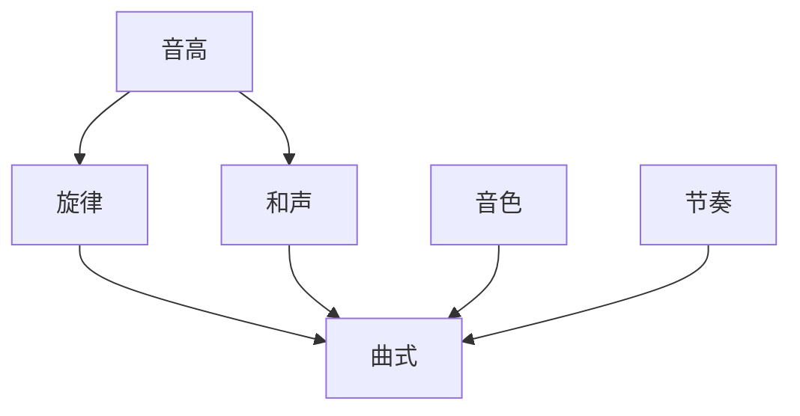
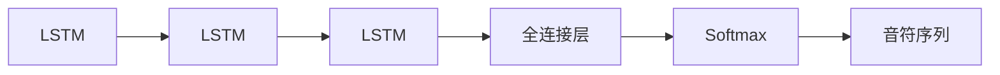

# AI人工智能代理工作流 AI Agent WorkFlow：在音乐创作中的应用

关键词：人工智能, 音乐创作, 代理工作流, 机器学习, 深度学习, 生成模型

## 1. 背景介绍
### 1.1  问题的由来
随着人工智能技术的飞速发展,AI已经开始在各个领域崭露头角,音乐创作也不例外。传统的音乐创作方式往往需要作曲家具备扎实的音乐理论基础和丰富的创作经验,创作周期较长,创新性也受限。而利用AI技术,特别是将AI Agent工作流应用到音乐创作中,有望极大提升音乐创作的效率和创新性,为音乐创作开辟新的道路。

### 1.2  研究现状
目前,国内外已有不少团队开始将AI技术应用到音乐创作领域。比如Google的Magenta项目、Sony的Flow Machines等。这些研究主要利用机器学习和深度学习技术,通过分析大量音乐作品,学习音乐创作的规律和风格,然后自动生成新的音乐片段或完整的音乐作品。但现有的研究大多局限于利用单一的生成模型,生成的音乐还比较单一,创新性不足。而本文提出利用AI Agent工作流,通过多个Agent的协同工作,有望生成更加丰富多样、富有创造力的音乐作品。

### 1.3  研究意义
本文的研究意义主要体现在以下几个方面:

1. 丰富音乐创作的手段和思路。利用AI Agent工作流为音乐创作提供新的途径,激发更多的创作灵感。
2. 提高音乐创作的效率。传统音乐创作往往需要大量时间,而AI可以在短时间内生成大量的音乐素材,加快创作进程。
3. 降低音乐创作的门槛。利用AI技术,即使是没有深厚音乐功底的普通人,也能参与到音乐创作中来。
4. 推动音乐创作的创新发展。AI Agent工作流通过多个Agent的分工协作,有望创作出更具新意和突破性的音乐作品。

### 1.4  本文结构
本文将从以下几个方面展开论述:
- 介绍音乐创作中涉及的核心概念,以及各概念之间的联系;
- 详细阐述AI Agent工作流的核心算法原理和具体操作步骤;
- 建立AI音乐创作的数学模型,推导相关数学公式,并举例说明;
- 给出AI音乐创作的代码实例,并进行详细的解释说明;
- 分析AI Agent工作流在音乐创作中的实际应用场景;
- 推荐音乐创作相关的学习资源、开发工具等;
- 总结全文,展望AI音乐创作的发展趋势和面临的挑战;
- 梳理音乐创作中的常见问题,并给出参考解答。

## 2. 核心概念与联系

在利用AI进行音乐创作时,需要了解几个核心概念:

- 音高(pitch):音频信号的频率,决定声音的高低。
- 音色(timbre):声音的特质,使得听众能够区分不同的乐器。
- 节奏(rhythm):音乐声音的长短、强弱等时间关系的组合。
- 和声(harmony):多个音高的组合,纵向的同时发声。
- 旋律(melody):由不同音高的音符构成的横向发展的线条。
- 曲式(musical form):音乐作品的整体结构,比如二段体、三段体等。

这些概念相互关联,共同构成了一部完整的音乐作品:



在利用AI进行音乐创作时,我们的目标就是让机器学会如何分析、组合这些基本音乐元素,创作出动听的旋律、和声、节奏,最终形成一首完整的音乐作品。而AI Agent工作流就是实现这一目标的重要途径。

## 3. 核心算法原理 & 具体操作步骤
### 3.1  算法原理概述
本文提出的AI Agent工作流,其核心思想是将音乐创作任务分解成多个子任务,每个子任务由一个特定的AI Agent负责,多个Agent协同工作,最终完成整首音乐的创作。每个Agent可采用不同的算法模型,针对性地解决音乐创作的某个特定问题。下面将重点介绍几个关键的算法模型。

### 3.2  算法步骤详解

#### 3.2.1 基于规则的音乐生成
早期的音乐AI多采用基于规则的方法,即将音乐创作的规律总结成一系列规则,然后用程序来实现这些规则,生成音乐。其基本步骤如下:
1. 收集整理出一系列音乐创作的规则,如和弦排列规则、音程规则等;
2. 将这些规则转化为程序可执行的逻辑判断语句;
3. 程序根据设定的规则,自动生成一段音乐片段;
4. 人工评估生成的音乐片段,筛选出较好的片段,进一步接续创作。

例如我们可以总结出一些常见的和弦进行规则:
- 主歌部分常用:I - vi - IV - V 
- 副歌部分常用:I - V - vi - IV
- 常见的终止式:ii - V - I

然后将其转化为程序逻辑:
```python
if 主歌部分:
    和弦序列 = [I, vi, IV, V] 
elif 副歌部分:
    和弦序列 = [I, V, vi, IV]
elif 终止部分:
    和弦序列 = [ii, V, I]
```

这种方法的优点是规则明确,生成的音乐能够符合常规的创作规律。但其局限性也比较明显,一是需要大量的人工总结规则,二是生成的音乐比较教条,创新性不足。

#### 3.2.2 基于概率统计的马尔可夫链方法
马尔可夫链是一种常用的概率统计模型,可以刻画一系列事件之间的概率转移关系。将其应用到音乐生成中,可以建模音符之间的先后关系,从而生成新的音乐片段。其基本步骤如下:
1. 收集大量同风格的音乐作品,提取出音符序列;
2. 统计分析每一个音符后面可能出现的后继音符及其概率;
3. 根据统计得到的概率转移矩阵,用马尔可夫链随机生成新的音符序列;
4. 将生成的音符序列转化为乐谱,合成音频。

例如我们统计一段C大调音乐中,每个音符后面出现的音符概率:

|       | C    | D    | E    | F    | G    | A    | B    |
|-------|------|------|------|------|------|------|------|
| C     | 0.2  | 0.3  | 0.1  | 0.2  | 0.1  | 0.05 | 0.05 |
| D     | 0.1  | 0.1  | 0.3  | 0.05 | 0.2  | 0.2  | 0.05 |
| E     | 0.05 | 0.1  | 0.2  | 0.3  | 0.1  | 0.05 | 0.2  |
| F     | 0.2  | 0.05 | 0.1  | 0.2  | 0.3  | 0.1  | 0.05 |
| G     | 0.1  | 0.2  | 0.1  | 0.05 | 0.2  | 0.3  | 0.05 |
| A     | 0.05 | 0.2  | 0.05 | 0.1  | 0.2  | 0.1  | 0.3  |
| B     | 0.3  | 0.05 | 0.2  | 0.05 | 0.1  | 0.2  | 0.1  |

有了这个概率转移矩阵,我们就可以用马尔可夫链按概率随机生成音符序列,比如:
- 初始音符是C,下一个音符有0.2的概率是C,0.3的概率是D,0.1的概率是E......
- 假设随机的下一个音符是D,再看D行,有0.1的概率下一个是C,0.1的概率是D......
- 不断重复,直到生成所需长度的音符序列。

马尔可夫链生成的音乐在音符的连接上更加自然,但生成的旋律缺乏宏观结构,听起来比较随机。

#### 3.2.3 基于深度学习的音乐生成
近年来,随着深度学习的发展,尤其是LSTM、GRU等神经网络能够建模时序数据,深度学习开始大量应用到音乐生成领域。其基本步骤如下:
1. 收集大量同风格的MIDI音乐文件,形成训练数据集;
2. 设计神经网络结构,比如LSTM、GRU、Transformer等;
3. 用训练集训练神经网络,使其学会音乐片段的特征;
4. 给定初始的音符序列,用训练好的模型预测后续的音符序列;
5. 不断生成,直到得到完整的音乐片段,转化为乐谱和音频。

例如我们可以设计一个简单的LSTM网络:



输入一个起始的音符序列,比如C D E,LSTM逐步预测下一个最可能的音符:
- 第一步预测下一个音符是F的概率最大,则生成F;
- 下一步的输入是D E F,预测下一个音符是G的概率最大,则生成G;
- 不断预测,直到生成所需长度的音符序列。

深度学习能够建模音乐片段的深层次特征,生成的音乐更加流畅自然,但训练周期长,需要大量的数据和算力。

### 3.3  算法优缺点
- 基于规则的方法:
    - 优点:规则明确,符合音乐理论。
    - 缺点:需要大量人工提炼规则,生成的音乐教条呆板。
- 马尔可夫链方法:
    - 优点:音符衔接自然,一定程度上学习了音乐风格。
    - 缺点:生成的音乐缺乏整体结构,难以把控。
- 深度学习方法:  
    - 优点:能够建模音乐的深层特征,生成的音乐流畅自然。
    - 缺点:需要大量的训练数据和算力,训练周期长。

### 3.4  算法应用领域
以上算法已经在音乐创作的各个方面得到广泛应用,比如:

- 自动作曲:生成主旋律、和弦旋律、鼓点节奏、бас贝斯线等。
- 音乐续写:给定一个起始的音乐片段,自动生成后续的音乐片段。
- 风格迁移:将一首音乐转化为另一种风格,比如将古典音乐转化为爵士风格。
- 音乐配器:自动为主旋律配上和声、节奏等。

总之,将AI技术应用到音乐创作领域,能够极大提高音乐创作的效率和创新性,为音乐创作开辟更广阔的空间。

## 4. 数学模型和公式 & 详细讲解 & 举例说明
### 4.1  数学模型构建
为了用数学语言来刻画音乐,我们首先需要将音乐的基本元素量化为数学变量和符号。以钢琴为例,我们可以用一个88维的one-hot向量来表示钢琴的88个键,每一维对应一个琴键,只有一个数值为1,其余为0。

我们再定义一些基本符号:
- $S$:表示一个音乐片段,可以看作一系列音符的序列。
- $N$:表示音符的总数。
- $x_i$:表示第$i$个音符,是一个88维的one-hot向量。
- $t_i$:表示第$i$个音符的持续时间。
- $v_i$:表示第$i$个音符的力度,即音量大小。

则一段音乐片段$S$就可以表示为:

$$S = \{(x_1,t_1