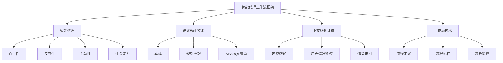

# AI人工智能代理工作流AI Agent WorkFlow：智能代理在智能家居中的实践

## 1. 背景介绍

### 1.1 问题的由来

随着物联网和人工智能技术的不断发展,智能家居系统逐渐成为现代生活的一部分。智能家居旨在通过互联网将家中的各种设备连接起来,实现自动化控制和智能管理,为用户提供更加舒适、便利和高效的生活体验。然而,由于涉及众多异构设备和复杂的业务流程,智能家居系统的开发和维护面临着巨大的挑战。

传统的智能家居系统通常采用集中式架构,所有设备都直接连接到中央控制器,控制器负责协调和管理所有设备。这种架构存在单点故障风险,且随着设备数量的增加,系统的复杂性也会急剧上升,导致可维护性和可扩展性较差。此外,集中式架构通常缺乏智能化决策能力,无法根据用户的习惯和偏好进行个性化的自动化控制。

### 1.2 研究现状

为了解决上述问题,研究人员提出了基于智能代理的分布式架构。智能代理是一种具有自主性、反应性、主动性和社会能力的软件实体,可以根据环境的变化做出智能决策并采取相应的行动。在智能家居系统中,每个设备或服务都可以部署一个智能代理,代理之间通过协作和协商来完成复杂的任务。

目前,已有多种智能代理框架应用于智能家居领域,如基于BDI(Belief-Desire-Intention)理论的Jadex、基于组织元模型的JaCaMo等。这些框架提供了代理编程模型、通信机制和协调机制,简化了智能代理系统的开发和部署。然而,现有框架大多侧重于代理的通用功能,缺乏对智能家居场景的深入支持和优化。

### 1.3 研究意义

设计一种专门面向智能家居场景的智能代理工作流框架,可以更好地满足智能家居系统的特殊需求,提高系统的智能化水平和用户体验。该框架应当具备以下特点:

1. **高度模块化和可扩展性**,能够轻松集成新的设备和服务;
2. **基于语义的设备发现和组合**,实现跨设备和跨领域的智能协作;
3. **基于上下文的决策和自动化**,根据用户偏好、环境状态和历史数据进行个性化控制;
4. **可视化建模和配置工具**,降低开发和维护的复杂性;
5. **安全性和隐私保护机制**,确保系统的可靠性和用户数据的安全性。

通过该框架的研究和应用,可以推动智能家居系统向更加智能化、人性化和可持续发展的方向演进,为用户带来全新的智能生活体验。

### 1.4 本文结构  

本文将首先介绍智能代理工作流在智能家居中的核心概念和相关技术,包括智能代理、语义Web技术、上下文感知计算等。然后详细阐述智能代理工作流框架的设计原理、架构和关键算法,并给出数学模型和公式推导。接下来,我们将通过一个实际项目案例,展示框架在智能家居场景中的具体应用,包括开发环境搭建、代码实现、运行结果等。最后,本文将总结研究成果,探讨未来的发展趋势和面临的挑战。

## 2. 核心概念与联系

智能代理工作流框架的设计涉及多个核心概念,包括智能代理、语义Web、上下文感知计算和工作流技术等,它们之间存在着紧密的联系。

### 2.1 智能代理

智能代理是一种具有自主性、反应性、主动性和社会能力的软件实体。在智能家居系统中,每个设备或服务都可以部署一个智能代理,代理之间通过协作和协商来完成复杂的任务。

- **自主性**:智能代理可以根据自身的知识库和目标,自主做出决策并执行相应的行为,而不需要人工干预。
- **反应性**:智能代理能够感知环境的变化,并根据环境状态做出适当的反应。
- **主动性**:智能代理不仅被动响应环境变化,还可以主动采取行动来实现自身目标。
- **社会能力**:智能代理可以与其他代理进行通信、协作和协商,以完成无法单独完成的任务。

### 2.2 语义Web技术

语义Web技术为智能代理提供了表示和共享知识的标准方式,包括本体(Ontology)、规则推理(Rule Reasoning)和SPARQL查询语言等。

- **本体**:本体是一种形式化的知识表示方式,定义了某一领域中概念、属性和关系等元素,为智能代理提供了共享的词汇和语义。
- **规则推理**:基于本体和规则,智能代理可以进行逻辑推理,从已知的事实中推导出新的知识。
- **SPARQL查询**:SPARQL是一种针对RDF数据的查询语言,智能代理可以使用SPARQL查询知识库中的信息。

### 2.3 上下文感知计算

上下文感知计算使智能代理能够感知和理解环境上下文,包括物理环境、用户偏好和情景等,从而做出更加智能的决策和行为。

- **环境感知**:通过各种传感器收集环境数据,如温度、光线、噪音等。
- **用户偏好建模**:根据用户的历史行为和反馈,构建用户偏好模型。
- **情景识别**:基于环境数据和用户偏好,识别当前的情景,如"睡眠"、"工作"等。

### 2.4 工作流技术

工作流技术为智能代理提供了一种标准化的方式来定义、执行和监控复杂的业务流程。

- **流程定义**:使用工作流建模语言(如BPMN)定义业务流程的活动、控制流和数据流。
- **流程执行**:工作流引擎根据流程定义执行相应的活动,并协调智能代理之间的交互。
- **流程监控**:监控流程的执行状态,收集执行数据,并根据需要进行干预或优化。

通过将上述核心概念有机结合,智能代理工作流框架能够为智能家居系统提供高度智能化的控制和管理能力。

## 3. 核心算法原理与具体操作步骤

### 3.1 算法原理概述

智能代理工作流框架的核心算法基于语义Web技术、上下文感知计算和工作流技术,实现了智能家居系统的自动化控制和优化。算法的主要思想是:

1. **建模阶段**:使用本体对智能家居系统中的设备、服务、环境和用户偏好等进行形式化建模,构建知识库。
2. **情景识别**:基于环境数据和用户偏好模型,识别当前的情景。
3. **目标推理**:根据当前情景和用户偏好,推理出需要实现的目标,如"创造舒适的睡眠环境"。
4. **服务组合**:使用语义匹配和规则推理,从知识库中发现并组合能够实现目标的设备和服务。
5. **工作流执行**:将组合的设备和服务封装为工作流,由工作流引擎执行相应的控制逻辑。
6. **反馈与优化**:监控工作流执行过程,收集用户反馈,并根据反馈优化决策模型和工作流。

该算法通过语义建模、情景感知和自动化服务组合,实现了智能家居系统的高度智能化控制。同时,它还具有良好的可扩展性和可配置性,能够适应新的设备、服务和用户需求。

### 3.2 算法步骤详解

1. **建模阶段**

   - 使用Web本体语言OWL构建智能家居本体,定义设备、服务、环境和用户偏好等概念及其属性和关系。
   - 根据实际设备和服务的能力,在本体中创建相应的个体(Individuals)。
   - 使用SWRL(Semantic Web Rule Language)定义推理规则,描述设备、服务和环境之间的约束条件和控制逻辑。

2. **情景识别**

   - 从各种传感器收集环境数据,如温度、光线、噪音等。
   - 将环境数据转换为RDF三元组,插入知识库。
   - 使用SPARQL查询和SWRL规则推理,匹配当前环境状态与已定义的情景模式。
   - 确定当前的情景,如"睡眠"、"工作"等。

3. **目标推理**

   - 根据当前情景和用户偏好模型,使用SWRL规则推理出需要实现的目标。
   - 例如,在"睡眠"情景下,目标可能是"创造舒适的睡眠环境"。

4. **服务组合**

   - 使用SPARQL查询知识库,发现能够实现目标的设备和服务。
   - 根据设备和服务的属性、功能和约束条件,使用SWRL规则进行语义匹配和组合。
   - 生成满足目标的设备和服务组合方案。

5. **工作流执行**

   - 将组合的设备和服务封装为BPMN工作流模型。
   - 工作流引擎执行工作流,协调智能代理之间的交互,实现对设备和服务的控制。
   - 在工作流执行过程中,智能代理根据环境变化做出相应的反应。

6. **反馈与优化**

   - 监控工作流执行过程,收集执行数据和用户反馈。
   - 分析用户反馈,了解目标实现的满意度。
   - 根据反馈,优化决策模型(如调整目标权重)和工作流模型。
   - 将优化后的模型持久化到知识库,为下一次决策和控制做好准备。

### 3.3 算法优缺点

**优点**:

- 高度智能化:算法能够根据环境和用户偏好自动做出智能决策,实现个性化的自动化控制。
- 可扩展性强:基于语义Web技术,新的设备和服务可以轻松集成到系统中。
- 可配置性高:决策模型和工作流模型可根据需求进行配置和优化。
- 跨领域协作:语义匹配机制支持跨设备和跨领域的服务组合。

**缺点**:

- 建模复杂度高:需要对智能家居系统的各个方面进行形式化建模,工作量较大。
- 推理效率有待提高:大规模知识库下,推理效率可能受到影响。
- 缺乏学习能力:算法无法自主学习和优化决策模型,需要人工分析用户反馈。

### 3.4 算法应用领域

智能代理工作流算法不仅适用于智能家居领域,还可以应用到其他需要智能化控制和优化的领域,如:

- **智能制造**:组合机器人、传感器和控制系统,实现自动化生产线的智能调度和优化。
- **智慧城市**:整合交通、能源、环保等城市服务,优化城市运营和管理。
- **智能医疗**:协调医疗设备、知识库和决策支持系统,提供个性化的智能诊疗方案。
- **智能办公**:根据会议安排、员工位置和设备状态,自动调度会议室和视频会议设备。

总的来说,智能代理工作流算法为构建高度智能化的分布式系统提供了有效的解决方案。

## 4. 数学模型和公式详细讲解与举例说明

### 4.1 数学模型构建

为了量化描