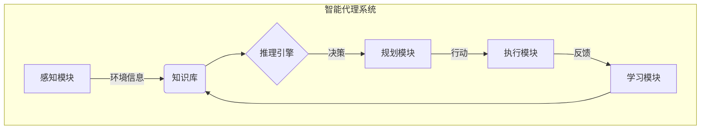
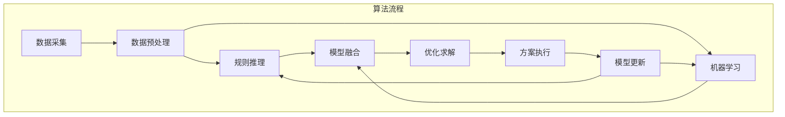

# AI人工智能代理工作流AI Agent WorkFlow：智能代理在航空领域系统中的应用

## 1. 背景介绍

### 1.1 问题的由来

在当今快节奏的商业环境中，航空公司面临着各种复杂的运营挑战。从机队管理、航班调度到乘客服务，每一个环节都需要高效、准确和实时的决策支持。传统的人工决策过程往往效率低下、容易出错，无法满足日益增长的运营需求。因此，引入智能代理技术成为航空公司提高运营效率、降低成本的关键举措。

### 1.2 研究现状

近年来，人工智能(AI)技术在各行业的应用日益广泛，智能代理系统作为AI的一个重要分支也受到了广泛关注。智能代理是一种自主的软件实体,能够感知环境、处理信息、做出决策并采取行动,以实现特定目标。在航空领域,智能代理系统已经被用于机队管理、航班调度、乘客服务等多个领域,显示出巨大的应用潜力。

### 1.3 研究意义

智能代理系统在航空领域的应用可以带来诸多好处:

1. 提高决策效率:智能代理可以快速处理大量数据,并根据预设目标做出实时决策,大大提高了运营效率。

2. 降低人工成本:智能代理可以自主完成许多重复性工作,减轻人工工作负担,降低运营成本。

3. 优化资源利用:通过智能决策,可以更好地利用机队、航线等资源,提高资源利用率。

4. 改善乘客体验:智能代理可以为乘客提供个性化服务,提升乘客满意度。

### 1.4 本文结构

本文将全面介绍智能代理在航空领域系统中的应用。首先阐述智能代理的核心概念和相关技术,然后详细解释其在航空领域的应用场景、算法原理和数学模型,并通过实际案例分析其实现过程。最后,探讨智能代理在航空领域的发展趋势和面临的挑战。

## 2. 核心概念与联系

智能代理系统是一种基于人工智能技术的自主软件系统,它能够感知环境、处理信息、做出决策并采取行动,以实现特定目标。智能代理系统通常包含以下几个核心组成部分:

1. **感知模块**: 用于获取环境信息,如航班数据、机队信息、天气情况等。

2. **知识库**: 存储领域知识、规则、策略等,为决策提供支持。

3. **推理引擎**: 基于知识库和感知信息,运用各种算法(如规则推理、机器学习等)进行推理并做出决策。

4. **规划模块**: 根据决策结果,制定行动计划并执行相应操作。

5. **学习模块**: 通过反馈机制不断优化知识库和决策策略。

此外,智能代理系统还需要具备自主性、反应性、主动性、社会性等特征,以适应复杂的运营环境。

## 3. 核心算法原理 & 具体操作步骤

### 3.1 算法原理概述

智能代理在航空领域的应用涉及多种算法,包括规则推理、机器学习、优化算法等。其中,规则推理和机器学习是两种最常用的算法范式。

**规则推理算法**通过预定义的规则和策略对输入数据进行推理,得出决策结果。这种算法的优点是可解释性强、执行效率高,但缺点是规则的制定需要大量的人工经验,且难以处理复杂的非结构化数据。

**机器学习算法**则是通过对历史数据的学习,自动发现数据中的模式和规律,从而对新数据进行预测和决策。常用的机器学习算法包括监督学习(如决策树、支持向量机等)和无监督学习(如聚类分析)等。机器学习算法的优点是可以处理复杂数据,具有很强的泛化能力,但缺点是需要大量的训练数据,且模型的可解释性较差。

在实际应用中,智能代理系统通常会综合运用规则推理和机器学习算法,发挥各自的优势,以提高决策的准确性和可靠性。

### 3.2 算法步骤详解

以机场场面分配为例,智能代理系统的工作流程如下:

1. **数据采集**:从各个数据源(如航班计划、机队信息、天气预报等)采集相关数据,作为算法输入。

2. **数据预处理**:对采集的数据进行清洗、标准化、特征工程等预处理,以适应算法的输入格式。

3. **规则推理**:根据预定义的规则和策略(如优先级、时间窗口等),对场面分配问题进行初步决策。

4. **机器学习**:将历史场面分配数据作为训练集,使用监督学习算法(如决策树、随机森林等)构建预测模型。

5. **模型融合**:将规则推理和机器学习模型的结果进行融合,得到综合的场面分配方案。

6. **优化求解**:使用优化算法(如整数规划、模拟退火等)对融合后的方案进行进一步优化,得到最终的场面分配计划。

7. **方案执行**:将优化后的场面分配计划下发执行,并收集实际执行情况的反馈数据。

8. **模型更新**:利用反馈数据对规则库和机器学习模型进行更新,以提高未来决策的准确性。

### 3.3 算法优缺点

**优点**:

1. 结合规则推理和机器学习的优势,提高决策的准确性和可靠性。
2. 通过优化算法进一步改进决策方案,提高资源利用效率。
3. 具有一定的可解释性,决策过程可追溯。
4. 通过反馈机制持续优化模型,适应环境变化。

**缺点**:

1. 算法的性能依赖于数据质量,需要大量的高质量训练数据。
2. 模型训练和优化过程计算量大,对计算资源要求较高。
3. 涉及多种算法技术,系统复杂度较高,开发和维护成本较大。
4. 存在一定的模型偏差风险,需要人工监督和干预。

### 3.4 算法应用领域

智能代理算法在航空领域有广泛的应用前景,主要包括:

1. **机队管理**:根据航线需求、机型特性等因素,优化机队调配和维修计划。
2. **航班调度**:综合考虑机场资源、天气状况等,实现航班的动态调整和重新分配。
3. **乘客服务**:为乘客提供个性化的航班推荐、舱位升级等增值服务。
4. **运营优化**:优化航线网络规划、机场资源分配等,提高运营效率。
5. **安全管理**:预测和防范潜在的安全风险,提高航空运营的安全性。

## 4. 数学模型和公式 & 详细讲解 & 举例说明

### 4.1 数学模型构建

在航空领域,智能代理系统常常需要解决一些复杂的优化问题,如机场场面分配、航线网络优化等。这些问题可以用数学模型进行形式化描述,并使用优化算法求解。以场面分配为例,可以构建如下整数规划模型:

**决策变量**:
$$
x_{ijk} = \begin{cases}
1, & \text{航班 i 分配到场面 j 的时间段 k}\\
0, & \text{否则}
\end{cases}
$$

**目标函数**:
$$
\max \sum_{i\in I}\sum_{j\in J}\sum_{k\in K}w_{ijk}x_{ijk}
$$
其中 $w_{ijk}$ 表示将航班 i 分配到场面 j 的时间段 k 的权重,目标是最大化总权重。

**约束条件**:

1. 每个航班只能分配到一个场面的一个时间段:
$$
\sum_{j\in J}\sum_{k\in K}x_{ijk}=1,\quad\forall i\in I
$$

2. 每个场面在同一时间段只能分配一个航班:
$$
\sum_{i\in I}x_{ijk}\leq 1,\quad\forall j\in J,k\in K
$$

3. 考虑航班的到达和离港时间窗口:
$$
a_i\leq\sum_{j\in J}\sum_{k\in K}t_kx_{ijk}\leq b_i,\quad\forall i\in I
$$

4. 其他约束(如机位兼容性等)。

通过建模和优化,可以得到一个满足各种约束条件的最优场面分配方案。

### 4.2 公式推导过程

在机场场面分配问题中,我们需要最大化总权重,即目标函数:
$$
\max \sum_{i\in I}\sum_{j\in J}\sum_{k\in K}w_{ijk}x_{ijk}
$$
其中 $w_{ijk}$ 表示将航班 i 分配到场面 j 的时间段 k 的权重。这个权重可以根据不同的优先级规则来设置,例如:

1. 航班的重要性(如头等舱比例、载客率等)
2. 航班的时间窗口(离港时间与分配时间段的匹配程度)
3. 机位的兼容性(是否适合该机型)
4. ...

假设我们将这些规则线性组合,则权重 $w_{ijk}$ 可以表示为:
$$
w_{ijk} = \alpha_1 f_1(i) + \alpha_2 f_2(i,k) + \alpha_3 f_3(i,j) + ...
$$
其中 $f_1(i)$ 表示航班 i 的重要性得分函数, $f_2(i,k)$ 表示航班 i 与时间段 k 的匹配得分函数, $f_3(i,j)$ 表示航班 i 与场面 j 的兼容性得分函数,...; $\alpha_1,\alpha_2,\alpha_3,...$ 为各项权重系数,可以通过机器学习等方法确定。

将权重公式代入目标函数,我们得到:
$$
\begin{aligned}
\max & \sum_{i\in I}\sum_{j\in J}\sum_{k\in K}(\alpha_1 f_1(i) + \alpha_2 f_2(i,k) + \alpha_3 f_3(i,j) + ...)x_{ijk}\\
\text{s.t. } & \sum_{j\in J}\sum_{k\in K}x_{ijk}=1,\quad\forall i\in I\\
& \sum_{i\in I}x_{ijk}\leq 1,\quad\forall j\in J,k\in K\\
& a_i\leq\sum_{j\in J}\sum_{k\in K}t_kx_{ijk}\leq b_i,\quad\forall i\in I\\
& \text{其他约束}
\end{aligned}
$$

这是一个整数规划问题,可以使用商业求解器(如 CPLEX、Gurobi 等)或者启发式算法(如模拟退火、遗传算法等)来求解。

### 4.3 案例分析与讲解

假设有一个小型机场,共有 3 个场面和 5 个航班需要分配。航班的到达和离港时间窗口、机型信息如下表所示:

| 航班编号 | 到达时间窗口 | 离港时间窗口 | 机型 |
|----------|--------------|--------------|------|
| 1        | 08:00-08:30 | 09:30-10:00 | A320 |
| 2        | 08:15-08:45 | 10:00-10:30 | B737 |
| 3        | 09:00-09:30 | 11:00-11:30 | A321 |
| 4        | 09:45-10:15 | 11:45-12:15 | A320 |
| 5        | 10:30-11:00 | 12