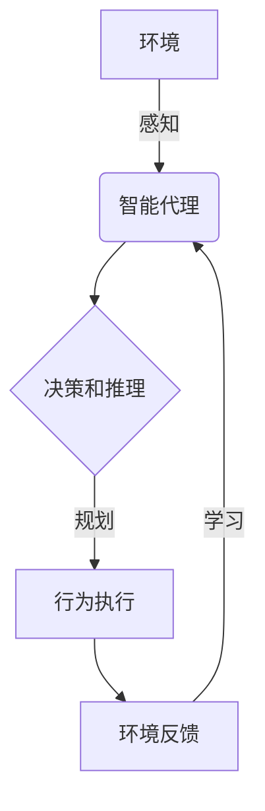

# AI人工智能代理工作流AI Agent WorkFlow：构建高效AI代理的基础

## 1. 背景介绍

### 1.1 问题的由来

在当今数字化时代,人工智能(AI)已经渗透到我们生活和工作的方方面面。随着AI技术的不断发展和应用场景的日益扩大,构建高效、可靠的AI代理系统变得越来越重要。AI代理是指能够感知环境、处理信息并采取行动的智能实体。它们被广泛应用于各种领域,如自动驾驶、机器人技术、智能助理等。

然而,设计和实现一个高效的AI代理工作流程并非易事。它需要综合考虑多个关键因素,如感知能力、决策逻辑、行为规划、学习能力等。此外,AI代理还需要具备适应不同环境的灵活性,并确保其行为符合预期目标和约束条件。

### 1.2 研究现状

目前,已有多种AI代理架构和工作流程被提出和研究,如基于规则的系统、基于模型的系统、基于学习的系统等。每种方法都有其优缺点,适用于不同的场景和需求。

例如,基于规则的系统通常易于理解和解释,但缺乏灵活性和适应性。基于模型的系统则更加灵活,但需要大量的训练数据和计算资源。而基于学习的系统则具有自主学习和改进的能力,但其决策过程往往是一个黑箱,难以解释和控制。

### 1.3 研究意义

构建高效的AI代理工作流程对于实现智能系统的可靠性、安全性和可解释性至关重要。一个优秀的AI代理工作流程不仅能够提高系统的性能和效率,还能确保其行为符合预期目标和约束条件,从而获得用户的信任和接受度。

此外,研究AI代理工作流程也有助于我们更好地理解智能系统的决策过程,并探索如何在不同领域应用AI技术。通过不断改进和优化AI代理工作流程,我们可以推动AI技术的发展,并为解决现实世界中的复杂问题提供有力支持。

### 1.4 本文结构

本文将系统地介绍AI代理工作流程的核心概念、算法原理、数学模型和实际应用。具体内容包括:

1. 核心概念与联系
2. 核心算法原理与具体操作步骤
3. 数学模型和公式详细讲解与举例说明
4. 项目实践:代码实例和详细解释说明
5. 实际应用场景
6. 工具和资源推荐
7. 总结:未来发展趋势与挑战
8. 附录:常见问题与解答

## 2. 核心概念与联系

在探讨AI代理工作流程之前,我们需要了解一些核心概念及其相互关系。这些概念为理解和构建AI代理系统奠定了基础。

### 2.1 智能代理(Intelligent Agent)

智能代理是指能够感知环境、处理信息并采取行动的实体。它们通过感知器(如摄像头、麦克风等)获取环境信息,并基于这些信息做出决策和执行相应的行为。

智能代理可以分为以下几种类型:

1. 简单反射代理(Simple Reflex Agent)
2. 基于模型的代理(Model-Based Agent)
3. 基于目标的代理(Goal-Based Agent)
4. 基于效用的代理(Utility-Based Agent)

不同类型的智能代理具有不同的感知、决策和行为能力,适用于不同的应用场景。

### 2.2 代理工作流程(Agent Workflow)

代理工作流程描述了智能代理从感知环境到执行行为的整个过程。一个典型的AI代理工作流程包括以下几个关键步骤:

1. 感知(Perception)
2. 学习(Learning)
3. 推理和决策(Reasoning and Decision Making)
4. 行为规划和执行(Behavior Planning and Execution)
5. 交互和反馈(Interaction and Feedback)

这些步骤相互关联且循环往复,形成了一个闭环系统。代理工作流程的设计直接影响着智能系统的性能和行为。

### 2.3 环境(Environment)

环境是指智能代理所处的外部世界,包括物理环境和虚拟环境。环境可以是完全可观测的(Fully Observable)或部分可观测的(Partially Observable)、确定的(Deterministic)或非确定的(Stochastic)、静态的(Static)或动态的(Dynamic)等。

智能代理需要与环境进行交互,感知环境状态并采取相应的行动。环境的复杂性和不确定性对代理工作流程的设计提出了挑战。

### 2.4 奖赏函数(Reward Function)

奖赏函数是指定义了智能代理所期望达成的目标或任务。它将环境状态和代理行为映射到一个数值奖赏,用于评估代理的行为是否符合预期目标。

奖赏函数的设计对于训练和优化智能代理系统至关重要。一个合理的奖赏函数不仅能够指导代理朝着正确的方向发展,还能够避免出现意外或不当的行为。

### 2.5 Mermaid 流程图

上图使用 Mermaid 流程图展示了智能代理与环境之间的交互过程,以及代理工作流程的关键步骤。智能代理首先感知环境状态,然后进行决策和推理,规划相应的行为并执行。环境会对代理的行为作出反馈,代理可以基于这些反馈进行学习和改进。这个循环不断重复,直到达成预期目标。

## 3. 核心算法原理与具体操作步骤

构建高效的AI代理工作流程需要结合多种算法和技术,包括感知算法、决策算法、规划算法和学习算法等。本节将介绍一些核心算法原理及其具体操作步骤。

### 3.1 算法原理概述

#### 3.1.1 感知算法

感知算法负责从环境中获取信息,并将其转换为代理可以理解和处理的形式。常见的感知算法包括计算机视觉算法(如目标检测、语义分割等)、自然语言处理算法(如语音识别、文本分类等)等。

#### 3.1.2 决策算法

决策算法根据代理的感知信息和目标,选择合适的行为。常见的决策算法有:

- 基于规则的决策算法,如决策树、专家系统等。
- 基于搜索的决策算法,如A*算法、蒙特卡罗树搜索等。
- 基于优化的决策算法,如动态规划、线性规划等。
- 基于机器学习的决策算法,如强化学习、深度学习等。

#### 3.1.3 规划算法

规划算法负责根据决策算法的输出,制定具体的行为序列或路径。常见的规划算法有:

- 经典规划算法,如A*算法、RRT算法等。
- 采样规划算法,如rapidly-exploring random tree (RRT)等。
- 基于优化的规划算法,如轨迹优化、运动规划等。
- 基于学习的规划算法,如行为克隆、逆强化学习等。

#### 3.1.4 学习算法

学习算法使得智能代理能够从经验中改进自身,适应不断变化的环境。常见的学习算法包括:

- 监督学习算法,如深度神经网络、支持向量机等。
- 非监督学习算法,如聚类算法、降维算法等。
- 强化学习算法,如Q-Learning、策略梯度等。
- 迁移学习算法,用于在不同领域之间迁移知识。

这些算法可以单独使用,也可以组合使用,形成复杂的AI代理工作流程。

### 3.2 算法步骤详解

#### 3.2.1 感知算法步骤

1. **数据采集**: 使用传感器(如摄像头、麦克风等)从环境中采集原始数据。
2. **预处理**: 对原始数据进行噪声去除、标准化等预处理,以提高后续处理的效率和准确性。
3. **特征提取**: 从预处理后的数据中提取有意义的特征,如边缘、纹理、语音特征等。
4. **模式识别**: 将提取的特征输入到机器学习模型中,识别出感兴趣的模式或对象,如物体、人脸、语音命令等。
5. **状态表示**: 将识别出的模式或对象转换为代理可以理解和处理的状态表示形式。

#### 3.2.2 决策算法步骤

1. **状态评估**: 评估当前状态,包括奖赏值、状态价值等。
2. **目标设置**: 根据奖赏函数和当前状态,设置代理的目标或子目标。
3. **行为生成**: 基于目标和当前状态,生成可能的行为候选集合。
4. **行为评估**: 评估每个候选行为的预期奖赏或效用,可以使用各种启发式搜索、规划或学习算法。
5. **行为选择**: 根据评估结果,选择最优行为或行为序列。

#### 3.2.3 规划算法步骤

1. **状态空间构建**: 根据环境和代理的能力,构建状态空间模型。
2. **目标状态设置**: 设置期望达到的目标状态。
3. **路径搜索**: 在状态空间中搜索从初始状态到目标状态的最优路径,可以使用经典搜索算法(如A*算法)或采样算法(如RRT算法)。
4. **路径优化**: 对搜索得到的路径进行平滑、简化或优化,以提高执行效率和质量。
5. **行为序列生成**: 将优化后的路径转换为一系列可执行的行为指令。

#### 3.2.4 学习算法步骤

1. **数据收集**: 收集代理与环境交互的数据,包括状态、行为和奖赏等。
2. **数据预处理**: 对收集的数据进行清洗、标注和增强等预处理。
3. **模型训练**: 使用监督学习、非监督学习或强化学习等算法,在收集的数据上训练模型。
4. **模型评估**: 在验证集或测试集上评估训练好的模型的性能。
5. **模型更新**: 根据评估结果,更新或微调模型参数,以提高模型的泛化能力。

### 3.3 算法优缺点

每种算法都有其优缺点,适用于不同的场景和需求。

- **感知算法**:
  - 优点:能够从原始数据中提取有用的信息,为后续决策和规划提供支持。
  - 缺点:对噪声和不确定性敏感,可能导致错误的状态表示。

- **决策算法**:
  - 优点:能够根据当前状态和目标做出合理的决策。
  - 缺点:决策过程可能存在局部最优或不确定性,需要与其他算法(如规划算法)结合使用。

- **规划算法**:
  - 优点:能够生成高质量的行为序列或路径。
  - 缺点:计算复杂度较高,可能无法在实时系统中使用。

- **学习算法**:
  - 优点:能够从经验中自主学习和改进,适应不断变化的环境。
  - 缺点:需要大量的训练数据,训练过程计算量大,且可解释性较差。

因此,在构建AI代理工作流程时,通常需要结合多种算法,发挥各自的优势,互相补充和协同工作。

### 3.4 算法应用领域

上述算法在多个领域都有广泛的应用,包括但不限于:

- **自动驾驶**: 感知算法用于检测道路标志、行人和障碍物;决策算法用于规划行车路线;规划算法用于生成平滑的行车轨迹;学习算法用于从驾驶数据中提高系统性能。

- **机器人技术**: 感知算法用于环境建模和目标识别;决策算法用于任务规划和运动决策;规划算法用于生成机器人运动轨迹;学习算法用于提高机器人的自主性和适应性。

- **智能助理**: 感知算法用于语音识别和自然语言理解;决策算法用于