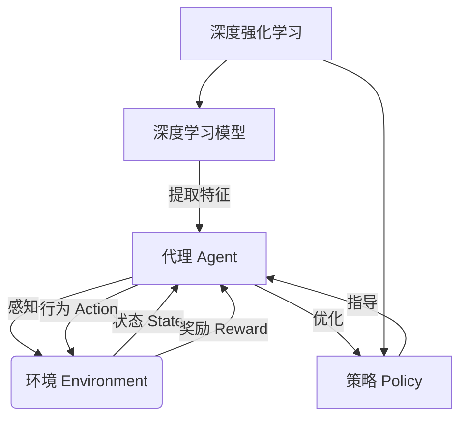

# AI人工智能代理工作流AI Agent WorkFlow：深度学习技术加强代理决策流程

## 1. 背景介绍

### 1.1 问题的由来

在当今快节奏的商业环境中，企业面临着越来越多的复杂决策情况。传统的决策流程往往依赖于人工经验和直觉,这种方式存在效率低下、决策质量参差不齐等问题。随着数据的快速积累和计算能力的不断提高,人工智能(AI)技术为优化决策流程提供了新的契机。

代理决策是指由代理(Agent)根据特定的规则或策略,代表决策主体(如个人或组织)做出决策的过程。代理决策广泛应用于金融交易、资源调度、游戏对战等领域。传统的代理决策系统通常采用规则引擎或基于经验的策略,难以处理复杂、动态的决策场景。

### 1.2 研究现状

近年来,深度学习(Deep Learning)技术在计算机视觉、自然语言处理等领域取得了突破性进展,也逐渐被应用于代理决策领域。研究人员尝试将深度学习模型集成到代理决策流程中,以提高决策质量和效率。目前的研究主要集中在以下几个方面:

1. **深度强化学习(Deep Reinforcement Learning)**:通过模拟训练,让代理自主探索最优决策策略。
2. **深度神经网络模型(Deep Neural Networks)**:利用神经网络对复杂数据进行特征提取和模式识别,为决策提供依据。
3. **多智能体系统(Multi-Agent Systems)**:研究多个智能代理之间的协作、竞争等行为,解决复杂的分布式决策问题。

虽然取得了一定进展,但将深度学习技术有效集成到代理决策流程中仍面临诸多挑战,如决策的可解释性、鲁棒性、在线学习等。

### 1.3 研究意义

将深度学习技术融入代理决策流程,可以显著提高决策质量和效率,为企业带来巨大的商业价值。具体意义包括:

1. **提高决策准确性**:深度学习模型能够从海量数据中发现隐藏的模式和规律,做出更准确的决策。
2. **加快决策速度**:代理可以根据训练好的模型快速做出决策,大幅提高效率。
3. **处理复杂场景**:深度学习技术能够处理高维、非线性的复杂决策问题。
4. **持续优化决策**:通过在线学习,代理可以不断优化决策策略,适应环境变化。
5. **降低人力成本**:自动化决策流程可以减少人工参与,降低企业运营成本。

### 1.4 本文结构

本文将全面介绍如何将深度学习技术应用于代理决策流程,主要内容包括:

1. 核心概念与联系
2. 核心算法原理与具体操作步骤
3. 数学模型和公式详细讲解与案例分析
4. 项目实践:代码实例和详细解释
5. 实际应用场景分析
6. 相关工具和学习资源推荐
7. 未来发展趋势与挑战探讨
8. 常见问题解答

## 2. 核心概念与联系

在介绍深度学习加强代理决策流程之前,我们先来了解几个核心概念及其联系:

1. **代理(Agent)**: 代理是一个感知环境并根据策略做出行为的智能体。代理的目标是通过与环境交互,最大化某种累积奖励。

2. **环境(Environment)**: 环境是代理所处的外部世界,代理通过观测环境状态并执行行为来影响环境。环境也会反馈奖励信号,指导代理优化策略。

3. **状态(State)**: 状态是对环境的数学表示,包含了代理所需的全部信息。状态空间决定了决策问题的复杂程度。

4. **行为(Action)**: 行为是代理对环境的响应,代理根据当前状态和策略选择一个行为执行。

5. **奖励(Reward)**: 奖励是环境对代理行为的评价反馈,代理的目标是最大化累积奖励。

6. **策略(Policy)**: 策略定义了代理在每个状态下选择行为的规则或概率分布。优化策略是强化学习的核心。

7. **深度学习模型**: 深度学习模型(如卷积神经网络、递归神经网络等)被用于从数据中提取特征,构建状态表示、近似策略或估计奖励等。

8. **深度强化学习**: 将深度学习模型集成到强化学习框架中,用于近似策略、估计价值函数等,以解决复杂的序列决策问题。

这些概念相互关联、环环相扣,共同构建了深度学习加强代理决策的理论框架。接下来我们将详细介绍其核心算法原理和实现细节。

## 3. 核心算法原理与具体操作步骤

### 3.1 算法原理概述

深度学习加强代理决策流程的核心是**深度强化学习(Deep Reinforcement Learning, DRL)**算法。DRL将深度神经网络模型(如卷积网络、递归网络等)集成到强化学习框架中,用于近似策略、估计价值函数等。

DRL算法的基本思路是:

1. 构建环境,定义状态、行为空间和奖励函数
2. 使用深度神经网络作为函数近似器,表示策略或价值函数
3. 通过与环境交互产生的数据,优化神经网络参数
4. 根据优化后的策略或价值函数指导代理做出决策

常见的DRL算法包括:

- **值函数近似(Value Function Approximation)**:使用神经网络估计状态价值函数或状态-行为价值函数,如深度Q网络(DQN)。
- **策略梯度(Policy Gradient)**:直接使用神经网络表示概率策略,通过策略梯度方法优化参数,如深度确定性策略梯度(DDPG)。
- **Actor-Critic**:结合值函数近似和策略梯度,使用一个网络(Actor)表示策略,另一个网络(Critic)评估价值函数,如深度确定性策略梯度(A3C)。

这些算法在不同场景下各有优缺点,需要根据具体问题进行选择和调优。接下来,我们将重点介绍两种广泛使用的DRL算法:DQN和DDPG。

### 3.2 算法步骤详解

#### 3.2.1 深度Q网络(Deep Q-Network, DQN)

DQN算法属于值函数近似范畴,使用深度神经网络来近似状态-行为价值函数(Q函数)。算法步骤如下:

1. **初始化Q网络和经验回放池**
   - 使用随机权重初始化Q网络(如卷积网络)
   - 创建一个经验回放池用于存储交互数据

2. **与环境交互,收集数据**
   - 对于每个时间步:
     - 根据当前状态$s_t$,选择一个行为$a_t$(如$\epsilon$-贪婪策略)
     - 执行选择的行为,获得下一状态$s_{t+1}$和奖励$r_t$
     - 将$(s_t, a_t, r_t, s_{t+1})$存入经验回放池

3. **从经验回放池采样,优化Q网络**
   - 从经验回放池中随机采样一个批次的数据
   - 计算目标Q值:$y_i = r_i + \gamma \max_{a'}Q(s_{i+1}, a'; \theta^-)$
   - 计算当前Q网络的Q值预测值:$Q(s_i, a_i; \theta)$
   - 优化Q网络参数$\theta$,使得预测值接近目标Q值:$\min_\theta \frac{1}{N}\sum_i(y_i - Q(s_i, a_i; \theta))^2$

4. **更新目标Q网络参数**
   - 每隔一定步数,将Q网络参数$\theta$复制到目标Q网络参数$\theta^-$

5. **重复2-4步骤,直到收敛**

DQN算法的关键在于:

- 使用经验回放池打破数据相关性,提高数据利用效率
- 目标Q网络的引入增加了算法稳定性
- $\epsilon$-贪婪策略平衡探索和利用

DQN适用于离散行为空间的决策问题,如Atari游戏、机器人控制等。

#### 3.2.2 深度确定性策略梯度(Deep Deterministic Policy Gradient, DDPG)

DDPG算法属于确定性策略梯度范畴,使用一个Actor网络表示确定性策略,一个Critic网络评估价值函数。算法步骤如下:

1. **初始化Actor网络、Critic网络和经验回放池**
   - 使用随机权重初始化Actor网络(如前馈网络)和Critic网络(如Q网络)
   - 创建一个经验回放池用于存储交互数据
   - 初始化目标Actor网络和目标Critic网络,与Actor和Critic网络参数相同

2. **与环境交互,收集数据**
   - 对于每个时间步:
     - 根据当前状态$s_t$,Actor网络输出行为$a_t = \mu(s_t|\theta^\mu)$
     - 执行选择的行为,获得下一状态$s_{t+1}$和奖励$r_t$  
     - 将$(s_t, a_t, r_t, s_{t+1})$存入经验回放池

3. **从经验回放池采样,优化Actor和Critic网络**
   - 从经验回放池中随机采样一个批次的数据
   - 更新Critic网络:
     - 计算目标Q值:$y_i = r_i + \gamma Q'(s_{i+1}, \mu'(s_{i+1}|\theta^{\mu'}))$
     - 计算当前Q值:$Q(s_i, a_i|\theta^Q)$
     - 优化Critic网络参数$\theta^Q$,使得Q值接近目标Q值:$\min_{\theta^Q} \frac{1}{N}\sum_i(y_i - Q(s_i, a_i|\theta^Q))^2$
   - 更新Actor网络:
     - 根据Actor网络输出的行为,计算Q值:$Q(s_i, \mu(s_i|\theta^\mu))$
     - 优化Actor网络参数$\theta^\mu$,使得Q值最大化:$\max_{\theta^\mu} \frac{1}{N}\sum_iQ(s_i, \mu(s_i|\theta^\mu))$

4. **更新目标Actor和Critic网络参数**
   - 软更新目标Actor网络参数:$\theta^{\mu'} \leftarrow \tau\theta^\mu + (1-\tau)\theta^{\mu'}$
   - 软更新目标Critic网络参数:$\theta^{Q'} \leftarrow \tau\theta^Q + (1-\tau)\theta^{Q'}$

5. **重复2-4步骤,直到收敛**

DDPG算法的优点在于:

- Actor-Critic架构分工明确,Actor专注于策略优化,Critic评估价值
- 使用目标网络增加算法稳定性
- 支持连续行为空间,可应用于控制、机器人等领域

DDPG在复杂的连续控制任务中表现优异,如机器人控制、自动驾驶等。

### 3.3 算法优缺点

深度强化学习算法相比传统强化学习算法具有以下优点:

1. **处理高维数据**:深度神经网络能够从高维原始数据(如图像、语音等)中自动提取特征,无需人工设计特征。
2. **泛化能力强**:神经网络具有强大的模式识别和泛化能力,可以应对复杂、动态的环境。
3. **端到端训练**:通过与环境交互的数据,可以端到端地优化整个决策流程。
4. **支持连续空间**:如DDPG算法,可以直接处理连续状态和行为空间。

但同时也存在一些缺点和挑战:

1. **样本效率低**:需要大量的交互数据来训练神经网络,数据获取成本高。
2. **收敛慢**:神经网络优化过程通常需要大量迭代,训练时间长。
3. **不稳定