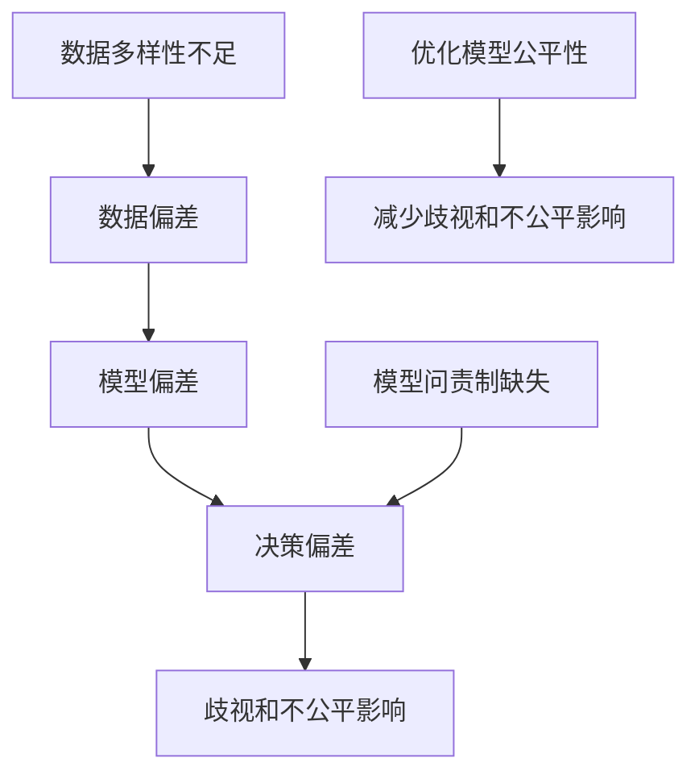
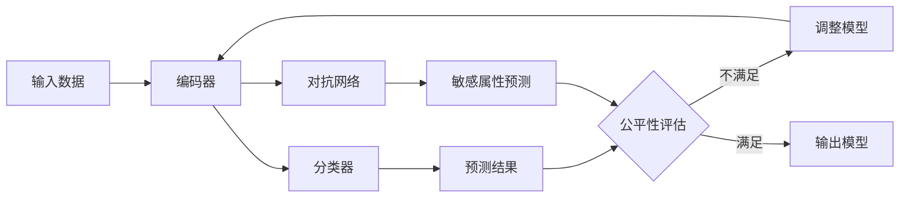

# AI人工智能核心算法原理与代码实例讲解：AI社会公平性

关键词：人工智能、算法公平性、机器学习、数据偏差、社会影响

## 1. 背景介绍

### 1.1 问题的由来

随着人工智能技术的快速发展和广泛应用,AI系统在决策和预测方面发挥着越来越重要的作用。然而,人们逐渐意识到,AI系统可能存在偏差和不公平性,对某些群体产生歧视和负面影响。这引发了人们对AI社会公平性的关注和讨论。

### 1.2 研究现状

目前,学术界和工业界都在积极探索AI社会公平性问题。一些研究者提出了量化衡量AI系统公平性的指标和方法,如统计平等、机会平等等。同时,也有研究致力于开发减轻偏差、提高公平性的算法,如对抗去偏技术、重要性加权等。但总体而言,AI社会公平性研究还处于起步阶段,许多问题有待进一步探索。

### 1.3 研究意义 

AI社会公平性研究对于推动人工智能技术健康发展、构建和谐包容的智能社会具有重要意义。只有确保AI系统的决策和预测公平合理,才能让人工智能真正造福全人类。深入研究AI社会公平性问题,有助于规避AI系统的潜在风险,增强公众对AI的信任,促进AI在教育、就业、司法等领域的应用。

### 1.4 本文结构

本文将重点探讨AI社会公平性问题,介绍相关的核心概念和算法原理。第2部分阐述AI社会公平性的核心概念和内涵。第3部分讲解几种主要的公平性评估指标和优化算法。第4部分建立数学模型,推导公平性优化的目标函数和求解方法。第5部分通过代码实例演示如何在机器学习任务中量化评估和改善模型的公平性。第6部分讨论AI公平性在现实场景中的应用。第7部分推荐相关工具和学习资源。第8部分总结全文,展望AI社会公平性的发展趋势和挑战。

## 2. 核心概念与联系

AI社会公平性问题的核心在于,训练数据、模型设计和决策过程中可能引入有害的偏差,导致AI系统对不同人群产生不公平的影响。例如,历史数据中就业数据可能存在性别歧视,如果用其训练AI系统,可能使模型继承和放大这种偏差。

讨论AI社会公平性,需要厘清几个关键概念:

- 公平性(Fairness):确保算法和模型对不同群体给予公平对待,避免基于敏感属性(如种族、性别)的歧视。
- 偏差(Bias):训练数据、特征工程、模型选择等环节引入的偏差,导致模型输出结果倾向于某些群体。
- 歧视(Discrimination):基于个人敏感属性而非客观标准对其进行区别对待,AI系统放大数据中的歧视会加剧不公平。
- 多样性(Diversity):训练数据和开发团队的多样性有助于减少偏差,代表性不足的数据会影响模型公平性。
- 问责制(Accountability):AI系统的决策应当可解释、可审计,需对不公平后果负责并及时纠正。

这些概念相互关联,共同构成了AI社会公平性问题的基本内涵。评估和优化AI系统的公平性,需要考虑数据、算法、决策各个层面,并权衡准确性和公平性的平衡。下图展示了这些概念之间的联系:



## 3. 核心算法原理 & 具体操作步骤

### 3.1 算法原理概述

评估和优化AI系统的社会公平性,需要用到多种算法和技术。主要思路包括:

1. 公平性指标:设计量化衡量AI系统公平性的数学指标,如统计平等、机会平等、反事实公平等。
2. 数据去偏:在数据预处理阶段,通过重采样、加权等方法平衡不同群体的代表性,减少数据偏差。
3. 公平性约束:在模型训练时,将公平性指标作为约束条件,使模型在追求性能的同时兼顾公平性。
4. 对抗去偏:利用对抗学习方法,训练一个对抗网络来减轻主模型的偏差,动态优化系统公平性。
5. 后处理校正:在模型决策后,对不同群体的结果进行统计校正,调整决策阈值以满足公平性要求。

### 3.2 算法步骤详解

以下以一种典型的公平性优化算法Adversarial Debiasing为例,详细讲解其步骤:

1. 定义公平性指标:如统计平等,要求模型对不同群体的预测结果分布相近。

2. 构建对抗网络:包含三部分:编码器、分类器、对抗网络。
   - 编码器:将输入数据映射到特征空间。
   - 分类器:基于特征预测目标变量。
   - 对抗网络:预测样本所属敏感组别。

3. 联合训练三个网络:
   - 最小化分类器的预测损失,优化模型性能;
   - 最小化对抗网络的预测损失,使其能准确识别敏感属性;
   - 最大化编码器提取特征的混淆度,使敏感属性难以从中预测。

4. 迭代优化直至收敛:分类器力求准确预测,对抗网络力求识别敏感属性,编码器力求去除特征中与敏感属性相关的信息。

5. 用去偏后的编码器+分类器组合进行预测,得到更公平的结果。

算法流程如下图所示:



### 3.3 算法优缺点

Adversarial Debiasing的优点包括:
- 可同时优化模型性能和公平性,在准确率和公平性之间取得平衡。
- 自适应地从数据中学习去偏策略,不需人工设计。
- 适用于多种类型的机器学习任务和模型。

缺点包括:
- 对抗训练不够稳定,容易受超参数影响。
- 去除敏感属性信息可能损害分类器性能。
- 计算开销大,对硬件要求较高。

### 3.4 算法应用领域

公平性优化算法可应用于机器学习的众多领域,如:
- 信贷评估:确保授信决策在不同人群中无差别。
- 招聘筛选:消除招聘系统基于性别、种族的歧视。
- 医疗诊断:保证诊断模型对不同人群一视同仁。
- 刑事司法:平等对待不同种族、阶层的嫌疑人。

总之,只要是对个人产生重要影响的AI决策系统,都需评估和优化其社会公平性,确保每个人获得公平对待。

## 4. 数学模型和公式 & 详细讲解 & 举例说明

### 4.1 数学模型构建

构建数学模型,考虑二分类任务,引入如下符号:
- $X$:输入特征
- $Y$:目标变量,取值为0或1
- $A$:敏感属性,取值为0或1
- $\hat{Y}$:模型预测结果
- $L_c$:分类损失函数
- $L_a$:对抗损失函数

目标是最小化分类误差,同时最小化预测结果与敏感属性的相关性。定义总损失函数:

$$L=E_{X,Y}[L_c(Y,\hat{Y})]-\lambda E_X[L_a(A,\hat{A})]$$

其中$\lambda$为平衡因子,控制公平性和性能的权重。

### 4.2 公式推导过程

对损失函数求梯度,得到优化方向:

$$\nabla_{\theta_c}L=E_{X,Y}[\nabla_{\theta_c}L_c(Y,\hat{Y})]-\lambda E_X[\nabla_{\theta_c}L_a(A,\hat{A})]$$

$$\nabla_{\theta_a}L=\lambda E_X[\nabla_{\theta_a}L_a(A,\hat{A})]$$

其中$\theta_c$和$\theta_a$分别为分类器和对抗网络的参数。

根据梯度更新参数,直至收敛:

$$\theta_c\leftarrow\theta_c-\eta\nabla_{\theta_c}L$$

$$\theta_a\leftarrow\theta_a-\eta\nabla_{\theta_a}L$$

$\eta$为学习率。

### 4.3 案例分析与讲解

以信贷评估中的性别歧视为例。假设历史数据中男性获得贷款的比例高于女性,如果直接用其训练模型,可能导致模型继承这种偏见,对女性申请人预测为拒绝的概率更大。

应用Adversarial Debiasing优化模型公平性的步骤如下:

1. 构建编码器,将申请人特征映射为低维表示。

2. 构建分类器,基于编码后的特征预测是否放贷。目标是最小化预测损失。

3. 构建对抗网络,从编码后的特征预测申请人性别。目标是最大化性别预测的混淆度。

4. 联合训练三个网络,使编码器提取的特征能很好地预测是否放贷,但难以预测性别。

5. 用训练好的编码器+分类器作为信贷评估模型,可获得性别无关的放贷决策。

### 4.4 常见问题解答

Q:去除敏感属性信息会不会影响模型性能?
A:有可能。完全去除敏感属性可能丢失部分预测目标的相关信息。需权衡公平性和性能,找到最佳平衡点。

Q:如果历史数据中已经没有歧视,还需要优化公平性吗?
A:视情况而定。若确信数据和模型没有偏差,可以不做优化。但在实践中,很难断言数据完全无偏,公平性评估和优化仍是必要的尽职调查。

Q:对抗去偏技术的局限性有哪些?
A:一是训练不稳定,容易受超参数影响。二是只关注特定敏感属性,可能忽略其他潜在的偏差来源。三是计算开销大。但总体而言,对抗去偏是一种有前景的公平性优化方法。

## 5. 项目实践：代码实例和详细解释说明

### 5.1 开发环境搭建

本项目使用Python 3和PyTorch实现Adversarial Debiasing算法。需安装以下库:
- NumPy:数值计算库
- Pandas:数据处理库
- Scikit-learn:机器学习库
- PyTorch:深度学习框架

可使用pip安装:

```
pip install numpy pandas scikit-learn torch
```

### 5.2 源代码详细实现

下面给出Adversarial Debiasing的PyTorch实现代码:

```python
import torch
import torch.nn as nn

class Encoder(nn.Module):
    def __init__(self, input_dim, hidden_dim):
        super(Encoder, self).__init__()
        self.fc1 = nn.Linear(input_dim, hidden_dim)
        self.fc2 = nn.Linear(hidden_dim, hidden_dim)
        
    def forward(self, x):
        x = torch.relu(self.fc1(x))
        x = torch.relu(self.fc2(x))
        return x
    
class Classifier(nn.Module):
    def __init__(self, hidden_dim, output_dim):
        super(Classifier, self).__init__()
        self.fc1 = nn.Linear(hidden_dim, output_dim)
        
    def forward(self, x):
        x = torch.sigmoid(self.fc1(x))
        return x
    
class Adversary(nn.Module):
    def __init__(self, hidden_dim, output_dim):
        super(Adversary, self).__init__()
        self.fc1 = nn.Linear(hidden_dim, output_dim)
        
    def forward(self, x):
        x = torch.