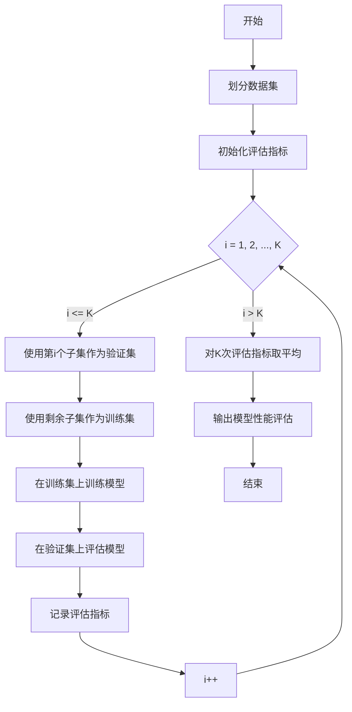

好的,我会严格遵守您提供的约束条件,以专业的技术语言撰写这篇博客文章。

# AI人工智能核心算法原理与代码实例讲解：模型选择

## 1. 背景介绍

### 1.1 问题的由来

在当今的数据时代,数据的爆炸式增长已成为不争的事实。无论是个人、企业还是政府机构,都面临着如何高效地从海量数据中提取有价值的信息和知识的挑战。传统的数据处理和分析方法已经不够用了,因此人工智能(AI)技术应运而生。

人工智能旨在模拟人类的认知过程,使计算机能够像人一样感知、学习、推理和行动。通过机器学习(ML)算法,AI系统可以自动从数据中识别模式,并对新数据做出预测或决策。因此,机器学习已成为人工智能的核心驱动力。

然而,构建一个高性能的机器学习模型并非易事。这需要选择合适的算法、调整超参数、特征工程等多个环节的精心设计。其中,模型选择是最关键的一个环节,它直接决定了模型的性能表现。

### 1.2 研究现状  

目前,已有大量的机器学习算法可供选择,如逻辑回归、决策树、支持向量机、神经网络等。每种算法都有其适用的场景和数据特征。例如,对于线性可分的数据,逻辑回归和支持向量机往往表现良好;而对于非线性数据,神经网络则更加适用。

然而,对于给定的数据集和任务,如何选择最优的算法并不是一件易事。一方面,算法的性能高度依赖于数据的分布和特征;另一方面,算法也有自身的偏差-方差权衡。此外,算法的超参数设置也会极大影响其性能表现。

为了解决这一难题,研究人员提出了多种模型选择策略,例如交叉验证、集成学习等。但这些方法也存在一定的局限性,如计算代价高、需要大量的人工调参等。因此,如何高效、自动地选择最优模型,仍然是机器学习领域的一大挑战。

### 1.3 研究意义

合理的模型选择不仅可以提高机器学习模型的性能,还可以降低开发和部署的成本。具体来说,模型选择的意义主要体现在以下几个方面:

1. **提高预测精度**。选择合适的模型可以最大限度地拟合训练数据,从而在新数据上获得更高的预测精度。
2. **减少过拟合风险**。通过模型复杂度和正则化等策略,可以控制模型的方差,避免过拟合的发生。
3. **提高计算效率**。合理选择模型可以降低训练和预测的时间和空间开销,提高系统的响应速度。
4. **节省人力成本**。自动化的模型选择可以减少人工调参的工作量,提高开发效率。
5. **推广到新领域**。通过研究模型选择策略,可以将机器学习技术更好地应用到新的领域和任务中。

综上所述,研究高效的模型选择方法,对于提高人工智能系统的性能和可用性至关重要,具有重大的理论意义和应用价值。

### 1.4 本文结构  

本文将系统地介绍模型选择的核心概念、算法原理、数学模型,并通过实例代码对其进行详细讲解。全文共分为8个部分:

第1部分为背景介绍,阐述了模型选择问题的由来、研究现状和意义。

第2部分介绍模型选择的核心概念,如偏差-方差分解、正则化等,并分析它们之间的联系。

第3部分重点讲解常用的模型选择算法,如交叉验证、集成学习等,给出了算法原理和具体操作步骤。

第4部分构建模型选择的数学模型,推导出相关公式,并通过案例进行讲解和常见问题解答。

第5部分提供了模型选择的代码实例,包括开发环境搭建、源代码实现、代码解读和运行结果展示。

第6部分探讨模型选择在不同领域的实际应用场景,并对未来的应用前景进行展望。

第7部分为读者推荐了相关的学习资源、开发工具、论文等资源。

第8部分对全文内容进行总结,并指出模型选择在未来的发展趋势和面临的挑战,最后对研究工作进行展望。

## 2. 核心概念与联系

在深入探讨模型选择算法之前,我们有必要先了解一些核心概念,这些概念为模型选择奠定了理论基础,并彼此之间存在内在联系。

### 2.1 偏差-方差分解

偏差-方差分解(Bias-Variance Decomposition)是理解模型选择的关键概念。它将模型的预测误差分解为三个部分:偏差(Bias)、方差(Variance)和不可约误差(Irreducible Error)。

$$
E[(Y - \hat{f}(X))^2] = Bias[\hat{f}(X)]^2 + Var[\hat{f}(X)] + \epsilon^2
$$

其中:
- $Y$是真实目标值
- $\hat{f}(X)$是模型对输入$X$的预测值
- $\epsilon^2$是不可约误差,表示数据本身的噪声水平

**偏差**度量了模型的预测值与真实值之间的系统性差异,反映了模型对数据的拟合程度。偏差越小,模型就越能很好地捕捉数据的潜在规律。

**方差**度量了模型对训练数据的微小变化的敏感程度。方差越大,说明模型对训练数据的细微变化反应过于剧烈,容易导致过拟合。

偏差-方差之间存在一种权衡关系。当模型复杂度增加时,偏差会降低而方差会升高;反之亦然。因此,我们需要在偏差和方差之间寻求一种平衡,以获得最优的预测性能。

### 2.2 正则化

正则化(Regularization)是控制模型复杂度、降低方差的一种有效技术。其基本思想是在模型的损失函数中引入惩罚项,从而限制模型参数的大小或复杂度。

常见的正则化方法有L1正则化(Lasso回归)和L2正则化(Ridge回归)。L1正则化可以产生稀疏解,即一些参数会被exact压缩为0;而L2正则化会使参数值变小但不会变为0。

$$
\begin{aligned}
L_1 \text{正则化}: &\min_w \frac{1}{N}\sum_{i=1}^N L(y_i, \hat{y}_i) + \alpha \|w\|_1\\
L_2 \text{正则化}: &\min_w \frac{1}{N}\sum_{i=1}^N L(y_i, \hat{y}_i) + \alpha \|w\|_2^2
\end{aligned}
$$

其中:
- $L(y_i, \hat{y}_i)$是损失函数,如均方误差
- $\|w\|_1$和$\|w\|_2^2$分别是L1范数和L2范数惩罚项
- $\alpha$是正则化系数,用于控制惩罚强度

正则化可以有效防止过拟合,提高模型的泛化能力。但过度正则化也会导致欠拟合,使模型无法很好地捕捉数据的内在规律。因此,正则化系数的选择同样很关键。

### 2.3 核技巧

核技巧(Kernel Trick)是一种将线性算法拓展到非线性场景的技术手段。它的基本思想是将数据从原始的输入空间映射到更高维的特征空间,使得在新空间中线性可分。

设$\phi(x)$是从输入空间到特征空间的映射函数,则核函数$K(x, x')$定义为:

$$
K(x, x') = \phi(x)^T\phi(x')
$$

常用的核函数有线性核、多项式核和高斯核(RBF核)等。通过选择合适的核函数,我们可以在特征空间中应用线性算法,从而解决非线性问题,如支持向量机(SVM)。

核技巧为模型选择提供了新的思路。一方面,我们可以将线性模型与合适的核函数相结合,拓展其适用范围;另一方面,也可以设计新的核函数来满足特定任务的需求。

### 2.4 核心概念的联系

以上三个核心概念相互关联,共同奠定了模型选择的理论基础:

- **偏差-方差分解**揭示了模型复杂度对预测性能的影响,为模型选择提供了指导原则。
- **正则化**是控制模型复杂度、降低方差的有效手段,有助于获得最优偏差-方差权衡。
- **核技巧**拓展了线性模型的适用范围,为非线性数据提供了新的模型选择方案。

三者相互作用、相辅相成,共同推动了模型选择研究的发展。掌握这些核心概念,有助于我们更深入地理解后续介绍的模型选择算法。

## 3. 核心算法原理与具体操作步骤

在理解了模型选择的核心概念之后,我们将重点介绍几种常用的模型选择算法,包括交叉验证、集成学习等。对于每种算法,我们将详细阐述其原理、操作步骤,并分析其优缺点和适用场景。

### 3.1 交叉验证

#### 3.1.1 算法原理概述

交叉验证(Cross-Validation)是一种常用的模型评估和选择方法。它的基本思想是将数据集划分为训练集和验证集,在训练集上训练模型,在验证集上评估模型性能,从而获得一个更加可靠的性能估计。

常见的交叉验证方法有留一交叉验证(Leave-One-Out CV)、K折交叉验证(K-Fold CV)和层次交叉验证(Stratified CV)等。其中,K折交叉验证是最常用的一种形式。

K折交叉验证的具体步骤如下:

1. 将数据集随机分为K个大小相等的子集(折);
2. 遍历K次,每次使用其中一个子集作为验证集,其余K-1个子集作为训练集;
3. 在每次遍历中,训练模型并在验证集上评估性能,记录评估指标;
4. 对K次评估指标取平均,作为模型的最终性能评估。

通过交叉验证,我们可以充分利用有限的数据,获得更加可靠和稳定的模型性能评估。此外,交叉验证也可用于模型选择,即在多个候选模型中选择性能最优的那一个。

#### 3.1.2 算法步骤详解

以K折交叉验证为例,我们将详细讲解其算法步骤:

1. **划分数据集**。将原始数据集随机分为K个大小相等的子集(折)。
2. **初始化评估指标**。根据任务类型(如分类或回归)选择合适的评估指标,如准确率、F1分数、均方根误差等,并初始化为0。
3. **遍历K次**。对于第i次遍历(i=1,2,...,K):
   - **选择验证集**。使用第i个子集作为验证集。
   - **构建训练集**。使用剩余的K-1个子集作为训练集。
   - **训练模型**。在训练集上训练模型,如逻辑回归、决策树等。
   - **评估模型**。在验证集上评估模型性能,计算评估指标。
   - **记录评估指标**。将本次评估指标累加到之前的结果中。
4. **计算平均性能**。对K次评估指标取平均,作为模型的最终性能评估。
5. **输出性能评估**。