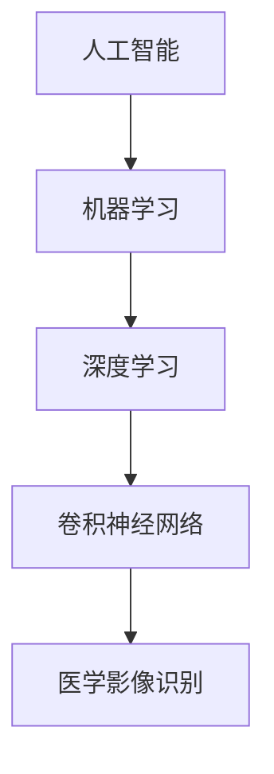

# AI人工智能深度学习算法：在医学影像识别中的应用

关键词：人工智能, 深度学习, 医学影像, 卷积神经网络, 计算机辅助诊断

## 1. 背景介绍
### 1.1  问题的由来
随着医疗技术的不断发展,医学影像数据呈现爆炸式增长。传统的人工诊断方式已经无法满足临床需求,迫切需要计算机辅助诊断(Computer-Aided Diagnosis, CAD)技术来提高诊断效率和准确性。而人工智能,尤其是深度学习技术的兴起,为医学影像分析带来了革命性的突破。
### 1.2  研究现状 
近年来,深度学习在医学影像识别领域取得了显著成果。一方面,卷积神经网络(Convolutional Neural Network, CNN)等深度学习模型在医学图像分类、检测、分割等任务上表现出色,甚至在某些场景下已经达到甚至超过了人类专家的水平。另一方面,研究者们不断探索将深度学习与医学知识相结合的方法,以进一步提升模型的可解释性和泛化能力。
### 1.3  研究意义
将AI深度学习算法应用于医学影像识别,有望极大提高医疗诊断的效率和准确性,减轻医生的工作负担,让更多患者及时获得高质量的医疗服务。同时,AI辅助诊断系统的普及也将推动精准医疗的发展,为疾病的早期筛查、个性化治疗提供有力支持。因此,深入研究深度学习在医学影像识别中的应用具有重要的理论和实践意义。
### 1.4  本文结构
本文将围绕AI深度学习算法在医学影像识别中的应用展开论述。第2部分介绍相关的核心概念;第3部分重点阐述深度学习的核心算法原理;第4部分建立数学模型并给出详细推导;第5部分通过代码实例演示具体实现;第6部分讨论实际应用场景;第7部分推荐相关工具和学习资源;第8部分总结全文并展望未来;第9部分列出常见问题解答。

## 2. 核心概念与联系
- 医学影像:泛指利用各种成像技术获得的人体内部结构或功能的图像,常见的有X射线、CT、MRI、超声等。
- 人工智能:让机器模拟人类智能的一门交叉学科,涉及计算机科学、数学、认知科学等多个领域。
- 机器学习:人工智能的一个分支,旨在通过数据驱动的方式让计算机系统自动"学习"如何执行任务,而无需显式编程。
- 深度学习:机器学习的一类算法,基于多层神经网络,能够从数据中自动学习多层次的特征表示。
- 卷积神经网络:一种专门用于处理网格拓扑结构数据(如图像)的深度学习模型,通过局部连接和权值共享等特性,能够高效地提取图像特征。

下图展示了这些核心概念之间的联系:

## 3. 核心算法原理 & 具体操作步骤
### 3.1  算法原理概述
卷积神经网络是深度学习在图像识别领域最成功的模型之一。它通过交替使用卷积层和池化层提取图像特征,再经过全连接层实现分类或回归任务。CNN的关键在于,卷积操作能够自动学习到图像的局部特征,并通过层级结构逐步形成更加抽象和高级的特征表示。
### 3.2  算法步骤详解
一个典型的CNN模型通常包含以下几个步骤:

1. 输入层:接收原始图像数据。
2. 卷积层:使用卷积核对图像进行卷积操作,提取局部特征。卷积核在图像上滑动,对每个局部区域执行点积,得到特征图(Feature Map)。一个卷积层通常包含多个卷积核,生成多个特征图。
3. 激活层:对卷积层的输出施加非线性激活函数,引入非线性因素,提高模型的表达能力。常用的激活函数有ReLU、sigmoid、tanh等。 
4. 池化层:对特征图进行下采样,减小数据维度,同时保留重要的特征。常见的池化操作有最大池化和平均池化。
5. 全连接层:将池化层输出的特征图"展平"成一维向量,并通过若干个全连接层(由神经元组成)对特征进行组合,最终输出预测结果。
6. 输出层:根据任务的不同,输出层可以是用于分类的softmax层,也可以是用于回归的线性层。

以上步骤可以根据具体任务进行调整和扩展,比如增加更多的卷积层和池化层,使用残差连接,引入注意力机制等。

### 3.3  算法优缺点
优点:
- 能够自动学习层次化的特征表示,无需人工设计特征。
- 具有平移不变性,对图像的平移、旋转等变化有较强的鲁棒性。
- 参数共享机制大大减少了模型的参数量,提高了训练效率。

缺点:
- 需要大量的标注数据进行训练,对医学影像这类专业领域数据获取成本较高。  
- 模型复杂度高,训练时间长,对计算资源要求较高。
- 模型的可解释性较差,难以给出明确的决策依据,这对医学诊断来说是个挑战。

### 3.4  算法应用领域
基于卷积神经网络的深度学习算法已经在医学影像的各个领域得到广泛应用,包括:
- 病变检测:如肺结节、乳腺肿块、皮肤病变等的检测。
- 器官分割:如脑部、心脏、肝脏等器官的分割。
- 疾病分类:如肿瘤的良恶性诊断,阿尔茨海默病的分期诊断等。
- 影像配准:如将不同模态、不同时间点的医学影像进行配准。
- 图像重建:如CT、MRI的图像重建和去噪。

随着深度学习技术的不断发展,其在医学影像识别中的应用范围还将不断扩大。

## 4. 数学模型和公式 & 详细讲解 & 举例说明
### 4.1  数学模型构建
我们以一个简单的二维卷积为例,来说明卷积神经网络的数学模型。

设输入图像为$\boldsymbol{X} \in \mathbb{R}^{H \times W}$,卷积核为$\boldsymbol{K} \in \mathbb{R}^{k \times k}$,卷积层的输出特征图为$\boldsymbol{Y} \in \mathbb{R}^{H' \times W'}$,其中$H'=H-k+1$,$W'=W-k+1$。

则卷积操作可以表示为:

$$
\boldsymbol{Y}_{i,j} = \sum_{m=0}^{k-1} \sum_{n=0}^{k-1} \boldsymbol{X}_{i+m,j+n} \boldsymbol{K}_{m,n}
$$

其中,$\boldsymbol{Y}_{i,j}$表示输出特征图在位置$(i,j)$处的值,$\boldsymbol{X}_{i+m,j+n}$表示输入图像在卷积核覆盖的区域内的像素值,$\boldsymbol{K}_{m,n}$表示卷积核的权重系数。

### 4.2  公式推导过程
上述卷积公式可以看作是两个矩阵(张量)的局部点积。我们将其展开:

$$
\begin{aligned}
\boldsymbol{Y}_{0,0} &= \boldsymbol{X}_{0,0} \boldsymbol{K}_{0,0} + \boldsymbol{X}_{0,1} \boldsymbol{K}_{0,1} + \cdots + \boldsymbol{X}_{k-1,k-1} \boldsymbol{K}_{k-1,k-1} \\
\boldsymbol{Y}_{0,1} &= \boldsymbol{X}_{0,1} \boldsymbol{K}_{0,0} + \boldsymbol{X}_{0,2} \boldsymbol{K}_{0,1} + \cdots + \boldsymbol{X}_{k-1,k} \boldsymbol{K}_{k-1,k-1} \\
&\cdots \\
\boldsymbol{Y}_{H'-1,W'-1} &= \boldsymbol{X}_{H-1,W-1} \boldsymbol{K}_{0,0} + \boldsymbol{X}_{H-1,W} \boldsymbol{K}_{0,1} + \cdots + \boldsymbol{X}_{H+k-2,W+k-2} \boldsymbol{K}_{k-1,k-1}
\end{aligned}
$$

可以看出,卷积核在图像上滑动,每次滑动都对当前位置的局部区域执行相同的点积操作,从而得到输出特征图的一个元素。这种权值共享的机制使得卷积层能够高效地提取局部特征。

### 4.3  案例分析与讲解
下面我们以一个3×3的图像和一个2×2的卷积核为例,演示卷积操作的过程。

输入图像$\boldsymbol{X}$:
$$
\boldsymbol{X} = \begin{bmatrix}
1 & 2 & 3 \\
4 & 5 & 6 \\
7 & 8 & 9
\end{bmatrix}
$$

卷积核$\boldsymbol{K}$:
$$
\boldsymbol{K} = \begin{bmatrix}
1 & 0 \\
0 & 1
\end{bmatrix}
$$

根据卷积公式,可以计算出输出特征图$\boldsymbol{Y}$:

$$
\boldsymbol{Y}_{0,0} = 1 \times 1 + 2 \times 0 + 4 \times 0 + 5 \times 1 = 6 \\
\boldsymbol{Y}_{0,1} = 2 \times 1 + 3 \times 0 + 5 \times 0 + 6 \times 1 = 8 \\
\boldsymbol{Y}_{1,0} = 4 \times 1 + 5 \times 0 + 7 \times 0 + 8 \times 1 = 12 \\
\boldsymbol{Y}_{1,1} = 5 \times 1 + 6 \times 0 + 8 \times 0 + 9 \times 1 = 14
$$

因此,输出特征图$\boldsymbol{Y}$为:
$$
\boldsymbol{Y} = \begin{bmatrix}
6 & 8 \\
12 & 14
\end{bmatrix}
$$

这个简单例子直观地展示了卷积的计算过程。在实际应用中,卷积核的大小、数量以及卷积层的堆叠方式可以根据任务需求进行设计和优化。

### 4.4  常见问题解答
Q: 卷积核的大小如何选择?  
A: 卷积核的大小是一个超参数,需要根据具体任务和数据特点进行调整。常见的选择有3×3、5×5、7×7等。较小的卷积核可以减少参数量,较大的卷积核可以扩大感受野。在实践中,通常使用多个小卷积核来替代一个大卷积核,既可以减少参数,又能增加网络深度。

Q: 卷积步长(stride)和填充(padding)有什么作用?  
A: 卷积步长指卷积核每次滑动的距离,默认为1。增大步长可以减小输出特征图的尺寸。填充指在输入图像周围添加额外的像素(通常为0),使输出特征图的尺寸与输入保持一致。步长和填充是控制卷积层输出尺寸的两个重要参数。

Q: 池化层的作用是什么?  
A: 池化层通过对输入特征图进行下采样,可以减小数据维度,降低计算复杂度,同时还能提高特征的平移不变性。常见的池化操作有最大池化(取局部区域的最大值)和平均池化(取局部区域的平均值)。池化层通常夹在连续的卷积层之间。

Q: 如何理解卷积神经网络的层级结构?  
A: CNN通过交替使用卷积层和池化层,逐步将局部特征组合成更高级的特征。浅层