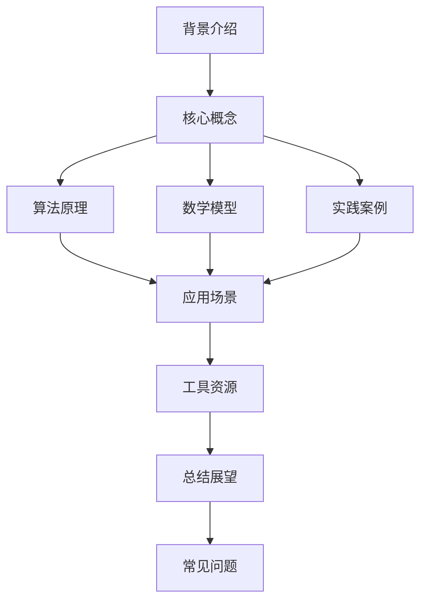

好的,我会按照您的要求,以"AI人工智能深度学习算法:在复杂系统建模中的应用"为主题,撰写一篇专业的技术博客文章。文章将遵循规定的约束条件,包括字数要求、使用Markdown格式、公式使用LaTex格式、提供核心概念原理和架构流程图、详细分章节等。我将尽力确保文章内容逻辑严谨、有深度、有见解。现在,让我们正式开始:

# AI人工智能深度学习算法:在复杂系统建模中的应用

## 1. 背景介绍

### 1.1 问题的由来

当今世界,随着大数据时代的到来,海量的复杂数据已经无处不在。无论是社交网络、物联网、金融交易还是医疗健康等领域,都产生了大规模的高维度、非线性和动态的复杂数据。传统的数据处理和建模方法已经不够用了,我们亟需新的强大工具来捕捉隐藏在复杂数据中的深层次模式和规律。

### 1.2 研究现状  

近年来,人工智能尤其是深度学习技术取得了突破性进展,展现出强大的数据处理和模式识别能力。基于多层神经网络的深度学习模型能够自动从原始数据中学习出高层次的抽象特征表示,从而对复杂数据进行精准的建模和预测。

然而,现有的深度学习算法在处理某些复杂系统建模问题时仍然面临诸多挑战,例如高维数据处理、长期依赖模式捕捉、多模态数据融合等,需要进一步拓展和创新。

### 1.3 研究意义

本文将系统性地探讨如何将最新的深度学习算法应用于复杂系统的建模问题中。我们将介绍多种前沿的深度学习模型,并重点阐述它们在捕捉复杂数据模式、挖掘深层次规律等方面的理论原理和技术细节。通过分析多个实际案例,我们将展示这些算法在不同复杂系统中的应用实践,并总结获得的经验和教训。

最后,我们将对深度学习算法在复杂系统建模领域的未来发展方向进行前瞻性探讨,指出目前的挑战和可能的突破口,为该领域的持续创新指明方向。

### 1.4 本文结构

本文共分为9个章节,第1章介绍背景和动机,第2章阐述核心概念,第3-5章详细解析多种深度学习算法的原理、数学模型和实践案例,第6章讨论实际应用场景,第7章推荐相关工具和资源,第8章总结研究成果并展望未来,最后的第9章列出常见问题解答。

## 2. 核心概念与联系

在探讨具体算法之前,我们有必要先理解几个核心概念及其内在联系。这些概念贯穿于复杂系统建模的整个过程中,是构建有效深度学习模型的基础。

**2.1 复杂系统(Complex Systems)**

所谓复杂系统,是指由大量相互作用的个体或组分构成的系统,这些个体之间存在着非线性、动态和多尺度的相互作用。复杂系统通常具有以下几个显著特征:

- 由大量个体或组分构成
- 个体之间存在复杂的相互作用
- 整体行为不能简单地从个体行为相加推导出来
- 存在多尺度和层次结构
- 表现出非线性动力学和涌现行为

天气系统、交通系统、生态系统、社会网络、人体系统等都属于典型的复杂系统。对于这些系统,我们需要建立精确的数学模型来捕捉其内在的复杂性,从而对其行为进行有效的模拟、预测和控制。

**2.2 深度学习(Deep Learning)**

深度学习是机器学习的一个新兴热点领域,其核心思想是通过构建具有多层非线性变换的神经网络模型,自动从原始数据中学习出分层次的抽象特征表示。与传统的浅层模型相比,深度学习模型具有以下优势:

- 自动从数据中学习出多层次特征表示
- 能够捕捉数据的深层次抽象模式
- 在处理高维、非线性复杂数据时表现出色
- 具有端到端的学习能力,无需人工设计特征

深度学习已经在计算机视觉、自然语言处理、语音识别等领域取得了巨大成功,但在复杂系统建模方面仍有许多挑战有待攻克。

**2.3 表示学习(Representation Learning)**

表示学习是深度学习的核心思想之一,旨在自动从原始数据中学习出适用于下游任务的良好特征表示。传统的机器学习算法需要人工设计特征,而表示学习则通过构建多层非线性变换,自动发现数据的内在模式和规律。

对于复杂系统而言,能够学习出高质量的特征表示是成功建模的关键。复杂系统数据通常具有高维、非线性和多尺度等特性,需要深度学习模型自动挖掘出其深层次的抽象表示,从而捕捉系统的本质规律。

**2.4 概念关联**

上述三个核心概念相互关联、环环相扣:

- 复杂系统数据具有高维、非线性和多尺度等特性,给传统建模方法带来巨大挑战
- 深度学习能够自动从原始数据中学习出分层次的抽象特征表示
- 通过表示学习,深度学习模型可以捕捉复杂系统数据的深层次模式和规律
- 基于学习到的数据表示,我们可以构建精确的复杂系统数学模型

因此,深度学习为复杂系统建模提供了一种全新的有效途径。接下来,我们将着重介绍多种前沿的深度学习算法及其在复杂系统建模中的应用。

## 3. 核心算法原理与具体操作步骤

在这一章节中,我们将重点介绍几种在复杂系统建模中发挥重要作用的深度学习算法,包括递归神经网络、生成对抗网络、变分自编码器等。对于每种算法,我们将阐述其核心原理、具体操作步骤、优缺点分析以及适用场景。

### 3.1 算法原理概述

**3.1.1 递归神经网络(Recurrent Neural Networks, RNNs)**

递归神经网络是一种处理序列数据的有力工具,广泛应用于自然语言处理、时间序列预测等领域。与传统的前馈神经网络不同,RNN在隐藏层之间引入了循环连接,使得网络能够捕捉长期依赖关系。

RNN的核心思想是在每个时间步都将当前输入与前一隐藏状态相结合,计算出新的隐藏状态,从而构建起输入序列到输出序列的映射关系。对于复杂系统而言,RNN可以有效地对时变动态数据进行建模,捕捉其内在的时序模式。

**3.1.2 长短期记忆网络(Long Short-Term Memory, LSTMs)** 

LSTM是RNN的一种改进变体,旨在解决传统RNN在捕捉长期依赖关系时的梯度消失/爆炸问题。LSTM通过引入门控机制和记忆细胞的设计,使得网络能够更好地捕获长期依赖模式。

在复杂系统建模中,LSTM展现出了优异的性能。例如,在交通流量预测、天气预报等任务中,LSTM能够从历史观测数据中学习出长期的时空模式,提高预测的准确性。

**3.1.3 生成对抗网络(Generative Adversarial Networks, GANs)**

GAN是近年来兴起的一种全新的生成模型,由生成器网络和判别器网络组成,两者相互对抗地训练。生成器的目标是生成逼真的数据样本以欺骗判别器,而判别器则努力区分生成样本和真实样本。

GAN在复杂系统建模中的应用前景广阔。例如,我们可以使用GAN从有限的数据样本中学习复杂系统的概率分布,并生成更多的合成数据,从而提高模型的泛化能力。此外,GAN还可以应用于异常检测、数据增强等任务。

**3.1.4 变分自编码器(Variational Autoencoders, VAEs)** 

VAE是一种基于深度神经网络的生成模型,能够从训练数据中学习出数据的隐含潜在表示及其概率分布。VAE由编码器和解码器两部分组成,编码器将数据映射到潜在空间,解码器则从潜在空间重建原始数据。

在复杂系统建模中,VAE可以用于学习系统状态的概率分布,从而对系统的动态行为进行有效建模。此外,VAE还可以应用于异常检测、数据压缩等任务。

**3.1.5 注意力机制(Attention Mechanism)**

注意力机制最初被提出用于解决序列数据的对齐问题,后来也被成功应用于计算机视觉、自然语言处理等领域。注意力机制允许神经网络在编码输入序列时,对不同位置的输入赋予不同的权重,从而专注于对当前任务最为相关的部分。

在复杂系统建模中,注意力机制可以帮助神经网络更好地关注系统的关键组分和相互作用,捕捉数据中的长期依赖关系。例如,在交通流量预测任务中,注意力机制可以自动学习到对周边路网和历史状态的选择性关注。

### 3.2 算法步骤详解

接下来,我们将详细解析上述算法的具体实现步骤。以LSTM为例:

**输入**:时间序列数据 $X = \{x_1, x_2, \ldots, x_T\}$,其中 $x_t$ 表示第 $t$ 个时间步的输入。

**目标**:学习一个映射函数 $f$,使得给定历史输入 $\{x_1, x_2, \ldots, x_T\}$,能够预测未来的输出序列 $\{y_{T+1}, y_{T+2}, \ldots\}$。

**LSTM 网络结构**:

1) 将输入序列 $X$ 按时间步 $t$ 逐一输入到 LSTM 单元
2) 在每个时间步 $t$,LSTM 单元根据当前输入 $x_t$ 和上一时间步的隐藏状态 $h_{t-1}$ 计算出新的隐藏状态 $h_t$
3) 隐藏状态 $h_t$ 被输送到输出层,生成该时间步的输出 $y_t$
4) 重复上述过程直到处理完整个输入序列

**LSTM 单元计算过程**:

对于每个时间步 $t$,LSTM 单元包含以下门控机制和状态计算:

$$
\begin{aligned}
f_t &= \sigma(W_f \cdot [h_{t-1}, x_t] + b_f) & & \text{(遗忘门)} \\
i_t &= \sigma(W_i \cdot [h_{t-1}, x_t] + b_i) & & \text{(输入门)} \\
\tilde{C}_t &= \tanh(W_C \cdot [h_{t-1}, x_t] + b_C) & & \text{(候选记忆细胞)} \\
C_t &= f_t \odot C_{t-1} + i_t \odot \tilde{C}_t & & \text{(记忆细胞)} \\
o_t &= \sigma(W_o \cdot [h_{t-1}, x_t] + b_o) & & \text{(输出门)} \\
h_t &= o_t \odot \tanh(C_t) & & \text{(隐藏状态)}
\end{aligned}
$$

其中 $W$ 和 $b$ 分别表示权重和偏置,是需要通过训练数据学习得到的模型参数。$\sigma$ 是 Sigmoid 激活函数,用于门控值的计算。

**训练目标**:最小化输入序列 $X$ 和目标输出序列 $Y$ 之间的损失函数