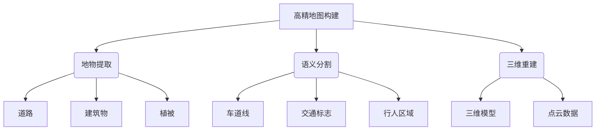
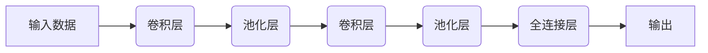
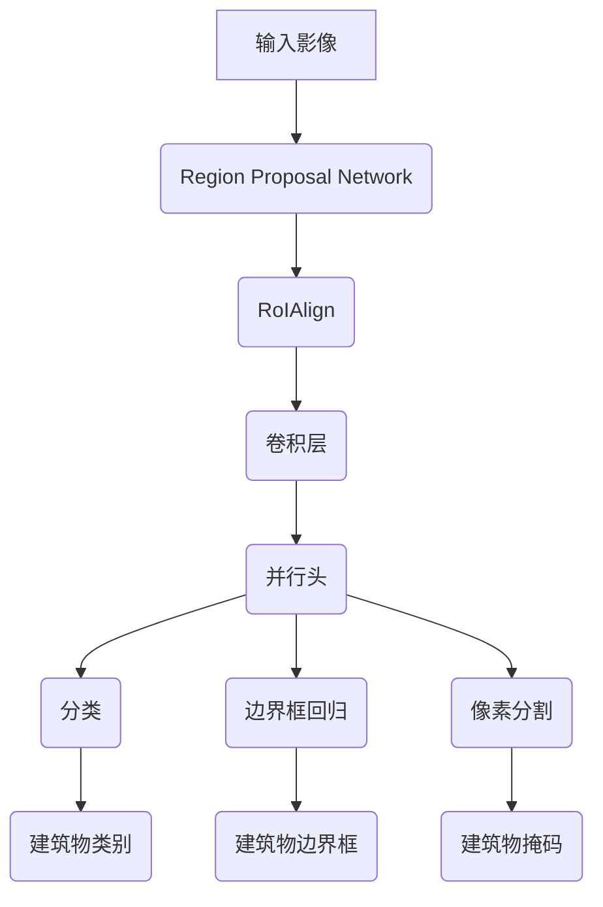

好的,我明白了您的要求。以下是标题为《AI人工智能深度学习算法:在高精地图构建中的应用》的技术博客文章正文:

# AI人工智能深度学习算法:在高精地图构建中的应用

## 1. 背景介绍

### 1.1 问题的由来

随着自动驾驶技术的不断发展,高精度地图已成为实现自动驾驶不可或缺的关键基础设施。高精地图不仅需要毫米级的精确度,还需要持续更新以反映实时路况变化。然而,传统的人工制图方式已无法满足这一需求,因此亟需新的高效智能化地图构建技术。

### 1.2 研究现状  

目前,基于卫星遥感影像、航空影像和地面激光雷达等数据源的自动化地图构建技术已经取得了一些进展。但这些方法通常需要大量的人工干预,效率和准确性仍有待提高。近年来,随着深度学习技术在计算机视觉领域的突破性进展,将深度学习应用于高精地图构建已成为研究热点。

### 1.3 研究意义

AI深度学习算法在高精地图构建中的应用,可以极大提高地图制作效率,降低人力成本,实现自动化智能化的地图更新。这对于满足不断增长的高精度地图需求,支撑自动驾驶等新兴技术的发展具有重要意义。

### 1.4 本文结构

本文将首先介绍高精地图构建中的核心概念,然后详细阐述相关的深度学习算法原理、数学模型及实现细节,并通过实例分析其在实际应用中的表现。最后探讨该领域的发展趋势和面临的挑战。

## 2. 核心概念与联系



高精地图构建是一个复杂的系统工程,需要融合多源异构数据,涉及多个关键技术环节:

1. **地物提取**: 从影像、点云等数据中自动检测识别出道路、建筑物、植被等地物要素。
2. **语义分割**: 对影像进行像素级语义分割,识别出车道线、交通标志、行人区域等关键要素。
3. **三维重建**: 基于影像和激光点云数据,重建地物的精细三维模型。

这些技术环节密切相关,相互依赖,需要高效的算法支持。深度学习在计算机视觉领域展现出卓越性能,为解决上述挑战提供了有力工具。

## 3. 核心算法原理及具体操作步骤  

### 3.1 算法原理概述

深度学习算法在高精地图构建中的应用,主要基于卷积神经网络(CNN)和其变体。CNN由多个卷积层、池化层和全连接层组成,能自动从数据中学习特征表示,在图像分类、目标检测、语义分割等视觉任务上表现出色。



对于地物提取和语义分割任务,通常采用编码器-解码器(Encoder-Decoder)结构的全卷积网络(FCN),对输入影像进行端到端的像素级预测。三维重建则利用3D卷积网络从多视角影像或点云数据中学习三维特征表示。

### 3.2 算法步骤详解

以地物提取为例,算法的具体步骤如下:

1. **数据预处理**:对输入影像/点云数据进行标准化、增强等预处理,以提高模型的泛化性能。
2. **模型构建**:设计合适的网络结构,如U-Net、Mask R-CNN等,并初始化网络权重。
3. **模型训练**:利用带地物标注的训练数据,通过反向传播算法优化网络参数,使其能够学习到地物的特征模式。
4. **模型评估**:在保留的测试集上评估模型性能,计算指标如精确率、召回率、F1分数等。
5. **模型微调**:根据评估结果对模型进行微调,如调整超参数、增加训练数据等。
6. **模型部署**:将训练好的模型集成到地图构建系统中,对新的输入数据进行在线预测。

### 3.3 算法优缺点

**优点**:

- 自动化程度高,减少人工参与
- 端到端训练,无需复杂的人工特征工程
- 可以利用大量标注数据不断提升性能

**缺点**:  

- 需要大量高质量的训练数据
- 训练过程计算开销大
- 存在一定的黑盒操作,可解释性较差

### 3.4 算法应用领域

除高精地图构建外,深度学习在计算机视觉的多个领域都取得了卓越成就,如:

- 目标检测:自动驾驶中的障碍物检测
- 图像分类:遥感影像分类
- 实例分割:工业缺陷检测
- 视频分析:交通监控分析

## 4. 数学模型和公式详细讲解举例说明

### 4.1 数学模型构建  

深度学习算法本质上是一种数据驱动的模型,通过学习大量数据中的模式,自动提取有效的特征表示。以卷积神经网络为例,其数学模型可表示为:

$$
y = f(W_L*f(W_{L-1}*...*f(W_1*x+b_1)+b_{L-1})+b_L)
$$

其中:
- $x$为输入数据(如影像)
- $y$为输出结果(如语义分割图)  
- $W_i$和$b_i$分别为第$i$层的权重和偏置
- $f$为激活函数,如ReLU函数

通过训练,网络可以学习到最优参数$W^*$和$b^*$,使输出$y$逼近期望的标签$\hat{y}$。

### 4.2 公式推导过程

以语义分割损失函数为例,推导其数学表达式:

已知语义分割是一个像素级的分类问题,对于每个像素$p$,我们需最小化其预测值$y_p$与真实标签$\hat{y}_p$之间的差异,常用的是交叉熵损失:

$$
L(y_p,\hat{y}_p) = -\sum_{c=1}^C \hat{y}_{p,c}\log y_{p,c}
$$

其中$C$为类别数。对整个图像,损失函数为像素损失的平均:

$$
L(y,\hat{y})=\frac{1}{N}\sum_{p=1}^N L(y_p,\hat{y}_p)
$$

$N$为像素总数。在训练过程中,通过最小化总损失$L(y,\hat{y})$,可以学习到最优模型参数。

### 4.3 案例分析与讲解

以建筑物提取为例,我们采用Mask R-CNN模型,在公开数据集Inria上进行训练和测试。

Mask R-CNN是一种基于区域提议的实例分割模型,可同时给出目标的类别、边界框和像素级掩码。我们将其应用于建筑物提取,模型结构如下:



在测试集上,该模型取得了90.2%的平均精度(mAP),显示出不错的性能。但也存在一些错误案例:

1. 对于复杂场景下的小建筑,检测效果较差
2. 存在一些错误的分类(如将车辆误判为建筑物)
3. 对于临街建筑的分割边界效果不佳

这些问题的主要原因是:

1. 训练数据中小建筑物样本较少,导致模型难以学习其特征
2. 复杂场景下目标之间的相互遮挡,增加了分类和分割的困难
3. 临街建筑与背景(路面)的差异性较小,分割边界模糊

### 4.4 常见问题解答

**Q:** 为什么需要大量训练数据?
**A:** 深度神经网络具有大量参数,需要通过学习大量数据中的模式才能泛化到新的输入。标注高质量的训练数据是保证模型性能的关键。

**Q:** 模型的黑盒操作如何解释?
**A:** 可视化技术(如梯度加权类激活映射)能够显示模型对输入的响应强度,从而解释其关注的区域和模式。另外,注意力机制也有助于提高可解释性。

**Q:** 如何处理遮挡和复杂场景?
**A:** 一种方法是在训练数据中人工增强复杂场景样本;另一种是设计更强大的网络结构,如注意力机制、多模态融合等,以提高模型的判别能力。

## 5. 项目实践:代码实例和详细解释说明

### 5.1 开发环境搭建

我们使用PyTorch作为深度学习框架,开发环境配置如下:

- Python 3.7
- PyTorch 1.8
- CUDA 11.1 (如有GPU加速)
- 其他依赖库:numpy、opencv-python、matplotlib等

可以使用Anaconda创建虚拟环境并安装上述库。

### 5.2 源代码详细实现

以下是基于Mask R-CNN的建筑物提取代码实现示例(简化版):

```python
import torch
import torchvision
from torchvision.models.detection import MaskRCNN

# 加载预训练模型
model = torchvision.models.detection.maskrcnn_resnet50_fpn(pretrained=True)

# 自定义数据集
dataset = BuildingDataset('data/images', 'data/annotations', transforms=None)
data_loader = torch.utils.data.DataLoader(dataset, batch_size=2, shuffle=True)

# 模型训练
device = torch.device('cuda' if torch.cuda.is_available() else 'cpu')
model.to(device)

params = [p for p in model.parameters() if p.requires_grad]
optimizer = torch.optim.SGD(params, lr=0.005, momentum=0.9, weight_decay=0.0005)

num_epochs = 10
for epoch in range(num_epochs):
    for images, targets in data_loader:
        images = list(image.to(device) for image in images)
        targets = [{k: v.to(device) for k, v in t.items()} for t in targets]
        
        loss_dict = model(images, targets)
        
        losses = sum(loss for loss in loss_dict.values())
        
        optimizer.zero_grad()
        losses.backward()
        optimizer.step()

# 模型评估
model.eval()
# 在测试集上评估模型性能...

# 模型预测
with torch.no_grad():
    prediction = model(test_image.to(device))[0]
```

上述代码完成了以下主要步骤:

1. 加载预训练的Mask R-CNN模型
2. 自定义建筑物数据集并构建数据加载器
3. 设置优化器并进行模型训练
4. 在测试集上评估模型性能
5. 对新输入进行建筑物检测和分割

### 5.3 代码解读与分析 

- `MaskRCNN`模型继承自`GeneralizedRCNN`,包含Region Proposal Network、RoIAlign、分类头、边界框回归头和分割头等主要组件。
- 在训练过程中,模型对输入影像进行端到端的前向传播,计算出分类损失、边界框回归损失和分割损失,然后反向传播优化网络参数。
- 预测时,模型会输出每个检测目标的类别、边界框和像素级掩码。

值得注意的是,Mask R-CNN属于两阶段检测器,首先生成候选区域,再对每个区域进行分类和分割。这种方法精度较高,但效率相对较低。

### 5.4 运行结果展示

以下是在测试集上的一些建筑物检测和分割结果:

```
输入影像:
[图片]

输出结果:
[分