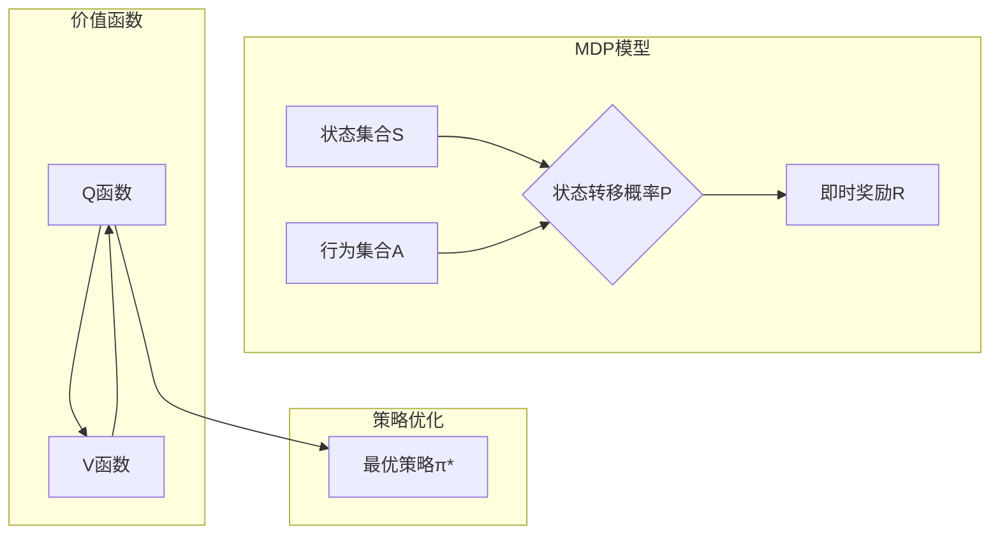

好的,我会按照您的要求,以"AI人工智能深度学习算法:智能深度学习代理的深度学习技术"为主题,撰写一篇专业的技术博客文章。文中将涵盖背景介绍、核心概念、算法原理、数学模型、项目实践、应用场景、资源推荐、发展趋势与挑战等内容。我会努力使用逻辑严谨、内容深入且结构清晰的写作风格,确保文章质量。请稍等,我需要一些时间准备和撰写。

# AI人工智能深度学习算法:智能深度学习代理的深度学习技术

## 1. 背景介绍

### 1.1 问题的由来

随着数据的快速增长和计算能力的不断提高,人工智能尤其是深度学习技术在诸多领域展现出了巨大的潜力和优势。然而,传统的深度学习模型通常是被动学习的,需要大量标注数据进行监督训练,这在很多实际场景下是低效且不实际的。相比之下,主动学习(Active Learning)范式赋予了智能代理主动探索和交互的能力,使其可以基于当前状态,自主决策下一步的行为,从而高效获取所需的知识。

### 1.2 研究现状  

主动学习范式结合了强化学习、元学习等多种技术,近年来受到了学术界和工业界的广泛关注。一些先驱性的工作如AlphaGo、Dyna-Q等展现了主动学习在复杂决策问题上的卓越表现。但目前主动学习代理的研究仍处于初级阶段,很多关键问题有待解决,如高效的探索策略、可解释性、安全性等。

### 1.3 研究意义

设计高效、可解释且安全的主动学习智能代理,对于推动人工智能技术的发展至关重要。它不仅可应用于游戏、机器人等传统领域,更有望解决医疗、金融等复杂决策问题,为人类社会创造巨大价值。本文将系统介绍主动学习智能代理的核心理论和技术,为读者提供全面的认知。

### 1.4 本文结构

本文首先阐述主动学习智能代理的核心概念,包括马尔可夫决策过程、价值函数等。接着详细解析主动学习代理的关键算法,如Q-Learning、策略梯度等,并给出数学模型和实现细节。然后介绍主动学习代理在现实中的应用场景,如游戏AI、自动驾驶等。最后探讨该领域的发展趋势、挑战及未来展望。

## 2. 核心概念与联系

主动学习智能代理理论的核心是马尔可夫决策过程(Markov Decision Process, MDP)。MDP通过一个四元组(S, A, P, R)对决策序列进行建模:

- S是状态集合
- A是行为集合  
- P是状态转移概率,P(s'|s,a)表示在状态s执行行为a后,转移到状态s'的概率
- R是即时奖励函数,R(s,a)表示在状态s执行行为a获得的即时奖励

智能代理的目标是找到一个策略π:S→A,使预期的累计奖励最大化:

$$\max_\pi \mathbb{E}\left[\sum_{t=0}^\infty \gamma^t R(s_t, a_t)\right]$$

其中γ∈(0,1)是折现因子,用于权衡当前和未来奖励的重要性。

为了量化一个策略的好坏,我们定义价值函数V^π(s)表示在状态s执行策略π后的预期累计奖励:

$$V^\pi(s) = \mathbb{E}_\pi\left[\sum_{t=0}^\infty \gamma^t R(s_t, a_t) | s_0 = s\right]$$

类似地,定义Q函数Q^π(s,a)表示在状态s执行行为a,之后再执行策略π的预期累计奖励:

$$Q^\pi(s,a) = \mathbb{E}_\pi\left[R(s,a) + \gamma \sum_{t=1}^\infty \gamma^{t-1} R(s_t, a_t) | s_0 = s, a_0 = a\right]$$

价值函数和Q函数是等价的,可以互相转换:

$$V^\pi(s) = \sum_{a \in A} \pi(a|s)Q^\pi(s,a)$$
$$Q^\pi(s,a) = R(s,a) + \gamma \sum_{s' \in S} P(s'|s,a)V^\pi(s')$$

优化策略的过程实际上是在学习最优的价值函数或Q函数。一旦获得了最优Q函数Q*,最优策略π*就可以简单地通过选择每个状态下Q值最大的行为得到:

$$\pi^*(s) = \arg\max_{a \in A} Q^*(s,a)$$

## 3. 核心算法原理 & 具体操作步骤  

### 3.1 算法原理概述

主动学习智能代理的核心算法可分为三大类:基于价值函数的算法、基于策略的算法和基于模型的算法。

- 基于价值函数的算法如Q-Learning,通过估计最优Q函数来获得最优策略。
- 基于策略的算法如策略梯度,直接对策略进行参数化,通过梯度上升优化策略参数。 
- 基于模型的算法如Dyna-Q,先学习环境的转移模型,然后基于模型进行规划和学习。

### 3.2 算法步骤详解

#### Q-Learning算法

Q-Learning是一种常用的基于价值函数的强化学习算法,其核心思想是通过不断探索和更新,逐步逼近最优Q函数。算法步骤如下:

1) 初始化Q表格,所有Q(s,a)值初始化为任意值
2) 对每个Episode:
    a) 初始化起始状态s
    b) 对每个时间步:
        i) 在状态s选择行为a,可使用ε-greedy策略平衡探索和利用
        ii) 执行行为a,观测reward r和新状态s' 
        iii) 根据下式更新Q(s,a):
            
$$Q(s,a) \leftarrow Q(s,a) + \alpha[r + \gamma\max_{a'}Q(s',a') - Q(s,a)]$$
            
        iv) 令s = s'
    c) 直到Episode终止
3) 重复2直到收敛

其中α是学习率,γ是折现因子。这一简单的Q-Learning算法虽然存在一些理论上的不足,但在实践中表现出色,被广泛应用。

#### 策略梯度算法

策略梯度是一种基于策略的强化学习算法,其核心思想是将策略π(a|s;θ)参数化为θ,然后通过梯度上升法直接优化策略参数。算法步骤如下:

1) 初始化策略参数θ
2) 对每个Episode:
    a) 产生一个Episode的轨迹τ=(s_0,a_0,r_0,s_1,a_1,r_1,...,s_T)
    b) 计算该轨迹的回报:
        
$$R(\tau) = \sum_{t=0}^T r_t$$
        
    c) 更新策略参数θ,使用策略梯度:
        
$$\theta \leftarrow \theta + \alpha\nabla_\theta \log\pi(a_t|s_t;\theta)R(\tau)$$
        
3) 重复2直到收敛

策略梯度的优点是可以直接优化策略,无需估计价值函数。但由于高方差问题,收敛速度较慢。

#### Dyna-Q算法

Dyna-Q算法是一种基于模型的强化学习算法,其核心思想是先学习环境模型,然后基于模型进行规划和学习。算法步骤如下:

1) 初始化Q函数和环境模型M
2) 对每个Episode:
    a) 初始化起始状态s
    b) 对每个时间步:
        i) 在状态s选择行为a
        ii) 执行行为a,观测reward r和新状态s'
        iii) 更新Q(s,a)和环境模型M
        iv) 执行n步规划,基于M和Q进行经验回放
        v) 令s = s'
    c) 直到Episode终止
3) 重复2直到收敛  

Dyna-Q算法将真实环境交互和模拟环境规划相结合,可以更高效地学习,尤其在稀疏奖励的情况下表现出色。

### 3.3 算法优缺点

- Q-Learning简单高效,是解决MDP问题的经典算法,但收敛性较差,在大状态空间下可能发散。
- 策略梯度可直接优化策略,适用于连续空间,但方差较大,收敛慢且易陷入局部最优。
- Dyna-Q利用模型进行规划,数据利用率高,但需要学习精确的环境模型,否则规划效果将受到影响。

### 3.4 算法应用领域

主动学习智能代理算法在诸多领域展现出广阔的应用前景:

- 游戏AI:AlphaGo等展现了卓越的游戏对抗性能
- 机器人控制:可用于机器人路径规划、操作决策等
- 自动驾驶:车辆在复杂环境下的决策和控制
- 智能调度:如作业调度、资源分配等决策优化
- 金融投资:基于市场状态进行投资组合优化
- 医疗诊断:根据病情和治疗效果持续优化诊疗方案

## 4. 数学模型和公式 & 详细讲解 & 举例说明

### 4.1 数学模型构建

我们将智能代理与环境的交互建模为马尔可夫决策过程(MDP)。MDP由一个四元组(S, A, P, R)构成:

- S是有限状态集合
- A是有限行为集合
- P是状态转移概率矩阵,P[s',s,a]表示在状态s执行行为a后,转移到状态s'的概率
- R是即时奖励函数,R(s,a)表示在状态s执行行为a获得的即时奖励

在每个时间步t,智能代理根据当前状态s_t选择一个行为a_t,并观测到从环境获得的即时奖励r_t=R(s_t,a_t),以及转移到新状态s_{t+1}的概率P(s_{t+1}|s_t,a_t)。

智能代理的目标是学习一个最优策略π*,使预期的累计折现奖励最大化:

$$\max_\pi \mathbb{E}\left[\sum_{t=0}^\infty \gamma^t R(s_t, \pi(s_t))\right]$$

其中γ∈(0,1)是折现因子,用于权衡当前和未来奖励的重要性。

为了量化一个策略π的好坏,我们定义状态价值函数V^π(s)和行为价值函数Q^π(s,a):

$$V^\pi(s) = \mathbb{E}_\pi\left[\sum_{t=0}^\infty \gamma^t R(s_t, a_t) | s_0 = s\right]$$
$$Q^\pi(s,a) = \mathbb{E}_\pi\left[R(s,a) + \gamma \sum_{t=1}^\infty \gamma^{t-1} R(s_t, a_t) | s_0 = s, a_0 = a\right]$$

价值函数和Q函数是等价的,可以互相转换:

$$V^\pi(s) = \sum_{a \in A} \pi(a|s)Q^\pi(s,a)$$
$$Q^\pi(s,a) = R(s,a) + \gamma \sum_{s' \in S} P(s'|s,a)V^\pi(s')$$

一旦获得了最优Q函数Q*,最优策略π*就可以简单地通过选择每个状态下Q值最大的行为得到:

$$\pi^*(s) = \arg\max_{a \in A} Q^*(s,a)$$

### 4.2 公式推导过程

我们以Q-Learning算法为例,推导其Q函数更新公式。

设当前状态为s,执行行为a,获得即时奖励r,并转移到新状态s'。根据Q函数的定义:

$$Q^\pi(s,a) = \mathbb{E}_\pi[r + \gamma Q^\pi(s',a')|s,a]$$

其中a'是在状态s'时执行的行为,服从策略π。我们的