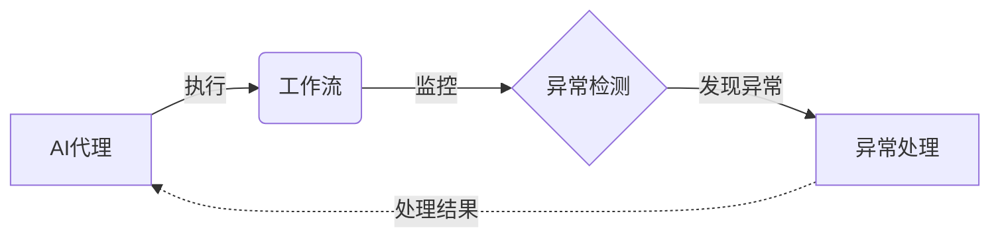

# AI代理工作流中的异常检测与处理机制

关键词：AI代理、工作流、异常检测、处理机制、机器学习、深度学习、统计模型、规则引擎

## 1. 背景介绍
### 1.1 问题的由来
随着人工智能技术的快速发展,AI代理在各行各业中得到了广泛应用。AI代理可以高效地完成各种任务,如客户服务、智能助理、自动化流程等。然而,在复杂多变的应用场景下,AI代理的工作流程中难免会出现各种异常情况,如数据质量问题、算法故障、资源限制等。及时发现和妥善处理这些异常,对于保障AI系统的稳定运行和服务质量至关重要。

### 1.2 研究现状
目前,学术界和工业界已经开展了大量关于异常检测的研究工作。传统的异常检测方法主要基于统计模型和规则引擎,如高斯混合模型、隔离森林等。近年来,随着深度学习的兴起,越来越多的研究开始探索利用神经网络进行异常检测,如自编码器、生成对抗网络等。此外,还有一些研究尝试将异常检测与因果推理、强化学习等技术相结合,以提高检测的准确性和鲁棒性。

### 1.3 研究意义 
对AI代理工作流中的异常进行有效检测和处理,具有重要的理论意义和实践价值:

1. 保障系统稳定性:及时发现和修复异常,可以避免因异常累积而导致的系统崩溃或瘫痪。
2. 提高服务质量:异常检测有助于及时发现和纠正服务质量问题,从而提升用户体验。
3. 节约运维成本:通过自动化的异常检测和处理,可以减少人工排查和修复的工作量,节约运维成本。
4. 促进技术创新:异常检测涉及机器学习、数据挖掘等前沿技术,有助于推动相关领域的理论创新和技术进步。

### 1.4 本文结构
本文将围绕AI代理工作流中的异常检测与处理机制展开深入探讨。第2节介绍相关的核心概念;第3节阐述常见的异常检测算法原理和操作步骤;第4节建立异常检测的数学模型并给出详细推导;第5节通过代码实例演示异常检测的实现;第6节分析异常检测在实际应用中的典型场景;第7节推荐相关的学习资源和开发工具;第8节总结全文并展望未来的研究方向;第9节列举常见问题解答。

## 2. 核心概念与联系

在讨论AI代理工作流的异常检测与处理之前,需要明确几个核心概念:

- AI代理:能够感知环境、自主决策和执行任务的人工智能系统,常见的如聊天机器人、智能助手等。
- 工作流:由一系列任务活动组成的业务流程,用于指导AI代理完成特定目标。
- 异常:偏离正常或预期状态的现象或行为,常见的如数据异常、算法异常、资源异常等。
- 异常检测:识别出异常情况的过程,一般基于对正常状态的建模和偏差分析。
- 异常处理:在检测到异常后采取的应对措施,如报警、回滚、自动修复等。

这些概念之间存在紧密联系。AI代理按照工作流执行任务的过程中,通过异常检测机制持续监控各个环节的状态,一旦发现异常就启动相应的处理流程,以保障工作流的正常进行。下图展示了它们之间的逻辑关系:



## 3. 核心算法原理 & 具体操作步骤
### 3.1 算法原理概述
异常检测的核心是建立对正常状态的数学表示,当观测值偏离这个表示时则判定为异常。常见的异常检测算法可分为以下几类:

- 统计模型:假设数据服从某种概率分布,异常即为小概率事件。代表算法有高斯混合模型、一类SVM等。
- 邻近法:假设正常样本在特征空间中紧密聚集,异常样本则相对孤立。代表算法有KNN、LOF等。
- 集成学习:结合多个基础异常检测器的判断结果,提高检测的鲁棒性。代表算法有Isolation Forest等。
- 神经网络:利用深度神经网络建模数据分布,重构误差大的样本视为异常。代表算法有自编码器、变分自编码器等。

### 3.2 算法步骤详解
以高斯混合模型为例,其异常检测的步骤如下:

1. 特征选择:根据先验知识选取合适的特征表示数据样本。
2. 参数估计:用EM算法拟合高斯混合分布的参数(均值、协方差、混合系数)。
3. 异常判别:计算样本在估计的分布下的概率密度,低于阈值则判定为异常。
4. 阈值选取:根据应用需求在异常检出率和误报率间权衡,选取合适的判别阈值。

### 3.3 算法优缺点
高斯混合模型的优点是:

- 数学基础完备,可解释性强。
- 适用于各种数据类型,对异常类型无先验假设。
- 计算高效,适合大规模实时应用。

但它也存在一些局限:

- 需要假设数据分布,对复杂分布拟合效果有限。
- 对高维数据处理能力不足,需要预先做特征选择。
- 离群点等噪声数据会影响参数估计的准确性。

### 3.4 算法应用领域
高斯混合模型已在多个领域的异常检测任务中得到应用,如:

- 工业制造:设备故障诊断、产品质量检测等。
- 金融风控:欺诈检测、反洗钱等。
- 网络安全:入侵检测、僵尸网络识别等。
- 医疗健康:疾病筛查、药物副作用监测等。

## 4. 数学模型和公式 & 详细讲解 & 举例说明
### 4.1 数学模型构建
假设观测数据 $X=\{x_1,\cdots,x_n\}$ 由 $k$ 个高斯分布混合而成,每个分量的参数为 $\theta_j=(\mu_j,\Sigma_j), j=1,\cdots,k$,混合系数为 $\alpha_j$,则混合分布的概率密度函数为:

$$
p(x)=\sum_{j=1}^k \alpha_j \mathcal{N}(x|\mu_j,\Sigma_j)
$$

其中,单个高斯分量的概率密度函数为:

$$
\mathcal{N}(x|\mu,\Sigma)=\frac{1}{(2\pi)^{d/2}|\Sigma|^{1/2}} \exp\left(-\frac{1}{2}(x-\mu)^T\Sigma^{-1}(x-\mu)\right)
$$

### 4.2 公式推导过程
模型参数 $\Theta=\{\alpha_j,\mu_j,\Sigma_j\}$ 可通过极大似然估计求解,即最大化对数似然函数:

$$
\mathcal{L}(\Theta|X)=\sum_{i=1}^n \log\left(\sum_{j=1}^k \alpha_j \mathcal{N}(x_i|\mu_j,\Sigma_j)\right)
$$

由于上式不易直接求解,通常采用EM算法迭代优化:

1. E步:计算每个样本属于各混合成分的后验概率(责任)

$$
\gamma_{ij}=\frac{\alpha_j \mathcal{N}(x_i|\mu_j,\Sigma_j)}{\sum_{l=1}^k \alpha_l \mathcal{N}(x_i|\mu_l,\Sigma_l)}
$$

2. M步:基于当前的责任估计更新模型参数

$$
\begin{aligned}
\mu_j&=\frac{1}{n_j}\sum_{i=1}^n \gamma_{ij}x_i \\
\Sigma_j&=\frac{1}{n_j}\sum_{i=1}^n \gamma_{ij}(x_i-\mu_j)(x_i-\mu_j)^T \\  
\alpha_j&=\frac{n_j}{n}
\end{aligned}
$$

其中 $n_j=\sum_{i=1}^n \gamma_{ij}$ 为第 $j$ 个成分的有效样本数。EM算法通过反复迭代上述两个步骤直至收敛,得到模型参数的极大似然估计。

### 4.3 案例分析与讲解
下面以一个简单的二维数据集为例,演示高斯混合模型的异常检测过程。数据如下图所示,其中蓝色点为正常样本,红色点为异常样本。

```python
import numpy as np
import matplotlib.pyplot as plt
from sklearn.mixture import GaussianMixture

# 生成示例数据
n_samples = 500
X_normal = np.random.multivariate_normal([0,0], [[1,0],[0,1]], n_samples)
X_outlier = np.random.multivariate_normal([5,5], [[1,0],[0,1]], 20)
X = np.concatenate([X_normal, X_outlier])

# 拟合高斯混合模型
k = 2
gmm = GaussianMixture(n_components=k, covariance_type='full', random_state=0)
gmm.fit(X)

# 计算样本异常分数
scores = -gmm.score_samples(X)

# 绘制结果
plt.figure(figsize=(8,6))
plt.scatter(X[:,0], X[:,1], c=scores, cmap='coolwarm')
plt.colorbar(label='Anomaly Score')
plt.title('Gaussian Mixture Model')
plt.show()
```

可以看出,高斯混合模型成功地对正常样本进行了建模,并为异常样本分配了较高的异常分数。实际使用时,可根据具体场景设置阈值,将异常分数超过阈值的样本识别为异常。

### 4.4 常见问题解答
1. 如何确定混合成分数 $k$ ?
   
   $k$ 的选择需要在欠拟合和过拟合之间权衡。一般策略是尝试多个 $k$ 值,用BIC等准则评估模型复杂度和拟合效果,选择得分最优的 $k$。
   
2. EM算法是否保证收敛到全局最优?

   EM算法只能保证收敛到局部最优,因此需要多次运行以避免局部极值。此外,还可以采用变分推断等技术改进EM算法。

3. 高斯混合模型能否处理非高斯分布的数据?

   尽管名为"高斯"混合,但只要混合成分足够多,原则上可以逼近任意连续分布。当然,这需要权衡计算复杂度。对于明显偏离高斯分布的数据,可考虑采用其他异常检测算法。

## 5. 项目实践：代码实例和详细解释说明
### 5.1 开发环境搭建
异常检测的开发可使用Python语言,需要安装以下依赖库:

- numpy:数值计算基础库
- pandas:数据处理和分析
- scikit-learn:机器学习算法库
- matplotlib:绘图和可视化

可使用pip命令安装:

```bash
pip install numpy pandas scikit-learn matplotlib
```

### 5.2 源代码详细实现
下面给出基于高斯混合模型的异常检测的完整Python实现:

```python
import numpy as np
import pandas as pd
from sklearn.mixture import GaussianMixture
from sklearn.metrics import precision_recall_curve

class GMMAnomaly:
    
    def __init__(self, k=2, threshold=None):
        self.k = k
        self.threshold = threshold
        self.model = None
        
    def fit(self, X):
        """拟合高斯混合模型"""
        self.model = GaussianMixture(n_components=self.k, 
                                     covariance_type='full', 
                                     random_state=0)
        self.model.fit(X)
        
        if self.threshold is None:
            # 根据训练集估计默认阈值
            scores = -self.model.score_samples(X)
            self.threshold = np.percentile(scores, 95)
        
    def predict(self, X):
        """异常预测"""
        scores = -self.model.score_samples(X)
        return scores > self.threshold
    
    def evaluate(self, X, y_true):
        """模型评估"""
        y_pred = self.predict(X)
        precision, recall, _ = precision_recall_curve(y