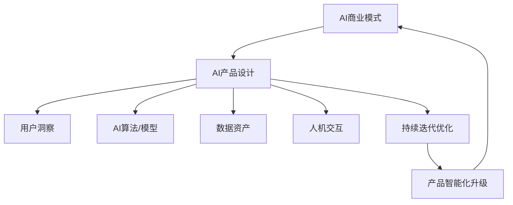

# AI商业模式与产品设计原理与代码实战案例讲解

关键词：AI商业模式、产品设计、代码实战、人工智能应用

## 1. 背景介绍
### 1.1  问题的由来
人工智能(Artificial Intelligence,AI)技术的快速发展正在深刻影响和重塑各行各业。如何利用AI技术打造创新的商业模式,开发有竞争力的智能产品,已成为众多企业关注的焦点。然而,AI商业模式与传统商业模式有很大不同,对产品设计也提出了新的要求。因此,深入探讨AI商业模式与产品设计原理,并给出代码实战案例,对于企业制定AI战略、开发AI产品具有重要意义。

### 1.2  研究现状
目前,国内外学者对AI商业模式与产品设计开展了一些研究。一些研究聚焦AI通用技术如何赋能传统行业,创造新的商业价值[1]。另一些研究则关注AI系统的产品设计方法,提出以用户为中心、数据驱动、持续迭代等原则[2]。还有研究探讨了AI产品的伦理设计问题[3]。但总体而言,既系统阐述AI商业模式与产品设计原理,又给出代码实战案例的研究还比较少。

### 1.3  研究意义
系统梳理AI商业模式与产品设计原理,并辅以代码实战案例,有助于企业全面把握AI产品开发的特点和流程,加速AI创新成果的落地应用。同时,对于广大AI从业者而言,本文也能够提供实践参考,提升实战能力。此外,本研究对于丰富AI产品设计理论、促进AI商业生态发展也具有一定学术价值。

### 1.4  本文结构
本文后续章节安排如下:第2部分概述了AI商业模式与产品设计的核心概念;第3部分重点阐述AI产品设计的核心算法原理与步骤;第4部分讨论了相关数学模型与公式;第5部分给出了代码实战案例;第6部分分析了AI产品的应用场景;第7部分推荐了相关工具和学习资源;第8部分总结全文,展望了未来AI产品的发展趋势与挑战;第9部分附录了一些常见问题解答。

## 2. 核心概念与联系
人工智能商业模式是指利用人工智能技术所创造的商业价值实现方式。它强调利用海量数据、算法模型、算力等AI要素,通过预测、决策优化、人机交互等智能化手段,提供个性化、自动化的产品或服务,从而创造新的收入来源。

AI产品设计则是指开发具备感知、学习、推理、决策等智能化功能的产品或系统的过程。它遵循以用户为中心、持续迭代优化的设计原则,充分利用机器学习、深度学习、知识图谱、自然语言处理等AI技术,让产品能够自主感知环境、理解用户需求、提供智能服务。

AI商业模式是AI产品的价值实现方式,对AI产品设计具有指导作用;而AI产品是AI商业模式的载体,二者相辅相成。下图展示了AI商业模式与产品设计的关系:



## 3. 核心算法原理 & 具体操作步骤
### 3.1  算法原理概述
AI产品的核心是机器学习算法,它能够基于数据对目标任务进行学习和优化。常见的机器学习算法包括:

1. 监督学习:通过标注数据训练模型,解决分类、回归等问题,代表算法有决策树、支持向量机、人工神经网络等。
2. 无监督学习:通过非标注数据训练模型,解决聚类、降维等问题,代表算法有K-means、主成分分析等。  
3. 强化学习:通过环境交互训练模型,解决策略优化问题,代表算法有Q-learning、策略梯度等。
4. 迁移学习:通过在已有模型基础上微调,解决小样本学习问题。

此外,深度学习作为一种多层神经网络算法,能够学习数据的高层特征表示,在图像、语音、自然语言等领域取得了突破性进展。

### 3.2  算法步骤详解
以监督学习为例,其主要步骤包括:

1. 准备标注数据:收集、清洗、标注训练数据集。
2. 特征工程:对原始数据进行特征提取、选择、降维等处理。  
3. 选择模型:根据任务类型、数据特点选择合适的机器学习模型。
4. 训练模型:利用训练数据对模型进行参数学习。
5. 评估模型:利用验证数据评估模型性能,并进行超参数调优。
6. 测试模型:利用测试数据评估模型的泛化能力。
7. 应用模型:将训练好的模型部署到实际系统中使用。

### 3.3  算法优缺点
机器学习算法的优点在于:
1. 通过数据驱动,减少了人工设计特征和规则的成本。
2. 能够随着数据的积累不断自我完善和优化。
3. 在感知、预测等任务上表现出色,大大提升了产品智能化水平。

但其缺点也较为明显:
1. 需要大量高质量的数据支撑,数据成本高。
2. 模型训练需要较大算力,资源消耗大。
3. 模型通常是黑盒,可解释性较差。
4. 对于复杂任务,模型的泛化能力有限。

### 3.4  算法应用领域  
机器学习算法在智能产品中应用广泛,如:
- 个性化推荐:通过挖掘用户行为偏好,实现商品、信息、广告等个性化推送。
- 智能客服:通过自然语言理解和生成技术,实现客户问题自动应答。  
- 智能监控:通过视频、传感器数据分析,实现设备异常、安全隐患等预警。
- 自动驾驶:通过环境感知、路径规划、决策控制,实现车辆自动驾驶。
- 辅助诊断:通过医学影像、病历数据挖掘,辅助疾病诊断和预后预测。

## 4. 数学模型和公式 & 详细讲解 & 举例说明
### 4.1  数学模型构建
以线性回归模型为例。假设有 $m$ 个样本,每个样本有 $n$ 个特征,我们用 $x^{(i)} \in \mathbb{R}^n$ 表示第 $i$ 个样本,$y^{(i)} \in \mathbb{R}$ 表示其对应的目标值。线性回归模型假设目标值与特征之间存在线性关系:

$$
h_\theta(x)=\theta_0+\theta_1x_1+...+\theta_nx_n
$$

其中 $\theta_i$ 是模型参数,$\theta=(\theta_0,\theta_1,...,\theta_n)$,表示为列向量。

为了学习最优参数 $\theta$,需要最小化损失函数,通常使用平方损失:

$$
J(\theta)=\frac{1}{2m}\sum_{i=1}^m(h_\theta(x^{(i)})-y^{(i)})^2
$$

### 4.2  公式推导过程
对损失函数求导,得到梯度:

$$
\nabla_\theta J(\theta)=\frac{1}{m}\sum_{i=1}^m(h_\theta(x^{(i)})-y^{(i)})·x^{(i)}
$$

令梯度为0,得到闭式解:

$$
\theta=(X^TX)^{-1}X^Ty
$$

其中 $X \in \mathbb{R}^{m \times (n+1)}$ 为样本矩阵,每行对应一个样本,第一列全为1,表示偏置项;$y \in \mathbb{R}^m$ 为目标值向量。

但实际应用中,通常采用梯度下降等优化算法迭代求解 $\theta$:

$$
\theta := \theta - \alpha \nabla_\theta J(\theta)
$$

其中 $\alpha$ 为学习率。

### 4.3  案例分析与讲解
以房价预测为例。假设我们收集了一个城市的房屋数据,每个样本包含面积、房龄、距市中心距离等特征,以及对应的房屋价格。我们可以构建一个线性回归模型:

$$
price = w_0 + w_1 \times area + w_2 \times age + w_3 \times distance
$$

其中 $w_i$ 为模型参数。我们将数据划分为训练集和测试集,在训练集上学习模型参数,并在测试集上评估模型的预测性能,如平均绝对误差(MAE):

$$
MAE=\frac{1}{m}\sum_{i=1}^m|price^{(i)}-\widehat{price}^{(i)}|
$$

其中 $price^{(i)}$ 为真实房价,$\widehat{price}^{(i)}$ 为预测房价。

### 4.4  常见问题解答
1. 线性回归对数据有哪些假设?
- 假设特征与目标值之间存在线性关系。
- 假设样本相互独立。
- 假设残差服从均值为0的高斯分布。

2. 如何评估线性回归模型的性能?
- 可以使用均方误差(MSE)、平均绝对误差(MAE)、决定系数(R2)等指标。
- 通过交叉验证等方法选择超参数。
- 绘制学习曲线,评估模型是否过拟合或欠拟合。

3. 线性回归有哪些改进版本?
- 岭回归:引入L2正则化,控制过拟合。
- Lasso回归:引入L1正则化,可以进行特征选择。
- 多项式回归:引入高次项,拟合非线性关系。
- 逻辑回归:引入Sigmoid函数,解决分类问题。

## 5. 项目实践：代码实例和详细解释说明
### 5.1  开发环境搭建
本项目使用Python语言,需要安装以下库:
- NumPy:数值计算库
- Pandas:数据处理库
- Matplotlib:数据可视化库
- Scikit-learn:机器学习库

可以使用pip安装:

```
pip install numpy pandas matplotlib scikit-learn
```

### 5.2  源代码详细实现
以下是使用Scikit-learn实现线性回归的代码:

```python
from sklearn.datasets import load_boston
from sklearn.model_selection import train_test_split
from sklearn.linear_model import LinearRegression
from sklearn.metrics import mean_absolute_error

# 加载波士顿房价数据集
boston = load_boston()
X = boston.data
y = boston.target

# 划分训练集和测试集
X_train, X_test, y_train, y_test = train_test_split(X, y, test_size=0.2, random_state=42)

# 创建线性回归模型
lr = LinearRegression()

# 训练模型
lr.fit(X_train, y_train)

# 预测测试集
y_pred = lr.predict(X_test)

# 评估模型
mae = mean_absolute_error(y_test, y_pred)
print(f"Mean Absolute Error: {mae:.2f}")
```

### 5.3  代码解读与分析
1. 第1-3行:导入需要的库,包括Scikit-learn的数据集、模型选择、线性回归模型和评估指标。
2. 第6-8行:加载波士顿房价数据集,并将特征和目标值分别赋值给X和y。 
3. 第11行:使用train_test_split函数划分训练集和测试集,测试集比例为20%,random_state参数设置随机种子以保证可复现。
4. 第14行:创建线性回归模型对象。
5. 第17行:使用fit方法在训练集上训练模型。
6. 第20行:使用predict方法在测试集上进行预测。
7. 第23-24行:使用mean_absolute_error函数计算平均绝对误差,并打印结果。

### 5.4  运行结果展示
运行上述代码,可以得到如下输出:

```
Mean Absolute Error: 3.27
```

表明该线性回归模型在测试集上的平均绝对误差为3.27。我们还可以进一步分析模型的系数和截距:

```python
print(f"Coefficients: {lr.coef_}")  
print(f"