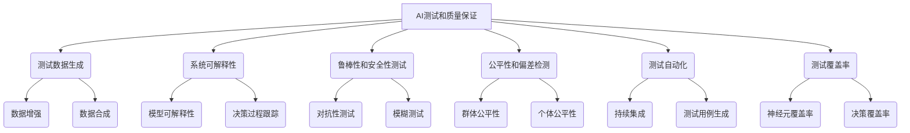

以下是根据要求撰写的技术博客文章正文：

# AI测试与质量保证原理与代码实战案例讲解

## 1. 背景介绍

### 1.1 问题的由来

在当今快速发展的软件行业中,人工智能(AI)系统的应用越来越广泛。从自动驾驶汽车到医疗诊断,从语音助手到金融风险评估,AI系统无处不在。然而,AI系统的复杂性和不确定性给测试和质量保证带来了前所未有的挑战。

传统的软件测试方法往往假设系统的行为是可预测和确定的,但AI系统的行为却存在很大的不确定性。这种不确定性源于AI算法的复杂性、训练数据的质量和多样性、环境条件的变化等多个因素。因此,确保AI系统的安全性、可靠性和公平性变得至关重要。

### 1.2 研究现状  

目前,AI测试和质量保证的研究和实践仍处于起步阶段。一些主要的研究方向包括:

- 测试数据的生成和管理
- AI系统的可解释性和透明度
- AI系统的鲁棒性和安全性测试
- AI系统的公平性和偏差检测
- AI测试自动化和持续集成

然而,这些研究领域仍存在诸多挑战,例如缺乏统一的测试方法论、测试oracle的构建困难、测试覆盖率的度量等。

### 1.3 研究意义

AI系统的广泛应用对人类生活产生了深远影响,确保这些系统的质量和可靠性至关重要。有效的AI测试和质量保证不仅可以提高系统的安全性和用户信任度,还可以降低潜在的法律和道德风险。此外,AI测试和质量保证的研究也将推动AI算法和系统的透明度和可解释性,有助于建立AI系统的监管和治理框架。

### 1.4 本文结构

本文将全面介绍AI测试和质量保证的原理和实践。我们将首先探讨AI测试的核心概念和挑战,然后深入讨论核心算法原理和数学模型。接下来,我们将通过代码示例和实战案例,详细说明AI测试的实现细节和应用场景。最后,我们将总结未来的发展趋势和挑战,并提供相关资源供读者进一步学习。

## 2. 核心概念与联系

AI测试和质量保证涉及多个核心概念,这些概念相互关联,共同构建了一个完整的理论和实践框架。

- **测试数据生成**:生成高质量的测试数据对于AI系统的测试至关重要。常用的方法包括数据增强和数据合成等。
- **系统可解释性**:提高AI系统的可解释性有助于理解系统的内部工作原理,从而更好地进行测试和调试。模型可解释性和决策过程跟踪是两个关键技术。
- **鲁棒性和安全性测试**:评估AI系统在各种情况下的鲁棒性和安全性,例如对抗性测试和模糊测试等。
- **公平性和偏差检测**:检测AI系统中可能存在的偏差和不公平性,包括群体公平性和个体公平性等。
- **测试自动化**:通过持续集成和自动化测试用例生成等技术,提高AI测试的效率和覆盖率。
- **测试覆盖率**:评估测试的充分性,常用的指标包括神经元覆盖率和决策覆盖率等。

这些核心概念相互关联、相辅相成,共同构建了AI测试和质量保证的理论和实践体系。

## 3. 核心算法原理与具体操作步骤  

### 3.1 算法原理概述

AI测试和质量保证涉及多种核心算法,这些算法旨在解决不同的挑战和问题。以下是一些常见算法的概述:

1. **对抗性测试算法**:通过对AI模型输入进行微小扰动,生成对抗性样本,评估模型在对抗攻击下的鲁棒性。常见算法包括FGSM、PGD等。

2. **模型可解释性算法**:通过各种技术(如LIME、SHAP等)解释AI模型的内部决策过程,提高模型的透明度和可解释性。

3. **公平性和偏差检测算法**:检测AI模型中可能存在的群体偏差和个体偏差,常用算法包括人口统计学检查、情况检查等。

4. **测试用例生成算法**:自动生成高质量的测试用例,覆盖不同的输入空间和决策路径。常见算法包括基于搜索的方法、基于约束求解的方法等。

5. **测试覆盖率评估算法**:评估测试的充分性,常用算法包括神经元覆盖率、决策覆盖率等。

这些算法各有侧重,但都旨在提高AI系统的质量、安全性和可靠性。

### 3.2 算法步骤详解

以对抗性测试算法FGSM为例,我们详细讲解其具体操作步骤:

1. **输入原始样本**:给定一个原始输入样本 $x$,以及目标AI模型 $f$。

2. **计算损失函数梯度**:计算损失函数 $J(x, y)$ 关于输入 $x$ 的梯度 $\nabla_x J(x, y)$,其中 $y$ 是样本 $x$ 的真实标签。

3. **生成对抗样本**:生成对抗样本 $x^{adv}$ 如下:

$$x^{adv} = x + \epsilon \cdot \text{sign}(\nabla_x J(x, y))$$

其中 $\epsilon$ 是扰动的大小,通常取较小值。

4. **评估模型鲁棒性**:将对抗样本 $x^{adv}$ 输入到目标模型 $f$ 中,观察模型的输出是否发生了改变。如果模型输出发生了显著变化,则说明模型对该类对抗样本不够鲁棒。

5. **迭代优化**:重复步骤2-4,不断优化对抗样本,直到找到能够攻破模型的最佳对抗样本。

通过这种方式,我们可以系统地评估AI模型在对抗攻击下的鲁棒性,从而发现模型的弱点并加以改进。

### 3.3 算法优缺点

每种算法都有其优缺点,我们需要根据具体场景选择合适的算法。

- **对抗性测试算法**:
  - 优点:能够有效评估模型的鲁棒性,发现潜在的安全漏洞。
  - 缺点:生成的对抗样本可能不够真实,与实际场景存在差距。

- **模型可解释性算法**:
  - 优点:提高模型的透明度,有助于理解模型的内部工作原理。
  - 缺点:解释结果可能过于简单化,无法完全解释复杂模型的行为。

- **公平性和偏差检测算法**:
  - 优点:能够发现模型中存在的潜在偏差和不公平性。
  - 缺点:评估公平性的指标和阈值选择存在一定主观性。

- **测试用例生成算法**:
  - 优点:能够自动化生成高质量的测试用例,提高测试效率。
  - 缺点:生成的测试用例可能无法完全覆盖所有可能的输入空间。

- **测试覆盖率评估算法**:
  - 优点:提供了评估测试充分性的客观指标。
  - 缺点:覆盖率指标可能无法完全反映测试的有效性。

因此,在实际应用中,我们需要权衡算法的优缺点,并根据具体需求选择合适的算法组合。

### 3.4 算法应用领域

AI测试和质量保证算法在多个领域都有广泛的应用:

1. **自动驾驶**:对抗性测试算法可用于评估自动驾驶系统在各种复杂场景下的鲁棒性,确保行车安全。公平性和偏差检测算法可用于检测系统中可能存在的偏见,例如对某些人群或物体的识别偏差。

2. **医疗诊断**:模型可解释性算法可用于解释AI辅助诊断系统的决策过程,提高医生对系统的信任度。测试用例生成算法可用于生成覆盖各种病症和症状的测试用例,全面评估系统的性能。

3. **金融风险评估**:公平性和偏差检测算法可用于检测贷款审批或投资决策系统中可能存在的偏见,避免歧视性做法。测试覆盖率评估算法可用于评估风险评估模型的充分性。

4. **社交媒体内容审核**:对抗性测试算法可用于评估内容审核系统对于恶意输入的鲁棒性,防止系统被攻击者利用。公平性和偏差检测算法可用于检测系统对不同群体的内容审核是否存在偏差。

5. **教育评估**:模型可解释性算法可用于解释AI评分系统的评判标准,提高评分过程的透明度。测试用例生成算法可用于生成覆盖各种知识点和题型的测试用例,全面评估系统的性能。

总的来说,AI测试和质量保证算法在各个领域都发挥着重要作用,有助于提高AI系统的安全性、可靠性和公平性。

## 4. 数学模型和公式详细讲解与举例说明

### 4.1 数学模型构建

在AI测试和质量保证中,我们经常需要构建数学模型来描述和分析相关问题。以对抗性测试为例,我们可以构建如下数学模型:

设有一个AI模型 $f: \mathcal{X} \rightarrow \mathcal{Y}$,其中 $\mathcal{X}$ 是输入空间, $\mathcal{Y}$ 是输出空间。我们的目标是找到一个对抗样本 $x^{adv}$,使得:

$$f(x^{adv}) \neq f(x)$$

但同时要求 $x^{adv}$ 与原始样本 $x$ 足够相似,即:

$$d(x^{adv}, x) \leq \epsilon$$

其中 $d$ 是一个距离度量,例如 $L_p$ 范数, $\epsilon$ 是一个小的扰动阈值。

我们可以将这个问题形式化为一个约束优化问题:

$$\begin{aligned}
\underset{x^{adv}}{\text{maximize}} & \quad J(x^{adv}, y) \\
\text{subject to} & \quad d(x^{adv}, x) \leq \epsilon \\
& \quad x^{adv} \in \mathcal{X}
\end{aligned}$$

其中 $J$ 是一个损失函数,例如交叉熵损失,用于最大化模型对 $x^{adv}$ 的错误预测。

通过求解这个优化问题,我们可以找到能够攻破目标模型的对抗样本。这个数学模型为我们设计对抗性测试算法提供了理论基础。

### 4.2 公式推导过程

接下来,我们将推导一种常见的对抗性测试算法FGSM(Fast Gradient Sign Method)的公式。

FGSM的基本思想是沿着损失函数梯度的方向对输入进行扰动,以最快速度增加模型的损失。具体来说,给定一个输入样本 $x$ 和其真实标签 $y$,我们可以计算损失函数 $J(x, y)$ 关于输入 $x$ 的梯度 $\nabla_x J(x, y)$。然后,我们可以构造对抗样本 $x^{adv}$ 如下:

$$x^{