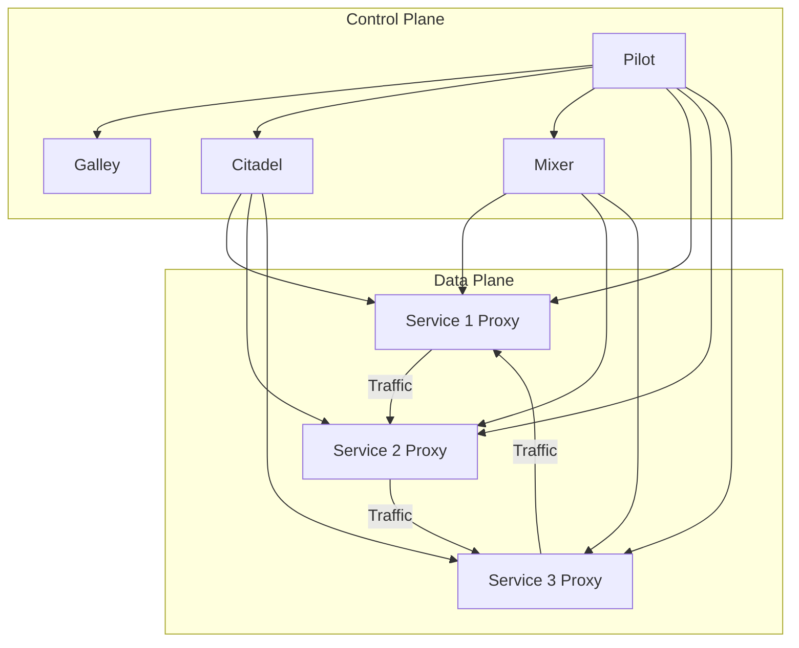

# AI系统Istio原理与代码实战案例讲解

## 1. 背景介绍

### 1.1 问题的由来

在现代分布式系统中,微服务架构已经成为了一种广泛采用的设计模式。通过将整个应用程序拆分为多个小型、独立的服务,每个服务都可以独立开发、部署和扩展,从而提高了系统的灵活性、可维护性和可伸缩性。然而,随着微服务数量的增加,管理和控制这些服务之间的通信和流量变得越来越复杂。

传统的服务网关和代理无法很好地解决这些挑战,因为它们通常只能提供有限的功能,如简单的路由和负载均衡。此外,它们还缺乏对服务网格的全局视图,无法有效地管理和监控整个系统。因此,需要一种新的解决方案来应对这些挑战,这就是Istio的诞生背景。

### 1.2 研究现状

Istio是一个开源的服务网格,旨在简化分布式微服务应用程序的构建、部署和管理。它提供了一种统一的方式来管理服务之间的通信,包括流量管理、安全性、策略执行和遥测收集。Istio被设计为独立于底层平台,可以部署在Kubernetes、Mesos、Cloud Foundry等各种环境中。

目前,Istio已经得到了广泛的关注和采用。许多知名公司,如Google、IBM、Red Hat等都在积极参与Istio的开发和维护。同时,Istio也得到了云计算供应商的支持,如Google Cloud Platform、Amazon Web Services和Microsoft Azure等。

### 1.3 研究意义

Istio的出现为构建和管理复杂的分布式系统带来了诸多好处:

1. **流量管理**: Istio提供了丰富的流量管理功能,如动态请求路由、熔断、重试和故障注入等,可以有效地控制服务之间的流量,提高系统的可靠性和弹性。

2. **安全性**: Istio内置了强大的安全功能,如mutual TLS、身份和证书管理等,可以保护服务之间的通信安全,防止数据泄露和中间人攻击。

3. **策略执行**: Istio支持定义和执行各种策略,如访问控制、速率限制和配额管理等,可以更好地控制和管理服务的行为。

4. **可观察性**: Istio提供了丰富的遥测功能,如指标、分布式跟踪和日志记录等,可以深入了解系统的运行状况,快速发现和诊断问题。

5. **平台无关性**: Istio可以与各种底层平台无缝集成,如Kubernetes、Mesos、Cloud Foundry等,提高了系统的可移植性和灵活性。

通过深入研究Istio的原理和实践,我们可以更好地理解和掌握构建和管理复杂分布式系统的技术,为未来的系统架构和设计提供宝贵的经验和指导。

### 1.4 本文结构

本文将全面介绍Istio的核心概念、原理和实践。首先,我们将探讨Istio的核心组件和架构,了解它们是如何协同工作的。接下来,我们将深入研究Istio的核心算法和数学模型,包括流量管理、安全性和策略执行等方面。然后,我们将通过实际的代码示例和案例分析,展示如何在实践中使用Istio构建和管理分布式系统。最后,我们将总结Istio的未来发展趋势和面临的挑战,并提供相关的学习资源和工具推荐。

## 2. 核心概念与联系

Istio是一个复杂的系统,包含了多个核心组件和概念。下面我们将介绍这些核心概念及它们之间的关系。

### 2.1 Istio架构概览

Istio采用了一种基于sidecar代理的架构模式。每个服务实例都会部署一个sidecar代理,所有的入站和出站流量都会经过这个代理。Istio的控制平面负责管理和配置这些代理,实现各种功能,如流量管理、安全性和策略执行等。

Istio的核心组件包括:

- **Envoy代理**: Envoy是一个高性能的代理,作为Istio的数据平面,负责处理服务之间的入站和出站流量。

- **Pilot**: Pilot是Istio的核心控制组件,负责配置和管理Envoy代理实例。它将高级路由规则转换为Envoy可以理解的配置。

- **Mixer**: Mixer是一个独立的组件,负责执行访问控制和使用策略,并收集遥测数据。

- **Citadel**: Citadel是Istio的安全组件,负责证书和密钥的生成、分发和轮换。

- **Galley**: Galley是Istio的配置验证和分发组件,确保配置的一致性和可靠性。

下面是Istio架构的Mermaid流程图:

### 2.2 流量管理

Istio提供了丰富的流量管理功能,包括请求路由、负载均衡、故障注入、熔断和重试等。这些功能都是通过配置Envoy代理实现的。

- **请求路由**: Istio可以根据各种条件(如HTTP头、URL、权重等)动态地路由请求到不同的服务版本。

- **负载均衡**: Istio支持多种负载均衡算法,如轮询、最小请求等,可以有效地分配流量。

- **故障注入**: Istio可以注入各种故障,如延迟、abort等,用于测试系统的弹性和容错能力。

- **熔断和重试**: Istio可以根据配置自动执行熔断和重试操作,提高系统的可靠性。

### 2.3 安全性

Istio内置了强大的安全功能,可以保护服务之间的通信安全。

- **mutual TLS**: Istio默认启用mutual TLS,所有服务之间的通信都经过加密和双向认证。

- **身份和证书管理**: Istio通过Citadel组件自动管理服务身份和证书,简化了证书的分发和轮换。

- **访问控制**: Istio支持基于角色的访问控制(RBAC),可以精细地控制服务之间的访问权限。

### 2.4 策略执行

Istio允许定义和执行各种策略,如访问控制、速率限制和配额管理等。这些策略都是通过Mixer组件实现的。

- **访问控制**: Istio可以根据定义的策略控制对服务的访问,如白名单、黑名单等。

- **速率限制**: Istio可以限制对服务的请求速率,防止服务被过载。

- **配额管理**: Istio可以根据配额限制对服务的使用,如并发连接数、CPU使用率等。

### 2.5 可观察性

Istio提供了丰富的遥测功能,可以深入了解系统的运行状况。

- **指标**: Istio可以收集各种指标数据,如请求计数、延迟、错误率等,用于监控和可视化。

- **分布式跟踪**: Istio支持分布式跟踪,可以跟踪请求在整个系统中的流动路径。

- **日志记录**: Istio可以收集和聚合来自各个服务的日志,方便问题排查和调试。

## 3. 核心算法原理 & 具体操作步骤

在本节中,我们将深入探讨Istio的核心算法原理和具体操作步骤。

### 3.1 算法原理概述

Istio的核心算法主要包括以下几个方面:

1. **流量管理算法**: 用于实现请求路由、负载均衡、故障注入等功能。这些算法通常基于一些启发式或机器学习模型,根据当前的流量状况和配置动态地调整流量分配。

2. **安全性算法**: 用于实现mutual TLS、身份和证书管理等功能。这些算法主要基于密码学原理,如非对称加密、数字签名等。

3. **策略执行算法**: 用于实现访问控制、速率限制和配额管理等功能。这些算法通常基于一些规则引擎或决策树模型,根据预定义的策略进行决策。

4. **遥测算法**: 用于收集和处理指标、分布式跟踪和日志等数据。这些算法通常涉及数据采样、聚合和可视化等技术。

### 3.2 算法步骤详解

#### 3.2.1 流量管理算法

Istio的流量管理算法主要由Pilot组件实现。Pilot会将高级路由规则转换为Envoy可以理解的配置,并下发到各个Envoy代理实例。

1. **请求路由算法**

Istio的请求路由算法基于一种称为"虚拟服务"的概念。每个虚拟服务都定义了一组路由规则,指定了如何将请求路由到不同的服务版本。路由规则可以基于各种条件,如HTTP头、URL、权重等。

Pilot会根据这些规则生成对应的Envoy配置,并下发到相关的Envoy代理实例。当请求到达Envoy时,它会根据配置中的规则进行路由。

2. **负载均衡算法**

Istio支持多种负载均衡算法,如轮询、最小请求等。这些算法都是在Envoy代理中实现的。

Pilot会根据配置生成相应的Envoy配置,指定使用哪种负载均衡算法以及相关参数。Envoy会根据这些配置对请求进行负载均衡。

3. **故障注入算法**

Istio的故障注入算法允许在请求路径中注入各种故障,如延迟、abort等。这些故障可以用于测试系统的弹性和容错能力。

Pilot会根据配置生成相应的Envoy配置,指定注入哪些故障以及相关参数。Envoy会根据这些配置对请求进行故障注入。

4. **熔断和重试算法**

Istio的熔断和重试算法可以自动执行熔断和重试操作,提高系统的可靠性。

Pilot会根据配置生成相应的Envoy配置,指定熔断和重试的条件和参数。Envoy会根据这些配置对请求进行熔断和重试操作。

#### 3.2.2 安全性算法

Istio的安全性算法主要由Citadel组件实现。

1. **mutual TLS算法**

Istio默认启用mutual TLS,所有服务之间的通信都经过加密和双向认证。

Citadel会为每个服务实例生成一个证书和私钥,并分发给相应的Envoy代理实例。Envoy会使用这些证书和私钥进行mutual TLS通信。

2. **身份和证书管理算法**

Istio通过Citadel组件自动管理服务身份和证书,简化了证书的分发和轮换。

Citadel会定期轮换证书,并将新的证书分发给相应的Envoy代理实例。Envoy会自动加载和使用新的证书,确保通信的安全性。

#### 3.2.3 策略执行算法

Istio的策略执行算法主要由Mixer组件实现。

1. **访问控制算法**

Istio的访问控制算法基于一种称为"策略"的概念。每个策略都定义了一组访问控制规则,指定了哪些服务可以访问哪些资源。

Mixer会根据这些策略生成相应的配置,并下发到相关的Envoy代理实例。当请求到达Envoy时,它会根据配置中的规则进行访问控制。

2. **速率限制算法**

Istio的速率限制算法可以限制对服务的请求速率,防止服务被过载。

Mixer会根据配置生成相应的Envoy配置,指定速率限制的条件和参数。Envoy会根据这些配置对请求进行速率限制。

3. **配额管理算法**

Istio的配额管理算法可以根据配额限制对服务的使用,如并发