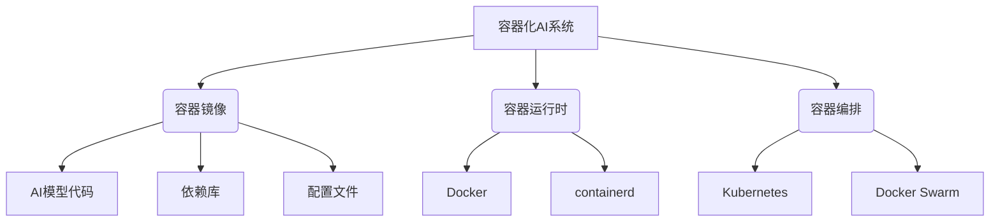

以下是《AI系统容器化原理与代码实战案例讲解》的正文内容:

# AI系统容器化原理与代码实战案例讲解

## 1. 背景介绍

### 1.1 问题的由来

随着人工智能(AI)系统在各行业的广泛应用,如何高效、可靠地部署和管理这些系统成为了一个迫切的需求。传统的部署方式存在着诸多挑战,例如环境依赖、资源占用、扩展性差等,这极大地阻碍了AI系统的快速迭代和弹性伸缩。

### 1.2 研究现状  

为解决上述问题,容器化技术(Container)应运而生。容器通过操作系统级虚拟化,将应用程序及其依赖打包到一个可移植的容器镜像中,实现"构建一次,到处运行"。Docker作为领先的容器化平台,已被广泛应用于传统应用的部署,但将其应用于AI系统仍面临着一些挑战,如GPU资源利用、大规模分布式训练等。

### 1.3 研究意义

本文旨在深入探讨AI系统容器化的原理和实践,帮助读者全面了解如何利用容器技术高效部署和管理AI系统。通过理论分析和实战案例,读者将掌握容器化AI系统的核心概念、关键技术,并学习如何构建可扩展、高可用的AI基础架构。

### 1.4 本文结构

本文首先介绍AI系统容器化的背景和现状,然后深入探讨其核心概念和算法原理。接下来,通过数学模型和公式推导,阐明容器调度的理论基础。在此基础上,提供了一个端到端的AI系统容器化实战案例,包括开发环境搭建、代码实现、部署和监控等全流程。最后,分析了容器化AI系统在实际场景中的应用,并对未来发展趋势和挑战进行了展望。

## 2. 核心概念与联系

容器化AI系统涉及多个核心概念,包括容器(Container)、容器镜像(Container Image)、容器运行时(Container Runtime)、容器编排(Container Orchestration)等,它们相互关联,共同构建了一个完整的容器化解决方案。



- **容器镜像**:包含了AI模型代码、依赖库、配置文件等,是容器的只读模板。通过构建容器镜像,实现了AI系统的可移植性和一致性部署。
- **容器运行时**:负责从容器镜像创建并运行容器实例,管理容器的生命周期。常见的容器运行时有Docker、containerd等。
- **容器编排**:用于自动化容器的部署、扩展、网络管理和资源调度等任务。Kubernetes和Docker Swarm是两个流行的容器编排工具。

上述核心概念紧密相连,共同为AI系统的容器化提供了完整的解决方案。开发人员只需构建好容器镜像,由容器运行时和编排工具负责容器的启动、扩展和管理,从而实现AI系统的高效、可靠部署。

## 3. 核心算法原理 & 具体操作步骤

### 3.1 算法原理概述

AI系统容器化的核心算法是**容器调度算法**,用于高效地将容器实例调度到合适的计算节点上运行。常见的容器调度算法包括:

1. **节点资源可用性调度**:根据节点的CPU、内存、GPU等资源的可用量,选择资源足够的节点运行容器。
2. **节点亲和性调度**:根据容器的亲和性/反亲和性规则,将容器调度到满足条件的节点。
3. **节点负载均衡调度**:将容器均匀分布到不同节点,避免资源集中导致的负载不均衡。
4. **节点拓扑感知调度**:考虑节点之间的网络拓扑,尽量将容器调度到网络延迟更小的节点。

上述算法通常会综合考虑多种因素,以实现高效、可靠的容器调度。

### 3.2 算法步骤详解

以**节点资源可用性调度**为例,其算法步骤如下:

1. 获取集群中所有节点的资源使用情况,包括CPU、内存、GPU等。
2. 遍历所有节点,计算每个节点的资源可用量。
3. 根据待调度容器的资源请求,筛选出满足要求的节点列表。
4. 如果有多个符合条件的节点,可进一步考虑其他调度策略(如负载均衡)进行二次筛选。
5. 从筛选结果中选择一个节点,将容器调度到该节点上运行。

该算法的时间复杂度为O(n),其中n为集群节点数量。在实际实现中,通常会引入缓存机制来提高调度效率。

### 3.3 算法优缺点

**优点**:

- 简单高效,时间复杂度较低。
- 能够充分利用集群资源,避免资源浪费。
- 易于扩展,可与其他调度策略相结合。

**缺点**:

- 只考虑节点资源,未涉及容器之间的关系。
- 未考虑数据本地性,可能导致跨节点数据传输开销较大。
- 需要实时获取节点资源使用情况,对集群监控系统有一定要求。

### 3.4 算法应用领域

节点资源可用性调度算法广泛应用于各种容器编排系统,如Kubernetes、Docker Swarm等。除了AI系统之外,它还可用于传统应用的容器化部署,如Web服务、数据库等。

此外,该算法不仅适用于容器调度,在虚拟机调度、任务调度等场景中也有广泛应用。

## 4. 数学模型和公式 & 详细讲解 & 举例说明

### 4.1 数学模型构建

为了更好地描述和优化容器调度问题,我们可以构建一个数学模型。假设有n个节点和m个容器,使用0-1整数规划模型:

**决策变量**:
$$
x_{ij} =
\begin{cases}
1, &\text{if container $j$ is scheduled to node $i$} \\
0, &\text{otherwise}
\end{cases}
$$

**目标函数**:
$$
\min \sum_{i=1}^{n}\sum_{j=1}^{m}c_{ij}x_{ij}
$$

其中$c_{ij}$表示将容器j调度到节点i的代价,可根据实际情况设置,如网络延迟、节点负载等。

**约束条件**:

1. 每个容器只能被调度到一个节点:
   $$
   \sum_{i=1}^{n}x_{ij}=1,\quad\forall j\in\{1,\ldots,m\}
   $$

2. 节点资源限制(以CPU为例):
   $$
   \sum_{j=1}^{m}r_j^{cpu}x_{ij}\leq R_i^{cpu},\quad\forall i\in\{1,\ldots,n\}
   $$
   其中$r_j^{cpu}$表示容器j的CPU请求,$R_i^{cpu}$表示节点i的CPU可用量。

通过求解上述0-1整数规划问题,可以得到最优的容器调度方案。

### 4.2 公式推导过程

在实际应用中,由于0-1整数规划问题的NP难解性,我们通常会使用启发式算法或近似算法来求解。下面以**节点资源可用性调度**为例,推导出一种贪心算法的近似解。

假设容器按照资源请求量$r_j$降序排列,节点按照资源可用量$R_i$降序排列。我们定义一个评分函数:
$$
\text{score}(i, j) = \frac{r_j}{R_i}
$$
该函数表示将容器j调度到节点i时的资源利用率。

算法步骤如下:

1. 对所有节点和容器进行排序。
2. 对每个容器j:
   a. 遍历所有节点i,计算score(i, j)。
   b. 选择score(i, j)最小的节点i*,将容器j调度到i*。
   c. 更新节点i*的资源可用量$R_{i^*}=R_{i^*}-r_j$。

该算法的时间复杂度为O(nm\log n),其中n为节点数,m为容器数。

### 4.3 案例分析与讲解

假设有3个节点和5个容器,资源请求情况如下:

| 节点 | CPU可用量 | 内存可用量 |
|------|------------|------------|
| 节点1 | 8          | 16G        |
| 节点2 | 4          | 8G         |
| 节点3 | 2          | 4G         |

| 容器 | CPU请求 | 内存请求 |
|------|---------|----------|
| 容器1 | 2       | 4G       |
| 容器2 | 1       | 2G       |
| 容器3 | 3       | 6G       |
| 容器4 | 1       | 1G       |
| 容器5 | 2       | 3G       |

使用上述贪心算法进行调度,具体步骤如下:

1. 对节点和容器进行排序:
   节点: 节点1 > 节点2 > 节点3
   容器: 容器3 > 容器1 = 容器5 > 容器2 > 容器4

2. 调度容器3:
   score(节点1, 容器3) = 3/8 = 0.375
   score(节点2, 容器3) = 3/4 = 0.75
   score(节点3, 容器3) = 3/2 = 1.5 (最大,不选)
   选择节点2,资源可用量更新为CPU: 1,内存: 2G

3. 调度容器1:
   score(节点1, 容器1) = 2/8 = 0.25
   score(节点2, 容器1) = 2/1 = 2 (最大,不选)
   选择节点1,资源可用量更新为CPU: 6,内存: 12G

4. 以此类推,最终调度方案为:
   节点1: 容器1,容器4
   节点2: 容器3,容器5
   节点3: 容器2

可见,该算法能够较为合理地利用节点资源,避免资源浪费。

### 4.4 常见问题解答

**Q: 如何处理容器之间的亲和性/反亲和性约束?**

A: 可以在算法中引入额外的约束条件,如果两个容器之间存在亲和性约束,则必须调度到同一个节点;如果存在反亲和性约束,则必须调度到不同节点。这会增加算法的复杂度,需要在调度时进行额外的检查和处理。

**Q: 算法是否考虑了数据本地性?**

A: 目前的算法仅考虑了节点资源,未涉及数据本地性。在实际应用中,如果容器需要访问大量数据,最好将其调度到数据所在节点,以减少数据传输开销。可以在算法中引入数据本地性作为一个额外的评分因素。

**Q: 如何处理节点故障导致的容器迁移?**

A: 当节点发生故障时,需要将该节点上的容器迁移到其他节点。可以基于当前算法,重新计算这些容器的调度方案。同时,也可以考虑在调度时预留一定的节点资源,作为容器迁移的备用资源。

## 5. 项目实践:代码实例和详细解释说明

### 5.1 开发环境搭建

本节将使用Kubernetes作为容器编排工具,并基于Kubernetes的调度器实现一个简单的AI系统容器化示例。

首先,需要准备以下环境:

- Kubernetes集群(可使用Minikube在本地快速搭建)
- Docker
- Golang开发环境
- AI框架(如TensorFlow、PyTorch等)

### 5.2 源代码详细实现

我们将实现一个简单的AI模型服务,并使用Kubernetes部署和管理该服务。

1. 创建AI模型代码(model.py):

```python
import tensorflow as tf

# 定义模型
model = tf.keras.Sequential([
    tf.keras.layers.Dense(10, activation='relu', input_shape=(784,)),
    tf.keras.layers.Dense(10, activation='softmax')
])

# 加载模型权重
model.