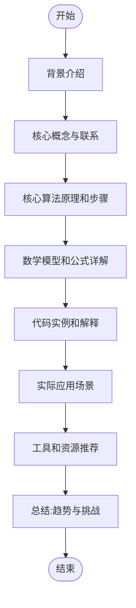
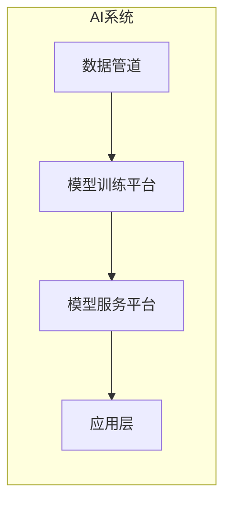

好的,我会按照您的要求,以"AI系统成本优化原理与代码实战案例讲解"为主题,撰写一篇专业的技术博客文章。文章将遵循您提供的结构模板,包含完整的正文内容,使用Markdown格式,并嵌入必要的LaTeX公式。我将尽最大努力提供逻辑清晰、内容深入的讲解,同时注重知识的系统性和实用性。在此过程中,我会尽量使用流畅的技术语言,并提供有见地的分析和洞察。此外,我还会尝试绘制Mermaid流程图来直观地展示核心概念和架构原理。请耐心等待,我会用心撰写这篇高质量的技术博客文章。

# AI系统成本优化原理与代码实战案例讲解

## 1. 背景介绍

### 1.1 问题的由来

在当前的商业环境中,人工智能(AI)系统的广泛应用已成为不可逆转的趋势。无论是为了提高运营效率、优化决策过程,还是开发创新产品和服务,AI系统都扮演着越来越重要的角色。然而,构建和维护AI系统需要大量的计算资源,这往往会导致高昂的成本支出。

随着AI系统的复杂性不断增加,其所需的计算能力也在与日俱增。训练深度神经网络模型通常需要大量的GPU和TPU资源,而在线推理服务也需要强大的CPU和内存支持。此外,存储和处理大规模数据集也是一项重大挑战。这些因素都会极大地增加AI系统的总体运营成本。

因此,如何在保证AI系统性能的前提下,有效优化其成本支出,成为了当前亟待解决的重要课题。通过合理的资源管理、模型优化和系统架构调整等手段,企业有望大幅降低AI系统的总体拥有成本(TCO),从而提高投资回报率,实现可持续发展。

### 1.2 研究现状

为了应对AI系统成本优化的挑战,业界和学术界都在积极开展相关研究和实践探索。目前,主要的研究方向包括:

1. **模型压缩与加速**:通过剪枝、量化、知识蒸馏等技术,压缩神经网络模型的大小和计算复杂度,从而降低推理成本。
2. **资源调度与优化**:基于工作负载特征,对GPU、CPU等硬件资源进行智能调度,提高资源利用率。
3. **系统架构优化**:探索分布式训练、模型并行、异构计算等新型系统架构,提升系统的计算效率。
4. **成本模型与优化策略**:建立成本模型,量化不同优化策略的成本收益,为决策提供依据。

虽然取得了一些进展,但由于AI系统的复杂多变性,目前的研究成果仍然存在一定的局限性,难以完全满足实际应用场景的需求。因此,持续的创新和突破至关重要。

### 1.3 研究意义

AI系统成本优化不仅关乎企业的经济效益,也是推动AI技术持续发展的关键因素。具体来说,其重要意义体现在以下几个方面:

1. **降低AI应用门槛**:通过降低AI系统的总体成本,将使更多中小企业能够获取AI技术红利,从而推动AI在各行业的广泛应用。
2. **促进AI技术创新**:成本优化将释放更多资源,为AI算法、架构和系统的创新研究提供动力。
3. **实现可持续发展**:合理控制成本支出,有助于AI技术的长期可持续发展,避免资源浪费。
4. **提高竞争力**:在同类产品或服务中,拥有成本优势将为企业带来更强的市场竞争力。

总的来说,AI系统成本优化是当前AI领域的一个重要课题,对于推动AI技术的发展和产业化应用都具有重大意义。

### 1.4 本文结构

本文将全面介绍AI系统成本优化的原理和实践。首先阐述核心概念,并分析不同优化策略之间的关系。接下来详细讲解核心算法原理、数学模型和公式推导。然后通过实际的代码实例,展示如何将理论付诸实践。最后探讨实际应用场景,并对未来发展趋势和挑战进行展望。

文章的主要结构如下:

## 2. 核心概念与联系

在探讨AI系统成本优化的具体方法之前,我们需要先理解一些核心概念及它们之间的关联。这些概念为后续的理论和实践奠定了基础。

### 2.1 AI系统架构

AI系统通常由以下几个主要组件构成:

1. **数据管道**:用于采集、清洗、标注和存储训练数据。
2. **模型训练平台**:提供GPU/TPU集群资源,用于训练深度学习模型。
3. **模型服务平台**:部署训练好的模型,为上层应用提供在线推理服务。
4. **应用层**:将AI模型集成到实际的业务系统中,为最终用户提供服务。

这些组件通过复杂的数据流和控制流相互关联,形成了完整的AI系统。优化任何一个环节的效率和成本,都将对整体系统产生影响。

### 2.2 成本构成

AI系统的总体成本(TCO)主要由以下几个部分构成:

1. **硬件成本**:包括GPU、TPU、CPU、存储和网络等硬件资源的采购和运维成本。
2. **软件成本**:AI框架、开发工具、中间件等软件许可和维护费用。
3. **人力成本**:AI工程师、数据标注员工等人力资源的薪酬支出。
4. **数据成本**:采集、存储和标注高质量数据集所需的费用支出。
5. **云服务成本**:使用公有云提供的AI服务(如模型训练、推理等)所需的费用。
6. **能源成本**:为AI系统提供所需电力的相关支出。

成本优化需要从这些方面入手,制定全面的策略方案。

### 2.3 优化策略

常见的AI系统成本优化策略包括:

1. **模型优化**:通过模型压缩、蒸馏、量化等技术,降低模型的计算和存储开销。
2. **系统架构优化**:采用分布式训练、模型并行、异构计算等架构,提高系统效率。
3. **资源优化**:基于工作负载特征,对GPU、CPU等资源进行智能调度和利用率优化。
4. **数据优化**:优化数据采集、存储和标注流程,降低相关成本支出。
5. **云资源优化**:合理利用公有云服务,实现成本最优配置。
6. **能源优化**:采用节能硬件、优化冷却系统等措施,降低能源消耗。

这些策略相互关联、相辅相成,需要统筹考虑,制定全面的优化方案。

### 2.4 评估指标

为了评估优化效果,我们需要建立合理的评估指标体系,主要包括:

1. **成本指标**:如总拥有成本(TCO)、成本回报率等直接反映经济效益的指标。
2. **性能指标**:如模型精度、延迟、吞吐量等反映系统性能水平的指标。
3. **资源指标**:如GPU利用率、存储空间占用等衡量资源利用效率的指标。
4. **能效指标**:如每瓦特计算能力、PUE(Power Usage Effectiveness)等评估能源利用水平的指标。

在优化过程中,我们需要在这些指标之间寻求合理的平衡和折中,以实现成本和性能的最优组合。

通过对核心概念的理解,我们可以更好地把握AI系统成本优化的全貌,为后续的理论分析和实践探索奠定基础。

## 3. 核心算法原理与具体操作步骤

在本节中,我们将深入探讨AI系统成本优化的核心算法原理及具体操作步骤。这些算法和方法是实现成本优化的关键所在,对于提高系统效率和降低总体拥有成本(TCO)至关重要。

### 3.1 算法原理概述

AI系统成本优化的核心算法主要包括以下几个方面:

1. **模型压缩算法**:通过剪枝、量化、知识蒸馏等技术,压缩神经网络模型的大小和计算复杂度,从而降低推理成本。
2. **资源调度算法**:根据工作负载特征,对GPU、CPU等硬件资源进行智能调度,提高资源利用率,避免资源浪费。
3. **分布式优化算法**:通过数据并行、模型并行等策略,实现分布式训练和推理,提升系统的计算效率。
4. **异构计算算法**:充分利用CPU、GPU、FPGA等异构计算单元,将不同的计算任务调度到最适合的硬件上执行。
5. **能耗优化算法**:通过动态电压频率调节(DVFS)、工作负载均衡等手段,降低系统的能耗水平。

这些算法相互关联、相辅相成,需要统筹考虑,制定全面的优化方案。下面我们将详细介绍其中的核心算法原理和具体操作步骤。

### 3.2 算法步骤详解

#### 3.2.1 模型压缩算法

模型压缩算法旨在减小神经网络模型的大小和计算复杂度,从而降低推理成本。常见的模型压缩技术包括:

1. **剪枝(Pruning)**:通过移除神经网络中的冗余连接和神经元,来压缩模型的大小和计算量。
2. **量化(Quantization)**:将原始的32位或16位浮点数模型参数,压缩为8位或更低比特位的定点数表示,从而减小模型大小和计算开销。
3. **知识蒸馏(Knowledge Distillation)**:利用一个大型教师模型指导一个小型学生模型的训练,使得学生模型在保持较高精度的同时,大幅减小了模型大小。

以剪枝算法为例,其具体操作步骤如下:

1. **计算连接重要性**:通过某种评估标准(如绝对值、二范数等)计算每个连接的重要性得分。
2. **排序和筛选**:根据重要性得分,对连接进行排序,并设置阈值,筛选出重要性较低的连接。
3. **剪枝操作**:将筛选出的低重要性连接的权重设置为0,等效于移除了该连接。
4. **精细调优**:在剪枝后,通过少量的精细调优训练,来恢复模型的精度。

通过这种方式,我们可以在保持模型精度的前提下,大幅减小模型的大小和计算量,从而降低推理成本。

#### 3.2.2 资源调度算法

资源调度算法旨在提高GPU、CPU等硬件资源的利用效率,避免资源浪费。常见的资源调度策略包括:

1. **基于优先级的调度**:根据任务的优先级高低,动态地为其分配合适的资源。
2. **基于公平性的调度**:确保不同任务能够获得公平的资源分配,避免某些任务长期占用大量资源。
3. **基于工作负载的调度**:根据任务的实时工作负载特征,动态调整资源分配策略。
4. **基于能耗的调度**:将任务调度到能耗较低的节点上执行,以降低整体能耗水平。

以基于工作负载的调度算法为例,其具体操作步骤如下:

1. **监控工作负载**:实时监控每个GPU/CPU节