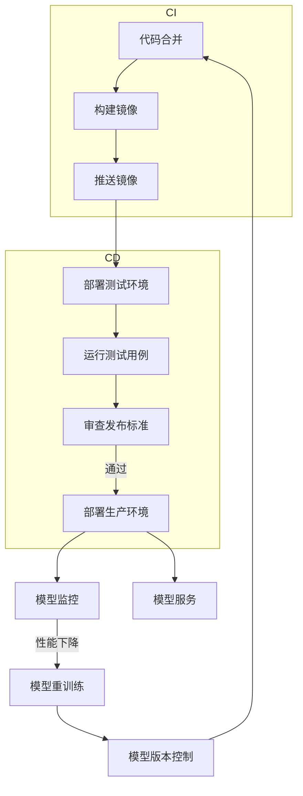

# AI系统持续部署原理与代码实战案例讲解

## 1. 背景介绍

### 1.1 问题的由来

在当今快节奏的软件开发环境中,AI系统的持续部署已经成为一个迫切的需求。传统的软件部署方式已经无法满足AI系统的复杂性和动态性,导致了以下几个主要问题:

1. **部署效率低下**: AI模型训练和优化过程耗时耗力,但将优化后的模型投入生产环境的过程却往往缓慢和手动化,导致新模型的价值无法被快速释放。

2. **版本控制混乱**: 由于缺乏统一的部署框架,不同的AI模型和服务往往采用不同的部署方式,版本控制混乱,给运维带来了巨大的挑战。

3. **环境依赖问题**: AI模型对运行环境的依赖性很强,从训练到生产环境的切换常常会导致模型表现的degradation。

4. **缺乏监控与反馈**: 传统部署流程缺乏对模型在线运行状态的监控和性能反馈机制,无法持续优化和改进模型。

因此,构建一个高效、可靠、可扩展的AI系统持续部署平台就显得尤为重要。

### 1.2 研究现状  

目前,一些主流的云服务商如AWS、GCP、Azure等都提供了AI模型部署的解决方案,但大多局限于特定的框架或平台。同时,一些开源社区也在积极探索通用的AI部署框架,例如:

- **KFServing**: Kubernetes原生的模型服务框架,支持多种机器学习框架。
- **BentoML**: 面向生产环境的高性能模型服务框架。
- **Cortex**: 支持任意模型的无服务器部署方案。

这些框架为AI系统的持续部署提供了有益的探索,但仍然存在一些不足,如对Kubernetes环境的依赖、生态支持有限、可扩展性较差等。因此,设计一个更加通用、高效、可扩展的AI持续部署解决方案仍然是一个有价值的研究方向。

### 1.3 研究意义

构建高效的AI系统持续部署能力,对于企业和组织具有重要的意义:

1. **加速AI模型的产品化进程**,缩短模型从实验室到生产环境的部署周期,提高AI投资回报率。

2. **提升模型在线服务的可靠性**,通过版本控制、环境管理等手段,确保模型服务的稳定运行。

3. **实现模型的持续优化**,基于模型在线运行状态的监控和反馈,持续优化和更新模型。

4. **降低AI系统运维成本**,统一的部署框架可以显著简化运维流程,提高效率。

5. **支持AI系统的灵活扩展**,以可插拔的方式集成新的AI模型和服务,提高系统的可扩展性。

因此,AI系统持续部署平台的研究不仅对于提升AI系统的运行效率具有重要意义,也是企业真正释放AI价值、获得竞争优势的关键一环。

### 1.4 本文结构

本文将从以下几个方面深入探讨AI系统持续部署的原理和实践:

1. 核心概念与架构
2. 部署流程与算法原理
3. 数学模型建模与公式推导
4. 代码实战案例讲解
5. 实际应用场景分析
6. 工具与资源推荐
7. 未来发展趋势与挑战

接下来,我们将逐一展开上述内容。

## 2. 核心概念与联系

在深入探讨AI系统持续部署的细节之前,我们有必要先理解其中涉及的一些核心概念:

### 2.1 持续集成(CI)

持续集成是一种软件开发实践,它的核心思想是开发人员频繁地将代码集成到主干分支。这种做法可以更快地发现集成错误,从而减少在集成阶段解决问题所需的时间和精力。

在AI系统中,持续集成通常包括:

- 代码合并
- 单元测试
- 构建Docker镜像
- 推送镜像到仓库

### 2.2 持续交付(CD)

持续交付是指将软件的构建、测试和发布过程自动化,以便软件可以随时进行可靠的发布。它建立在持续集成的基础之上,进一步自动化了发布流程。

对于AI系统,持续交付可能包括:

- 将模型部署到测试环境
- 运行一系列测试用例
- 收集模型性能指标
- 审查发布标准

### 2.3 模型服务

模型服务是指将训练好的机器学习模型部署为可访问的在线服务,以便其他应用程序或客户端可以发送数据并获得模型的预测或推理结果。

常见的模型服务框架包括TensorFlow Serving、KFServing、BentoML等。

### 2.4 模型版本控制

由于模型的训练是一个迭代的过程,需要对不同版本的模型进行跟踪和管理。模型版本控制不仅包括模型文件本身,还包括相关的配置、元数据等。

一些流行的模型版本控制工具包括DVC、MLflow等。

### 2.5 模型监控

在模型部署到生产环境后,需要持续监控其运行状态和性能指标,以确保模型的稳定性和准确性。常见的监控指标包括:

- 延迟
- 吞吐量
- 资源利用率
- 模型准确率等

### 2.6 模型更新

根据模型监控的结果,可能需要对模型进行优化或重新训练。在这种情况下,需要将新版本的模型无缝地部署到生产环境中,替换旧版本的模型。这就需要一个可靠的模型更新机制。

上述这些概念相互关联,共同构建了AI系统持续部署的完整流程。下面让我们用一个流程图来直观地展示它们之间的关系:

上图展示了AI系统持续部署的完整流程,包括持续集成、持续交付、模型服务、模型监控、模型更新等关键环节。我们将在后续章节中详细探讨其中的原理和实现细节。

## 3. 核心算法原理 & 具体操作步骤

在上一节中,我们介绍了AI系统持续部署涉及的核心概念。现在,让我们深入探讨其中的核心算法原理和具体操作步骤。

### 3.1 算法原理概述

AI系统持续部署的核心算法可以概括为以下几个主要步骤:

1. **模型构建**: 基于代码仓库中的源代码,构建出可部署的模型artifcats(如Docker镜像)。
2. **模型测试**: 将构建好的模型部署到测试环境中,运行一系列测试用例,评估模型的性能和质量。
3. **模型审查**: 根据测试结果和预定义的发布标准,审查并决定是否可以将模型部署到生产环境。
4. **模型部署**: 如果审查通过,则将模型部署到生产环境中,作为在线服务对外提供服务。
5. **模型监控**: 持续监控生产环境中模型的运行状态和性能指标。
6. **模型更新**: 如果监控到模型性能下降,则触发模型重新训练和更新流程,将新版本的模型无缝替换旧版本。

这个过程是一个闭环,通过持续的监控、反馈和更新,不断优化和提升模型的性能。

### 3.2 算法步骤详解

接下来,我们将对上述算法的每个步骤进行更加详细的解释。

#### 3.2.1 模型构建

模型构建的第一步是从代码仓库中获取最新的源代码。这通常是通过与代码仓库(如Git)集成来实现的。一旦检测到新的代码提交,就会触发构建流程。

构建过程的核心是将源代码、模型文件、依赖项等打包到一个可部署的artifcats中,通常是Docker镜像。这个过程可以使用像Dockerflie这样的构建工具来自动化完成。

一旦构建完成,生成的Docker镜像就可以被推送到镜像仓库中,以供后续的测试和部署使用。

#### 3.2.2 模型测试

在将新构建的模型部署到生产环境之前,需要对其进行全面的测试,以确保其质量和性能满足要求。

测试过程通常包括以下几个步骤:

1. **部署测试环境**: 将新构建的模型部署到一个独立的测试环境中,该环境应该尽可能模拟生产环境的条件。
2. **运行测试用例**: 针对部署的模型运行一系列预定义的测试用例,这些测试用例应该覆盖各种输入场景和边缘情况。
3. **收集性能指标**: 在测试过程中,收集模型的各种性能指标,如延迟、吞吐量、资源利用率等。
4. **评估测试结果**: 将测试结果与预期的质量标准进行对比,评估模型是否满足发布要求。

测试过程可以通过自动化测试框架来实现,如pytest、Robot Framework等。

#### 3.2.3 模型审查

在测试阶段收集到模型的性能指标和测试结果之后,需要进行发布审查,决定是否可以将该模型部署到生产环境中。

审查过程通常包括以下几个步骤:

1. **指标评估**: 对收集到的各项性能指标进行评估,检查是否满足预定义的发布标准。
2. **测试报告审查**: 审查测试报告,分析测试用例的覆盖率、失败案例等,判断模型的质量是否可接受。
3. **风险评估**: 评估将新模型部署到生产环境可能带来的风险,如对现有系统的影响、回滚方案等。
4. **审批决策**: 根据上述评估结果,由相关人员(如产品经理、架构师等)审批是否可以发布新模型。

审查过程可以通过工作流工具(如GitHub Actions)来自动化,并为每个发布版本生成审查报告。

#### 3.2.4 模型部署

如果模型通过了审查,就可以将其部署到生产环境中,作为在线服务对外提供服务。

部署过程通常包括以下步骤:

1. **准备生产环境**: 根据预定义的配置,准备好生产环境的基础设施资源,如计算实例、负载均衡器、存储等。
2. **部署模型服务**: 使用之前构建的Docker镜像,在生产环境中启动模型服务的实例。
3. **服务注册**: 将新部署的模型服务注册到服务发现系统中,以便其他应用可以发现和访问该服务。
4. **流量转移**: 通过负载均衡器或API网关,将流量逐步从旧版本的模型服务转移到新版本。
5. **监控上线**: 为新部署的模型服务启用监控,收集其运行状态和性能指标。

部署过程可以通过基础设施即代码(IaC)工具(如Terraform)和容器编排工具(如Kubernetes)来自动化完成。

#### 3.2.5 模型监控

一旦模型服务部署到生产环境中,就需要持续监控其运行状态和性能指标,以确保其稳定性和准确性。

监控过程包括以下几个方面:

1. **性能监控**: 持续收集模型服务的延迟、吞吐量、资源利用率等性能指标。
2. **日志监控**: 分析模型服务的日志输出,检测潜在的错误和异常。
3. **准确率监控**: 对比模型的预测结果与实际标签,评估模型的准确率是否下降。
4. **警报触发**: 当监控到异常情况时,触发相应的警报,通知相关人员进行处理。

监控系统可以基于开源工具(如Prometheus、Grafana)构建