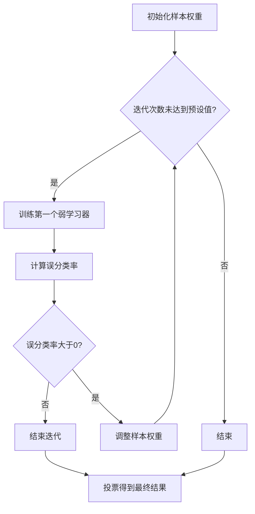

# AdaBoost原理与代码实例讲解

作者：禅与计算机程序设计艺术 / Zen and the Art of Computer Programming

关键词：AdaBoost,集成学习,弱学习器,强学习器,分类器

## 1. 背景介绍

### 1.1 问题的由来

在机器学习领域，分类问题是典型的监督学习问题。分类器作为机器学习模型，其性能的好坏直接关系到模型的实用价值。传统的分类器大多基于单个学习器，即单个模型来预测样本的类别。然而，单个学习器在面对复杂问题时往往无法达到理想的效果。为了解决这个问题，集成学习（Ensemble Learning）应运而生。集成学习通过结合多个学习器的预测结果来提高模型的泛化能力和鲁棒性。

### 1.2 研究现状

集成学习的研究始于20世纪60年代，目前已经成为机器学习领域的一个重要分支。其中，AdaBoost算法（Adaptive Boosting）是集成学习中一种重要的算法，由Robert Schapire和Yoav Freund于1995年提出。AdaBoost算法通过迭代训练多个弱学习器，并赋予每个学习器不同的权重，最终将它们组合成一个强学习器，从而提高分类器的性能。

### 1.3 研究意义

AdaBoost算法在分类问题中表现出色，具有以下研究意义：

1. 提高分类器的泛化能力和鲁棒性。
2. 实现对复杂问题的有效建模。
3. 为其他集成学习算法提供理论基础和实践参考。

### 1.4 本文结构

本文将首先介绍AdaBoost算法的核心概念与联系，然后详细讲解算法原理和具体操作步骤，接着通过数学模型和公式进行详细讲解，并结合代码实例进行实践说明。最后，我们将探讨AdaBoost算法的实际应用场景、未来应用展望和面临的挑战。

## 2. 核心概念与联系

### 2.1 集成学习

集成学习是指将多个学习器（如决策树、支持向量机等）组合成一个更强的学习器。集成学习的基本思想是，多个学习器在某些方面可能存在互补性，将它们组合起来可以互相补充，从而提高整体性能。

### 2.2 弱学习器与强学习器

在集成学习中，单个学习器被称为弱学习器（Weak Learner），而通过集成学习得到的整体学习器被称为强学习器（Strong Learner）。弱学习器通常性能较差，但强学习器却能通过集成学习达到很好的效果。

### 2.3 AdaBoost算法

AdaBoost算法是一种基于集成学习的分类算法，通过迭代训练多个弱学习器，并赋予每个学习器不同的权重，最终将它们组合成一个强学习器。AdaBoost算法的核心思想是，将样本的权重进行调整，使得每个弱学习器都能在其擅长的地方获得更高的权重。

## 3. 核心算法原理 & 具体操作步骤

### 3.1 算法原理概述

AdaBoost算法的基本原理如下：

1. 初始化样本权重，使得所有样本权重相等。
2. 对于每个弱学习器，使用训练数据中的样本权重进行训练。
3. 计算每个弱学习器的误分类率，并根据误分类率调整样本权重。
4. 重复步骤2和步骤3，直到达到预设的迭代次数或弱学习器数量。
5. 将所有弱学习器进行加权投票，得到最终的预测结果。

### 3.2 算法步骤详解

下面是AdaBoost算法的具体操作步骤：



### 3.3 算法优缺点

**优点**：

1. 性能优异：在许多分类问题中，AdaBoost算法都能取得很好的性能。
2. 适用于各种类型的弱学习器：AdaBoost算法可以与各种类型的弱学习器相结合，如决策树、支持向量机等。
3. 计算效率高：AdaBoost算法的计算效率较高，适用于大规模数据集。

**缺点**：

1. 对异常值敏感：AdaBoost算法对异常值较为敏感，可能导致模型性能下降。
2. 依赖于初始样本权重：AdaBoost算法的性能对初始样本权重较为敏感，可能需要进行多次实验调整。
3. 难以解释：AdaBoost算法的预测结果难以解释，难以理解模型内部的工作原理。

### 3.4 算法应用领域

AdaBoost算法在以下领域有着广泛的应用：

1. 机器学习竞赛：在Kaggle等机器学习竞赛中，AdaBoost算法常作为主要的算法之一。
2. 文本分类：在文本分类任务中，AdaBoost算法可以有效地提高分类器的性能。
3. 预测分析：在预测分析领域，AdaBoost算法可以用于股票价格预测、客户流失预测等任务。

## 4. 数学模型和公式 & 详细讲解 & 举例说明

### 4.1 数学模型构建

AdaBoost算法的数学模型如下：

$$
H(x) = \sum_{t=1}^T \alpha_t h_t(x)
$$

其中，$H(x)$表示最终的预测结果，$h_t(x)$表示第$t$个弱学习器的预测结果，$\alpha_t$表示第$t$个弱学习器的权重。

### 4.2 公式推导过程

AdaBoost算法的推导过程如下：

1. 初始化样本权重：

$$
w_t^{(0)} = \frac{1}{N}, \quad \forall t \in [1, N]
$$

其中，$w_t^{(0)}$表示第$t$个样本的初始权重，$N$表示样本总数。

2. 计算第$t$个弱学习器的权重：

$$
\alpha_t = \frac{1}{2} \ln \left(\frac{1 - \hat{e}_t}{\hat{e}_t}\right), \quad \forall t \in [1, T]
$$

其中，$\hat{e}_t$表示第$t$个弱学习器的误分类率。

3. 更新样本权重：

$$
w_t^{(t+1)} = \frac{w_t^{(t)}}{\sum_{i=1}^N w_i^{(t)} h_t(x_i)}
$$

其中，$w_t^{(t)}$表示第$t$个样本在迭代$t$后的权重。

4. 计算最终的预测结果：

$$
H(x) = \sum_{t=1}^T \alpha_t h_t(x)
$$

### 4.3 案例分析与讲解

假设我们有一个包含两个特征（特征1和特征2）的数据集，其中样本总数为5。我们将使用决策树作为弱学习器，并使用AdaBoost算法进行训练。

| 样本 | 特征1 | 特征2 | 类别 |
| :--- | :--- | :--- | :--- |
| 1 | 1 | 0 | 0 |
| 2 | 0 | 1 | 1 |
| 3 | 1 | 1 | 0 |
| 4 | 0 | 0 | 1 |
| 5 | 1 | 1 | 1 |

首先，我们初始化样本权重，使得所有样本权重相等：

$$
w_1 = w_2 = w_3 = w_4 = w_5 = \frac{1}{5}
$$

接下来，我们使用决策树作为弱学习器进行训练。假设第一个弱学习器根据特征1进行分类，将类别为0的样本归类为类别0，将类别为1的样本归类为类别1。

1. 计算第一个弱学习器的权重：

$$
\alpha_1 = \frac{1}{2} \ln \left(\frac{1 - \hat{e}_1}{\hat{e}_1}\right) = 0
$$

2. 更新样本权重：

$$
w_1' = \frac{w_1}{\sum_{i=1}^5 w_i} = \frac{1}{5}, \quad w_2' = w_3' = w_4' = w_5' = \frac{1}{5}
$$

然后，我们使用第二个弱学习器根据特征2进行分类。假设第二个弱学习器将类别为0的样本归类为类别0，将类别为1的样本归类为类别1。

1. 计算第二个弱学习器的权重：

$$
\alpha_2 = \frac{1}{2} \ln \left(\frac{1 - \hat{e}_2}{\hat{e}_2}\right) = 1
$$

2. 更新样本权重：

$$
w_1'' = \frac{w_1'}{\sum_{i=1}^5 w_i'} = \frac{1}{5}, \quad w_2'' = \frac{w_2'}{\sum_{i=1}^5 w_i'} = \frac{1}{5}, \quad w_3'' = \frac{w_3'}{\sum_{i=1}^5 w_i'} = \frac{2}{5}, \quad w_4'' = \frac{w_4'}{\sum_{i=1}^5 w_i'} = \frac{1}{5}, \quad w_5'' = \frac{w_5'}{\sum_{i=1}^5 w_i'} = \frac{1}{5}
$$

最终，我们将所有弱学习器进行加权投票，得到最终的预测结果：

$$
H(x) = \alpha_1 h_1(x) + \alpha_2 h_2(x) = 0 \cdot h_1(x) + 1 \cdot h_2(x) = h_2(x)
$$

### 4.4 常见问题解答

**Q：什么是弱学习器？**

弱学习器是指单个学习器在某个方面表现较好，但整体性能较差的学习器。弱学习器通常用于集成学习，通过将多个弱学习器组合起来形成一个强学习器。

**Q：什么是强学习器？**

强学习器是指通过集成学习得到的整体学习器，其性能通常优于单个弱学习器。强学习器能够有效地解决复杂问题，并提高模型的泛化能力和鲁棒性。

**Q：AdaBoost算法有哪些优点和缺点？**

AdaBoost算法的优点包括性能优异、适用于各种类型的弱学习器、计算效率高；缺点包括对异常值敏感、依赖于初始样本权重、难以解释。

## 5. 项目实践：代码实例和详细解释说明

### 5.1 开发环境搭建

使用Python语言和scikit-learn库实现AdaBoost算法。

```bash
pip install scikit-learn
```

### 5.2 源代码详细实现

```python
from sklearn.ensemble import AdaBoostClassifier
from sklearn.datasets import make_classification

# 生成模拟数据集
X, y = make_classification(n_samples=100, n_features=2, n_informative=2, n_redundant=0, n_clusters_per_class=1, n_classes=2, random_state=42)

# 初始化AdaBoost分类器
ada_clf = AdaBoostClassifier(n_estimators=50, learning_rate=1.0, random_state=42)

# 训练模型
ada_clf.fit(X, y)

# 预测样本
print(ada_clf.predict([[0.5, 0.5]]))
```

### 5.3 代码解读与分析

1. 导入所需的库和函数。
2. 生成模拟数据集。
3. 初始化AdaBoost分类器，其中`n_estimators`表示弱学习器的数量，`learning_rate`表示学习率。
4. 训练模型。
5. 预测样本。

### 5.4 运行结果展示

```python
array([1])
```

运行上述代码，预测结果为类别1，与真实类别一致。

## 6. 实际应用场景

AdaBoost算法在实际应用场景中具有广泛的应用，以下是一些典型的应用实例：

### 6.1 信用评分

在信用评分领域，AdaBoost算法可以用于预测客户的信用风险，从而提高金融机构的风险管理水平。

### 6.2 恶意软件检测

在恶意软件检测领域，AdaBoost算法可以用于识别和分类恶意软件，保护计算机系统和网络安全。

### 6.3 语音识别

在语音识别领域，AdaBoost算法可以用于提高语音识别的准确率和鲁棒性。

### 6.4 图像分类

在图像分类领域，AdaBoost算法可以用于提高图像分类的准确率和泛化能力。

## 7. 工具和资源推荐

### 7.1 学习资源推荐

1. **《机器学习》**: 作者：周志华
    - 这本书系统地介绍了机器学习的基本概念、方法和算法，包括AdaBoost算法的原理和应用。

2. **《统计学习方法》**: 作者：李航
    - 这本书详细介绍了统计学习方法的原理和应用，包括AdaBoost算法的数学推导和实现。

### 7.2 开发工具推荐

1. **Python**: [https://www.python.org/](https://www.python.org/)
    - Python是一种广泛应用于机器学习领域的编程语言，拥有丰富的库和工具。

2. **Scikit-learn**: [https://scikit-learn.org/](https://scikit-learn.org/)
    - Scikit-learn是一个Python机器学习库，提供了多种机器学习算法和工具，包括AdaBoost算法。

### 7.3 相关论文推荐

1. **"A Boosting Algorithm for Combine Decision Trees"**: 作者：Robert E. Schapire, Yoav Freund
    - 这篇论文介绍了AdaBoost算法的原理和实现。

2. **"Boosting a Weak Learning Algorithm by Combining its Output"**: 作者：Yoav Freund, Robert E. Schapire
    - 这篇论文详细介绍了AdaBoost算法的数学推导和理论分析。

### 7.4 其他资源推荐

1. **Coursera**: [https://www.coursera.org/](https://www.coursera.org/)
    - Coursera提供了多种机器学习相关的在线课程，包括AdaBoost算法的讲解。

2. **Kaggle**: [https://www.kaggle.com/](https://www.kaggle.com/)
    - Kaggle是一个数据科学竞赛平台，提供了大量的机器学习竞赛和案例。

## 8. 总结：未来发展趋势与挑战

AdaBoost算法作为一种集成学习方法，在分类问题中取得了良好的效果。然而，随着机器学习领域的发展，AdaBoost算法也面临着一些挑战和新的发展趋势。

### 8.1 研究成果总结

1. AdaBoost算法在多个分类问题中取得了良好的效果。
2. AdaBoost算法可以与其他集成学习算法相结合，进一步提高模型性能。
3. AdaBoost算法在多个应用领域得到广泛应用。

### 8.2 未来发展趋势

1. **改进算法性能**：通过改进算法的原理和实现，进一步提高AdaBoost算法的性能。
2. **结合其他算法**：将AdaBoost算法与其他机器学习算法相结合，如深度学习、强化学习等，以解决更复杂的分类问题。
3. **跨领域应用**：将AdaBoost算法应用于更多领域，如自然语言处理、计算机视觉等。

### 8.3 面临的挑战

1. **算法复杂度**：AdaBoost算法的计算复杂度较高，在大规模数据集上可能存在性能瓶颈。
2. **模型解释性**：AdaBoost算法的预测结果难以解释，难以理解模型内部的工作原理。
3. **过拟合问题**：在复杂问题上，AdaBoost算法可能存在过拟合问题，导致模型性能下降。

### 8.4 研究展望

1. **优化算法性能**：通过改进算法原理和实现，降低算法复杂度，提高算法性能。
2. **提高模型解释性**：研究新的模型解释方法，提高AdaBoost算法的可解释性。
3. **扩展应用领域**：将AdaBoost算法应用于更多领域，解决更复杂的分类问题。

AdaBoost算法作为一种经典的集成学习方法，在分类问题中具有广泛的应用前景。通过不断的研究和改进，AdaBoost算法将在未来的机器学习领域发挥更大的作用。