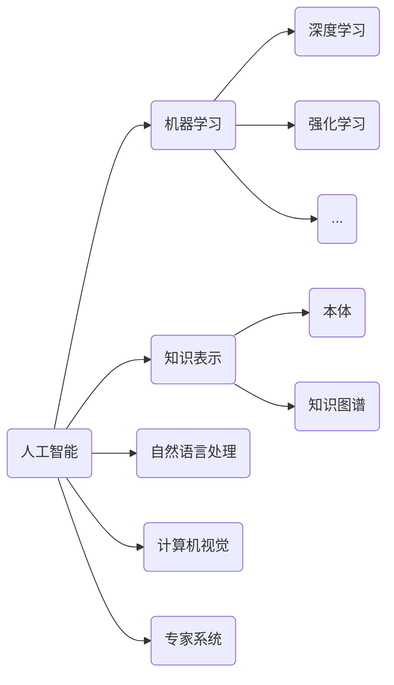

# Artificial Intelligence (AI)原理与代码实例讲解

## 1. 背景介绍
### 1.1 问题的由来
人工智能(Artificial Intelligence,AI)是计算机科学领域的一个重要分支,旨在研究如何让计算机模拟人类的智能行为。自1956年达特茅斯会议首次提出"人工智能"这一概念以来,AI经历了从早期的符号主义、专家系统,到90年代的统计学习和神经网络,再到近年来的深度学习,几经起伏。当前,以深度学习为代表的AI技术正在掀起新一轮的研究热潮,在计算机视觉、自然语言处理、语音识别、智能决策等领域取得了突破性进展,对社会生活和生产方式产生了深远影响。

### 1.2 研究现状
近年来,AI研究呈现出以下几个主要特点:

1. 深度学习的兴起。深度学习通过构建多层神经网络,利用海量数据进行端到端的训练,极大提升了AI系统在感知、认知等方面的性能。典型的深度学习模型包括卷积神经网络(CNN)、循环神经网络(RNN)、生成对抗网络(GAN)等。

2. 多模态学习的发展。现实世界信息具有多模态性,如文本、图像、音频等。多模态学习旨在融合不同模态的数据,进行联合建模和推理。如ViLBERT、CLIP等视觉-语言预训练模型。  

3. 知识表示与推理。将先验知识和常识引入AI系统,增强其逻辑推理和因果推断能力。知识图谱、规则推理等技术得到广泛应用。

4. 强化学习的应用。通过智能体与环境的交互学习最优策略,在博弈、机器人控制等领域取得良好效果。代表性工作如AlphaGo、DDPG等。

5. 神经符号融合。探索将符号推理与神经网络学习相结合,以期获得更强大、更可解释的AI系统。神经符号模型如神经图灵机、神经逻辑编程等。

### 1.3 研究意义
人工智能的研究对科技进步、经济发展、社会生活等方方面面都具有重大意义:

1. 推动科技进步。AI是当前最前沿、最具颠覆性的技术之一,推动了计算机科学和信息技术的跨越式发展。

2. 促进产业升级。AI在工业制造、金融、医疗、教育等行业得到广泛应用,极大提升生产效率和服务质量,催生众多新业态、新模式。

3. 改善民生福祉。AI在智慧城市、智能家居、智慧医疗等领域为人们提供更加便捷、智能、人性化的服务,提升生活品质。

4. 助力科学研究。AI为科学研究提供新的工具和思路,加速药物开发、材料设计、天文观测等领域的科研突破。

5. 回应社会挑战。AI在疾病诊断、灾害预警、环境保护、反恐维稳等社会治理领域发挥重要作用。

### 1.4 本文结构
本文将围绕人工智能的原理和代码实践展开深入探讨。首先介绍AI的核心概念和主要技术范式。然后重点阐述机器学习的基本原理、主要算法,并给出详细的数学推导和代码实现。接着讨论深度学习的网络结构、训练技巧和应用实例。最后总结AI的发展趋势,分析当前面临的挑战,并对未来作出展望。

## 2. 核心概念与联系
人工智能是一个涵盖范围极其广泛的科学领域,由众多分支学科构成。这里对几个核心概念作一简要介绍:

- 机器学习:使计算机系统具备自动学习和改进性能的能力,无需明确编程。按学习范式可分为监督学习、无监督学习、半监督学习、强化学习等。
- 深度学习:多层神经网络及其训练方法。利用多层次的特征提取和变换对输入数据进行高层抽象,解决复杂问题。
- 知识表示:将结构化或非结构化数据组织成便于存储、检索和推理的形式。如本体、语义网、知识图谱等。 
- 自然语言处理:研究计算机处理人类语言的各种理论和方法。包括文本分类、信息抽取、机器翻译、对话系统等任务。
- 计算机视觉:从图像或视频中提取信息,使计算机能够"理解"视觉内容。如目标检测、图像分割、人脸识别等。
- 专家系统:模拟人类专家的推理思维,解决特定领域的复杂问题。由知识库、推理机、解释器等部分组成。

这些概念之间既相互独立又密切联系。机器学习是实现AI的主要途径和核心技术,深度学习则是机器学习的一个重要分支。知识表示、自然语言处理、计算机视觉等可视作具体的应用领域,用机器学习的方法来解决相应问题。专家系统则代表了一种基于知识的AI范式。



## 3. 核心算法原理 & 具体操作步骤
### 3.1 算法原理概述
机器学习算法是人工智能的核心,其主要思想是通过数据驱动,从样本中自动分析获得规律,并利用学习得到的规律对未知数据进行预测。本节以监督学习中的分类和回归问题为例,介绍几种常见的机器学习算法。

### 3.2 算法步骤详解
#### 3.2.1 线性回归
线性回归是利用数理统计中回归分析,来确定两种或两种以上变量间相互依赖的定量关系的一种统计分析方法。其数学模型是:
$$h_\theta(x)=\theta_0+\theta_1x_1+...+\theta_nx_n$$
其中,$\theta_i$是模型参数,$x_i$是输入特征。如何学得模型参数呢?最常用的是最小二乘法,即求解最小化损失函数:
$$J(\theta)=\frac{1}{2m}\sum_{i=1}^{m}(h_\theta(x^{(i)})-y^{(i)})^2$$
其中$m$为样本数量,$y^{(i)}$为样本$i$的真实值。
求解该最优化问题,得到的$\theta$即为学习到的模型参数。

线性回归算法步骤如下:
1. 收集数据: 采集数据样本及其对应的目标值
2. 准备数据: 对数据进行预处理,如归一化、特征缩放等
3. 分析数据: 使用散点图等方法对数据进行可视化分析
4. 训练算法: 采用梯度下降等优化算法求解模型参数 
5. 测试算法: 利用学习到的模型对测试集数据进行预测,评估性能
6. 使用算法: 将模型应用到实际预测任务中

以下是单变量线性回归的Python实现:
```python
import numpy as np
import matplotlib.pyplot as plt

# 加载数据
data = np.genfromtxt("data.csv", delimiter=",")
X = data[:,0]
y = data[:,1]
m = len(y) # 样本数量

# 数据可视化
plt.scatter(X, y)
plt.xlabel('Population of City in 10,000s')
plt.ylabel('Profit in $10,000s')
plt.show()

# 定义模型函数
def model(X, theta):
    return X.dot(theta)

# 定义损失函数
def cost(X, y, theta):
    return np.sum((model(X, theta) - y)**2) / (2*m)

# 定义梯度下降函数
def gradient_descent(X, y, theta, alpha, iters):
    costs = []
    for i in range(iters):
        theta = theta - (alpha/m) * X.T.dot(model(X, theta) - y)
        costs.append(cost(X, y, theta))
    return theta, costs

# 初始化参数
X = np.stack([np.ones(m), X], axis=1) # 加入偏置项
theta = np.zeros(2)
alpha = 0.01
iters = 1000

# 训练模型
theta, costs = gradient_descent(X, y, theta, alpha, iters)
print("theta:", theta) # 输出学习到的参数

# 预测
X_test = np.array([[1, 3.5], [1, 7]])
y_pred = model(X_test, theta)
print("predictions:", y_pred)

# 可视化结果
plt.scatter(X[:,1], y)
plt.plot(X[:,1], model(X, theta), c='r')
plt.show()
```

#### 3.2.2 逻辑回归
逻辑回归是机器学习中的一个非常经典的分类算法,它是一种监督学习算法,用于两分类问题(即输出只有两种可能的值,如真/假)。逻辑回归虽然名字带"回归",但实际上是一种分类方法。其核心思想是利用Sigmoid函数将线性回归的输出映射到(0,1)区间,作为样本属于某一类别的概率。

设$x\in\mathbb{R}^n$为输入,$y\in\{0,1\}$为输出,逻辑回归模型为:

$$
P(y=1|x;\theta)=h_\theta(x)=\frac{1}{1+e^{-\theta^Tx}}
$$

其中,$\theta$为待学习的参数。对于给定的$x$,可通过比较$h_\theta(x)$与0.5的大小来进行分类。

逻辑回归的目标是最小化损失函数:

$$
J(\theta)=-\frac{1}{m}\sum_{i=1}^m[y^{(i)}\log h_\theta(x^{(i)})+(1-y^{(i)})\log(1-h_\theta(x^{(i)}))]
$$

这实际上是最大化似然函数。求解该最优化问题的方法仍为梯度下降法。

逻辑回归算法步骤总结如下:
1. 收集数据: 采集数据样本及其对应的类别标签
2. 准备数据: 对数据进行预处理,如缺失值处理、数据归一化等  
3. 分析数据: 使用直方图、散点图等方法对数据进行可视化分析
4. 训练算法: 采用梯度下降等优化算法求解逻辑回归模型
5. 测试算法: 利用学习到的模型对测试集数据进行预测,评估分类准确率
6. 使用算法: 将模型应用到实际分类任务中

以下是逻辑回归的Python实现:

```python
import numpy as np
import matplotlib.pyplot as plt

# 加载数据
data = np.genfromtxt("data.csv", delimiter=",")
X = data[:,:-1] 
y = data[:,-1]
m = len(y)

# 数据可视化
plt.scatter(X[:,0], X[:,1], c=y, cmap=plt.cm.Spectral)

# sigmoid函数
def sigmoid(z):
    return 1 / (1 + np.exp(-z))

# 定义模型函数
def model(X, theta):
    return sigmoid(X.dot(theta))

# 定义损失函数  
def cost(X, y, theta):
    h = model(X, theta)
    return -np.sum(y*np.log(h) + (1-y)*np.log(1-h)) / m

# 定义梯度下降函数
def gradient(X, y, theta):
    h = model(X, theta)
    return X.T.dot(h - y) / m

# 训练模型
X = np.insert(X, 0, 1, axis=1) # 插入偏置项
theta = np.zeros(X.shape[1])
alpha = 0.1
iters = 1000

costs = []
for i in range(iters):
    theta = theta - alpha * gradient(X, y, theta)
    costs.append(cost(X, y, theta))

# 可视化决策边界
x1 = np.linspace(30, 100, 100)
x2 = -(theta[0] + theta[1]*x1) / theta[2]
plt.plot(x1, x2, c='r')
plt.show()

# 预测
def predict(x, theta):
    x = np.insert(x, 0, 1) # 插入偏置项
    p = model(x, theta)
    return 1 if p >= 0.5 else 0

x_test = np.array([50, 30])  
print(predict(x_test, theta))
```

#### 3.2.3 支持向量机
支持向量机(Support Vector Machine,SVM)是一种二分类