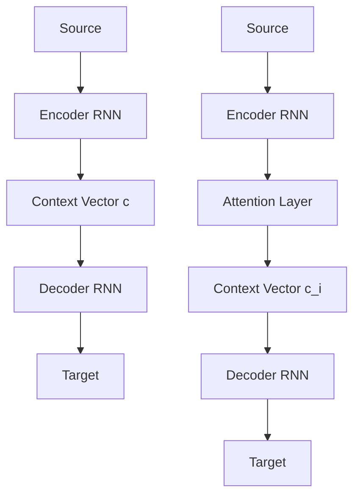

# AttentionMechanism：关注机制的原理与应用

关键词：注意力机制、Transformer、Seq2Seq、神经网络、自然语言处理

## 1. 背景介绍
### 1.1 问题的由来
随着深度学习的快速发展，各种神经网络模型不断涌现，在计算机视觉、自然语言处理等领域取得了巨大成功。然而，传统的神经网络模型如RNN、CNN等在处理长序列数据时存在一些固有缺陷，如梯度消失、梯度爆炸、长期依赖等问题，限制了模型性能的进一步提升。
### 1.2 研究现状
2017年，Google提出了基于自注意力机制（Self-Attention）的Transformer模型，开创了NLP领域的新时代。Transformer抛弃了传统的RNN/CNN等结构，完全依靠Attention机制来学习序列间的依赖关系，并行计算效率高，训练速度快，刷新了多项NLP任务的最佳性能。此后，各种基于注意力的模型如BERT、GPT、XLNet等相继问世，成为了当前NLP研究的主流范式。
### 1.3 研究意义 
深入理解并掌握注意力机制的原理和应用，对于从事人工智能尤其是自然语言处理研究的学者来说至关重要。一方面可以帮助我们设计出性能更优的模型架构，另一方面也有助于解释模型的内部工作机制，让深度学习模型不再是一个"黑盒子"。此外，注意力机制提供了一种全新的思路来解决传统模型的局限性，为未来人工智能的发展指明了方向。
### 1.4 本文结构
本文将全面深入地探讨注意力机制的原理和应用。第2部分介绍注意力机制的核心概念。第3部分重点讲解Self-Attention的算法原理和计算过程。第4部分给出数学模型和公式推导。第5部分通过代码实例演示如何实现一个简单的Attention模型。第6部分总结注意力机制在各领域的应用。第7部分推荐一些学习资源。第8部分讨论注意力未来的趋势和挑战。

## 2. 核心概念与联系
注意力（Attention）源自于人类视觉注意力机制，指的是在观察某个对象时，视觉系统会有选择性地将注意力集中到重要的局部区域上，而忽略其他无关区域，从而在杂乱的环境中快速定位目标。类似地，在深度学习中，注意力机制让模型学会关注输入数据中的关键信息，赋予不同特征不同的权重，从而做出更准确的判断。

常见的注意力机制有：
- Soft Attention：用一个概率分布来表示注意力权重，对所有输入位置加权求和。
- Hard Attention：只关注一个输入位置，权重要么是0要么是1。
- Global Attention：在Decoder的每个时间步都考虑整个Encoder的输出。
- Local Attention：每次只关注Encoder输出的一个小范围。
- Self-Attention：序列内部元素之间计算注意力，捕捉长距离依赖。
- Multi-Head Attention：多个注意力函数并行计算，增加模型容量。

下图展示了Attention与传统Seq2Seq模型的区别：



传统Seq2Seq模型中Encoder将整个输入序列编码为一个固定长度的Context Vector，而Attention模型在Decoder的每一步都根据当前隐状态动态地计算Context Vector，更好地利用了Encoder的信息。

## 3. 核心算法原理 & 具体操作步骤
### 3.1 算法原理概述
Self-Attention的核心思想是：序列的每个元素与其他所有元素计算注意力权重，得到一个加权求和的新表示。相比RNN按时间步顺序计算，Self-Attention可以并行计算，大大提高了训练效率。
### 3.2 算法步骤详解
以Transformer中的Scaled Dot-Product Attention为例，详细介绍Self-Attention的计算过程：

1. 将输入序列X通过三个线性变换得到Query矩阵Q、Key矩阵K、Value矩阵V：
$$ Q = X \cdot W^Q, \quad K = X \cdot W^K, \quad V = X \cdot W^V $$

2. 计算Q与K的点积注意力分数，除以 $\sqrt{d_k}$ 缩放，再做softmax归一化得到注意力权重矩阵A：
$$ A = \text{softmax}(\frac{QK^T}{\sqrt{d_k}}) $$

3. 将A与V相乘，得到输出的新表示Z：
$$ Z = A \cdot V $$

4. 将Z送入前馈神经网络FFN，完成一次Self-Attention的计算：
$$ \text{SelfAttention}(X) = \text{FFN}(Z) $$

其中Q、K、V的维度为 $d_k$，X的序列长度为 $n$。上述过程可以并行计算，时间复杂度为 $O(n^2 \cdot d_k)$。
### 3.3 算法优缺点
Self-Attention的优点：
- 并行计算，速度快，不受序列长度限制
- 可以捕捉任意距离的长依赖关系
- 可解释性强，可视化Attention矩阵分析模型行为

缺点：
- 计算复杂度随序列长度平方增长，难以处理很长的序列
- 缺乏先验知识，完全依靠数据学习，需要大量训练数据
### 3.4 算法应用领域
Self-Attention广泛应用于以下领域：
- 机器翻译：Transformer
- 语言模型预训练：BERT、GPT、XLNet
- 阅读理解：BiDAF
- 文本匹配：ESIM
- 图像字幕：Image Transformer
- 语音识别：Speech Transformer

## 4. 数学模型和公式 & 详细讲解 & 举例说明
### 4.1 数学模型构建
定义输入序列 $X=(x_1,\dots,x_n)$，$x_i \in \mathbb{R}^{d_x}$，目标是学习一个Attention函数：
$$\text{Attention}(Q, K, V) = \text{softmax}(\frac{QK^T}{\sqrt{d_k}})V$$
其中 $Q \in \mathbb{R}^{n \times d_k}$, $K \in \mathbb{R}^{n \times d_k}$, $V \in \mathbb{R}^{n \times d_v}$ 分别是Query、Key、Value矩阵，通过线性变换得到：
$$Q = XW^Q, \quad K=XW^K, \quad V=XW^V$$
$W^Q \in \mathbb{R}^{d_x \times d_k}, W^K \in \mathbb{R}^{d_x \times d_k}, W^V \in \mathbb{R}^{d_x \times d_v}$ 是可学习的参数矩阵。
### 4.2 公式推导过程
softmax归一化公式：
$$\text{softmax}(x_i) = \frac{\exp(x_i)}{\sum_j \exp(x_j)}$$
将其代入Attention函数：
$$\begin{aligned}
\text{Attention}(Q, K, V) &= \text{softmax}(\frac{QK^T}{\sqrt{d_k}})V \\
&= \frac{\exp(\frac{QK^T}{\sqrt{d_k}})}{\sum_j \exp(\frac{QK^T}{\sqrt{d_k}})_j}V
\end{aligned}$$
### 4.3 案例分析与讲解
以一个简单的例子说明Self-Attention的计算过程。假设有一个句子："The animal didn't cross the street because it was too tired"，我们要判断"it"指代的是"animal"还是"street"。

1. 将句子中的每个词映射为词向量，得到输入序列X：

```
[
  [0.2, 0.1, 0.3],  # The 
  [0.5, 0.2, 0.1],  # animal
  [0.3, 0.2, 0.1],  # didn't
  [0.1, 0.4, 0.2],  # cross
  [0.2, 0.1, 0.5],  # the
  [0.4, 0.3, 0.2],  # street
  [0.1, 0.5, 0.3],  # because
  [0.2, 0.1, 0.6],  # it
  [0.3, 0.4, 0.5],  # was
  [0.5, 0.2, 0.3],  # too
  [0.4, 0.1, 0.2]   # tired
]
```

2. 计算出Query、Key、Value矩阵：

```
Q = X @ W_Q
K = X @ W_K 
V = X @ W_V
```

3. 计算注意力分数矩阵 $\frac{QK^T}{\sqrt{d_k}}$，对应位置(i,j)表示第i个词对第j个词的注意力分数。

4. 对每一行做softmax，得到注意力权重矩阵A。观察it所在行，可以发现animal的权重最大，说明it主要关注animal，即it指代的是animal。

5. 将A与V相乘，得到输出表示Z。it的新表示融合了其他词的信息，更加丰富。

### 4.4 常见问题解答
Q：Self-Attention能捕捉多长距离的依赖关系？
A：理论上可以捕捉任意长度的依赖，因为每个位置都能直接与其他所有位置发生交互。但实际上受限于数值精度和优化难度，当序列很长时Attention的效果会下降。一般需要与其他机制如位置编码配合。

Q：Attention矩阵的可解释性体现在哪里？  
A：Attention矩阵揭示了序列内部元素的关联程度。矩阵(i,j)位置的数值越大，说明位置i越依赖位置j。通过可视化Attention矩阵的热力图，能直观地看出模型关注的区域，有助于分析模型的推理过程。

## 5. 项目实践：代码实例和详细解释说明
### 5.1 开发环境搭建
- Python 3.7
- PyTorch 1.8
- NumPy
- Matplotlib

### 5.2 源代码详细实现

定义Attention层：

```python
import torch
import torch.nn as nn
import torch.nn.functional as F

class SelfAttention(nn.Module):
    def __init__(self, d_model, d_k, d_v):
        super().__init__()
        self.W_Q = nn.Linear(d_model, d_k)
        self.W_K = nn.Linear(d_model, d_k) 
        self.W_V = nn.Linear(d_model, d_v)
        self.scale = 1 / d_k ** 0.5
        
    def forward(self, x, mask=None):
        Q = self.W_Q(x)
        K = self.W_K(x)
        V = self.W_V(x)
        
        attn = torch.matmul(Q, K.transpose(1, 2)) * self.scale
        if mask is not None:
            attn = attn.masked_fill(mask == 0, -1e9) 
        attn = F.softmax(attn, dim=-1)
        
        output = torch.matmul(attn, V)
        return output, attn
```

使用Attention层构建模型：

```python  
class AttentionModel(nn.Module):
    def __init__(self, vocab_size, d_model, d_k, d_v, n_heads):
        super().__init__()
        self.embed = nn.Embedding(vocab_size, d_model)
        self.attns = nn.ModuleList([
            SelfAttention(d_model, d_k, d_v) for _ in range(n_heads)
        ])
        self.fc = nn.Linear(n_heads * d_v, d_model)
        
    def forward(self, x, mask=None):
        x = self.embed(x)
        outputs = [attn(x, mask)[0] for attn in self.attns]
        output = torch.cat(outputs, dim=-1) 
        output = self.fc(output)
        return output
```

训练模型：

```python
model = AttentionModel(vocab_size=1000, d_model=512, d_k=64, d_v=64, n_heads=8)
criterion = nn.CrossEntropyLoss()
optimizer = torch.optim.Adam(model.parameters(), lr=0.001)

for epoch in range(10):
    for x, y in data_loader:
        optimizer.zero_grad()
        y_pred = model(x)
        loss = criterion(y_pred, y)
        loss.backward()
        optimizer.step()
```

### 5.3 代码解读与分析
- SelfAttention层先通过三个线性变换得到Q、K、V矩阵，然