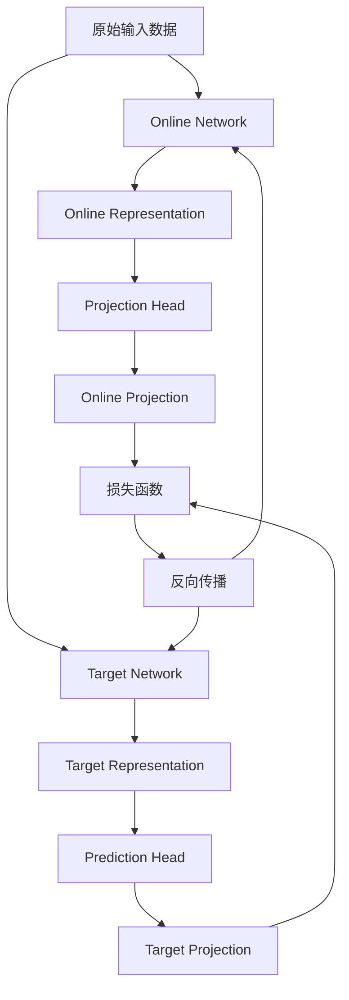

# BYOL原理与代码实例讲解

## 1. 背景介绍

### 1.1 问题的由来

在深度学习领域中,监督学习一直是主流范式。然而,标注大量高质量的训练数据是一项艰巨的任务,不仅需要耗费大量的人力和财力,而且在某些领域(如医疗影像)还需要专业人士的参与。为了减轻标注数据的负担,自监督学习(Self-Supervised Learning)应运而生。

自监督学习旨在利用未标注的原始数据(如图像、视频、语音等)中蕴含的丰富信息,通过设计合理的预文本任务(Pretext Task),使模型能够从这些任务中学习到有用的表示,进而将这些表示迁移到下游任务中,提高模型的泛化能力。

### 1.2 研究现状

早期的自监督学习方法主要集中在利用图像的不同视角、颜色等低级信息进行预训练,但这些方法往往只能学习到浅层次的表示,难以捕捉图像的高级语义信息。近年来,基于对比学习(Contrastive Learning)的自监督方法取得了突破性进展,其核心思想是通过最大化正样本对和负样本对之间的相似度差异,使得相似的样本对具有相近的表示,不相似的样本对具有不同的表示。

### 1.3 研究意义

BYOL(Bootstrap Your Own Latent)是一种新颖的自监督表示学习框架,它不需要使用传统的对比学习范式,而是通过一种特殊的自训练(Self-Training)机制来学习表示。BYOL的出现不仅为自监督学习提供了一种全新的思路,而且它的训练过程更加简单高效,在多个下游任务上都取得了非常优秀的性能。

### 1.4 本文结构

本文将全面介绍BYOL的原理和实现细节。首先阐述BYOL的核心思想和基本框架,然后深入探讨其核心算法原理和数学模型,并结合代码实例进行详细的解释和分析。最后,我们将讨论BYOL在实际应用中的场景,以及未来的发展趋势和挑战。

## 2. 核心概念与联系

BYOL的核心思想是通过一种特殊的自训练机制,使得两个不同的网络(Online Network和Target Network)能够相互"引导"对方学习到更好的表示。具体来说,Online Network会生成一个目标表示(Target Representation),而Target Network则会生成一个在线表示(Online Representation)。BYOL的目标是使这两个表示尽可能地保持一致,从而实现自监督的表示学习。

BYOL的灵感来源于一种古老的自助启发式算法——Bootstrap。在统计学中,Bootstrap是一种通过重复采样原始数据来估计样本统计量分布的方法。类似地,BYOL也是通过一种"自助"的方式,让两个网络互相学习对方的表示,从而逐步提高表示的质量。

BYOL与传统的对比学习方法有着根本的区别。对比学习需要构造大量的正负样本对,并最大化正样本对的相似度,最小化负样本对的相似度。这种方法不仅计算开销大,而且容易受到噪声的影响。相比之下,BYOL只需要关注两个网络之间的一致性,从而避免了对比学习中的这些问题。

BYOL的核心框架如下所示的Mermaid流程图:

其中,Online Network和Target Network分别生成Online Representation和Target Representation。这两个表示经过投影头(Projection Head)和预测头(Prediction Head)的变换后,得到Online Projection和Target Projection。BYOL的目标是使这两个投影尽可能地保持一致,从而实现自监督的表示学习。

在训练过程中,只有Online Network会被更新,而Target Network的参数是通过指数移动平均(Exponential Moving Average)的方式缓慢更新的。这种设计不仅可以提高训练的稳定性,而且还能够避免模型的表示崩溃(Representation Collapse)问题。

## 3. 核心算法原理 & 具体操作步骤

### 3.1 算法原理概述

BYOL算法的核心原理可以概括为以下几个方面:

1. **在线表示和目标表示**: BYOL使用两个不同的网络(Online Network和Target Network)分别生成在线表示(Online Representation)和目标表示(Target Representation)。

2. **投影头和预测头**: 在线表示和目标表示分别经过投影头(Projection Head)和预测头(Prediction Head)的变换,得到在线投影(Online Projection)和目标投影(Target Projection)。

3. **损失函数**: BYOL的目标是使在线投影和目标投影尽可能地保持一致,因此损失函数是这两个投影之间的均方差(Mean Squared Error)。

4. **目标网络更新**: 与在线网络不同,目标网络的参数是通过指数移动平均(Exponential Moving Average)的方式缓慢更新的,这不仅可以提高训练的稳定性,而且还能够避免模型的表示崩溃问题。

5. **对比学习的替代**: BYOL不需要构造正负样本对,也不需要计算样本之间的相似度,从而避免了传统对比学习方法中的一些问题。

### 3.2 算法步骤详解

BYOL算法的具体步骤如下:

1. **输入数据**: 从未标注的原始数据(如图像、视频等)中随机采样一个小批量数据作为输入。

2. **在线表示和目标表示**: 将输入数据分别传递给Online Network和Target Network,得到在线表示$\mathbf{z}_\text{online}$和目标表示$\mathbf{z}_\text{target}$。

3. **投影头和预测头**: 将在线表示和目标表示分别通过投影头和预测头进行变换,得到在线投影$\mathbf{p}_\text{online}$和目标投影$\mathbf{q}_\text{target}$:

$$
\begin{aligned}
\mathbf{p}_\text{online} &= f_\text{proj}(\mathbf{z}_\text{online}) \\
\mathbf{q}_\text{target} &= g_\text{pred}(\mathbf{z}_\text{target})
\end{aligned}
$$

其中,$f_\text{proj}$和$g_\text{pred}$分别表示投影头和预测头,通常是由几层全连接层组成的非线性变换。

4. **损失函数**: 计算在线投影和目标投影之间的均方差作为损失函数:

$$
\mathcal{L}_\text{BYOL} = \left\lVert \mathbf{q}_\text{target} - \mathbf{p}_\text{online} \right\rVert_2^2
$$

5. **反向传播和参数更新**: 通过反向传播算法计算损失函数相对于Online Network和投影头、预测头参数的梯度,并使用优化器(如SGD或Adam)更新这些参数。

6. **目标网络更新**: 使用指数移动平均的方式更新Target Network的参数:

$$
\theta_\text{target} \leftarrow \tau \theta_\text{online} + (1 - \tau) \theta_\text{target}
$$

其中,$\theta_\text{online}$和$\theta_\text{target}$分别表示Online Network和Target Network的参数,$\tau$是一个小的滞后系数,通常取值在0.99左右。

7. **重复训练**: 重复上述步骤,直到模型收敛或达到预设的训练轮数。

在训练过程中,BYOL通过最小化在线投影和目标投影之间的差异,使得Online Network和Target Network能够相互"引导"对方学习到更好的表示。由于Target Network的参数是缓慢更新的,因此它可以作为一个"老师"网络,指导Online Network朝着更好的方向优化。

### 3.3 算法优缺点

BYOL算法相比传统的对比学习方法有以下优点:

1. **简单高效**: BYOL不需要构造正负样本对,也不需要计算样本之间的相似度,从而大大降低了计算开销。

2. **鲁棒性强**: BYOL避免了对比学习中的噪声问题,因为它只关注两个网络之间的一致性,而不需要处理大量的负样本。

3. **泛化能力强**: BYOL在多个下游任务上都取得了非常优秀的性能,表明它学习到了高质量的表示。

4. **训练稳定**: 由于Target Network的参数是缓慢更新的,因此BYOL的训练过程更加稳定,不容易出现表示崩溃的问题。

然而,BYOL也存在一些缺点和局限性:

1. **理论支持不足**: BYOL的理论基础尚不完全清晰,目前还缺乏对其收敛性和优化性质的深入理解。

2. **超参数sensitiveness**: BYOL的性能对于一些超参数(如投影头和预测头的结构、滞后系数等)比较敏感,需要进行大量的实验调优。

3. **数据增强依赖**: BYOL对数据增强的依赖性较强,不同的数据增强策略可能会导致性能的显著差异。

4. **领域局限性**: BYOL目前主要应用于计算机视觉领域,在其他领域(如自然语言处理)的应用还有待探索。

### 3.4 算法应用领域

BYOL作为一种新颖的自监督表示学习框架,已经在多个领域展现出了广阔的应用前景:

1. **计算机视觉**: BYOL最初就是为了解决计算机视觉任务中的表示学习问题而提出的,在图像分类、目标检测、语义分割等任务中都取得了非常优秀的性能。

2. **医疗影像分析**: 由于医疗数据的标注成本高昂,BYOL可以利用大量未标注的医疗影像数据进行自监督预训练,从而提高下游任务(如病理分类、肿瘤检测等)的性能。

3. **视频理解**: BYOL也可以应用于视频数据的表示学习,为视频分类、行为识别、动作检测等任务提供强大的表示支持。

4. **工业缺陷检测**: 在工业生产中,BYOL可以利用大量未标注的正常产品图像进行自监督预训练,从而提高缺陷检测模型的性能。

5. **增强学习**: BYOL学习到的表示也可以用于增强学习领域,作为强化学习智能体的状态表示,提高智能体的决策能力。

6. **其他领域**: BYOL的思想也可以推广到其他领域,如自然语言处理、音频处理等,为这些领域的表示学习问题提供新的解决方案。

## 4. 数学模型和公式 & 详细讲解 & 举例说明

### 4.1 数学模型构建

为了更好地理解BYOL的原理,我们可以将其建模为一个优化问题。假设Online Network的参数为$\theta_\text{online}$,Target Network的参数为$\theta_\text{target}$,投影头和预测头的参数分别为$\phi_\text{proj}$和$\phi_\text{pred}$。给定一个输入样本$\mathbf{x}$,我们可以定义BYOL的目标函数如下:

$$
\min_{\theta_\text{online}, \phi_\text{proj}, \phi_\text{pred}} \left\lVert g_{\phi_\text{pred}}(f_{\theta_\text{target}}(\mathbf{x})) - f_{\phi_\text{proj}}(f_{\theta_\text{online}}(\mathbf{x})) \right\rVert_2^2
$$

其中,$f_\theta$表示网络的前向传播过程,具有参数$\theta$;$g_\phi$表示预测头的变换,具有参数$\phi$。

这个目标函数实际上是在最小化Online Network和Target Network生成的表示之间的差异,并通过投影头和预测头对这些表示进行了非线性变换。由于Target Network的参数$\theta_\text{target}$是通过指数移动平均的方式缓慢更新的,因此它可以作为一个"老师"网络,指导Online Network朝着更好的方向优化。

在实际的训练过程中,我们还需要引入一些正则化项,如权重衰减(Weight Decay)等,以防止模型过