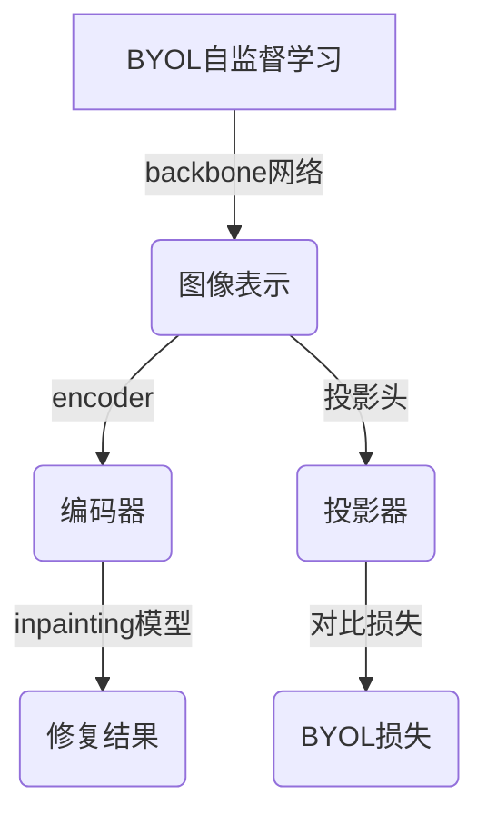

# BYOL在图像inpainting领域的应用

## 1. 背景介绍

### 1.1 问题的由来

图像inpainting是指在图像中的某些区域缺失或损坏时，通过算法自动生成与周围区域相连贯的像素值来修复图像的过程。这个问题源于现实生活中的多种场景,例如:

- 老旧照片或壁画上的划痕、污渍需要修复
- 数字图像传输过程中由于信号干扰导致部分像素丢失
- 视频流中由于遮挡或运动导致部分图像区域缺失
- 去除图像中的不想要的物体(如水印、标志等)后需要修补剩余区域

传统的图像inpainting方法主要基于像素级或patch级的纹理合成,但这些方法往往无法很好地捕捉图像的语义信息,从而导致修复结果与原始图像不够自然和协调。

### 1.2 研究现状  

近年来,受深度学习技术的驱动,基于卷积神经网络(CNN)的图像inpainting方法取得了长足进展,能够更好地理解和生成具有复杂语义结构的图像内容。其中,生成对抗网络(GAN)是一种常用的框架,通过生成器和判别器的对抗训练来学习图像的真实数据分布。

然而,大多数基于GAN的inpainting模型都需要成对的完整图像和mask作为监督信号进行训练,这对数据的标注和采集带来了很大挑战。同时,这些监督模型也容易过度依赖mask的形状和位置信息,导致生成结果缺乏灵活性。

### 1.3 研究意义

BYOL(Bootstrap Your Own Latent)是一种自监督表示学习方法,它通过对比学习的方式,使用同一个图像的不同视角(augmented views)作为正例对,从而学习出对于下游任务(如图像分类)有效的特征表示。

将BYOL引入到图像inpainting任务中,可以避免对成对数据的依赖,直接从大量未标注图像中学习有效的图像表示,从而极大扩展了可用的训练数据量。同时,由于BYOL的自监督性质,生成的inpainting结果不会过度依赖mask的具体形状和位置,因此具有更好的泛化能力。

本文将深入探讨如何将BYOL自监督学习框架应用于图像inpainting任务,并分析其原理、实现细节和实验结果,为该领域的研究提供新的思路和方法。

### 1.4 本文结构

本文的其余部分安排如下:

- 第2部分介绍BYOL在图像inpainting中的核心概念及其与其他相关方法的联系。
- 第3部分详细阐述BYOL inpainting的算法原理和具体实现步骤。
- 第4部分构建BYOL inpainting的数学模型,并推导相关公式。
- 第5部分给出一个基于PyTorch的BYOL inpainting实现示例,并解释关键代码细节。
- 第6部分讨论BYOL inpainting在各类实际场景中的应用前景。
- 第7部分总结推荐了一些有助于学习和实践的工具和资源。  
- 第8部分对BYOL inpainting的研究成果进行总结,并展望其未来发展趋势和面临的挑战。
- 第9部分列出部分常见问题和解答,以帮助读者更好地理解和掌握这一技术。

## 2. 核心概念与联系

BYOL inpainting将自监督表示学习与图像inpainting任务相结合,其核心思想是:利用BYOL框架从大量未标注图像中学习出对下游inpainting任务有效的图像表示,然后将这种表示用于指导inpainting模型修复图像缺失区域。

具体来说,BYOL inpainting包含以下几个关键模块:

1. **Backbone网络**: 通常采用预训练的卷积神经网络(如ResNet)作为基础编码器,对输入图像进行编码。

2. **数据增强(Data Augmentation)**: 对输入图像施加随机的数据增强变换(如裁剪、翻转、颜色扰动等),生成两个不同的视图(views)。

3. **Online/Target网络**: BYOL使用两个相同的网络,一个是待训练的Online网络,另一个是用指数移动平均(EMA)更新的Target网络,两者的参数在训练过程中保持一定的差异。

4. **投影头(Projection Head)**: 将Backbone网络输出的特征向量映射到一个新的embedding空间,使其更利于进行对比学习。

5. **对比损失(Contrastive Loss)**: 最小化Online网络和Target网络在同一个图像的两个视图上的投影头输出之间的差异,从而学习出有效的图像表示。

6. **Inpainting模型**: 使用Backbone网络编码器的输出特征,通过某种解码网络(如U-Net)对图像缺失区域进行修复和生成。

通过以上模块的协同工作,BYOL inpainting能够在不需要任何监督信号的情况下,直接从大量未标注图像中学习出对inpainting任务有效的图像表示,从而避免了对成对标注数据的依赖,同时生成的结果也不会过度依赖mask的具体形状和位置。

BYOL inpainting与其他相关的图像inpainting方法的主要区别和联系如下:

- 与基于GAN的监督inpainting方法相比,BYOL inpainting不需要成对的图像-mask数据进行训练,可以利用更广泛的未标注数据,降低了数据采集和标注的成本。
- 与其他一些自监督inpainting方法(如Context Encoder)相比,BYOL inpainting基于对比学习的方式,能够学习到更有区分性和语义信息的图像表示。
- BYOL inpainting也可以与半监督学习相结合,在有少量标注数据的情况下,结合无监督对比损失和监督重建损失进行联合训练,进一步提高性能。
- 除了inpainting任务,BYOL框架也可以应用于其他计算机视觉任务(如图像分类、目标检测等),为这些领域提供一种有效的自监督表示学习方式。

总的来说,BYOL inpainting为图像inpainting任务提供了一种全新的自监督学习范式,具有独特的理论基础和应用前景,值得我们深入探讨和研究。

## 3. 核心算法原理 & 具体操作步骤

### 3.1 算法原理概述

BYOL inpainting算法的核心原理可以概括为以下三个方面:

1. **自监督对比学习**

   BYOL采用自监督的对比学习(Contrastive Learning)范式,通过最大化同一图像两个增强视图之间的相似性,最小化不同图像视图之间的相似性,从而学习出对下游任务(如inpainting)有效的图像表示。

   具体来说,BYOL使用两个网络:Online网络和Target网络,它们的参数是不同的。对于同一输入图像的两个增强视图,Online网络和Target网络会生成对应的投影向量,我们最小化这两个投影向量之间的差异,作为训练的对比损失函数。

2. **在线目标网络更新**

   与一般的对比学习方法不同,BYOL不需要构造大量的负例对,而是引入了Target网络的概念。Target网络的参数是Online网络参数的指数移动平均(EMA),因此Target网络的输出可以视为Online网络输出的"旧状态",两者之间存在一定的差异,可以作为正则化约束,避免了陷入不良解的风险。

3. **端到端inpainting训练**

   在BYOL的对比学习框架下,我们可以使用Backbone网络的编码器输出作为inpainting模型(如U-Net)的条件,端到端地训练inpainting模型,使其能够基于从大量未标注数据中学习到的有效图像表示,生成自然、连贯的inpainting结果。

综上所述,BYOL inpainting算法通过自监督对比学习的方式,使用大量未标注数据学习出有效的图像表示;同时引入Target网络作为在线正则化约束;最后将学习到的表示应用于inpainting模型,端到端地生成修复结果,整个过程无需任何监督信号和标注数据。

### 3.2 算法步骤详解  

BYOL inpainting算法的具体实现步骤如下:

1. **数据增强**
   - 从未标注图像数据集中采样一个图像batch $\{x_i\}$
   - 对每个图像 $x_i$ 施加随机的数据增强变换(如裁剪、翻转、颜色扰动等),生成两个不同的视图 $\tilde{x}_i^1$和 $\tilde{x}_i^2$

2. **Backbone网络编码**
   - 使用预训练的卷积神经网络(如ResNet)作为Backbone网络的编码器 $f_\theta(\cdot)$
   - 将两个视图 $\tilde{x}_i^1$和 $\tilde{x}_i^2$ 分别通过编码器获得对应的特征表示 $z_i^1 = f_\theta(\tilde{x}_i^1)$ 和 $z_i^2 = f_\theta(\tilde{x}_i^2)$

3. **投影头映射**
   - 定义一个投影头网络 $g_\theta(\cdot)$,将特征表示 $z_i^1$和 $z_i^2$ 映射到一个新的embedding空间,得到投影向量:
     $$y_i^1 = g_\theta(z_i^1), \qquad y_i^2 = g_\theta(z_i^2)$$

4. **Target网络更新**
   - 定义一个与Online网络(包括Backbone和投影头)参数相同的Target网络,参数记为 $\xi$
   - 使用指数移动平均(EMA)的方式更新Target网络的参数:
     $$\xi \leftarrow \lambda \xi + (1-\lambda)\theta$$
     其中 $\lambda$ 是平滑系数,一般取值 $0.99\sim0.999$

5. **对比损失计算**
   - 使用Target网络的参数 $\xi$ 计算视图 $\tilde{x}_i^1$ 和 $\tilde{x}_i^2$ 对应的投影向量:
     $$\bar{y}_i^1 = g_\xi(f_\xi(\tilde{x}_i^1)), \qquad \bar{y}_i^2 = g_\xi(f_\xi(\tilde{x}_i^2))$$
   - 计算Online网络投影向量与Target网络投影向量之间的对比损失:
     $$\mathcal{L}_i = \|y_i^1 - \bar{y}_i^2\|_2^2 + \|y_i^2 - \bar{y}_i^1\|_2^2$$

6. **Backbone网络和投影头更新**
   - 计算整个batch的平均对比损失:
     $$\mathcal{L} = \frac{1}{N}\sum_{i=1}^N \mathcal{L}_i$$
   - 使用随机梯度下降法更新Online网络(Backbone和投影头)的参数 $\theta$,最小化对比损失 $\mathcal{L}$

7. **Inpainting模型训练**
   - 使用Backbone网络编码器的输出特征 $z_i^1$ 和 $z_i^2$ 作为条件
   - 将条件特征输入inpainting解码器网络(如U-Net),生成对应的inpainting结果 $\hat{x}_i^1$ 和 $\hat{x}_i^2$
   - 计算inpainting重建损失(如 $L_1$ 损失):
     $$\mathcal{L}_\text{inpaint} = \|\hat{x}_i^1 - x_i\|_1 + \|\hat{x}_i^2 - x_i\|_1$$
   - 使用随机梯度下降法更新inpainting模型的参数,最小化重建损失 $\mathcal{L}_\text{inpaint}$

以上步骤反复迭代,直至BYOL对比学习和inpainting模型收敛。在训练过程中,我们无需任何监督信号或标注数据,就可以使用大量未标注图像数据集,通过自监督的方式学习出对inpainting任务有效的图像表示,并将其应用于inpainting模型进行端到端的修复图像生成。

### 3.3 算法优缺点

**优点**:

1.