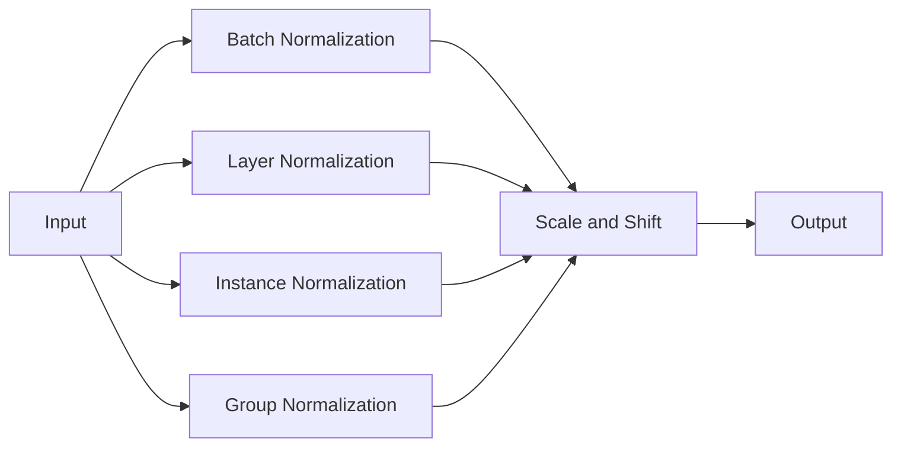

# Batch Normalization原理与代码实例讲解

## 1. 背景介绍
### 1.1 问题的由来
在深度神经网络的训练过程中,由于网络结构的深层叠加,每一层的输入数据分布会发生改变,导致训练过程变得困难。这种现象被称为"Internal Covariate Shift"。为了解决这个问题,2015年,Sergey Ioffe和Christian Szegedy在论文《Batch Normalization: Accelerating Deep Network Training by Reducing Internal Covariate Shift》中提出了Batch Normalization(简称BN)的方法。

### 1.2 研究现状 
自从BN方法被提出以来,在深度学习领域掀起了一股研究热潮。目前BN已经成为深度神经网络训练的标准配置,被广泛应用于各种网络结构中,如CNN、RNN、GAN等。一些经典的网络如Inception、ResNet都采用了BN。研究表明,BN能够加速模型收敛、提高泛化能力、缓解梯度消失问题。

### 1.3 研究意义
BN是深度学习发展历程中的一个里程碑式的工作,对后续的研究产生了深远影响。深入理解BN的原理和实现,对于掌握深度学习的基础知识和应用都有重要意义。通过学习BN,我们可以了解如何设计更有效的网络结构,改进模型训练和优化的策略。

### 1.4 本文结构
本文将从以下几个方面对BN进行详细讲解:
- 第2部分介绍BN的核心概念和与其他normalization方法的联系
- 第3部分讲解BN算法的原理和具体操作步骤
- 第4部分给出BN的数学模型和公式推导过程,并举例说明
- 第5部分提供BN的代码实现,结合代码讲解其工作原理
- 第6部分总结BN在实际应用中的一些场景
- 第7部分推荐BN相关的学习资源、工具和文献
- 第8部分对全文进行总结,讨论BN的未来发展趋势和挑战
- 第9部分的附录中列出了一些常见问题与解答

## 2. 核心概念与联系
BN的基本思想是对每一层网络的输入数据做归一化(normalization)处理,使其分布稳定在一个标准正态分布,然后再进行线性变换和非线性激活。BN与其他一些normalization方法关系密切,如下图所示:



- Batch Normalization: 在每个小批量(mini-batch)内对数据做归一化,然后进行缩放和平移。主要用于CNN。
- Layer Normalization: 在每个样本的所有特征上做归一化。主要用于RNN。
- Instance Normalization: 在每个样本的每个通道上做归一化。主要用于风格迁移。
- Group Normalization: 将通道分组,然后在每个group内做归一化。主要用于CNN,对batchsize不敏感。

## 3. 核心算法原理 & 具体操作步骤
### 3.1 算法原理概述
BN的算法可以分为以下几个步骤:

1. 计算mini-batch的均值
2. 计算mini-batch的方差 
3. 对mini-batch做归一化
4. 引入可学习参数gamma和beta做缩放和平移
5. 进行线性变换和非线性激活

通过上述步骤,BN将每层网络的输入数据分布固定,从而减轻了Internal Covariate Shift问题,加速了模型训练。

### 3.2 算法步骤详解
下面以输入$X=\{x_1,\dots,x_m\}$为例,具体说明BN的计算过程。

步骤1: 计算mini-batch的均值
$$\mu_B \leftarrow \frac{1}{m}\sum_{i=1}^m x_i$$

步骤2: 计算mini-batch的方差
$$\sigma_B^2 \leftarrow \frac{1}{m}\sum_{i=1}^m (x_i-\mu_B)^2$$

步骤3: 归一化
$$\hat{x_i} \leftarrow \frac{x_i-\mu_B}{\sqrt{\sigma_B^2+\epsilon}}$$
其中$\epsilon$是一个很小的常数,用于保证分母不为0。

步骤4: 引入可学习参数gamma和beta做缩放和平移
$$y_i \leftarrow \gamma \hat{x_i} + \beta$$
其中$\gamma$和$\beta$是可学习的参数向量,维度与$x$一致。它们让网络能够自适应地调整归一化后的数据分布。

步骤5: 进行线性变换和非线性激活
$$z_i \leftarrow g(y_i)$$
其中$g$表示非线性激活函数,如ReLU、sigmoid等。

### 3.3 算法优缺点
BN算法的主要优点有:
- 加速模型收敛,提高训练速度
- 提高模型泛化能力,不易过拟合  
- 降低了网络对参数初始化的敏感度
- 允许使用较大的学习率,加快训练
- 可以少用或不用Dropout和L2正则

但BN也存在一些缺点:
- 对batchsize比较敏感,若batchsize太小,误差会较大,不适合在线学习 
- 破坏数据分布,有悖于某些场景(如RNN) 
- 增加了计算复杂度和内存消耗

### 3.4 算法应用领域
BN在许多领域都有广泛应用,例如:
- 图像分类、检测、分割等视觉任务
- 语音识别、机器翻译等语音语言任务
- GAN中的生成器和判别器网络
- 迁移学习和domain adaptation

## 4. 数学模型和公式 & 详细讲解 & 举例说明
### 4.1 数学模型构建
BN的数学模型可以表示为:

$$y=\gamma\frac{x-\mathrm{E}[x]}{\sqrt{\mathrm{Var}[x]+\epsilon}}+\beta$$

其中$x$是输入,$y$是输出,$\gamma$和$\beta$是可学习参数。
$\mathrm{E}[x]$和$\mathrm{Var}[x]$分别表示输入数据的均值和方差:

$$\mathrm{E}[x]=\frac{1}{m}\sum_{i=1}^m x_i$$

$$\mathrm{Var}[x]=\frac{1}{m}\sum_{i=1}^m (x_i-\mathrm{E}[x])^2$$

### 4.2 公式推导过程
对上述公式进行推导,可得:

$$\begin{aligned}
y &= \gamma\frac{x-\mathrm{E}[x]}{\sqrt{\mathrm{Var}[x]+\epsilon}}+\beta \\
&= \gamma\frac{x-\frac{1}{m}\sum_{i=1}^m x_i}{\sqrt{\frac{1}{m}\sum_{i=1}^m (x_i-\mathrm{E}[x])^2+\epsilon}}+\beta \\
&= \gamma\frac{x-\frac{1}{m}\sum_{i=1}^m x_i}{\sqrt{\frac{1}{m}\sum_{i=1}^m (x_i-\frac{1}{m}\sum_{i=1}^m x_i)^2+\epsilon}}+\beta \\
&= \gamma\frac{x-\mu_B}{\sqrt{\sigma_B^2+\epsilon}}+\beta
\end{aligned}$$

其中$\mu_B$和$\sigma_B^2$表示mini-batch的均值和方差。

### 4.3 案例分析与讲解
下面以一个简单的例子说明BN的计算过程。假设我们有4个样本,每个样本有3个特征:

$$X=\left[ \begin{matrix} 
1 & 2 & 3\\
4 & 5 & 6\\ 
7 & 8 & 9\\
10 & 11 & 12
\end{matrix}\right]$$

对每一列特征做BN,计算过程如下:

步骤1: 计算均值

$$\mu_B=\left[ \begin{matrix}
\frac{1+4+7+10}{4} & \frac{2+5+8+11}{4} & \frac{3+6+9+12}{4}
\end{matrix}\right]=\left[ \begin{matrix}
5.5 & 6.5 & 7.5
\end{matrix}\right]$$

步骤2: 计算方差

$$\sigma_B^2=\left[ \begin{matrix}
\frac{(1-5.5)^2+(4-5.5)^2+(7-5.5)^2+(10-5.5)^2}{4} & \dots & \dots
\end{matrix}\right]=\left[ \begin{matrix}
8.25 & 8.25 & 8.25
\end{matrix}\right]$$

步骤3: 归一化

$$\hat{X}=\left[ \begin{matrix}
\frac{1-5.5}{\sqrt{8.25+\epsilon}} & \frac{2-6.5}{\sqrt{8.25+\epsilon}} & \frac{3-7.5}{\sqrt{8.25+\epsilon}}\\
\dots & \dots & \dots \\
\dots & \dots & \dots \\
\frac{10-5.5}{\sqrt{8.25+\epsilon}} & \frac{11-6.5}{\sqrt{8.25+\epsilon}} & \frac{12-7.5}{\sqrt{8.25+\epsilon}}
\end{matrix}\right]$$

步骤4: 引入gamma和beta

$$Y=\gamma\hat{X}+\beta$$

其中$\gamma$和$\beta$是可学习的参数,例如:
$$\gamma=\left[ \begin{matrix}
1.1 & 0.9 & 1.2
\end{matrix}\right], \quad \beta=\left[ \begin{matrix}
0.1 & -0.2 & 0.3
\end{matrix}\right]$$

则最终输出为:
$$Y=\left[ \begin{matrix}
1.1\cdot\frac{1-5.5}{\sqrt{8.25+\epsilon}}+0.1 & 0.9\cdot\frac{2-6.5}{\sqrt{8.25+\epsilon}}-0.2 & 1.2\cdot\frac{3-7.5}{\sqrt{8.25+\epsilon}}+0.3\\
\dots & \dots & \dots \\
\dots & \dots & \dots \\
1.1\cdot\frac{10-5.5}{\sqrt{8.25+\epsilon}}+0.1 & 0.9\cdot\frac{11-6.5}{\sqrt{8.25+\epsilon}}-0.2 & 1.2\cdot\frac{12-7.5}{\sqrt{8.25+\epsilon}}+0.3
\end{matrix}\right]$$

可以看到,经过BN处理后,数据分布变得更加规范,有利于后续的网络学习。同时,引入的$\gamma$和$\beta$参数让网络能够自适应调整数据分布。

### 4.4 常见问题解答
问题1: BN中的$\gamma$和$\beta$有什么作用?

答: $\gamma$和$\beta$是BN引入的可学习参数,让网络能够自适应地调整归一化后的数据分布。如果$\gamma=\sqrt{\sigma_B^2+\epsilon}, \beta=\mu_B$,那么BN就等价于没有做任何操作。因此$\gamma$和$\beta$让BN更加灵活。

问题2: 为什么BN能够加速模型收敛?

答: BN通过归一化使每层网络的输入数据分布稳定,减小了Internal Covariate Shift,从而加速了梯度下降的收敛。此外,BN还起到了正则化的作用,一定程度上避免了过拟合。

问题3: BN在训练和测试时有何不同?

答: 在训练时,BN使用mini-batch的均值和方差进行归一化。在测试时,通常使用训练集上累积的均值和方差(running mean/var)。这是因为测试时的batchsize可能等于1,此时用mini-batch做归一化误差会很大。

## 5. 项目实践：代码实例和详细解释说明
### 5.1 开发环境搭建
本节代码使用PyTorch框架,需要安装以下依赖:
- python 3.x
- pytorch 1.x
- numpy

可以使用pip命令安装:
```bash
pip install torch numpy
```

### 5.2 源代码详细实现
下面给出BN层的PyTorch代码实现:

```python
import torch
import torch.nn as nn

class BatchNorm(nn.Module):
    def __init__(self, num_features, eps=1e-5, momentum=0.1):
        super().__init__()
        self.num_features = num_features
        self.eps = eps
        self.momentum = momentum
        
        # 参数
        self.gamma = nn.Parameter(torch.ones(num_features))
        self.beta = nn.Parameter(torch.zeros(num_features))
        
        # 在训练时计算均值和方差
        self.register_buffer('running_mean', torch.zeros(