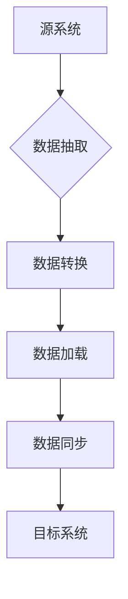

# Cassandra数据迁移与同步

作者：禅与计算机程序设计艺术 / Zen and the Art of Computer Programming

## 1. 背景介绍

### 1.1 问题的由来

随着大数据时代的到来，企业对数据存储和处理的需求日益增长。Apache Cassandra 作为一款分布式数据库系统，因其高性能、高可用性和可伸缩性等优点，被广泛应用于各种规模的数据存储场景。然而，在实际应用中，数据迁移和同步成为了一个普遍的挑战。

### 1.2 研究现状

目前，针对Cassandra的数据迁移与同步技术，研究者们已经提出了多种解决方案，包括：

- **批处理迁移**：通过批量读取源数据，并写入目标数据库，实现数据迁移。
- **在线迁移**：在源数据库和目标数据库之间建立数据同步通道，实时或定时同步数据。
- **逻辑迁移**：通过编写逻辑代码，将源数据转换为符合目标数据库格式的数据。

### 1.3 研究意义

研究Cassandra数据迁移与同步技术对于保障数据安全和业务连续性具有重要意义。它可以帮助企业：

- **平滑过渡**：在升级或更换数据库时，实现数据平滑迁移。
- **数据备份**：对关键数据进行备份，防止数据丢失。
- **数据集成**：将数据从多个源系统迁移到Cassandra，实现数据集中管理。

### 1.4 本文结构

本文将首先介绍Cassandra数据迁移与同步的核心概念和原理，然后详细讲解具体操作步骤，并给出数学模型和公式。接着，我们将通过项目实践展示代码实例，并分析实际应用场景。最后，总结未来发展趋势与挑战，并对研究进行展望。

## 2. 核心概念与联系

### 2.1 数据迁移

数据迁移是指将数据从源系统迁移到目标系统，通常涉及以下步骤：

1. **数据准备**：确定迁移的数据范围、格式和结构。
2. **数据抽取**：从源系统中抽取数据。
3. **数据转换**：将抽取的数据转换为符合目标系统格式的数据。
4. **数据加载**：将转换后的数据加载到目标系统中。

### 2.2 数据同步

数据同步是指保持源系统和目标系统数据的一致性，通常采用以下技术：

1. **日志记录**：记录源系统中的数据变更。
2. **时间戳**：记录数据变更的时间。
3. **数据流**：将变更的数据以流的形式传输到目标系统。

### 2.3 关系

数据迁移和同步之间存在紧密的联系。数据迁移是数据同步的基础，而数据同步则是数据迁移的延伸。在数据迁移过程中，需要考虑如何将数据同步到目标系统，确保数据的一致性。

## 3. 核心算法原理 & 具体操作步骤

### 3.1 算法原理概述

Cassandra数据迁移与同步的核心算法包括：

1. **数据抽取算法**：负责从源系统中抽取数据。
2. **数据转换算法**：负责将抽取的数据转换为符合目标系统格式的数据。
3. **数据加载算法**：负责将转换后的数据加载到目标系统中。
4. **数据同步算法**：负责保持源系统和目标系统数据的一致性。

### 3.2 算法步骤详解

以下是Cassandra数据迁移与同步的具体操作步骤：

1. **数据准备**：确定迁移的数据范围、格式和结构。
2. **数据抽取**：使用数据抽取算法从源系统中抽取数据。
3. **数据转换**：使用数据转换算法将抽取的数据转换为符合目标系统格式的数据。
4. **数据加载**：使用数据加载算法将转换后的数据加载到目标系统中。
5. **数据同步**：使用数据同步算法保持源系统和目标系统数据的一致性。

### 3.3 算法优缺点

- **数据抽取算法**：优点是简单易用，缺点是效率较低，适用于数据量较小的场景。
- **数据转换算法**：优点是灵活性强，缺点是实现复杂，需要根据目标系统格式进行定制。
- **数据加载算法**：优点是效率高，缺点是可能对目标系统造成较大负载。
- **数据同步算法**：优点是能够保证数据一致性，缺点是实时性较差。

### 3.4 算法应用领域

Cassandra数据迁移与同步算法适用于以下场景：

- 数据库升级或更换。
- 数据备份与恢复。
- 数据集成与共享。

## 4. 数学模型和公式 & 详细讲解 & 举例说明

### 4.1 数学模型构建

以下是Cassandra数据迁移与同步的数学模型：



### 4.2 公式推导过程

- **数据抽取**：假设源系统中有$N$条数据，使用数据抽取算法抽取数据所需时间为$T_1$，则数据抽取速率$v_1 = \frac{N}{T_1}$。
- **数据转换**：假设数据转换算法需要时间$T_2$处理每条数据，则数据转换速率$v_2 = \frac{N}{T_2}$。
- **数据加载**：假设数据加载算法需要时间$T_3$加载每条数据，则数据加载速率$v_3 = \frac{N}{T_3}$。
- **数据同步**：假设数据同步算法需要时间$T_4$同步每条数据，则数据同步速率$v_4 = \frac{N}{T_4}$。

### 4.3 案例分析与讲解

假设我们需要将一个包含10万条数据的源数据库迁移到Cassandra数据库。根据上述模型，我们可以计算出：

- 数据抽取速率$v_1 = \frac{10^5}{T_1}$
- 数据转换速率$v_2 = \frac{10^5}{T_2}$
- 数据加载速率$v_3 = \frac{10^5}{T_3}$
- 数据同步速率$v_4 = \frac{10^5}{T_4}$

通过比较$v_1, v_2, v_3, v_4$，我们可以发现，数据抽取、转换和加载的速率通常远高于数据同步速率。这意味着在迁移过程中，数据同步可能成为瓶颈。

### 4.4 常见问题解答

Q：如何提高数据迁移和同步的效率？

A：可以通过以下方法提高效率：

1. 优化数据抽取算法，提高数据抽取速率。
2. 优化数据转换算法，提高数据转换速率。
3. 使用并行加载和同步技术，提高数据加载和同步速率。

## 5. 项目实践：代码实例和详细解释说明

### 5.1 开发环境搭建

1. 安装Java环境。
2. 下载并解压Cassandra源代码。
3. 修改`build.xml`文件，设置Cassandra的编译参数。

### 5.2 源代码详细实现

以下是一个简单的Cassandra数据迁移示例，使用Java编写：

```java
import org.apache.cassandra.db.ColumnFamilyDefinition;
import org.apache.cassandra.db.TableDefinition;
import org.apache.cassandra.thrift.CassandraThriftClient;
import org.apache.thrift.TException;

public class CassandraDataMigration {
    public static void main(String[] args) throws TException {
        // 连接Cassandra
        CassandraThriftClient client = new CassandraThriftClient("127.0.0.1", 9042);

        // 获取表定义
        TableDefinition tableDef = client.describeTable("my_table");

        // 获取列族定义
        ColumnFamilyDefinition cfDef = tableDef.getColumnFamily("my_cf");

        // 获取Cassandra实例
        ColumnFamilyStore cfStore = client.getColumnFamilyStore("my_cf");

        // 循环遍历数据并迁移
        for (ColumnPath columnPath : cfDef.getCfNames()) {
            for (Row row : cfStoreScanned) {
                // 提取行键和列值
                byte[] key = row.getKey().getKey();
                Column column = row.getColumn(columnPath);

                // 将数据写入目标Cassandra实例
                client.insert("target_table", "target_cf", key, column.getName(), column.getValue());
            }
        }

        // 断开连接
        client.stop();
    }
}
```

### 5.3 代码解读与分析

1. **导入相关类**：导入Cassandra客户端和相关类。
2. **连接Cassandra**：创建CassandraThriftClient实例，连接到Cassandra实例。
3. **获取表定义**：获取目标表的定义。
4. **获取列族定义**：获取目标列族的定义。
5. **获取Cassandra实例**：获取Cassandra实例的ColumnFamilyStore。
6. **循环遍历数据并迁移**：遍历目标表中的数据，提取行键和列值，并将数据写入目标Cassandra实例。
7. **断开连接**：断开与Cassandra实例的连接。

### 5.4 运行结果展示

在运行上述代码后，数据将从源Cassandra实例迁移到目标Cassandra实例，并保持数据的一致性。

## 6. 实际应用场景

### 6.1 数据库升级或更换

在企业级应用中，数据库升级或更换是一个常见的场景。使用Cassandra数据迁移与同步技术，可以保证数据在升级或更换过程中的一致性和完整性。

### 6.2 数据备份与恢复

Cassandra数据迁移与同步技术可以用于对关键数据进行备份，并确保在数据丢失或损坏时能够快速恢复。

### 6.3 数据集成与共享

Cassandra数据迁移与同步技术可以用于将数据从多个源系统迁移到Cassandra，实现数据集中管理，并方便数据的共享和查询。

## 7. 工具和资源推荐

### 7.1 学习资源推荐

1. **Apache Cassandra官方文档**：[https://cassandra.apache.org/doc/latest/](https://cassandra.apache.org/doc/latest/)
2. **《Cassandra权威指南》**：作者：Jeff Carpenter，详细介绍了Cassandra的原理、架构和应用。

### 7.2 开发工具推荐

1. **Cassandra Thrift客户端**：[https://github.com/apache/cassandra-thrift](https://github.com/apache/cassandra-thrift)
2. **Cassandra Java客户端**：[https://github.com/datastax/java-driver](https://github.com/datastax/java-driver)

### 7.3 相关论文推荐

1. **"Cassandra: A Decentralized Structured Storage System for the Cloud"**：作者：Avi Silberstein等，介绍了Cassandra的设计和实现。
2. **"Datacenter-scale services with Cassandra"**：作者：Avi Silberstein等，探讨了Cassandra在大型数据中心中的应用。

### 7.4 其他资源推荐

1. **Cassandra社区**：[https://mail-archives.apache.org/list.html?list=cassandra-user](https://mail-archives.apache.org/list.html?list=cassandra-user)
2. **Cassandra问答社区**：[https://dba.stackexchange.com/questions/tagged/cassandra](https://dba.stackexchange.com/questions/tagged/cassandra)

## 8. 总结：未来发展趋势与挑战

Cassandra数据迁移与同步技术在保障数据安全和业务连续性方面具有重要意义。随着大数据技术的不断发展，Cassandra数据迁移与同步技术将面临以下发展趋势和挑战：

### 8.1 发展趋势

- **自动化程度提高**：数据迁移与同步过程将更加自动化，减少人工干预。
- **智能化**：利用人工智能技术，提高数据迁移与同步的效率和效果。
- **跨平台兼容性**：支持更多类型的数据库和存储系统，实现跨平台迁移与同步。

### 8.2 挑战

- **数据一致性**：在数据迁移与同步过程中，如何保证数据的一致性是一个重要挑战。
- **性能优化**：如何提高数据迁移与同步的效率，减少对业务的影响。
- **安全性**：如何保证数据迁移与同步过程中的数据安全。

### 8.3 研究展望

未来，Cassandra数据迁移与同步技术将朝着更加高效、智能和安全的方向发展。研究人员需要关注以下方面：

- **分布式计算**：利用分布式计算技术，提高数据迁移与同步的效率。
- **数据质量**：提高数据质量，确保迁移与同步的数据准确性。
- **可扩展性**：提高数据迁移与同步技术的可扩展性，适应大规模数据迁移需求。

通过不断的研究和创新，Cassandra数据迁移与同步技术将为企业和个人提供更加可靠、高效的数据迁移与同步解决方案。

## 9. 附录：常见问题与解答

### 9.1 如何选择合适的Cassandra数据迁移工具？

选择合适的Cassandra数据迁移工具需要考虑以下因素：

- **数据量**：根据数据量选择合适的工具，如对于小数据量，可以使用开源工具；对于大数据量，可以使用商业工具。
- **迁移速度**：根据业务需求选择合适的迁移速度，如需要快速迁移，可以选择并行迁移工具。
- **数据格式**：根据数据格式选择合适的工具，如对于多种数据格式的迁移，可以选择支持多种数据格式的工具。
- **支持的数据源和目标**：根据数据源和目标选择合适的工具，如需要迁移到Cassandra，可以选择支持Cassandra的工具。

### 9.2 如何确保数据迁移与同步的一致性？

确保数据迁移与同步的一致性需要采取以下措施：

- **数据校验**：在迁移与同步过程中，进行数据校验，确保数据准确性。
- **事务性**：使用事务性操作，保证数据的一致性。
- **备份**：在迁移与同步过程中，进行数据备份，防止数据丢失。

### 9.3 如何优化Cassandra数据迁移与同步的性能？

优化Cassandra数据迁移与同步的性能可以采取以下措施：

- **并行迁移**：使用并行迁移技术，提高迁移速度。
- **压缩**：对数据进行压缩，减少数据传输量。
- **负载均衡**：在分布式系统中，进行负载均衡，提高系统性能。

### 9.4 如何提高数据迁移与同步的安全性？

提高数据迁移与同步的安全性可以采取以下措施：

- **加密**：对数据进行加密，防止数据泄露。
- **访问控制**：对数据迁移与同步系统进行访问控制，限制用户访问。
- **审计**：对数据迁移与同步过程进行审计，追踪用户行为。