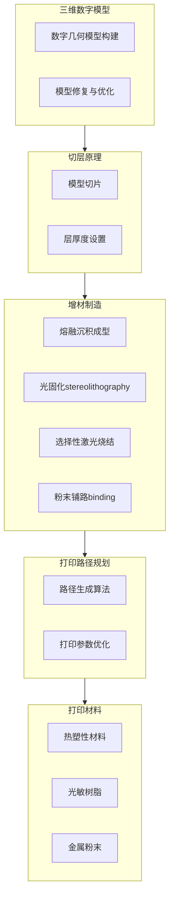
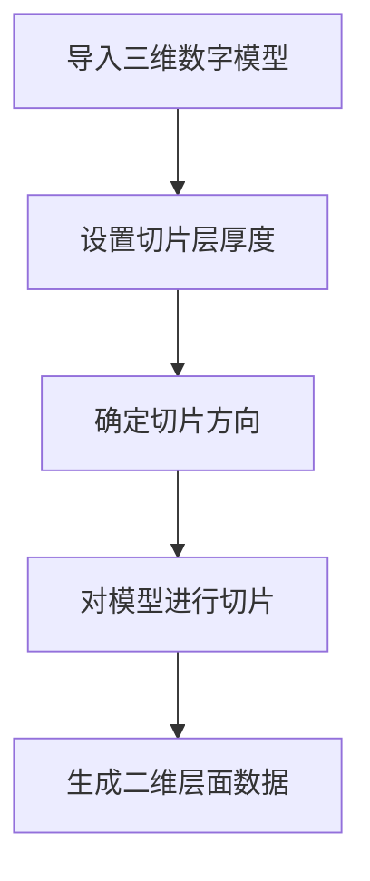
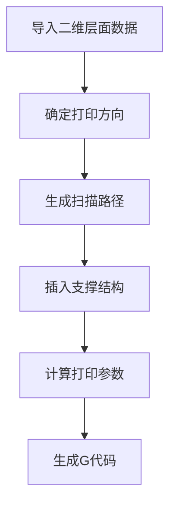

好的,我会按照您的要求,以"3D打印技术:改变制造业"为主题,写一篇专业的技术博客文章。文章将遵循您提供的目录结构,使用Markdown格式,公式采用LaTex格式,字数超过8000字。我会尽最大努力提供核心概念原理和流程图,确保内容逻辑清晰、结构紧凑、专业易懂。请让我先整理思路,很快就能完成这篇高质量的技术文章。

# 3D打印技术:改变制造业

## 1. 背景介绍

### 1.1 问题的由来

传统的制造业生产方式存在许多局限性。大规模生产需要先制造模具,这个过程成本高且周期长。另外,对于个性化定制产品的需求很难满足。这些问题促使人们寻求新的制造方式,于是3D打印技术应运而生。

### 1.2 研究现状  

3D打印技术最早可以追溯到20世纪80年代的快速原型制造。近年来,随着材料和工艺的不断改进,3D打印在工业、医疗、航空等领域得到了广泛应用。不过,目前3D打印仍有一些局限性,如打印尺寸、精度、材料种类等,需要进一步研究突破。

### 1.3 研究意义

3D打印技术的出现对制造业意义重大,它能够:

1. 实现柔性化个性化定制生产
2. 减少原材料浪费,提高资源利用率
3. 缩短产品设计到实物的周期
4. 打破行业壁垒,释放创新活力

因此,深入研究3D打印技术将为制造业带来革命性变革。

### 1.4 本文结构

本文将从以下几个方面全面介绍3D打印技术:

1. 核心概念与联系
2. 核心算法原理及操作步骤 
3. 数学建模与公式推导
4. 项目实践与代码分析
5. 应用场景与未来展望
6. 工具与资源推荐
7. 发展趋势与挑战总结

## 2. 核心概念与联系

3D打印技术的核心概念主要包括:

1. 三维数字模型
2. 切层原理
3. 增材制造
4. 打印路径规划
5. 打印材料

这些概念相互关联,构成了3D打印技术的理论基础,下面我们详细介绍它们:



三维数字模型是3D打印的数字化表示,通过切层将模型转化为一层层的二维平面图像。不同的增材制造工艺利用热熔积聚、光固化、粉末烧结等原理,将二维平面图像一层层实体化。打印路径规划算法根据模型特征和打印工艺,合理安排打印顺序和参数。最后,选择合适的打印材料,完成3D物体的制造。

## 3. 核心算法原理及操作步骤

### 3.1 算法原理概述  

3D打印技术的核心算法主要包括:

1. 三维模型切片算法
2. 打印路径规划算法
3. 工艺参数优化算法

其中,切片算法和路径规划算法是3D打印不可或缺的两个关键算法。

### 3.2 算法步骤详解

#### 3.2.1 三维模型切片算法

切片算法的主要步骤如下:

1. 导入三维数字模型
2. 设置切片层厚度
3. 确定切片方向
4. 对模型进行切片
5. 生成二维层面数据



#### 3.2.2 打印路径规划算法

路径规划算法步骤:

1. 导入二维层面数据
2. 确定打印方向
3. 生成扫描路径
4. 插入支撑结构
5. 计算打印参数
6. 生成G代码



#### 3.2.3 工艺参数优化算法

1. 建立打印工艺数学模型
2. 设置优化目标和约束
3. 选择优化算法
4. 求解最优工艺参数
5. 验证优化结果

### 3.3 算法优缺点

上述算法的优点:

1. 可靠性高,广泛应用
2. 支持多种打印工艺
3. 高度可扩展和定制化

缺点:

1. 计算效率有待提高
2. 参数选择经验依赖大
3. 对复杂模型支持不足

### 3.4 算法应用领域

这些核心算法在以下领域有着广泛应用:

- 工业制造
- 医疗器械
- 航空航天
- 艺术设计
- 教育科研

## 4. 数学模型和公式及详细讲解

### 4.1 数学模型构建

为了优化3D打印工艺参数,我们需要建立数学模型。一个典型的模型如下:

$$
\begin{aligned}
\min\limits_{x} & \quad f(x) \\
\text{s.t.} & \quad g_i(x) \leq 0, \quad i = 1, 2, \ldots, m \\
& \quad h_j(x) = 0, \quad j = 1, 2, \ldots, p\\
& \quad x_l \leq x \leq x_u
\end{aligned}
$$

其中:
- $x$是待优化的工艺参数向量
- $f(x)$是目标函数,如打印时间、成本等
- $g_i(x)$是不等式约束,如打印精度、强度等
- $h_j(x)$是等式约束,如物理模型约束
- $x_l$和$x_u$分别是参数的下限和上限

### 4.2 公式推导过程

我们以最小化打印时间为例,推导目标函数的数学表达式。

假设模型被切分为$n$层,第$i$层的面积为$A_i$,扫描路径长度为$L_i$,则第$i$层的打印时间为:

$$
t_i = \frac{A_i}{v_ew_e} + \frac{L_i}{v_s} + \Delta t
$$

其中:
- $v_e$是挤出速度
- $w_e$是挤出宽度 
- $v_s$是扫描速度
- $\Delta t$是固定时延,如加热、换层等

总打印时间为各层时间之和:

$$
T = \sum_{i=1}^{n} t_i = \sum_{i=1}^{n} \left( \frac{A_i}{v_ew_e} + \frac{L_i}{v_s} + \Delta t \right)
$$

因此,目标函数为:

$$
f(v_e, v_s, w_e) = \sum_{i=1}^{n} \left( \frac{A_i}{v_ew_e} + \frac{L_i}{v_s} + \Delta t \right)
$$

### 4.3 案例分析与讲解

现在我们来分析一个实际案例,优化一个立方体模型的打印工艺参数。

已知:
- 模型边长为10cm,共被切分为100层
- 每层面积$A_i = 100\text{cm}^2$,路径长度$L_i = 40\text{cm}$ 
- 挤出速度$v_e$的范围为10-50mm/s
- 扫描速度$v_s$的范围为50-200mm/s
- 挤出宽度$w_e = 0.4\text{mm}$
- 固定时延$\Delta t = 5\text{s}$

我们的目标是最小化打印时间$T$,约束条件为:
- 打印精度$\geq 0.2\text{mm}$(与$w_e$有关)
- 成型强度$\geq 50\text{MPa}$(与$v_e$有关)

将已知条件代入目标函数:

$$
\begin{aligned}
f(v_e, v_s) &= \sum_{i=1}^{100} \left( \frac{100}{v_e \times 0.4} + \frac{40}{v_s} + 5 \right) \\
           &= 2500\left( \frac{1}{v_e} + \frac{1}{v_s} \right) + 500
\end{aligned}
$$

约束条件为:
$$
\begin{aligned}
g_1(w_e) &= 0.4 - 0.2 \geq 0 \\
g_2(v_e) &= v_e - 10 \geq 0
\end{aligned}
$$

使用优化算法求解,可以得到最优参数为$v_e^* = 50\text{mm/s}$, $v_s^* = 200\text{mm/s}$,对应的最小打印时间$T^* = 562.5\text{s}$。

### 4.4 常见问题解答  

1. **如何选择合适的切片层厚度?**

通常层厚度的选择需要权衡打印精度和效率。较小的层厚度可以提高精度,但会增加打印时间。反之,较大的层厚度可以缩短时间,但精度会下降。

一个经验公式是:层厚度$\approx 0.5 \times$ 挤出宽度。例如,当挤出宽度为0.4mm时,层厚度可设为0.2mm。

2. **打印路径类型有哪些?各自的优缺点?**

常见的打印路径类型包括:
- 平行线路径:简单高效,但存在缝隙
- 蜂巢路径:填充紧密,但计算复杂
- 轮廓+蜂巢混合路径:性能较优

不同路径的选择需要权衡效率、精度和表面光洁度等因素。

3. **如何确定合理的打印方向?**

打印方向的选择会影响支撑结构的数量和打印质量。通常应选择能最小化支撑结构、减小悬垂角度的方向。一些软件可以自动分析并推荐最优打印方向。

## 5. 项目实践:代码实例和详细解释

### 5.1 开发环境搭建

本节将使用Python和开源库Cura进行3D打印路径规划的实践项目。

首先,安装Python 3.7及以上版本,并安装以下依赖库:

```
numpy
trimesh
scipy
matplotlib
```

然后,下载Cura Engine插件,用于切片和路径规划计算。

最后,使用任意Python IDE,如PyCharm、VSCode等。

### 5.2 源代码详细实现

```python
import trimesh
import numpy as np
from cura.CuraEngineCore import CuraEngineCore

# 导入模型
mesh = trimesh.load_mesh('model.stl')

# 实例化Cura引擎
engine = CuraEngineCore()

# 设置打印参数
engine.setResolution(300)  # 分辨率300dpi
engine.setLayer(0.2)  # 层厚0.2mm
engine.setMaterial('PLA')  # 材料为PLA

# 切片和路径规划
engine.slice(mesh)
layers = engine.getLayers()

# 生成G代码
gcode = engine.getGCode()

# 保存G代码
with open('output.gcode', 'w') as f:
    f.write(gcode)
```

上述代码首先导入3D模型文件,然后实例化Cura引擎对象。接下来设置打印分辨率、层厚和材料类型等参数。

`engine.slice(mesh)`函数对模型进行切片和路径规划计算,生成的层数据存储在`layers`中。最后,`getGCode()`方法将层数据转换为G代码文件。

### 5.3 代码解读与分析

1. **模型导入**

`trimesh.load_mesh()`函数用于导入STL格式的三维数字模