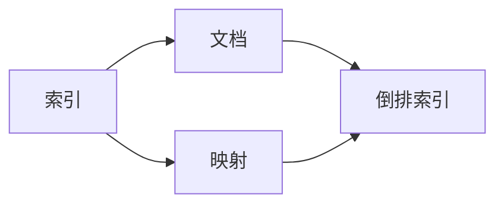
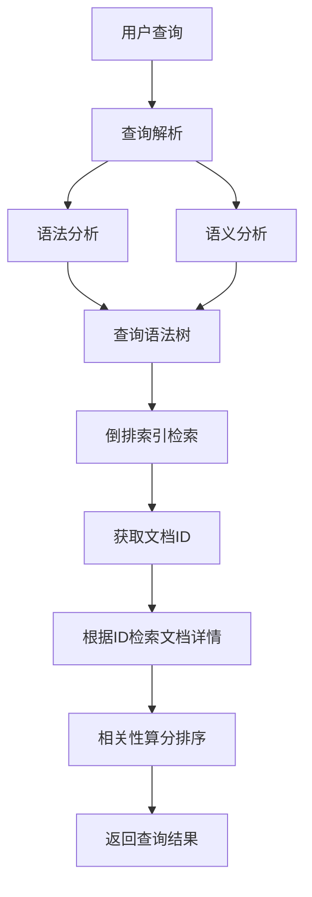
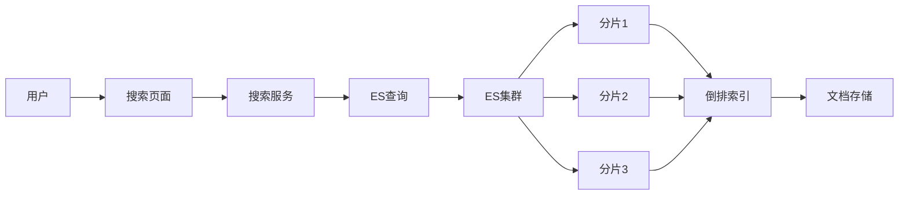

# ES查询技巧：分页、排序、过滤

关键词：Elasticsearch, 查询, 分页, 排序, 过滤, 搜索, 查询DSL

## 1. 背景介绍
### 1.1  问题的由来
随着互联网数据量的爆炸式增长,传统的关系型数据库在海量数据的查询和检索方面已经力不从心。Elasticsearch(简称ES)作为一款基于Lucene的开源分布式搜索引擎,凭借其强大的全文检索能力、准实时性、分布式特性,在全文搜索、日志分析、指标分析等领域得到了广泛的应用。然而,随着业务需求的日益复杂,开发者在使用ES进行查询时,经常会遇到分页、排序、过滤等一系列问题,影响查询性能和结果的准确性。

### 1.2  研究现状
目前,关于ES查询优化的研究主要集中在查询语句的构建、索引设计、性能调优等方面。一些学者提出了使用查询DSL(Domain Specific Language)来构建复杂查询[1],通过组合使用match、term、bool等查询,实现多条件、跨字段的灵活查询。也有研究致力于索引模板的设计[2],通过预定义mapping中字段的类型、分词器、存储等属性,优化索引的查询速度。还有一些工作从硬件层面对ES进行调优[3],如使用SSD、增加内存、调整线程池等,提升ES集群的吞吐量和性能。

### 1.3  研究意义
ES作为时下流行的搜索引擎,大量应用在各个互联网领域。深入研究ES的查询技巧,总结一些实用的分页、排序、过滤方案,可以帮助开发者更好地使用ES,构建高效、准确的搜索功能,提升用户体验。同时,对ES查询的优化,也可为其他搜索引擎的设计和改进提供有益的参考。

### 1.4  本文结构
本文将重点介绍ES查询中的分页、排序、过滤技巧。第2节介绍ES查询的一些核心概念,如索引、文档、倒排索引等。第3节重点讲解查询的分页实现,包括from/size、scroll、search_after等方案的原理和使用。第4节介绍常见的字段排序和自定义评分排序方法。第5节总结几种实用的过滤器语法,如term、range、exists等。第6节通过一个实际的案例,演示在ES中如何利用这些技巧构建一个电商商品搜索引擎。第7节推荐一些ES学习的资源和工具。最后第8节总结全文,并展望ES查询优化的一些趋势和挑战。

## 2. 核心概念与联系

在深入学习ES查询之前,我们先来了解几个ES的核心概念：

- 索引(Index):ES存储数据的地方,类似于MySQL的数据库。一个索引可以包含多个文档。
- 文档(Document):ES中的最小数据单元,常以JSON格式存储,类似于MySQL的一条记录。
- 映射(Mapping):定义了文档中字段的类型和属性,类似于MySQL的表结构。
- 倒排索引(Inverted Index):ES底层基于Lucene实现的一种索引结构,通过分词将文档内容切分为词条(Term),然后记录每个词条出现在哪些文档中,大大提高了全文检索的效率。

这些概念之间的关系如下图所示:



可以看出,文档存储在索引中,映射定义了文档的结构,二者共同决定了倒排索引的生成。倒排索引是ES实现快速全文搜索的核心数据结构。

## 3. 核心算法原理 & 具体操作步骤
### 3.1  算法原理概述
ES查询的核心是基于倒排索引实现的。对用户输入的查询语句,ES首先会对其进行语法和语义分析,将其转化为一个查询语法树。然后ES根据查询树从倒排索引中获取相关的文档ID,再根据文档ID去检索文档的详细内容,最后根据相关性算分对结果排序并返回。这个过程可以用下面的流程图表示:



### 3.2  算法步骤详解

1. 查询解析
   
   ES使用一种类似SQL的DSL(Domain Specific Language)来表达查询,常见的有match、term、range、bool等。例如:
   ```json
   GET /my_index/_search
   {
     "query": {
       "match": {
         "title": "elasticsearch"
       }
     }
   }
   ```
   这个查询会去索引my_index中查找title字段包含"elasticsearch"的文档。
   
   ES的查询解析器会将这个JSON格式的查询转换为一个查询语法树,方便后续处理。

2. 倒排索引检索

   有了查询语法树,ES就可以从倒排索引中检索相关文档了。还是以上面的match查询为例,ES会执行如下步骤:

   - 对查询词"elasticsearch"进行分词,得到词条"elasticsearch"
   - 在倒排索引中查找包含此词条的文档,得到一组文档ID,如[1, 3, 5]
   - 根据文档ID去检索文档的详细内容(称为正排索引)

3. 相关性算分排序

   单纯返回包含查询词的文档并不够,还需要对结果进行排序。ES使用一个相关性评分算法,为每个文档计算一个相关度分值,分值越高就排在越前面。
   
   ES的相关性算法考虑了多个因素,如词频(Term Frequency)、逆文档频率(Inverse Document Frequency)、文档长度等,详细公式在下一节展开。

4. 返回查询结果

   ES默认会返回排名前10的搜索结果,我们也可以通过size参数自定义要返回的数量。
   
   为了实现分页,ES还支持通过from参数指定偏移位置,与size结合使用可以返回从第from+1条数据开始的size条结果。
   
   最后,ES将这些查询命中的文档封装为一个JSON格式的响应返回给调用方。

### 3.3  算法优缺点

ES查询的优点主要有:

- 查询灵活多变,支持各种复杂的条件组合
- 基于倒排索引,查询速度非常快
- 内置相关性评分排序,结果更加精准
- 支持分布式架构,可以线性扩展,适合海量数据的查询

但它的缺点也不容忽视:

- 查询语法相对复杂,上手有一定门槛
- 过于灵活的查询方式,不当使用反而会降低性能
- 相关性评分计算比较耗CPU资源
- 分布式架构也引入了一些复杂性,如文档的分片与路由

因此在实际应用中,还需要根据具体的业务场景,权衡查询的灵活性和性能,适度使用ES的查询功能。

### 3.4  算法应用领域

ES查询在很多领域都有广泛应用,比较典型的有:

- 全文搜索:如百度、谷歌等搜索引擎,电商网站的商品搜索等。
- 日志分析:ELK技术栈中的Logstash、Kibana都依赖ES进行日志的存储和查询分析。
- 指标监控:ES适合存储时序数据,常用于应用性能的指标监控和告警。
- 推荐系统:ES可以存储用户画像,基于用户的历史行为进行个性化推荐。
- 地理位置:ES内置了地理位置数据类型,可以实现LBS(Location Based Service)应用。

下面是一个使用ES实现商品搜索的架构图:



用户在搜索页面输入关键词,请求发送到后端搜索服务,搜索服务将请求转发给ES进行查询。ES集群由多个分片(Shard)组成,每个分片都包含部分的倒排索引和文档数据。ES会在所有分片中并行执行查询,然后汇总各分片的结果,返回给搜索服务,最后展示给用户。

## 4. 数学模型和公式 & 详细讲解 & 举例说明
### 4.1  数学模型构建
ES的相关性评分采用的是布尔模型(Boolean Model)和向量空间模型(Vector Space Model)的组合。

布尔模型主要用于判断一个文档是否包含查询词,它的输出是一个二值,即"是"或"否"。布尔模型的优点是计算简单,缺点是无法区分查询词的重要性。

向量空间模型则将查询和文档都表示为一个N维向量,每个维度对应一个词条,维度的值就是词条的权重。查询向量与文档向量的夹角余弦值就表示了二者的相似度。向量空间模型能比较精准地反映词条的权重,进而影响文档的排序。

### 4.2  公式推导过程
ES使用的相关性评分公式为:

$$score(q,d) = \sum_{t \in q} \sqrt{tf(t,d)} * idf(t)^2 * norm(d)$$

其中:
- $q$表示查询
- $d$表示文档
- $t$表示词条
- $tf(t,d)$表示词条$t$在文档$d$中的词频
- $idf(t)$表示词条$t$的逆文档频率
- $norm(d)$表示文档$d$的长度归一化因子

下面我们来推导一下这个公式:

首先,一个词条对文档的贡献度应该与它在文档中出现的频率成正比,即$tf(t,d)$。但为了避免词频过大引起的过拟合,ES采用$\sqrt{tf(t,d)}$来平滑这个值。

其次,一个词条的重要性应该与它在所有文档中出现的频率成反比,即$idf(t)$。直观上,一个词条如果在大部分文档中都出现,那它的区分度就很低;反之如果一个词条只在少数文档中出现,那它就很有可能反映了文档的特殊性。idf的计算公式为:

$$idf(t) = 1 + log(\frac{N}{df(t)+1})$$

其中$N$为文档总数,$df(t)$为包含词条$t$的文档数。分母加1是为了避免除零错误。

最后,为了平衡不同长度的文档,需要引入一个归一化因子$norm(d)$,它与文档长度成反比:

$$norm(d) = \frac{1}{\sqrt{\sum_{t \in d} tf(t,d)}}$$

将以上三个部分相乘,就得到了ES的相关性评分公式。

### 4.3  案例分析与讲解
下面我们来看一个具体的例子。假设我们有以下3个文档:

```
d1: ES is an open source search engine
d2: ES is based on Lucene
d3: Lucene is an IR library 
```

现在我们要查询"ES Lucene"这个短语,来计算每个文档的相关性得分。

对于d1,它包含查询词"ES",词频为1,根据idf公式,假设$idf("ES") = 1.5$。d1不包含"Lucene",因此总得分为:

$$score(q,d1) = \sqrt{1} * 1.5^2 * \frac{1}{\sqrt{6}} = 1.837$$

对于d2,它包含查询词"ES"和"Lucene",词频都为1,假设$idf("Lucene") = 2.0$,则总得分为:

$$score(q,d2) = (\sqrt{1} * 1.5^2 + \sqrt{1} * 2.0^2) * \frac{1}{\sqrt{5}} = 5.022$$

对于d3,它只包含查询词"Lucene",词频为1,总得分为:

$$score(q,d3) = \sqrt{1} * 2.0^2 * \frac{1