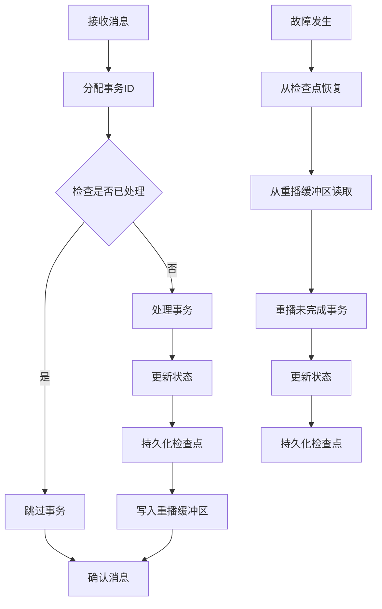

# Exactly-once语义的重要性和应用场景

## 1. 背景介绍

### 1.1 问题的由来

在分布式系统中,确保数据处理的正确性和一致性是一个长期存在的挑战。传统上,大多数系统都采用了"至多一次"(At-Most-Once)或"至少一次"(At-Least-Once)语义来处理消息和事件。然而,这两种方式都存在着固有的缺陷和局限性。

"至多一次"语义确保消息不会被重复处理,但如果在处理过程中出现故障或网络中断,则可能导致消息丢失,从而影响数据的完整性。另一方面,"至少一次"语义则可以保证消息最终会被处理,但存在重复处理的风险,这可能会引入数据不一致性或造成其他副作用。

为了解决这些问题,Exactly-once语义应运而生。它旨在确保每条消息都只被精确处理一次,不会出现丢失或重复处理的情况,从而保证了数据处理的正确性和一致性。

### 1.2 研究现状

近年来,随着分布式系统和事件驱动架构的广泛应用,Exactly-once语义受到了越来越多的关注和研究。许多著名的分布式流处理系统,如Apache Kafka、Apache Flink和Apache Spark等,都已经支持或正在努力实现Exactly-once语义。

然而,实现Exactly-once语义并非一蹴而就。它需要解决诸多技术挑战,如故障恢复、重播缓冲区管理、状态一致性等。研究人员和工程师们一直在探索各种方法和技术来实现这一目标,例如基于事务的方法、检查点机制、幂等性处理等。

### 1.3 研究意义

Exactly-once语义对于确保数据处理的正确性和一致性至关重要。在许多关键应用场景中,如金融交易、物联网数据处理、电子商务订单处理等,数据的准确性和完整性是不可或缺的。任何数据丢失或重复处理都可能导致严重的后果,如财务损失、决策错误或系统故障。

通过实现Exactly-once语义,我们可以大大提高分布式系统的可靠性和健壮性,确保数据处理的准确性和一致性。这不仅有助于提高系统的整体质量和用户体验,还可以降低维护成本和风险。

### 1.4 本文结构

本文将全面探讨Exactly-once语义的重要性和应用场景。我们将首先介绍Exactly-once语义的核心概念和原理,包括其与"至多一次"和"至少一次"语义的区别。接下来,我们将深入探讨实现Exactly-once语义的核心算法和数学模型,并提供详细的公式推导和案例分析。

此外,我们还将介绍一个实际项目的代码实现,详细解释如何在实践中应用Exactly-once语义。最后,我们将探讨Exactly-once语义在各种应用场景中的作用,并分享相关的工具和资源。

## 2. 核心概念与联系

Exactly-once语义是一种保证消息或事件只被精确处理一次的机制,它位于"至多一次"(At-Most-Once)和"至少一次"(At-Least-Once)语义之间。

"至多一次"语义确保消息不会被重复处理,但如果在处理过程中出现故障或网络中断,则可能导致消息丢失。这种情况下,数据的完整性无法得到保证。

"至少一次"语义则可以保证消息最终会被处理,但存在重复处理的风险。这可能会引入数据不一致性或造成其他副作用,如重复计费或重复执行操作等。

相比之下,Exactly-once语义旨在确保每条消息都只被精确处理一次,不会出现丢失或重复处理的情况。它结合了"至多一次"和"至少一次"语义的优点,同时避免了它们的缺陷。

实现Exactly-once语义需要解决诸多技术挑战,如故障恢复、重播缓冲区管理、状态一致性等。它通常涉及到事务机制、检查点机制、幂等性处理等技术手段。

Exactly-once语义对于确保数据处理的正确性和一致性至关重要,尤其在金融交易、物联网数据处理、电子商务订单处理等关键应用场景中。它可以大大提高分布式系统的可靠性和健壮性,确保数据处理的准确性和完整性。

## 3. 核心算法原理 & 具体操作步骤

### 3.1 算法原理概述

实现Exactly-once语义的核心算法原理可以概括为以下几个关键步骤:

1. **事务和检查点机制**: 将消息处理过程划分为多个阶段,每个阶段都被视为一个事务。系统会定期进行检查点,记录每个事务的状态和进度。

2. **幂等性处理**: 确保每个事务都是幂等的,即多次执行相同的操作,结果与执行一次相同。这可以通过唯一标识符、重复数据过滤等机制来实现。

3. **故障恢复**: 当发生故障时,系统可以根据检查点信息恢复到最近的一致状态,并重播未完成的事务。

4. **重播缓冲区管理**: 使用重播缓冲区临时存储未完成的事务,以便在故障恢复时重播。

5. **状态一致性**: 确保系统的状态在故障恢复后保持一致,避免数据不一致或重复处理。

这些步骤相互协作,共同实现了Exactly-once语义。接下来,我们将详细探讨每个步骤的具体操作步骤。

### 3.2 算法步骤详解

1. **事务和检查点机制**

   - 将消息处理过程划分为多个阶段,每个阶段都被视为一个事务。
   - 系统会定期进行检查点,记录每个事务的状态和进度。
   - 检查点信息通常会持久化存储,以便在故障恢复时使用。

2. **幂等性处理**

   - 为每个事务分配一个唯一的标识符,例如UUID或递增序列号。
   - 在处理事务之前,检查是否已经处理过具有相同标识符的事务。
   - 如果已经处理过,则跳过该事务,避免重复处理。
   - 可以使用数据库、缓存或其他存储机制来记录已处理的事务标识符。

3. **故障恢复**

   - 当发生故障时,系统会根据最近的检查点信息恢复到一致状态。
   - 从检查点开始,重播所有未完成的事务。
   - 利用幂等性处理机制,确保重播的事务不会被重复处理。

4. **重播缓冲区管理**

   - 使用重播缓冲区临时存储未完成的事务。
   - 在故障恢复时,从重播缓冲区中读取未完成的事务,并重播它们。
   - 重播缓冲区通常使用持久化存储,以确保数据不会在故障时丢失。

5. **状态一致性**

   - 在处理事务时,需要确保系统的状态保持一致。
   - 可以使用事务机制或其他同步机制来协调状态更新。
   - 在故障恢复后,需要根据检查点信息重建一致的状态。

这些步骤相互配合,共同实现了Exactly-once语义。下面是一个简化的流程图,展示了算法的整体执行流程:

### 3.3 算法优缺点

**优点**:

- 确保数据处理的正确性和一致性,避免了数据丢失或重复处理的问题。
- 提高了分布式系统的可靠性和健壮性,降低了维护成本和风险。
- 适用于各种关键应用场景,如金融交易、物联网数据处理、电子商务订单处理等。

**缺点**:

- 实现复杂,需要解决诸多技术挑战,如故障恢复、重播缓冲区管理、状态一致性等。
- 引入了额外的开销,如检查点存储、重播缓冲区管理等,可能会影响系统的性能。
- 需要精心设计和优化,以确保算法的正确性和效率。

### 3.4 算法应用领域

Exactly-once语义在以下领域有着广泛的应用:

- **流处理系统**: 如Apache Kafka、Apache Flink、Apache Spark等,都支持或正在努力实现Exactly-once语义,以确保数据处理的准确性和一致性。

- **消息队列系统**: 如RabbitMQ、Apache Kafka等,可以利用Exactly-once语义来确保消息只被消费一次,避免重复处理或丢失。

- **分布式数据库**: 如Apache Cassandra、Apache HBase等,可以使用Exactly-once语义来确保数据写入的原子性和一致性。

- **金融交易系统**: 在金融交易系统中,Exactly-once语义可以确保交易只被执行一次,避免重复扣款或其他错误。

- **物联网数据处理**: 在物联网场景中,Exactly-once语义可以确保传感器数据只被处理一次,避免重复计算或错误决策。

- **电子商务订单处理**: 在电子商务系统中,Exactly-once语义可以确保订单只被处理一次,避免重复扣款或发货等问题。

总的来说,任何需要确保数据处理正确性和一致性的分布式系统,都可以从Exactly-once语义中受益。

## 4. 数学模型和公式 & 详细讲解 & 举例说明

### 4.1 数学模型构建

为了更好地理解和实现Exactly-once语义,我们可以构建一个数学模型来描述系统的状态和事务处理过程。

假设系统有一个状态集合 $S$,每个状态 $s \in S$ 代表系统在某个时间点的快照。我们定义一个状态转移函数 $f: S \times E \rightarrow S$,其中 $E$ 是事务集合。该函数描述了当在状态 $s$ 下执行事务 $e$ 时,系统将转移到新的状态 $s'$,即 $s' = f(s, e)$。

我们的目标是找到一个函数序列 $\{f_1, f_2, \ldots, f_n\}$,使得对于任意初始状态 $s_0$ 和事务序列 $\{e_1, e_2, \ldots, e_n\}$,最终状态 $s_n = f_n(f_{n-1}(\ldots f_1(s_0, e_1), e_2), \ldots, e_n)$ 与按顺序执行这些事务的结果相同。

为了实现这一目标,我们需要引入一些额外的约束条件:

1. **幂等性**: 对于任意状态 $s$ 和事务 $e$,如果 $f(s, e) = s$,则称事务 $e$ 在状态 $s$ 下是幂等的。我们要求所有事务都是幂等的,以避免重复执行导致的状态改变。

2. **可交换性**: 对于任意状态 $s$ 和两个事务 $e_1$、$e_2$,如果 $f(f(s, e_1), e_2) = f(f(s, e_2), e_1)$,则称事务 $e_1$ 和 $e_2$ 是可交换的。可交换性可以确保事务的执行顺序不会影响最终状态。

3. **检查点一致性**: 在执行事务序列时,系统会定期进行检查点,记录当前状态。在故障恢复时,系统需要从最近的一致检查点状态开始重播未完成的事务。

通过满足这些约束条件,我们可以构建一个数学模型来描述Exactly-once语义的实现。下面是一个简化的示例:

假设我们有一个初始状态 $s_0$,需要执行事务序列 $\{e_1, e_2, e_3