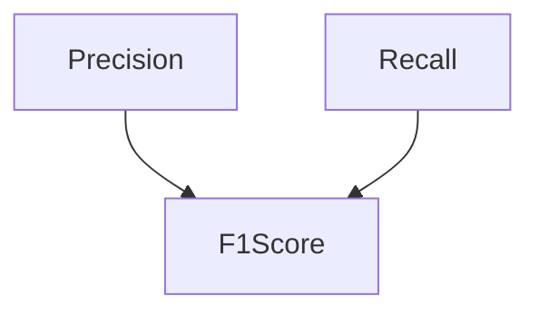

# F1Score在目标检测任务中的应用

关键词：目标检测、F1Score、评估指标、精确率、召回率、mAP

## 1. 背景介绍
### 1.1  问题的由来
目标检测是计算机视觉领域的一个核心任务，旨在从图像或视频中检测出感兴趣的目标对象，并给出其位置和类别。随着深度学习的发展，目标检测技术取得了长足进步，在安防监控、无人驾驶、医学影像等诸多领域得到广泛应用。然而，如何客观评估目标检测算法的性能一直是一个亟待解决的问题。

### 1.2  研究现状
目前，目标检测算法的评估主要采用精确率(Precision)、召回率(Recall)、mAP(mean Average Precision)等指标。其中，精确率和召回率分别衡量了检测结果的准确性和完整性，但无法权衡两者之间的平衡。mAP综合考虑了精确率和召回率，被广泛用于各种目标检测竞赛中，如PASCAL VOC、COCO等。然而，mAP的计算过程相对复杂，对置信度阈值敏感，且难以直观理解。

### 1.3  研究意义
F1Score作为一种经典的模型评估指标，在信息检索、自然语言处理等领域得到广泛应用。它是精确率和召回率的调和平均数，能够平衡两者，给出更加综合客观的评价。将F1Score引入目标检测任务，有助于简化模型评估流程，直观反映算法性能，便于横向比较不同算法。这对于推动目标检测技术的发展具有重要意义。

### 1.4  本文结构
本文将重点介绍F1Score在目标检测任务中的应用。第2部分阐述F1Score的核心概念以及与其他评估指标的联系。第3部分详细讲解F1Score的计算原理和操作步骤。第4部分建立F1Score的数学模型，并结合实例演示其计算过程。第5部分给出F1Score的代码实现，并解析其内部原理。第6部分探讨F1Score在实际目标检测系统中的应用场景。第7部分推荐相关的工具和学习资源。第8部分总结全文，并展望F1Score的未来发展方向。

## 2. 核心概念与联系
F1Score是一种衡量二分类模型性能的指标，定义为精确率和召回率的调和平均数：

$F1=2\cdot\frac{precision \cdot recall}{precision+recall}$

其中，精确率(Precision)表示预测为正例的样本中真正例的比例，召回率(Recall)表示真实为正例的样本中被预测为正例的比例。

精确率和召回率的计算公式如下：

$Precision=\frac{TP}{TP+FP}$

$Recall=\frac{TP}{TP+FN}$

其中，TP(True Positive)表示将正样本预测为正样本的数量，FP(False Positive)表示将负样本预测为正样本的数量，FN(False Negative)表示将正样本预测为负样本的数量。

F1Score与精确率、召回率的关系可以用下图表示：

可以看出，F1Score在精确率和召回率之间取得了一个平衡。当精确率和召回率都很高时，F1Score也会很高；反之，如果精确率和召回率有一个很低，F1Score也会降低。

F1Score与另一个常用的目标检测评估指标mAP也有密切联系。mAP衡量的是在不同召回率水平下的平均精确率，需要绘制Precision-Recall曲线，计算曲线下的面积。而F1Score可以看作是mAP的一个特例，只关注召回率和精确率相等时的情况。因此，F1Score的计算更加简单直观，但评估的角度没有mAP全面。

## 3. 核心算法原理 & 具体操作步骤
### 3.1  算法原理概述
在目标检测任务中，F1Score的计算需要将检测结果与真实标注进行匹配，判断每个预测框是否为真正例。传统的IoU(Intersection over Union)匹配策略，计算预测框与真实框的交并比，设定一个阈值(如0.5)，超过阈值则认为是匹配的。

在得到匹配结果后，对每一个类别，统计TP、FP、FN的数量，代入公式计算F1Score。将所有类别的F1Score求平均，即可得到整个数据集上的F1Score。

### 3.2  算法步骤详解
1. 对每张图像，获取其预测框和真实框的位置和类别信息。
2. 对每个类别，遍历所有预测框：
   - 计算预测框与所有真实框的IoU值。
   - 选择IoU最大的真实框，若大于阈值(如0.5)，则视为TP，否则视为FP。
   - 将匹配过的真实框从列表中移除。
3. 对每个类别，遍历剩余的真实框，每个都视为FN。
4. 对每个类别，根据TP、FP、FN，计算F1Score。
5. 对所有类别的F1Score求平均，得到最终的F1Score。

### 3.3  算法优缺点
优点：
- 计算简单，易于实现和理解。
- 综合考虑了精确率和召回率，能够平衡两者。
- 对置信度阈值不敏感，适合比较不同算法。

缺点：
- 没有考虑预测框的置信度，无法评估置信度的准确性。
- 对每个类别的重要性一视同仁，难以突出重点类别。
- 对检测框的位置准确性评估不足，只考虑是否匹配。

### 3.4  算法应用领域
F1Score作为一种通用的模型评估指标，可以用于各种二分类问题。在目标检测领域，可以用F1Score评估一阶段和两阶段检测器，比较不同检测算法的性能。例如，可以用F1Score比较Faster R-CNN、SSD、YOLO等算法在特定数据集上的表现。

除了目标检测，F1Score还可以用于以下计算机视觉任务：
- 图像分类：将分类问题看作每个类别的二分类问题，计算F1Score。
- 语义分割：将每个像素的分类看作二分类问题，计算F1Score。
- 实例分割：将每个实例的分割看作二分类问题，计算F1Score。

## 4. 数学模型和公式 & 详细讲解 & 举例说明
### 4.1  数学模型构建
设真实框的集合为$G=\{G_1,G_2,...,G_m\}$，预测框的集合为$D=\{D_1,D_2,...,D_n\}$。

定义匹配函数$M(G_i,D_j)$表示真实框$G_i$和预测框$D_j$是否匹配：

$$
M(G_i,D_j)=\begin{cases}
1, & IoU(G_i,D_j) \geq \theta \\
0, & IoU(G_i,D_j) < \theta
\end{cases}
$$

其中，$IoU(G_i,D_j)$表示真实框$G_i$和预测框$D_j$的交并比，$\theta$为设定的匹配阈值。

对于类别$c$，定义$TP_c$、$FP_c$、$FN_c$如下：

$$
TP_c=\sum_{i=1}^{m}\sum_{j=1}^{n}M(G_i,D_j)\cdot \mathbb{I}(G_i=c)\cdot \mathbb{I}(D_j=c)
$$

$$
FP_c=\sum_{j=1}^{n}\mathbb{I}(D_j=c)\cdot(1-\sum_{i=1}^{m}M(G_i,D_j)\cdot\mathbb{I}(G_i=c))
$$

$$
FN_c=\sum_{i=1}^{m}\mathbb{I}(G_i=c)\cdot(1-\sum_{j=1}^{n}M(G_i,D_j)\cdot\mathbb{I}(D_j=c))
$$

其中，$\mathbb{I}$为指示函数，当条件满足时取1，否则取0。

类别$c$的F1Score定义为：

$$
F1_c=2\cdot\frac{Precision_c \cdot Recall_c}{Precision_c+Recall_c}
$$

$$
Precision_c=\frac{TP_c}{TP_c+FP_c}
$$

$$
Recall_c=\frac{TP_c}{TP_c+FN_c}
$$

最终的F1Score为所有类别的平均：

$$
F1=\frac{1}{C}\sum_{c=1}^{C}F1_c
$$

其中，$C$为类别总数。

### 4.2  公式推导过程
F1Score的推导过程如下：

首先，由精确率和召回率的定义可得：

$$
Precision_c=\frac{TP_c}{TP_c+FP_c}
$$

$$
Recall_c=\frac{TP_c}{TP_c+FN_c}
$$

将二者代入F1Score的定义式：

$$
\begin{aligned}
F1_c & = 2\cdot\frac{Precision_c \cdot Recall_c}{Precision_c+Recall_c} \\
& = 2\cdot\frac{\frac{TP_c}{TP_c+FP_c} \cdot \frac{TP_c}{TP_c+FN_c}}{\frac{TP_c}{TP_c+FP_c}+\frac{TP_c}{TP_c+FN_c}} \\
& = 2\cdot\frac{TP_c^2}{(TP_c+FP_c)(TP_c+FN_c)} \cdot \frac{(TP_c+FP_c)(TP_c+FN_c)}{TP_c(TP_c+FP_c+FN_c)} \\
& = \frac{2TP_c}{2TP_c+FP_c+FN_c}
\end{aligned}
$$

将所有类别的F1Score求平均，即得到最终的F1Score：

$$
F1=\frac{1}{C}\sum_{c=1}^{C}F1_c=\frac{1}{C}\sum_{c=1}^{C}\frac{2TP_c}{2TP_c+FP_c+FN_c}
$$

### 4.3  案例分析与讲解
下面以一个简单的二分类问题为例，演示F1Score的计算过程。

假设有5个样本，其真实标签和预测标签如下：

| 样本 | 真实标签 | 预测标签 |
|:---:|:-------:|:-------:|
|  1  |    1    |    1    |
|  2  |    0    |    1    |
|  3  |    1    |    0    |
|  4  |    0    |    0    |
|  5  |    1    |    1    |

对于正类(标签为1)，可以统计出：
- TP = 2 (样本1和样本5)
- FP = 1 (样本2)
- FN = 1 (样本3)

代入公式计算正类的F1Score：

$$
Precision=\frac{TP}{TP+FP}=\frac{2}{2+1}=0.67
$$

$$
Recall=\frac{TP}{TP+FN}=\frac{2}{2+1}=0.67
$$

$$
F1=2\cdot\frac{Precision \cdot Recall}{Precision+Recall}=2\cdot\frac{0.67 \cdot 0.67}{0.67+0.67}=0.67
$$

同理可计算出负类(标签为0)的F1Score为0.8。

最终的F1Score为正类和负类的平均：

$$
F1=\frac{1}{2}(0.67+0.8)=0.735
$$

### 4.4  常见问题解答
1. F1Score适用于哪些场景？
   
   F1Score适用于二分类问题，特别是正负样本分布不均衡的情况。在目标检测中，可以用F1Score评估算法在每个类别上的性能，然后取平均得到整体性能。

2. F1Score与Accuracy有何区别？
   
   Accuracy衡量的是整体的分类准确率，但在正负样本分布不均衡时，会受到多数类的影响，无法反映模型在少数类上的性能。而F1Score对正负样本的重视程度相同，能够更加全面地评估模型性能。

3. 为什么F1Score被定义为精确率和召回率的调和平均数？
   
   调和平均数的特点是，当两个数值差距较大时，调和平均数会更接近较小的那个数。因此，只有当精确率和召回率都很高时，F1Score才会高。这符合我们对模型性能