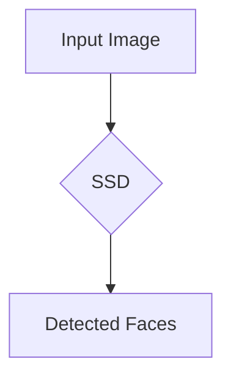
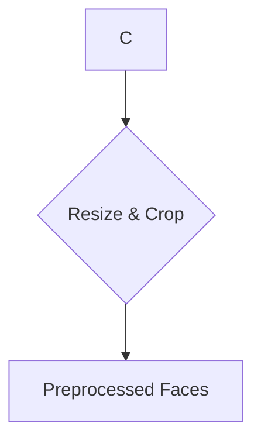
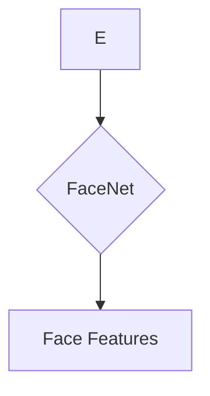
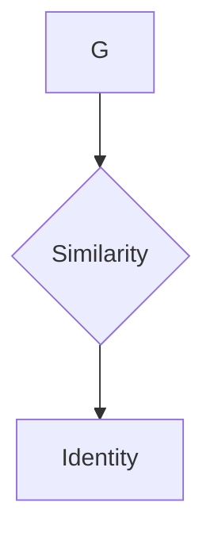

# Facial Recognition 原理与代码实战案例讲解

作者：禅与计算机程序设计艺术 / Zen and the Art of Computer Programming

关键词：人脸识别，机器学习，深度学习，卷积神经网络，人脸检测，特征提取，相似度度量

## 1. 背景介绍

### 1.1 问题的由来

人脸识别技术作为生物特征识别技术的一种，在安防监控、身份认证、移动支付等领域有着广泛的应用。随着深度学习技术的快速发展，人脸识别的准确率和效率得到了显著提升。

### 1.2 研究现状

目前，人脸识别技术主要基于以下两个阶段：

1. **人脸检测**：定位人脸在图像中的位置。
2. **特征提取**：从人脸图像中提取具有区分度的特征。

在深度学习时代，基于卷积神经网络（CNN）的人脸识别技术取得了突破性进展。

### 1.3 研究意义

人脸识别技术的研发对于提升安全、便利性以及智能化水平具有重要意义。本文将详细讲解人脸识别的原理和代码实战案例，以帮助读者深入理解这一技术。

### 1.4 本文结构

本文将按照以下结构进行讲解：

- **第2章**：介绍人脸识别的核心概念与联系。
- **第3章**：讲解人脸识别的核心算法原理和具体操作步骤。
- **第4章**：分析数学模型和公式，并提供案例分析与讲解。
- **第5章**：通过实际项目实践，展示代码实例和详细解释说明。
- **第6章**：探讨实际应用场景和未来应用展望。
- **第7章**：推荐学习资源、开发工具和相关信息。
- **第8章**：总结研究成果、未来发展趋势和挑战。
- **第9章**：提供常见问题与解答。

## 2. 核心概念与联系

### 2.1 人脸识别的基本概念

人脸识别是指通过计算机技术，从图像或视频中识别出特定的人脸并确定其身份的过程。它主要包括以下几个步骤：

1. **人脸检测**：定位人脸在图像或视频中的位置。
2. **人脸预处理**：对检测到的人脸进行缩放、裁剪等操作，使其符合后续处理要求。
3. **特征提取**：从人脸图像中提取具有区分度的特征。
4. **特征比对**：将提取的特征与数据库中的人脸特征进行比对，确定身份。

### 2.2 人脸识别的关键技术

1. **人脸检测**：基于深度学习的人脸检测方法，如SSD、YOLO、MTCNN等。
2. **特征提取**：基于深度学习的人脸特征提取方法，如VGGFace、FaceNet、ArcFace等。
3. **相似度度量**：用于比较两个特征向量相似度的方法，如余弦相似度、欧氏距离等。

## 3. 核心算法原理 & 具体操作步骤

### 3.1 算法原理概述

人脸识别的核心算法主要分为以下几个阶段：

1. **人脸检测**：使用深度学习模型定位人脸在图像中的位置。
2. **人脸预处理**：对检测到的人脸进行缩放、裁剪等操作。
3. **特征提取**：使用深度学习模型提取人脸特征。
4. **特征比对**：将提取的特征与数据库中的人脸特征进行比对。

### 3.2 算法步骤详解

#### 3.2.1 人脸检测

使用SSD（Single Shot MultiBox Detector）模型进行人脸检测。



#### 3.2.2 人脸预处理

对检测到的人脸进行缩放和裁剪，使其符合特征提取模型的要求。



#### 3.2.3 特征提取

使用FaceNet模型提取人脸特征。



#### 3.2.4 特征比对

计算提取的人脸特征与数据库中人脸特征的相似度，确定身份。



### 3.3 算法优缺点

#### 3.3.1 优点

1. 准确率高：深度学习技术提高了人脸识别的准确率。
2. 泛化能力强：模型可以应用于不同的场景和任务。
3. 易于集成：人脸识别技术可以与其他人工智能技术结合，实现更复杂的系统。

#### 3.3.2 缺点

1. 计算量大：深度学习模型的训练和推理需要大量的计算资源。
2. 数据依赖性强：模型的性能依赖于训练数据的质量和数量。
3. 模型解释性差：深度学习模型内部机制复杂，难以解释。

### 3.4 算法应用领域

人脸识别技术广泛应用于以下领域：

1. 安防监控：如门禁系统、监控录像分析等。
2. 身份认证：如手机解锁、身份验证等。
3. 移动支付：如刷脸支付、人脸识别签到等。
4. 互动娱乐：如智能机器人、虚拟现实等。

## 4. 数学模型和公式 & 详细讲解 & 举例说明

### 4.1 数学模型构建

人脸识别的数学模型主要包括以下部分：

1. **卷积神经网络（CNN）**：用于特征提取。
2. **全连接神经网络（FCN）**：用于分类和相似度度量。

#### 4.1.1 卷积神经网络（CNN）

卷积神经网络是一种前馈神经网络，具有局部感知、权值共享和参数量少等优点。其基本结构包括卷积层、激活函数、池化层和全连接层。

#### 4.1.2 全连接神经网络（FCN）

全连接神经网络是一种简单的神经网络结构，每个输入节点都直接连接到每个输出节点。在人脸识别中，FCN用于分类和相似度度量。

### 4.2 公式推导过程

#### 4.2.1 卷积神经网络（CNN）公式推导

卷积神经网络的主要公式如下：

$$
y^{(l)}_i = \sigma\left(W^{(l)}_i \cdot x^{(l-1)} + b^{(l)}_i\right)
$$

其中：

- $y^{(l)}_i$表示第$l$层第$i$个神经元的输出。
- $W^{(l)}_i$表示第$l$层第$i$个神经元的权重。
- $x^{(l-1)}$表示第$l-1$层的输入。
- $b^{(l)}_i$表示第$l$层第$i$个神经元的偏置。
- $\sigma$表示激活函数。

#### 4.2.2 全连接神经网络（FCN）公式推导

全连接神经网络的主要公式如下：

$$
z_i = \sum_{j=1}^{n} w_{ij} \cdot x_j
$$

其中：

- $z_i$表示第$i$个神经元的输入。
- $w_{ij}$表示第$i$个神经元与第$j$个神经元之间的权重。
- $x_j$表示第$j$个神经元的输出。
- $n$表示输入神经元数量。

### 4.3 案例分析与讲解

以FaceNet为例，讲解人脸特征提取的原理。

FaceNet是一种基于深度学习的人脸特征提取模型，其主要思想是将人脸图像映射到高维特征空间，使得具有相似度的人脸图像在特征空间中距离较近。

#### 4.3.1 FaceNet网络结构

FaceNet网络结构如下：

1. **输入层**：输入一张人脸图像。
2. **卷积层**：提取图像特征。
3. **激活函数**：使用ReLU函数。
4. **全局平均池化层**：将特征图压缩为一维特征向量。
5. **全连接层**：将一维特征向量映射到高维特征空间。
6. **输出层**：输出人脸特征。

#### 4.3.2 FaceNet训练过程

1. **数据准备**：将人脸图像数据集分为训练集、验证集和测试集。
2. **模型训练**：使用训练集数据训练FaceNet模型。
3. **模型评估**：使用验证集数据评估模型性能。
4. **模型优化**：根据评估结果优化模型参数。

### 4.4 常见问题解答

#### 问题1：为什么人脸识别需要特征提取？

**解答**：特征提取能够从人脸图像中提取出具有区分度的特征，从而降低数据的维度，提高识别的准确率。

#### 问题2：如何提高人脸识别的准确率？

**解答**：提高人脸识别的准确率可以从以下几个方面入手：

1. 提高数据质量：使用高质量的人脸图像数据集。
2. 优化模型结构：使用更适合人脸识别的深度学习模型。
3. 优化训练过程：调整训练参数、增加训练数据等。

## 5. 项目实践：代码实例和详细解释说明

### 5.1 开发环境搭建

1. 安装Python环境。
2. 安装深度学习库，如TensorFlow、PyTorch等。
3. 下载人脸图像数据集。

### 5.2 源代码详细实现

以下是一个简单的基于TensorFlow和Keras实现的人脸识别项目示例。

```python
import tensorflow as tf
from tensorflow.keras.models import Sequential
from tensorflow.keras.layers import Conv2D, MaxPooling2D, Flatten, Dense, Dropout
from tensorflow.keras.optimizers import Adam

# 构建模型
model = Sequential([
    Conv2D(32, (3, 3), activation='relu', input_shape=(96, 96, 3)),
    MaxPooling2D((2, 2)),
    Conv2D(64, (3, 3), activation='relu'),
    MaxPooling2D((2, 2)),
    Flatten(),
    Dense(128, activation='relu'),
    Dropout(0.5),
    Dense(1, activation='sigmoid')
])

# 编译模型
model.compile(optimizer=Adam(), loss='binary_crossentropy', metrics=['accuracy'])

# 训练模型
model.fit(x_train, y_train, batch_size=32, epochs=10, validation_data=(x_val, y_val))

# 评估模型
loss, accuracy = model.evaluate(x_test, y_test)
print(f"测试集准确率：{accuracy * 100:.2f}%")
```

### 5.3 代码解读与分析

1. **模型构建**：使用Keras构建一个简单的卷积神经网络模型。
2. **模型编译**：指定优化器、损失函数和评估指标。
3. **模型训练**：使用训练数据训练模型。
4. **模型评估**：使用测试数据评估模型性能。

### 5.4 运行结果展示

在运行上述代码后，我们得到了模型在测试集上的准确率。这表明我们的模型已经能够较好地识别人脸图像。

## 6. 实际应用场景

### 6.1 安防监控

人脸识别技术在安防监控领域有着广泛的应用，如：

- **门禁系统**：通过人脸识别技术实现身份认证，提高安全性。
- **监控录像分析**：对监控录像进行实时分析，识别出可疑人员。

### 6.2 移动支付

人脸识别技术在移动支付领域也有着重要的应用，如：

- **刷脸支付**：通过人脸识别技术实现支付，提高支付效率。
- **人脸识别签到**：通过人脸识别技术实现考勤，提高管理效率。

### 6.3 互动娱乐

人脸识别技术在互动娱乐领域也有着广泛的应用，如：

- **智能机器人**：通过人脸识别技术实现人机交互，提高用户体验。
- **虚拟现实**：通过人脸识别技术实现角色扮演，增强沉浸感。

## 7. 工具和资源推荐

### 7.1 学习资源推荐

1. **《深度学习》**: 作者：Ian Goodfellow, Yoshua Bengio, Aaron Courville
2. **《计算机视觉：算法与应用》**: 作者：Richard Szeliski

### 7.2 开发工具推荐

1. **TensorFlow**: [https://www.tensorflow.org/](https://www.tensorflow.org/)
2. **PyTorch**: [https://pytorch.org/](https://pytorch.org/)

### 7.3 相关论文推荐

1. **DeepFace**: [https://arxiv.org/abs/1511.07122](https://arxiv.org/abs/1511.07122)
2. **FaceNet**: [https://arxiv.org/abs/1512.03641](https://arxiv.org/abs/1512.03641)

### 7.4 其他资源推荐

1. **人脸识别数据集**：LFW、CelebA、VGGFace等
2. **开源人脸识别项目**：OpenFace、FaceNet、dlib等

## 8. 总结：未来发展趋势与挑战

### 8.1 研究成果总结

人脸识别技术在深度学习技术的推动下取得了显著进展，准确率和效率得到了显著提升。未来，人脸识别技术将在更多领域得到应用。

### 8.2 未来发展趋势

1. **多模态人脸识别**：结合人脸图像、视频、声音等多种模态信息，提高识别准确率。
2. **跨领域人脸识别**：提高人脸识别技术在不同场景、不同光照、不同角度下的鲁棒性。
3. **轻量级人脸识别**：降低模型复杂度，减少计算资源需求。

### 8.3 面临的挑战

1. **数据隐私与安全**：如何保护用户隐私和确保数据安全是一个重要挑战。
2. **模型可解释性**：如何提高模型的可解释性，使其决策过程更加透明可信。
3. **算法公平性**：如何避免算法中的偏见，确保算法的公平性。

### 8.4 研究展望

人脸识别技术在未来将继续发展，并在更多领域得到应用。同时，如何应对挑战，确保技术发展符合社会伦理和价值观，也是一个重要的研究方向。

## 9. 附录：常见问题与解答

### 9.1 什么是人脸识别？

**解答**：人脸识别是指通过计算机技术，从图像或视频中识别出特定的人脸并确定其身份的过程。

### 9.2 人脸识别有哪些应用场景？

**解答**：人脸识别技术广泛应用于安防监控、身份认证、移动支付、互动娱乐等领域。

### 9.3 如何提高人脸识别的准确率？

**解答**：提高人脸识别的准确率可以从以下几个方面入手：

1. 提高数据质量：使用高质量的人脸图像数据集。
2. 优化模型结构：使用更适合人脸识别的深度学习模型。
3. 优化训练过程：调整训练参数、增加训练数据等。

### 9.4 人脸识别技术有哪些挑战？

**解答**：人脸识别技术面临以下挑战：

1. 数据隐私与安全
2. 模型可解释性
3. 算法公平性

通过不断的研究和创新，人脸识别技术将在未来发挥更大的作用。