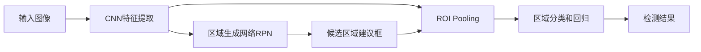

# Faster R-CNN原理与代码实例讲解

## 1. 背景介绍
### 1.1 问题的由来
目标检测是计算机视觉领域的一个核心问题,旨在从图像中定位和识别感兴趣的目标对象。传统的目标检测方法主要基于手工设计的特征和分类器,如HOG特征+SVM分类器。但这类方法存在特征表达能力有限、检测精度不高、难以处理复杂场景等问题。随着深度学习的发展,基于深度卷积神经网络(CNN)的目标检测方法逐渐成为主流。其中,两阶段检测器代表作是R-CNN系列,包括R-CNN、Fast R-CNN和Faster R-CNN。

### 1.2 研究现状 
自2014年R-CNN提出以来,两阶段检测器不断发展,在精度和速度上取得了显著进步。Fast R-CNN通过ROI Pooling实现特征共享,大幅提升了检测速度。Faster R-CNN进一步引入区域生成网络(RPN),实现了端到端训练和近实时检测。此后,许多改进工作不断涌现,如FPN引入特征金字塔结构,Mask R-CNN扩展到实例分割任务。总的来说,两阶段检测器在精度上一直保持领先,是工业界应用的首选。同时,单阶段检测器如YOLO、SSD等以速度见长,在实时场景有独特优势。

### 1.3 研究意义
Faster R-CNN是两阶段检测器的里程碑式工作,奠定了现代目标检测的基本范式。深入理解其原理和实现细节,对于掌握目标检测的核心思想和关键技术至关重要。通过学习Faster R-CNN,我们可以系统地了解两阶段检测器的设计思路、网络结构、训练方法等,并在此基础上展开进一步的研究和应用。此外,相关代码实践有助于加深原理的理解,并积累动手实现的经验。Faster R-CNN已被广泛应用于自动驾驶、智慧安防、医学影像等领域,研究其应用场景和改进方向具有重要的理论和实践意义。

### 1.4 本文结构
本文将全面介绍Faster R-CNN的原理和代码实例。第2部分介绍Faster R-CNN的核心概念和整体架构。第3部分重点讲解其核心算法,包括区域生成网络(RPN)和ROI Pooling。第4部分给出Faster R-CNN的数学模型和公式推导。第5部分通过代码实例详细说明Faster R-CNN的实现细节。第6部分讨论其实际应用场景。第7部分推荐相关学习资源。第8部分总结全文,展望未来发展方向。第9部分列出常见问题解答。

## 2. 核心概念与联系
Faster R-CNN的核心概念包括:
- 卷积神经网络(CNN):用于提取图像特征。Faster R-CNN采用VGG16或ResNet等经典CNN作为骨干网络。
- 区域生成网络(RPN):在CNN特征图上生成候选区域(建议框)。RPN是Faster R-CNN的核心创新,实现了端到端训练。
- 感兴趣区域池化(ROI Pooling):将候选区域对应的CNN特征汇集到固定尺寸,便于后续检测和分类。
- 区域检测和分类:对ROI Pooling后的特征进行类别预测和边界框回归,得到最终检测结果。

下图展示了Faster R-CNN的整体架构和各部分的联系:

可以看出,Faster R-CNN采用端到端的两阶段检测架构。首先,骨干CNN提取整图特征;然后RPN生成候选区域;接着ROI Pooling对这些区域的特征进行汇集;最后通过全连接层实现区域分类和边界框回归,输出检测结果。这种设计有效平衡了精度和速度,是两阶段检测器的代表。

## 3. 核心算法原理 & 具体操作步骤
### 3.1 算法原理概述
Faster R-CNN的核心是区域生成网络(RPN)和ROI Pooling。RPN在CNN特征图上以滑动窗口的方式densely生成候选区域。对于每个滑动窗口位置,RPN设置了不同尺度和长宽比的锚框(anchor),并对每个锚框进行二分类(是否为前景)和边界框回归,从而生成候选区域建议框。ROI Pooling则将这些不同尺寸的建议框对应的CNN特征汇集到固定尺寸(如7x7),便于后续检测和分类网络处理。最后,检测和分类网络对每个候选区域进行多类别分类和边界框微调,得到最终检测结果。

### 3.2 算法步骤详解
1. CNN特征提取:输入图像经过预训练的CNN(如VGG16),提取得到特征图(如conv5_3层输出)。
2. 区域生成网络RPN:
   - 在conv5_3特征图上以3x3卷积核进行滑动窗口,每个滑动窗口位置设置k个锚框(如k=9,3个尺度 x 3个长宽比)。
   - 对每个锚框,RPN连接两个全连接层:分类层cls和回归层reg。
   - cls层输出2k个得分,表示每个锚框为前景/背景的概率。
   - reg层输出4k个坐标,表示每个锚框的中心坐标和宽高的修正量。
   - 根据cls和reg层输出,选取前景概率较高的N个锚框作为候选区域建议框。
3. ROI Pooling:
   - 根据RPN生成的候选区域坐标,在conv5_3特征图上进行感兴趣区域池化。
   - ROI Pooling将每个候选区域划分为固定数目的子区域(如7x7),并对每个子区域进行最大池化,输出固定尺寸的特征(如7x7x512)。
4. 区域分类和回归:
   - ROI Pooling后的特征通过两个全连接层(每层4096维),分别进行多类别分类和边界框回归。
   - 分类层输出C+1个类别概率(C为前景类别数,1为背景)。回归层输出4C个坐标修正量(每个类别4个)。
   - 根据分类概率和回归坐标对候选区域进行过滤和微调,得到最终检测框及其类别。
5. 训练过程:
   - 预训练骨干CNN网络,并固定其参数。
   - 端到端训练RPN和检测网络,采用分阶段的4步交替训练。
   - RPN阶段:按照IoU阈值(如0.7)划分锚框的正负样本,并进行二分类和边界框回归。
   - 检测阶段:根据RPN proposals和真值框的IoU划分正负样本,并进行多分类和边界框回归。
   - 两个阶段分别采用二分类和多分类的交叉熵损失,以及边界框的Smooth L1损失。

### 3.3 算法优缺点
Faster R-CNN的主要优点包括:
- 采用RPN实现了候选区域提取的端到端学习,避免了传统方法的冗余计算。
- 引入锚框机制,可以覆盖不同尺度和长宽比的目标。
- ROI Pooling实现了特征共享,大幅提升了检测速度。
- 整体采用端到端的两阶段检测架构,在精度和速度上取得了很好的平衡。

同时,Faster R-CNN也存在一些局限:
- 两阶段设计使得检测速度仍然难以满足实时要求。
- RPN生成的候选区域质量有待提高,尤其是小目标和密集目标的漏检问题。
- 对尺度变化较大的目标检测效果不够理想,需要引入多尺度特征融合等改进。

### 3.4 算法应用领域
Faster R-CNN是一个通用的目标检测算法,可以应用于多种场景,如:
- 自动驾驶:检测车辆、行人、交通标志等。
- 智慧安防:检测可疑人员、违禁物品等。
- 医学影像:检测病灶、器官等。
- 工业视觉:检测缺陷、零件等。
- 遥感图像:检测舰船、飞机、建筑等。

在这些领域,Faster R-CNN可以作为基础检测器,并结合具体任务进行适当改进,如增加上下文信息、引入域自适应等。

## 4. 数学模型和公式 & 详细讲解 & 举例说明
### 4.1 数学模型构建
Faster R-CNN的数学模型主要包括RPN和检测网络两部分。

对于RPN,其目标是学习一个函数 $f_{\theta}(X, A)$,将图像特征 $X$ 和锚框集合 $A$ 映射为候选区域集合 $R$。形式化地,RPN可以表示为:

$$
R = f_{\theta}(X, A) = \{(p_i, t_i) | i=1,2,...,N\}
$$

其中, $p_i$ 表示第 $i$ 个候选区域为前景的概率, $t_i$ 表示其边界框坐标的修正量。 $N$ 为候选区域总数。 $\theta$ 为RPN的参数。

对于检测网络,其目标是学习一个函数 $g_{\phi}(X, R)$,将图像特征 $X$ 和候选区域集合 $R$ 映射为最终检测结果 $D$。形式化地,检测网络可以表示为:

$$
D = g_{\phi}(X, R) = \{(c_i, b_i) | i=1,2,...,M\}  
$$

其中, $c_i$ 表示第 $i$ 个检测结果的类别, $b_i$ 表示其边界框坐标。 $M$ 为最终检测结果数。 $\phi$ 为检测网络的参数。

### 4.2 公式推导过程
以RPN为例,详细推导其训练目标和损失函数。

RPN的训练样本为 $(X, A, Y)$,其中 $Y=\{(y_i, v_i) | i=1,2,...,N\}$ 为锚框的真值标签。 $y_i \in \{0,1\}$ 表示锚框 $i$ 是否为前景, $v_i \in \mathbb{R}^4$ 表示锚框 $i$ 与其对应真值框的坐标差。

RPN的训练目标是最小化以下多任务损失:

$$
L(\theta) = \frac{1}{N_{cls}} \sum_{i} L_{cls}(p_i, y_i) + \lambda \frac{1}{N_{reg}} \sum_{i} y_i L_{reg}(t_i, v_i)
$$

其中, $L_{cls}$ 为二分类的交叉熵损失:

$$
L_{cls}(p_i, y_i) = -y_i \log p_i - (1-y_i) \log (1-p_i)
$$

$L_{reg}$ 为边界框回归的Smooth L1损失:

$$
L_{reg}(t_i, v_i) = \sum_{j \in \{x,y,w,h\}} \text{Smooth}_{L1}(t_i^j - v_i^j)
$$

$$
\text{Smooth}_{L1}(x) = \begin{cases} 
0.5x^2 & \text{if } |x| < 1 \\
|x| - 0.5 & \text{otherwise}
\end{cases}
$$

$N_{cls}$ 和 $N_{reg}$ 分别为分类和回归任务的归一化因子,通常设为mini-batch中的锚框总数。 $\lambda$ 为平衡两个任务损失的超参数,默认为1。

对于检测网络,其损失函数与RPN类似,主要区别在于采用多类别交叉熵损失,以及根据类别进行边界框回归。限于篇幅,此处不再赘述。

### 4.3 案例分析与讲解
下面以一个具体例子来说明Faster R-CNN的检测过程。

假设输入图像尺寸为800x600,骨干网络为VGG16,RPN的滑动窗口步长为16,每个位置设置9个锚框(3个尺度x3个长宽比)。

首先,图像经过VGG16的conv5_3层,得到50x38x512的特征图。

然后,RPN在特征图上以3x3卷积核进行滑动窗口,共有50x38个滑动