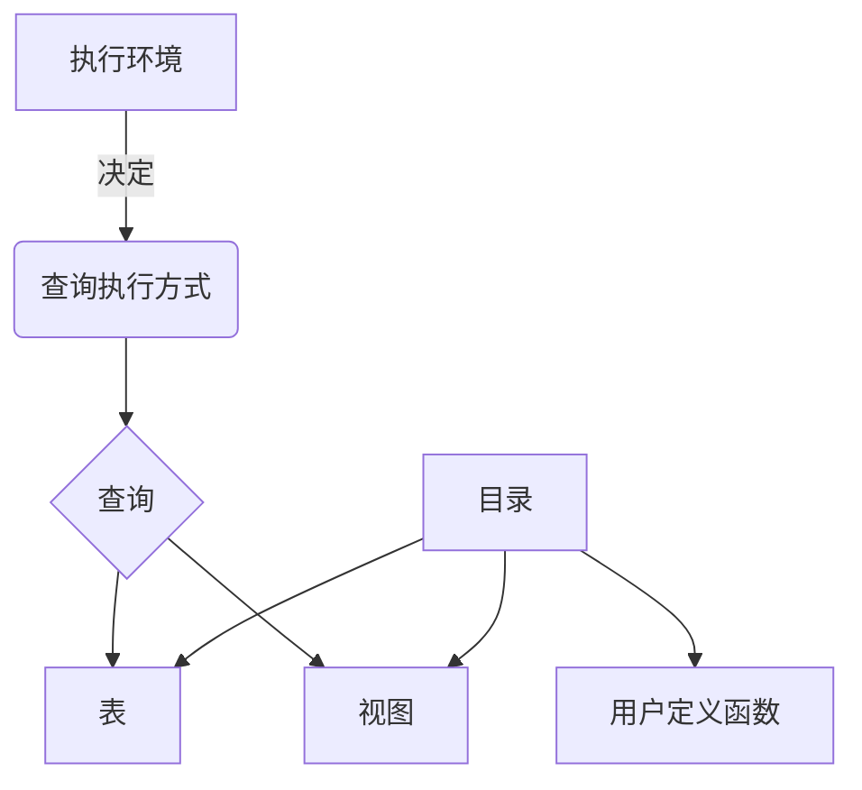

# Flink Table API和SQL原理与代码实例讲解

## 1. 背景介绍

### 1.1 问题的由来

在当今大数据时代，实时数据处理和分析变得越来越重要。传统的批处理系统无法满足对实时性的需求,而流式处理系统能够及时响应数据流并进行低延迟的计算。Apache Flink作为一个开源的分布式流处理框架,凭借其高吞吐量、低延迟和准确一次语义等优势,在业界获得了广泛的应用。

然而,直接使用Flink的DataStream API进行流处理存在一些挑战。首先,DataStream API需要使用Java或Scala等编程语言,这对于数据分析师和业务人员来说存在一定的学习门槛。其次,DataStream API更侧重于流处理的底层实现,缺乏对复杂分析逻辑的高级抽象,导致代码可读性和可维护性较差。

### 1.2 研究现状

为了解决上述问题,Flink引入了Table API和SQL接口,提供了一种声明式的编程范式。Table API提供了一套类似于关系数据库的查询语言,使得开发人员可以使用熟悉的SQL语法来进行流式数据处理和分析。SQL接口则允许直接在Flink中执行SQL查询,无需编写任何代码。

Table API和SQL接口建立在Apache Calcite项目之上,Calcite是一个强大的查询优化器和SQL解析器。它能够将SQL查询转换为逻辑执行计划,并进行一系列优化,最终生成高效的物理执行计划。Flink利用Calcite的能力,实现了对SQL的解析、优化和执行。

### 1.3 研究意义

深入理解Flink Table API和SQL的原理对于高效利用这一强大功能至关重要。本文将从以下几个方面进行详细阐述:

1. **核心概念**: 介绍Table API和SQL接口的核心概念,如表(Table)、视图(View)、查询(Query)等,以及它们之间的关系。

2. **算法原理**: 解释Table API和SQL接口背后的算法原理,包括查询优化、执行计划生成等过程。

3. **数学模型**: 阐述查询优化中使用的代数模型,如关系代数和代价模型,并给出相关公式推导。

4. **代码实例**: 通过具体的代码示例,展示如何使用Table API和SQL接口进行流式数据处理和分析。

5. **应用场景**: 介绍Table API和SQL接口在实际应用中的使用案例,如实时报表、数据监控等。

6. **工具和资源**: 推荐相关的学习资源、开发工具和论文,方便读者进一步深入研究。

通过本文的学习,读者将全面掌握Flink Table API和SQL接口的核心知识,提高流式数据处理和分析的能力。

### 1.4 本文结构  

本文共分为9个部分:

1. **背景介绍**: 阐述问题的由来、研究现状和意义,以及本文的结构安排。

2. **核心概念与联系**: 介绍Table API和SQL接口的核心概念,如表、视图、查询等,并解释它们之间的关系。

3. **核心算法原理与具体操作步骤**: 详细阐述Table API和SQL接口背后的算法原理,包括查询优化、执行计划生成等过程,并给出具体的操作步骤。

4. **数学模型和公式详细讲解与举例说明**: 介绍查询优化中使用的代数模型,如关系代数和代价模型,并推导相关公式,辅以案例分析。

5. **项目实践:代码实例和详细解释说明**: 提供具体的代码示例,展示如何使用Table API和SQL接口进行流式数据处理和分析,并对代码进行详细解释。

6. **实际应用场景**: 介绍Table API和SQL接口在实时报表、数据监控等实际应用场景中的使用案例。

7. **工具和资源推荐**: 推荐相关的学习资源、开发工具、论文等,方便读者进一步深入研究。

8. **总结:未来发展趋势与挑战**: 总结本文的研究成果,展望Table API和SQL接口的未来发展趋势,并分析面临的挑战。

9. **附录:常见问题与解答**: 列出使用Table API和SQL接口过程中的常见问题,并给出解答。

## 2. 核心概念与联系

在深入探讨Flink Table API和SQL的算法原理之前,我们需要先了解一些核心概念。Table API和SQL接口建立在关系数据模型之上,借鉴了关系数据库的许多概念,但也有自身的特殊之处。

### 2.1 表(Table)

表是Table API和SQL接口中最基本的概念。在Flink中,表可以来自静态数据源(如文件或数据库表)或动态数据源(如Kafka主题)。每个表都有一个关联的schema,定义了表中的字段名称、字段类型等元数据信息。

表可以被注册为临时视图,以便在SQL查询中引用。同时,表也可以作为DataStream或DataSet的视图,允许在Table API和DataStream/DataSet API之间无缝切换。

### 2.2 视图(View)

视图是一种虚拟表,它是基于其他表或视图通过SQL查询定义而来的。视图不存储实际数据,而是在查询执行时动态计算结果。视图可以简化复杂查询的编写,提高代码的可读性和可维护性。

### 2.3 查询(Query)

查询是Table API和SQL接口的核心功能。用户可以使用类SQL语法编写查询,对表或视图进行投影(SELECT)、过滤(WHERE/FILTER)、聚合(GROUP BY)、连接(JOIN)等操作。查询会被Flink的查询优化器优化,生成高效的执行计划。

### 2.4 执行环境(ExecutionEnvironment)

执行环境决定了查询的执行方式。Flink提供了流执行环境(StreamExecutionEnvironment)和批处理执行环境(BatchTableEnvironment)两种模式。流执行环境将查询应用于无界数据流,结果也是一个无界数据流;批处理执行环境则将查询应用于有界数据集,结果是一个有界数据集。

### 2.5 目录(Catalog)

目录用于维护Flink中的元数据,如表、视图、用户定义函数等。Flink支持多种目录实现,包括内存级别的GenericInMemoryCatalog、基于Hive Metastore的HiveCatalog等。用户可以根据需求选择合适的目录系统。

### 2.6 核心概念关系

上述核心概念之间存在着密切的关系,如下图所示:

执行环境决定了查询的执行方式(流式或批处理)。查询可以作用于表或视图,并可以使用目录中注册的用户定义函数。表和视图的元数据信息存储在目录中。

通过对核心概念及其关系的理解,我们为后续深入探讨Table API和SQL接口的算法原理打下了基础。

## 3. 核心算法原理与具体操作步骤

在上一节中,我们介绍了Table API和SQL接口的核心概念。本节将深入探讨其背后的算法原理,包括查询优化、执行计划生成等过程,并给出具体的操作步骤。

### 3.1 算法原理概述

Flink Table API和SQL接口的算法原理可以概括为以下几个主要步骤:

1. **SQL解析**: 将SQL查询解析为抽象语法树(Abstract Syntax Tree, AST)。

2. **逻辑查询计划生成**: 根据AST生成逻辑查询计划,表示查询的逻辑结构。

3. **逻辑查询优化**: 对逻辑查询计划进行一系列等价变换,以提高查询效率。

4. **优化器规则匹配**: 根据优化规则对逻辑查询计划进行模式匹配和替换。

5. **物理查询计划生成**: 将优化后的逻辑查询计划翻译为物理查询计划。

6. **代码生成**: 根据物理查询计划生成可执行代码,并提交到Flink集群执行。

下面我们将详细阐述每个步骤的算法原理和具体操作步骤。

### 3.2 算法步骤详解

#### 3.2.1 SQL解析

SQL解析是将SQL查询转换为抽象语法树(AST)的过程。Flink使用Apache Calcite作为SQL解析器和查询优化器。

具体操作步骤如下:

1. 使用Calcite的SQL Parser将SQL查询解析为AST。

2. 进行语法验证,检查SQL查询是否符合语法规则。

3. 进行语义验证,检查表、字段、函数等是否存在,类型是否匹配等。

4. 生成经过验证的AST。

#### 3.2.2 逻辑查询计划生成

逻辑查询计划是查询的逻辑表示,描述了查询的逻辑结构,但没有考虑具体的物理执行方式。

具体操作步骤如下:

1. 遍历AST,将每个节点转换为相应的逻辑计划节点(RelNode)。

2. 根据AST的结构,构建逻辑计划节点之间的父子关系。

3. 应用一些基本的逻辑优化规则,如投影剪裁、过滤器下推等。

4. 生成初始的逻辑查询计划。

#### 3.2.3 逻辑查询优化

逻辑查询优化是对逻辑查询计划进行等价变换,以提高查询效率的过程。主要包括以下优化策略:

1. **投影剪裁(Project Pruning)**: 移除不需要的投影字段。

2. **过滤器下推(Filter Pushdown)**: 将过滤条件下推到数据源,减少数据传输量。

3. **连接重排序(Join Reorder)**: 根据代价模型调整连接顺序,减少中间结果大小。

4. **子查询去关联(Decorrelation)**: 将相关子查询转换为非相关子查询,提高执行效率。

5. **常量折叠(Constant Folding)**: 预计算常量表达式,减少运行时开销。

6. **分区剪裁(Partition Pruning)**: 根据过滤条件剪裁不需要的数据分区。

具体操作步骤如下:

1. 定义优化规则集合,每个规则描述一种优化模式。

2. 遍历逻辑查询计划,寻找匹配优化规则的模式。

3. 对匹配的模式应用相应的优化规则,生成新的逻辑计划节点。

4. 更新逻辑查询计划,替换原有节点。

5. 重复步骤2-4,直到不再有优化规则可应用。

#### 3.2.4 优化器规则匹配

优化器规则匹配是逻辑查询优化的核心环节。它通过模式匹配和替换的方式,将优化规则应用于逻辑查询计划。

具体操作步骤如下:

1. 定义优化规则,每个规则包含模式(Pattern)和替换(Replacement)两部分。

2. 使用底层规则引擎(如Apache Calcite的VolcanoPlanner)进行规则匹配。

3. 对于每个逻辑计划节点,尝试匹配所有优化规则的模式。

4. 如果匹配成功,使用替换部分生成新的逻辑计划节点,替换原有节点。

5. 重复步骤3-4,直到不再有优化规则可应用。

#### 3.2.5 物理查询计划生成

物理查询计划描述了查询的具体执行方式,包括算子、数据分区、数据传输等细节。

具体操作步骤如下:

1. 遍历优化后的逻辑查询计划,将每个逻辑计划节点翻译为一个或多个物理计划节点(PhysicalRelNode)。

2. 根据数据属性(如分区键、排序键等)和代价模型,选择合适的物理算子实现。

3. 构建物理计划节点之间的数据传输边(Exchange)。

4. 应用一些物理优化规则,如数据重分区、算子链接等。

5. 生成最终的物理查询计划。

#### 3.2.6 代码生成与执行

最后一步是根据物理查询计划生成可执行代码,并提交到Flink集群执行