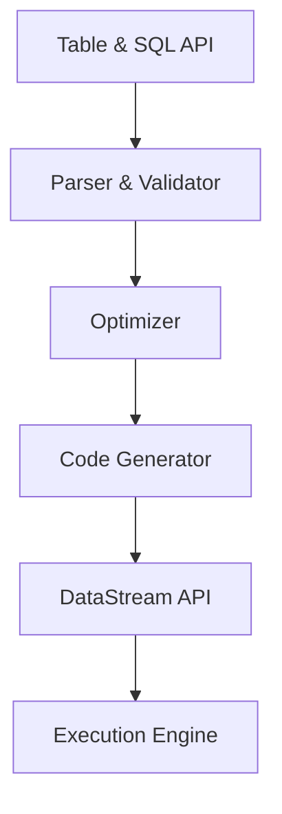

# FlinkTableAPI:数据仓库与数据挖掘

## 1. 背景介绍

### 1.1 问题的由来

在当今的数据时代，数据已经成为企业和组织的关键资产。随着数据量的快速增长和多样化,传统的数据处理方式已经无法满足现代业务需求。大数据技术的出现为解决这一挑战提供了新的途径。Apache Flink是一个开源的分布式大数据处理引擎,它提供了强大的流式和批量数据处理能力,可以实时处理海量数据。

Flink Table API 和 SQL 是 Flink 提供的用于处理结构化数据的关系型API,它们为开发人员提供了声明式的编程范式,使得开发人员可以更加专注于业务逻辑,而不必过多关注底层的实现细节。Flink Table API 和 SQL 支持对流式和批量数据进行统一的处理,并且提供了与传统数据库类似的查询语言,降低了开发人员的学习成本。

### 1.2 研究现状

目前,Flink Table API 和 SQL 已经被广泛应用于各种数据处理场景,如数据仓库、数据湖、实时数据分析等。许多知名公司和组织,如 Uber、Netflix、Alibaba 等,都在生产环境中使用 Flink 进行数据处理和分析。

然而,尽管 Flink Table API 和 SQL 提供了强大的功能,但它们也面临着一些挑战。例如,对于复杂的数据处理场景,开发人员需要编写复杂的 SQL 查询或 Table API 代码,这可能会增加开发和维护的难度。此外,对于一些特殊的数据处理需求,Flink Table API 和 SQL 可能无法提供足够的灵活性和扩展性。

### 1.3 研究意义

本文将深入探讨 Flink Table API 和 SQL 在数据仓库和数据挖掘领域的应用。通过介绍 Flink Table API 和 SQL 的核心概念、算法原理和数学模型,以及实际应用场景和代码实例,读者可以更好地理解和掌握这些技术。

此外,本文还将分享一些实用的工具和资源,以及未来发展趋势和挑战,为读者提供更全面的视角。无论是数据工程师、数据分析师还是其他相关从业人员,都可以从本文中获取有价值的见解和实践经验。

### 1.4 本文结构

本文将按照以下结构进行展开:

1. 背景介绍
2. 核心概念与联系
3. 核心算法原理与具体操作步骤
4. 数学模型和公式详细讲解与举例说明
5. 项目实践:代码实例和详细解释说明
6. 实际应用场景
7. 工具和资源推荐
8. 总结:未来发展趋势与挑战
9. 附录:常见问题与解答

## 2. 核心概念与联系

在深入探讨 Flink Table API 和 SQL 之前,我们需要先了解一些核心概念及其之间的关系。

### 2.1 Apache Flink

Apache Flink 是一个开源的分布式流式数据处理引擎,它支持有状态计算和高吞吐量的流式数据处理。Flink 的核心架构包括以下几个关键组件:

- **TaskManager**: 负责执行数据处理任务,包括数据流的接收、转换和发送。
- **JobManager**: 负责协调分布式执行,调度任务,协调检查点(checkpointing)等。
- **Checkpointing**: 用于实现容错和一致性,通过定期保存状态快照来实现故障恢复。
- **StateBackend**: 用于管理和维护应用程序的状态数据。
- **Time**: Flink 提供了事件时间(Event Time)和处理时间(Processing Time)两种时间概念,用于处理乱序数据和实现窗口操作。

Flink 支持多种编程模型,包括 DataStream API(用于流式数据处理)、DataSet API(用于批量数据处理)和 Table API & SQL(用于处理结构化数据)。本文将重点关注 Table API 和 SQL。

### 2.2 Flink Table API

Flink Table API 是一个用于处理结构化数据的关系型 API,它提供了一种声明式的编程范式。Table API 将数据表示为一个或多个关系表,并提供了一系列类似于关系数据库的操作,如投影(projection)、过滤(filter)、连接(join)、分组(group)、聚合(aggregate)等。

Table API 支持处理流式数据和批量数据,并且可以与 DataStream API 和 DataSet API 无缝集成。它还支持各种数据格式,如 CSV、JSON、Avro 等,以及多种存储系统,如 Kafka、HDFS、HBase 等。

### 2.3 Flink SQL

Flink SQL 是 Flink 提供的另一种处理结构化数据的方式。它基于类 SQL 语言,允许开发人员使用熟悉的 SQL 语法来查询和转换数据。Flink SQL 支持标准的 SQL 语法,包括 DDL(数据定义语言)、DML(数据操作语言)和 DQL(数据查询语言)。

与传统的关系数据库不同,Flink SQL 可以处理流式数据和批量数据,并且支持复杂的窗口操作和时间语义。此外,Flink SQL 还提供了一些扩展功能,如 MATCH_RECOGNIZE(用于模式匹配)和 OVER(用于窗口聚合)等。

### 2.4 Flink Table & SQL 内部架构

Flink Table & SQL 内部架构如下图所示:



1. **Table & SQL API**: 提供了 Table API 和 SQL 接口,允许开发人员使用声明式的方式编写数据处理逻辑。
2. **Parser & Validator**: 将 Table API 或 SQL 查询解析为抽象语法树(AST),并进行语法和语义验证。
3. **Optimizer**: 对抽象语法树进行优化,包括逻辑优化(如谓词下推、投影剪裁等)和物理优化(如连接重排序、代码生成等)。
4. **Code Generator**: 将优化后的逻辑计划转换为可执行的 DataStream 程序。
5. **DataStream API**: Flink 的底层流式处理引擎,用于执行 DataStream 程序。
6. **Execution Engine**: Flink 的分布式执行引擎,负责任务调度、资源管理和容错处理等。

通过这种架构,Flink Table & SQL 可以将声明式的查询或转换逻辑转换为高效的分布式执行计划,并利用 Flink 的流式处理引擎和执行引擎来实现高性能和高可用的数据处理。

## 3. 核心算法原理与具体操作步骤

在本节中,我们将探讨 Flink Table API 和 SQL 背后的核心算法原理,以及具体的操作步骤。

### 3.1 算法原理概述

Flink Table API 和 SQL 的核心算法原理包括以下几个方面:

1. **关系代数**: Flink Table API 和 SQL 基于关系代数,将数据表示为关系(表),并提供了一系列关系运算,如投影、选择、连接、聚合等。这些运算可以组合成复杂的查询或转换逻辑。

2. **查询优化**: Flink 的查询优化器会对输入的查询或转换逻辑进行一系列优化,包括逻辑优化(如谓词下推、投影剪裁等)和物理优化(如连接重排序、代码生成等),以提高查询执行的效率。

3. **增量计算**: Flink 采用了增量计算的策略,只对变更的数据进行计算,而不是对整个数据集重新计算。这种策略可以显著提高流式数据处理的性能。

4. **窗口操作**: Flink 支持各种窗口操作,如滚动窗口、滑动窗口、会话窗口等,用于对流式数据进行分组和聚合。窗口操作是实现流式数据处理的关键。

5. **时间语义**: Flink 提供了事件时间(Event Time)和处理时间(Processing Time)两种时间概念,用于处理乱序数据和实现窗口操作。正确处理时间语义对于保证数据处理的准确性和一致性至关重要。

6. **容错与一致性**: Flink 采用了检查点(Checkpointing)机制来实现容错和一致性。通过定期保存状态快照,Flink 可以在发生故障时从最近的一致性检查点恢复,保证数据处理的准确性和可靠性。

### 3.2 算法步骤详解

下面我们将详细介绍 Flink Table API 和 SQL 的具体操作步骤:

1. **定义数据源**

   首先,需要定义数据源,可以是流式数据源(如 Kafka、Socket 等)或批量数据源(如文件、数据库等)。Flink 支持多种数据格式,如 CSV、JSON、Avro 等。

   ```scala
   // 定义流式数据源
   val socketStream: DataStream[String] = env.socketTextStream("localhost", 9999)

   // 定义批量数据源
   val csvStream: DataStream[Person] = env.readTextFile("file:///path/to/persons.csv")
     .map(line => {...})
   ```

2. **注册数据源为表**

   使用 `StreamTableEnvironment` 或 `BatchTableEnvironment` 将数据源注册为表,并指定相应的Schema。

   ```scala
   import org.apache.flink.table.descriptors.{Csv, FileSystem, Schema}

   val csvTableSource = new CsvTableSource(
     "/path/to/persons.csv",
     fieldNames = Array("name", "age"),
     fieldTypes = Array(Types.STRING, Types.INT)
   )

   tEnv.registerTableSource("persons", csvTableSource)
   ```

3. **使用 Table API 或 SQL 进行查询/转换**

   可以使用 Table API 或 SQL 对注册的表进行查询或转换操作。

   ```scala
   // Table API
   val result = tEnv.from("persons")
     .select('name, 'age)
     .filter('age > 18)
     .toAppendStream[Person]

   // SQL
   val sqlQuery = """
     SELECT name, age
     FROM persons
     WHERE age > 18
   """
   val result = tEnv.sqlQuery(sqlQuery)
   ```

4. **执行查询并获取结果**

   最后,需要触发查询的执行,并获取结果数据流或数据集。

   ```scala
   // 对于流式查询
   result.print()

   // 对于批量查询
   val resultSet = result.executeAndCollect()
   ```

### 3.3 算法优缺点

Flink Table API 和 SQL 的算法具有以下优点:

- **声明式编程范式**: 开发人员可以使用类似 SQL 的语法进行编程,无需关注底层的实现细节,提高了开发效率和可维护性。
- **查询优化**: Flink 的查询优化器可以自动优化查询执行计划,提高查询执行的效率。
- **统一的流式和批量处理**: Table API 和 SQL 支持对流式数据和批量数据进行统一的处理,简化了开发过程。
- **容错与一致性**: Flink 的检查点机制可以保证数据处理的准确性和可靠性。

但同时也存在一些缺点:

- **灵活性有限**: 对于一些特殊的数据处理需求,Table API 和 SQL 可能无法提供足够的灵活性和扩展性。
- **性能瓶颈**: 在某些复杂的查询场景下,Table API 和 SQL 可能会存在性能瓶颈,无法满足高性能的要求。
- **学习成本**: 虽然 SQL 语法相对简单,但掌握 Flink Table API 和 SQL 的所有特性和优化技巧仍需要一定的学习成本。

### 3.4 算法应用领域

Flink Table API 和 SQL 可以应用于以下领域:

- **数据仓库**: 利用 Flink 的流式和批量处理能力,可以构建实时数据仓库,支持实时数据分析和报告。
- **数据湖**: 将各种来源的数据存储在数据湖中,使用 Flink Table API 和 SQL 对数据进行处理和分析。
- **实时数据分析**: 利用 Flink 的流式处理能力,可以实现对实时数据流进行实时分析,如网络日志分析、用户行为分析等。
- **ETL 流程**: 使用 Flink Table API 和 SQL 可以构建高效的 ETL(提取、