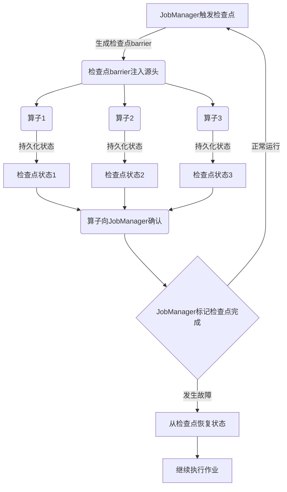

# Flink状态检查点机制原理

## 1. 背景介绍

### 1.1 问题的由来

在现代分布式流处理系统中,数据流是持续不断地产生和处理的。由于各种原因,如硬件故障、网络中断或代码错误等,系统可能会发生故障。如果没有合适的容错机制,一旦发生故障,所有已经处理的数据和状态都将丢失,系统需要从头开始重新处理数据流,这将导致大量的数据重复处理,浪费大量的计算资源,并且延迟处理结果的输出。

为了解决这个问题,需要一种机制来持久化流处理系统的状态,以便在发生故障时能够从最近的一致状态恢复,避免重复处理已经处理过的数据,从而提高系统的可靠性和容错性。这就是检查点(Checkpoint)机制的由来。

### 1.2 研究现状

目前,许多流处理系统都采用了检查点机制,如Apache Flink、Apache Spark Streaming、Apache Kafka Streams等。其中,Apache Flink是一个开源的分布式流处理系统,它提供了一种称为"Flink状态检查点"的机制,用于持久化流处理程序的状态。

Flink状态检查点机制已经被广泛应用于各种流处理场景,如实时数据分析、实时数据管道、实时机器学习等。它能够有效地保证数据处理的一致性和容错性,提高了系统的可靠性和可用性。

### 1.3 研究意义

深入理解Flink状态检查点机制的原理对于开发和优化流处理应用程序至关重要。通过掌握这一机制的工作原理,开发人员可以更好地设计和实现容错机制,提高系统的可靠性和性能。同时,对于Flink社区和开发者来说,研究和优化Flink状态检查点机制也是一个重要的课题,可以进一步提升Flink的性能和可用性。

### 1.4 本文结构

本文将从以下几个方面深入探讨Flink状态检查点机制的原理:

1. 介绍Flink状态检查点机制的核心概念和相关联的概念。
2. 详细阐述Flink状态检查点机制的核心算法原理和具体操作步骤。
3. 构建数学模型并推导相关公式,对算法进行理论分析和案例讲解。
4. 提供代码实例并进行详细解释,展示Flink状态检查点机制的实际应用。
5. 探讨Flink状态检查点机制在实际场景中的应用,并展望未来的发展趋势。
6. 推荐相关工具和学习资源,方便读者进一步深入学习。
7. 总结研究成果,分析未来发展趋势和面临的挑战,并对未来的研究方向进行展望。
8. 附录部分回答常见问题,帮助读者更好地理解和应用Flink状态检查点机制。

## 2. 核心概念与联系

在深入探讨Flink状态检查点机制的原理之前,我们需要先了解一些核心概念和它们之间的联系。

### 2.1 状态(State)

在Flink中,状态是指流处理程序在执行过程中需要保存和维护的数据。状态可以是各种形式,如窗口数据、聚合结果、机器学习模型等。保存和恢复状态是实现容错和一致性的关键。

### 2.2 检查点(Checkpoint)

检查点是指在特定的一致状态下,将流处理程序的状态持久化到外部存储系统(如HDFS或RocksDB)的过程。检查点可以保证在发生故障时,系统能够从最近的一致状态恢复,避免重复处理已经处理过的数据。

### 2.3 检查点barrier(Checkpoint Barrier)

检查点barrier是一种特殊的数据记录,它用于在流处理程序中标记检查点的开始和结束。当检查点barrier到达某个算子时,该算子会将其当前状态持久化到检查点,并将barrier向下游传递。

### 2.4 状态后端(State Backend)

状态后端是Flink用于管理和持久化状态的组件。它负责将状态数据存储到外部存储系统,如内存、文件系统或数据库。常见的状态后端包括内存状态后端、文件系统状态后端和RocksDB状态后端等。

### 2.5 一致性(Consistency)

一致性是指在发生故障时,系统能够从一个全局一致的状态恢复,避免数据丢失或重复计算。Flink状态检查点机制通过定期创建检查点来保证系统的一致性。

### 2.6 吞吐量(Throughput)

吞吐量是指单位时间内系统能够处理的数据量。Flink状态检查点机制需要在保证一致性的同时,尽可能地减少对系统吞吐量的影响。

### 2.7 延迟(Latency)

延迟是指数据从进入系统到产生结果所需的时间。Flink状态检查点机制也需要尽可能地减少对系统延迟的影响。

这些核心概念相互关联,共同构成了Flink状态检查点机制的基础。理解这些概念及其联系,对于深入理解Flink状态检查点机制的原理至关重要。

## 3. 核心算法原理 & 具体操作步骤

### 3.1 算法原理概述

Flink状态检查点机制的核心算法原理是基于"分界线(Barrier)传播"和"渐进式(Incremental)检查点"的思想。

1. **分界线传播**

   检查点barrier作为一种特殊的数据记录,沿着数据流的方向在算子之间传播。当一个算子接收到检查点barrier时,它会将自己的当前状态持久化到检查点,并将barrier向下游传递。这样,整个流处理拓扑就形成了一个"分界线",将数据流分成两个部分:在分界线之前的数据已经被处理并持久化,而在分界线之后的数据还未被处理。

2. **渐进式检查点**

   Flink采用了渐进式检查点的方式,即在整个流处理拓扑中,不同的算子可以异步地执行状态持久化操作。这种方式可以避免整个流处理拓扑在执行检查点时被完全阻塞,从而减少对吞吐量和延迟的影响。

通过上述两个核心思想,Flink状态检查点机制能够在发生故障时,从最近的一致状态恢复,保证了数据处理的一致性和容错性。同时,它也尽可能地减少了对系统吞吐量和延迟的影响。

### 3.2 算法步骤详解

Flink状态检查点机制的具体操作步骤如下:

1. **触发检查点**

   Flink作业管理器(JobManager)根据配置的检查点间隔时间或其他策略,决定何时触发一次新的检查点。

2. **生成检查点barrier**

   JobManager为新的检查点生成一个唯一的检查点ID,并将对应的检查点barrier注入到数据流的源头。

3. **barrier传播**

   检查点barrier沿着数据流的方向在算子之间传播。每个算子在接收到barrier时,会执行以下操作:
   a. 将当前状态持久化到检查点
   b. 将barrier向下游传递

4. **确认检查点**

   当所有下游算子都完成状态持久化并向JobManager确认后,JobManager会将该检查点标记为"已完成"。

5. **状态恢复**

   如果发生故障,Flink会从最近的已完成检查点恢复作业的状态。所有算子都会从检查点中读取其对应的状态,并从该状态继续执行。

6. **垃圾回收**

   为了节省存储空间,Flink会定期清理较旧的已完成检查点。

这个过程是循环执行的,以保证系统在任何时候都有最新的一致状态可供恢复。

### 3.3 算法优缺点

**优点:**

1. **一致性保证**:通过定期创建检查点,Flink状态检查点机制能够保证在发生故障时,系统可以从最近的一致状态恢复,避免数据丢失或重复计算。

2. **高吞吐量**:采用渐进式检查点的方式,可以避免整个流处理拓扑在执行检查点时被完全阻塞,从而减少对吞吐量的影响。

3. **低延迟**:由于检查点操作是异步执行的,因此对系统的延迟影响也相对较小。

4. **可配置性**:Flink提供了多种配置选项,用户可以根据实际需求调整检查点的间隔时间、状态后端等参数,以权衡一致性、吞吐量和延迟之间的平衡。

**缺点:**

1. **额外开销**:执行检查点操作需要额外的计算资源和存储空间,会增加系统的开销。

2. **恢复时间**:从检查点恢复状态需要一定的时间,在这段时间内,系统无法处理新的数据,会导致短暂的中断。

3. **状态大小限制**:由于需要持久化状态,因此算子的状态大小受到了一定的限制,无法无限制地增长。

4. **一致性边界**:虽然Flink状态检查点机制能够保证一致性,但是一致性的边界仅限于Flink作业内部。如果涉及到外部系统(如数据源或接收器),则需要额外的机制来保证端到端的一致性。

总的来说,Flink状态检查点机制通过一定的折中,在一致性、吞吐量和延迟之间取得了较好的平衡,适用于大多数流处理场景。但在某些特殊情况下,可能需要根据实际需求进行权衡和调整。

### 3.4 算法应用领域

Flink状态检查点机制可以广泛应用于各种流处理场景,包括但不限于:

1. **实时数据分析**:在实时数据分析中,需要对持续产生的数据进行处理和分析,如网络日志分析、用户行为分析等。Flink状态检查点机制可以保证分析结果的一致性和可靠性。

2. **实时数据管道**:在构建实时数据管道时,需要可靠地从源头消费数据,经过一系列转换后将结果输出到目的地。Flink状态检查点机制可以确保在发生故障时,数据不会丢失或重复处理。

3. **实时机器学习**:在实时机器学习场景中,需要持续地从数据流中学习和更新模型。Flink状态检查点机制可以持久化模型的状态,在发生故障时从最近的一致状态恢复,避免重新训练模型。

4. **事件驱动应用**:事件驱动应用程序需要对持续产生的事件进行处理和响应。Flink状态检查点机制可以保证事件处理的一致性和可靠性。

5. **物联网(IoT)数据处理**:在物联网场景中,需要实时处理来自大量传感器的数据流。Flink状态检查点机制可以确保数据处理的可靠性和容错性。

6. **在线交易处理(OLTP)系统**:一些在线交易处理系统需要实时处理交易数据,并保证数据的一致性和可靠性。Flink状态检查点机制可以应用于这些场景。

总之,任何需要实时处理持续产生的数据流,并且对数据处理的一致性和可靠性有较高要求的场景,都可以考虑应用Flink状态检查点机制。

## 4. 数学模型和公式 & 详细讲解 & 举例说明

为了更好地理解和分析Flink状态检查点机制的性能,我们可以