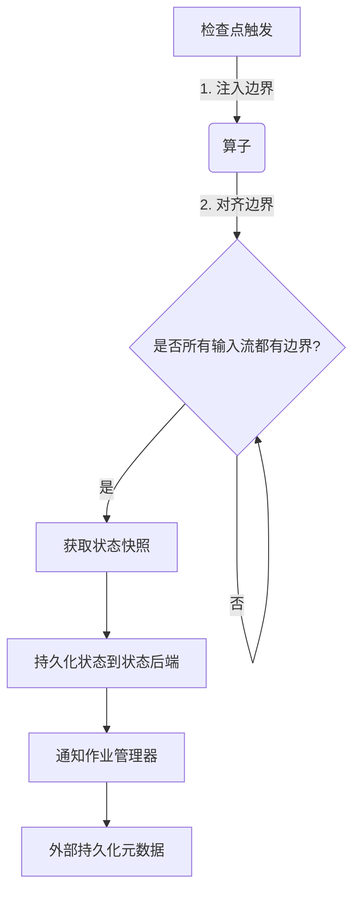

# Flink的检查点与故障恢复机制

## 1. 背景介绍

### 1.1 问题的由来

在大数据处理领域中,数据流处理系统需要持续不断地处理大量的数据流,任何节点发生故障都可能导致数据丢失或计算结果不正确。因此,确保系统的容错性和一致性是至关重要的。Apache Flink作为一个分布式数据流处理框架,提供了检查点(Checkpoint)和故障恢复机制来应对这一挑战。

### 1.2 研究现状

目前,已有多种容错机制被应用于流处理系统中,如基于重播(Replay)的方法、基于检查点的方法等。其中,检查点机制由于其高效和一致性保证而被广泛采用。Apache Flink、Apache Spark Streaming等知名流处理框架都采用了检查点机制。

### 1.3 研究意义

深入理解Flink的检查点与故障恢复机制,对于构建高可用、高吞吐的流处理应用程序至关重要。本文将全面剖析Flink检查点的原理、实现和优化策略,为读者提供系统的理论基础和实践指导。

### 1.4 本文结构

本文首先介绍Flink检查点的核心概念,然后深入探讨其算法原理和具体实现步骤。接着,详细阐述检查点机制的数学模型和公式推导过程。随后,通过实际代码示例展示如何在Flink应用中启用和配置检查点。最后,分析检查点机制在实际场景中的应用,并对未来发展趋势和挑战进行展望。

## 2. 核心概念与联系

在探讨Flink检查点机制之前,需要了解以下几个核心概念:

1. **状态后端(State Backends)**: Flink将算子的状态存储在状态后端,支持多种状态后端如MemoryStateBackend、FsStateBackend等。

2. **边界(Barrier)**: 边界用于指示检查点对齐的位置,算子在收到所有输入流的边界后,才能触发检查点。

3. **检查点(Checkpoint)**: 检查点是对作业的一次全局数据流状态的持久化快照,用于故障恢复。

4. **检查点间隔(Checkpoint Interval)**: 定义了两次检查点之间的时间间隔。

5. **检查点超时(Checkpoint Timeout)**: 如果检查点过程在该时间内未完成,则会被视为失败并触发新的检查点。

这些概念相互关联,共同构成了Flink检查点与故障恢复的基础框架。状态后端负责存储状态快照,边界用于检查点对齐,检查点则捕获全局一致的数据流状态快照。检查点间隔和超时时间控制检查点的触发频率和超时行为。

## 3. 核心算法原理与具体操作步骤

### 3.1 算法原理概述

Flink的检查点算法基于"持续流水线式的轻量级快照"理念,它通过状态后端和检查点协调器的协作,以增量式的方式持续获取作业的状态快照,从而实现高效的检查点和一致性恢复。该算法的核心思想是:

1. **分散式异步快照**: 每个算子独立获取自身状态的增量快照,而不是集中式的全局快照。

2. **持续增量式快照**: 算子以流水线方式持续获取增量状态快照,而不是在检查点时一次性获取全量快照。

3. **一致性对齐**: 通过边界的注入和对齐,确保所有快照能组合成一个全局一致的视图。

该算法避免了传统检查点算法中的"停止整个世界(Stop-the-world)"开销,从而实现了高吞吐和低延迟。



### 3.2 算法步骤详解

1. **触发检查点**: 检查点协调器根据检查点间隔或其他策略触发新的检查点。

2. **注入边界**: 检查点协调器向所有源算子注入边界,标记检查点对齐的位置。

3. **边界对齐**: 每个算子在收到所有输入流的边界后,进入"对齐"状态。

4. **获取状态快照**: 对齐后,算子获取自身状态的增量快照。

5. **持久化状态快照**: 算子将增量状态快照持久化到状态后端。

6. **通知作业管理器**: 算子通知作业管理器自身已完成检查点。

7. **持久化元数据**: 作业管理器等待所有算子完成后,将检查点元数据持久化到外部系统(如文件系统)。

8. **确认检查点完成**: 所有步骤完成后,新检查点生效,旧检查点可被丢弃。

通过这一流程,Flink实现了无需"停止整个世界"的高效检查点,并保证了端到端的一致性恢复。

### 3.3 算法优缺点

**优点**:

1. **高吞吐低延迟**: 避免了传统检查点算法中的"停止整个世界"开销。

2. **一致性恢复**: 通过边界对齐,确保恢复后的状态是全局一致的。

3. **增量式快照**: 降低了获取快照的开销,提高了效率。

4. **异步分散式**: 各算子并行异步获取快照,提高了并行度。

**缺点**:

1. **增加了实现复杂度**: 需要精心设计边界注入、对齐和增量快照等机制。

2. **存在"算子内不一致"窗口**: 在获取快照期间,算子内部状态可能会发生变化,导致短暂的不一致。

3. **额外的元数据开销**: 需要维护检查点元数据,会增加一些额外开销。

### 3.4 算法应用领域

Flink检查点算法适用于需要低延迟、高吞吐和强一致性保证的流处理场景,如:

- 金融风控系统
- 电商实时推荐系统
- 物联网数据处理
- 在线机器学习
- 实时数据分析等

任何对延迟和吞吐有严格要求,同时需要端到端精确一次(Exactly-Once)语义保证的流处理应用,都可以从Flink的检查点机制中受益。

## 4. 数学模型和公式详细讲解与举例说明

### 4.1 数学模型构建

为了形式化描述Flink检查点算法,我们构建如下数学模型:

考虑一个数据流作业由 $n$ 个算子 $\{O_1, O_2, \dots, O_n\}$ 组成,其中:

- $O_i$ 表示第 $i$ 个算子
- $S_i^t$ 表示算子 $O_i$ 在时间 $t$ 的状态
- $C^t$ 表示时间 $t$ 的检查点
- $B_i^t$ 表示注入到算子 $O_i$ 的边界,用于标记检查点对齐位置

我们的目标是在任意时间点 $t$,都能从检查点 $C^t$ 中恢复出一个全局一致的状态 $\{S_1^t, S_2^t, \dots, S_n^t\}$。

### 4.2 公式推导过程

为了实现上述目标,Flink检查点算法需要满足以下条件:

$$
\forall i, j \in \{1, 2, \dots, n\}, \exists B_i^t, B_j^t, \textrm{使得} S_i^t \sqcup S_j^t
$$

其中 $\sqcup$ 表示两个状态是一致的,即不存在因果关系。换言之,对于任意两个算子 $O_i$ 和 $O_j$,都存在一个边界 $B_i^t$ 和 $B_j^t$,使得它们的状态 $S_i^t$ 和 $S_j^t$ 在时间 $t$ 是一致的。

进一步,我们定义检查点 $C^t$ 为所有算子状态的并集:

$$
C^t = \bigcup_{i=1}^n S_i^t
$$

根据上述条件,检查点 $C^t$ 就是一个全局一致的状态快照。

在实现层面,Flink通过以下步骤来满足这一条件:

1. 注入边界 $B_i^t$ 到每个算子 $O_i$
2. 算子 $O_i$ 在收到所有输入流的边界后,获取自身状态 $S_i^t$
3. 将所有 $S_i^t$ 组合成检查点 $C^t$

通过这种方式,Flink保证了检查点的一致性,从而实现了精确一次(Exactly-Once)语义。

### 4.3 案例分析与讲解

考虑一个流处理作业,由3个算子组成:源算子 $O_1$,映射算子 $O_2$ 和窗口算子 $O_3$,它们的关系如下图所示:


假设在时间 $t_0$ 触发了一个检查点 $C^{t_0}$,则检查点过程如下:

1. 协调器向 $O_1$ 注入边界 $B_1^{t_0}$

2. $O_1$ 收到 $B_1^{t_0}$ 后,获取状态 $S_1^{t_0}$,持久化到状态后端

3. $B_1^{t_0}$ 通过 $O_1 \rightarrow O_2$ 的边,传递到 $O_2$

4. $O_2$ 收到 $B_1^{t_0}$ 后,暂不对齐,继续处理 $O_1$ 的数据

5. $O_2$ 的输出通过 $O_2 \rightarrow O_3$ 的边,传递到 $O_3$

6. $O_3$ 收到 $O_2$ 的数据后,注入新的边界 $B_2^{t_0}$

7. $O_2$ 收到 $B_2^{t_0}$ 后,对齐,获取状态 $S_2^{t_0}$,持久化

8. $O_3$ 收到 $B_1^{t_0}$ 和 $B_2^{t_0}$ 后,对齐,获取状态 $S_3^{t_0}$,持久化

9. 所有算子完成后,协调器将元数据持久化,形成检查点 $C^{t_0} = S_1^{t_0} \cup S_2^{t_0} \cup S_3^{t_0}$

通过这个案例,我们可以看到Flink如何通过边界注入和对齐,来获取一个全局一致的检查点状态。同时,每个算子都是异步并行地获取自身状态快照,避免了集中式快照的开销。

### 4.4 常见问题解答

**Q: 为什么需要边界对齐?**

A: 边界对齐是为了确保算子状态的一致性。如果不对齐,上游算子的状态可能已经包含了下游算子还未处理的数据,从而导致不一致。

**Q: 增量快照与全量快照有何区别?**

A: 全量快照需要在检查点时获取整个状态,开销很大。而增量快照只需持久化自上次检查点以来的状态变化,开销较小,更加高效。

**Q: 检查点一致性是如何保证的?**

A: 通过边界注入和对齐,确保每个算子在获取状态快照时,其输入流都已包含检查点边界。从而使得所有状态快照在时间上是一致的,组合起来就是全局一致的视图。

**Q: 检查点元数据包含哪些内容?**

A: 检查点元数据主要包括:1)检查点ID 2)检查点触发时间 3)持久化状态的存储路径 4)算子并行度等信息。这些元数据用于后续的故障恢复。

## 5. 项目实践:代码实例和详细解释说明

### 5.1 开发环境搭建

要在Flink项目中启用检查点机制,我们首先需要配置开发环境。以Maven为例,在`pom.xml`中添加Flink的依赖:

```xml
<dependency>
    <groupId>org.apache.flink</groupId>
    