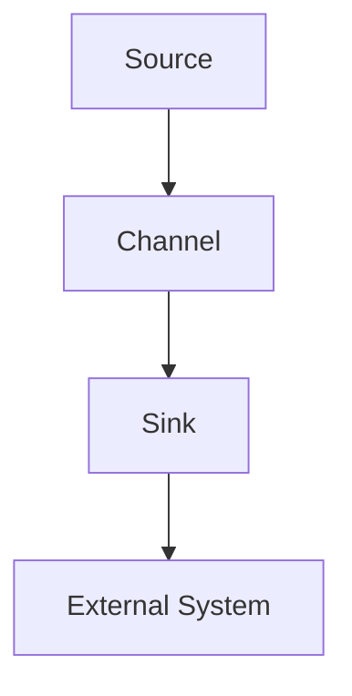

# Flume原理与代码实例讲解

作者：禅与计算机程序设计艺术 / Zen and the Art of Computer Programming

## 1. 背景介绍

### 1.1 问题的由来

随着大数据时代的到来，数据采集、存储和处理的复杂性日益增加。如何高效地从各个数据源中收集数据，并将其传输到数据存储系统中，成为了大数据处理领域的一个重要问题。Flume作为一种数据采集和处理工具，应运而生。

### 1.2 研究现状

Flume是一款由Cloudera公司开发的开源分布式系统，用于实时采集、聚合、移动和存储大量日志数据。它具有高性能、高可靠性和易于扩展的特点，广泛应用于大数据平台的日志采集和传输。

### 1.3 研究意义

掌握Flume的原理和应用，有助于我们更好地理解大数据平台的架构和数据处理流程，提高数据采集和传输的效率。本文将深入探讨Flume的原理，并通过代码实例进行讲解，帮助读者更好地理解和使用Flume。

### 1.4 本文结构

本文将按照以下结构进行展开：

- 介绍Flume的核心概念和联系
- 分析Flume的算法原理和具体操作步骤
- 详细讲解Flume的数学模型和公式
- 通过项目实践展示Flume的代码实例和详细解释
- 探讨Flume的实际应用场景和未来发展趋势
- 总结Flume的研究成果和面临的挑战

## 2. 核心概念与联系

Flume的核心概念包括：

- **Agent**：Flume的基本运行单元，负责数据采集、聚合和传输。
- **Source**：Agent中负责采集数据的组件。
- **Channel**：Agent中负责暂存数据的组件，可以是内存、数据库或文件系统。
- **Sink**：Agent中负责将数据传输到目标存储系统的组件。
- **Sink Processor**：对数据进行处理，如转换、过滤等。

这些组件之间的关系如下：



## 3. 核心算法原理 & 具体操作步骤

### 3.1 算法原理概述

Flume采用事件驱动的方式，通过Source组件从数据源中采集数据，存储在Channel中，然后由Sink组件将数据传输到目标系统。

### 3.2 算法步骤详解

Flume的算法步骤如下：

1. **数据采集**：Source组件从数据源中读取数据，并生成事件。
2. **数据暂存**：事件存储在Channel中，等待传输。
3. **数据传输**：Sink组件将事件从Channel中取出，并传输到目标系统。

### 3.3 算法优缺点

**优点**：

- 高性能：Flume采用高效的数据传输机制，能够处理大量数据。
- 高可靠性：Flume支持数据持久化存储，确保数据不丢失。
- 易于扩展：Flume可以水平扩展，满足大数据平台的性能需求。

**缺点**：

- 灵活性有限：Flume的Channel和Sink组件有限，需要自定义开发。
- 复杂性较高：Flume配置较为复杂，需要一定的学习成本。

### 3.4 算法应用领域

Flume适用于以下场景：

- 日志采集：从各个系统采集日志数据，如Web服务器、数据库等。
- 数据迁移：将数据从源系统迁移到目标系统。
- 数据聚合：对数据进行汇总和统计。

## 4. 数学模型和公式 & 详细讲解 & 举例说明

### 4.1 数学模型构建

Flume的数学模型可以表示为：

$$
\text{Flume} = \text{Source} + \text{Channel} + \text{Sink}
$$

其中：

- $\text{Source}$：数据采集模块，用于从数据源读取数据。
- $\text{Channel}$：数据暂存模块，用于存储数据。
- $\text{Sink}$：数据传输模块，用于将数据传输到目标系统。

### 4.2 公式推导过程

Flume的工作流程可以表示为以下公式：

$$
\text{数据流} = \text{数据采集} + \text{数据暂存} + \text{数据传输}
$$

### 4.3 案例分析与讲解

假设我们需要从Web服务器中采集日志数据，并存储到HDFS中。我们可以使用以下Flume配置：

```xml
<configuration>
    <agent name="flume-agent" version="1.9.0" spillsdir="${java.io.tmpdir}/flume/spills">
        <sources>
            <source type="exec" name="webserver-source">
                <exec command="/usr/bin/cat /var/log/httpd/access_log" />
            </source>
        </sources>
        <sinks>
            <sink type="hdfs" name="hdfs-sink">
                <hdfs>
                    <path>/user/hadoop/flume/logs</path>
                    <writer>
                        <type>TextFile</type>
                    </writer>
                </hdfs>
            </sink>
        </sinks>
        <channels>
            <channel name="memory-channel" type="memory" capacity="10000" transactionCapacity="1000" />
        </channels>
        <sources>
            <source>
                <type>channel</type>
                <channel>memory-channel</channel>
            </source>
        </sources>
        <sinks>
            <sink>
                <type>channel</type>
                <channel>memory-channel</channel>
            </sink>
        </sinks>
    </agent>
</configuration>
```

### 4.4 常见问题解答

**Q：Flume的数据传输机制是什么？**

A：Flume采用基于内存的数据传输机制，将数据从Source传输到Channel，再从Channel传输到Sink。为了保证数据不丢失，Flume支持数据持久化存储。

**Q：Flume如何实现水平扩展？**

A：Flume可以通过增加Agent的数量来实现水平扩展。每个Agent负责处理一部分数据，从而提高整体的处理能力。

## 5. 项目实践：代码实例和详细解释说明

### 5.1 开发环境搭建

1. 安装Java环境。
2. 安装Flume。
3. 下载示例配置文件。

### 5.2 源代码详细实现

以下是一个简单的Flume配置文件，用于采集Web服务器日志数据并存储到HDFS中：

```xml
<configuration>
    <agent name="flume-agent" version="1.9.0" spillsdir="${java.io.tmpdir}/flume/spills">
        <sources>
            <source type="exec" name="webserver-source">
                <exec command="/usr/bin/cat /var/log/httpd/access_log" />
            </source>
        </sources>
        <sinks>
            <sink type="hdfs" name="hdfs-sink">
                <hdfs>
                    <path>/user/hadoop/flume/logs</path>
                    <writer>
                        <type>TextFile</type>
                    </writer>
                </hdfs>
            </sink>
        </sinks>
        <channels>
            <channel name="memory-channel" type="memory" capacity="10000" transactionCapacity="1000" />
        </channels>
        <sources>
            <source>
                <type>channel</type>
                <channel>memory-channel</channel>
            </source>
        </sources>
        <sinks>
            <sink>
                <type>channel</type>
                <channel>memory-channel</channel>
            </sink>
        </sinks>
    </agent>
</configuration>
```

### 5.3 代码解读与分析

- `<agent>` 标签定义了Flume Agent的配置信息。
- `<sources>` 标签定义了数据源，这里使用`exec`类型的数据源，从Web服务器日志文件中读取数据。
- `<sinks>` 标签定义了数据传输的目标，这里使用`hdfs`类型的Sink，将数据存储到HDFS中。
- `<channels>` 标签定义了数据暂存通道，这里使用`memory`类型的Channel，将数据暂存到内存中。

### 5.4 运行结果展示

运行Flume Agent后，Web服务器日志数据将实时采集并存储到HDFS中。

## 6. 实际应用场景

Flume在实际应用中具有广泛的应用场景，以下列举一些常见的应用场景：

### 6.1 日志采集

- 采集Web服务器、数据库、应用程序等系统的日志数据。
- 将日志数据存储到HDFS、Elasticsearch、Kafka等系统中。

### 6.2 数据迁移

- 将数据从源系统迁移到目标系统，如从MySQL迁移到HDFS。
- 将数据从本地文件系统迁移到云存储系统。

### 6.3 数据聚合

- 对日志数据进行汇总和统计，如访问量、错误率等。
- 对用户行为数据进行分析，如用户画像、推荐系统等。

## 7. 工具和资源推荐

### 7.1 学习资源推荐

1. **官方文档**：[https://flume.apache.org/](https://flume.apache.org/)
    - Apache Flume的官方文档，提供了详细的配置和使用说明。

2. **Flume官方教程**：[https://flume.apache.org/FlumeUserGuide.html](https://flume.apache.org/FlumeUserGuide.html)
    - Apache Flume的用户指南，介绍了Flume的原理和配置方法。

### 7.2 开发工具推荐

1. **IntelliJ IDEA**：[https://www.jetbrains.com/idea/](https://www.jetbrains.com/idea/)
    - IntelliJ IDEA是一款功能强大的集成开发环境，支持Java开发，包括Flume开发。

2. **Eclipse**：[https://www.eclipse.org/](https://www.eclipse.org/)
    - Eclipse是一款开源的集成开发环境，同样支持Java开发，包括Flume开发。

### 7.3 相关论文推荐

1. **Flume: A Distributed Log Collection Service for Hadoop**：[https://www.usenix.org/system/files/conference/hadoopsp10/sp10_paper_rajasekar.pdf](https://www.usenix.org/system/files/conference/hadoopsp10/sp10_paper_rajasekar.pdf)
    - 这篇论文介绍了Flume的设计和实现。

2. **A Comparison of Log Collection Systems**：[https://www.usenix.org/system/files/conference/hadoopsp10/sp10_paper_gilbert.pdf](https://www.usenix.org/system/files/conference/hadoopsp10/sp10_paper_gilbert.pdf)
    - 这篇论文比较了不同的日志采集系统，包括Flume。

### 7.4 其他资源推荐

1. **Apache Flume社区**：[https://flume.apache.org/flume-user-mailinglist.html](https://flume.apache.org/flume-user-mailinglist.html)
    - Apache Flume的用户邮件列表，可以交流问题和经验。

2. **Stack Overflow**：[https://stackoverflow.com/questions/tagged/flume](https://stackoverflow.com/questions/tagged/flume)
    - Stack Overflow上的Flume标签，可以搜索和提问Flume相关问题。

## 8. 总结：未来发展趋势与挑战

Flume作为一种高效、可靠的数据采集和处理工具，在数据采集和处理领域发挥着重要作用。以下是Flume的未来发展趋势和挑战：

### 8.1 未来发展趋势

1. **多租户支持**：Flume将支持多租户数据采集，满足不同业务部门的数据需求。
2. **云原生支持**：Flume将支持云原生架构，满足云计算环境下的大数据采集和处理需求。
3. **与容器技术集成**：Flume将与Docker、Kubernetes等容器技术集成，实现容器化部署和运维。

### 8.2 面临的挑战

1. **性能优化**：随着数据量的增加，Flume的性能优化成为关键问题。
2. **安全性**：Flume需要提高安全性，防止数据泄露和恶意攻击。
3. **易用性**：Flume的配置和管理相对复杂，需要提高易用性。

### 8.3 研究展望

Flume的未来研究方向包括：

1. **智能化采集**：利用机器学习技术，实现智能化的数据采集和预处理。
2. **弹性伸缩**：实现Flume的弹性伸缩，满足不同业务场景下的资源需求。
3. **跨平台支持**：支持更多操作系统和平台，提高Flume的通用性和可移植性。

总之，Flume作为一种高效、可靠的数据采集和处理工具，在未来的发展中将继续发挥重要作用。通过不断改进和创新，Flume将为大数据平台的构建和运营提供有力支持。

## 9. 附录：常见问题与解答

### 9.1 Flume与其他数据采集工具相比，有哪些优势？

A：Flume相比于其他数据采集工具，具有以下优势：

- 高性能：Flume采用高效的数据传输机制，能够处理大量数据。
- 高可靠性：Flume支持数据持久化存储，确保数据不丢失。
- 易于扩展：Flume可以水平扩展，满足大数据平台的性能需求。

### 9.2 如何将Flume与其他大数据工具集成？

A：Flume可以与其他大数据工具集成，如Hadoop、Spark、Flink等。具体集成方法如下：

1. 将Flume作为数据源，将采集到的数据传输到Hadoop、Spark、Flink等大数据平台。
2. 将Flume的输出结果存储到HDFS、Elasticsearch、Kafka等大数据存储系统。
3. 使用Flume与其他大数据工具的API进行交互，实现数据共享和联动。

### 9.3 Flume的配置和管理比较复杂，有什么简化方法？

A：为了简化Flume的配置和管理，可以采取以下方法：

1. 使用Flume提供的模板配置，快速生成Flume配置文件。
2. 使用自动化脚本工具，如Ansible、Chef等，实现Flume的自动化部署和管理。
3. 利用开源社区提供的Flume插件和工具，简化Flume的配置和使用。