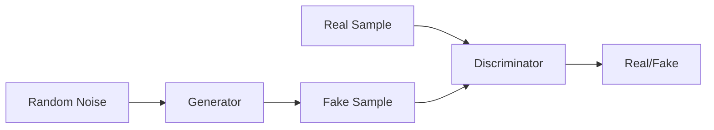

# GAN 生成模型：生成器 (Generator) 原理与代码实例讲解

关键词：生成对抗网络、生成器、判别器、对抗训练、深度学习

## 1. 背景介绍
### 1.1 问题的由来
生成对抗网络(Generative Adversarial Networks, GANs)自2014年被 Ian Goodfellow 等人提出以来，迅速成为了深度学习领域的研究热点。它为生成式建模提供了一种全新的思路和方法，在图像生成、风格迁移、语音合成等众多领域取得了令人瞩目的成果。然而，对于初学者来说，GAN的原理和实现可能比较难以理解和掌握。特别是作为GAN核心组件之一的生成器，其内部结构和工作机制更是令人费解。

### 1.2 研究现状
目前，业界已经提出了多种GAN的变体和改进，如DCGAN、WGAN、CGAN、CycleGAN等，它们在生成器和判别器的网络结构、损失函数设计、训练策略等方面进行了大量的探索和创新，极大地提升了GAN的性能和应用范围。不过，对于GAN生成器的原理解析和代码实践的系统性介绍还比较匮乏，很多初学者在学习过程中无从下手。

### 1.3 研究意义
深入理解GAN生成器的原理，对于掌握GAN的工作机制、开发GAN的应用都具有重要意义。一方面，生成器是GAN的核心组件，其性能的优劣直接决定了整个GAN模型的效果。另一方面，通过剖析生成器的结构和算法，有助于我们把握GAN的精髓，为进一步改进和创新GAN技术提供启发。此外，GAN作为一种通用的生成式建模方法，其思想对于其他领域的研究也有重要的借鉴意义。

### 1.4 本文结构
本文将围绕GAN生成器的原理和代码实践展开详细讨论。第2部分介绍GAN的核心概念及其内部组件之间的关系。第3部分重点阐述生成器的工作原理和典型网络结构。第4部分从数学角度对生成器的目标函数和优化过程进行建模分析。第5部分通过代码实例演示如何使用PyTorch实现一个基于DCGAN的图像生成器。第6部分总结生成器在图像生成、风格迁移等领域的应用场景。第7部分推荐一些学习GAN生成器的资源。最后第8部分对全文进行总结，并展望GAN技术的未来发展趋势和挑战。

## 2. 核心概念与联系
GAN网络由两个核心组件构成：生成器(Generator)和判别器(Discriminator)。生成器的目标是生成尽可能逼真的假样本去欺骗判别器，而判别器的目标是尽可能准确地区分真实样本和生成的假样本。两个网络在训练过程中互相博弈，形成了一种动态的对抗平衡。

生成器可以看作是一个生成模型，它接收一个随机噪声向量作为输入，通过一系列的非线性变换将其映射到数据空间，输出一个与真实数据分布尽可能接近的假样本。判别器可以看作是一个二分类器，它的输入是一个数据样本（可以是真实的，也可以是生成器生成的假样本），输出是一个0到1之间的标量，表示输入样本是真实数据的概率。

下图展示了GAN的基本架构和数据流：

可以看到，生成器和判别器是两个相互竞争、互相促进的模块。生成器努力生成以假乱真的样本去欺骗判别器，而判别器则不断提升自己的分辨能力去识破生成器的"伪造品"。两个网络在这种你来我往的博弈中同时提升，最终达到一个动态平衡：生成器生成的样本与真实数据几乎难以区分，判别器对生成样本和真实样本也难以判别。这时我们就得到了一个训练有素的生成模型，它掌握了真实数据的分布规律，可以用来生成新颖逼真的数据样本。

## 3. 核心算法原理 & 具体操作步骤
### 3.1 算法原理概述
GAN生成器的核心原理可以概括为：将一个随机噪声向量通过一个由多层感知机或卷积网络组成的生成网络G映射到数据空间，生成与真实数据分布尽可能接近的假样本，去欺骗判别网络D。

形式化地，给定一个随机噪声向量 $z$，生成器 $G(z)$ 试图输出一个假样本 $\tilde{x}=G(z)$，让判别器 $D(\tilde{x})$ 无法判别其真伪，即 $D(G(z)) \approx 1$。而判别器 $D(x)$ 的目标是对输入的样本 $x$ 进行真假判别，对于真实样本 $x$ 输出 $D(x) \approx 1$，对于生成的假样本 $\tilde{x}$ 输出 $D(\tilde{x}) \approx 0$。

生成器 $G$ 和判别器 $D$ 的博弈过程可以用下面的minimax博弈来刻画：

$$\min_G \max_D V(D,G) = \mathbb{E}_{x \sim p_{data}(x)}[\log D(x)] + \mathbb{E}_{z \sim p_z(z)}[\log (1-D(G(z)))]$$

其中 $p_{data}$ 表示真实数据分布，$p_z$ 表示随机噪声的先验分布（通常为标准正态分布）。生成器 $G$ 的目标是最小化 $\log (1-D(G(z)))$，即让判别器对生成样本的判别概率 $D(G(z))$ 尽可能接近1；判别器 $D$ 的目标是最大化 $\log D(x)$（对于真实样本）和 $\log (1-D(G(z)))$（对于生成样本），即让 $D(x)$ 尽可能接近1，让 $D(G(z))$ 尽可能接近0。

### 3.2 算法步骤详解
GAN的训练本质上是一个minimax博弈问题的迭代优化过程，主要分为以下步骤：

1. 初始化生成器 $G$ 和判别器 $D$ 的参数，通常采用Xavier初始化或者He初始化。

2. 在每个训练迭代中：
   
   a. 从真实数据集中采样一批真实样本 $\{x^{(1)}, \cdots, x^{(m)}\}$。
   
   b. 从先验分布 $p_z(z)$ 中采样一批随机噪声 $\{z^{(1)}, \cdots, z^{(m)}\}$。
   
   c. 用采样的随机噪声 $z^{(i)}$ 生成一批假样本 $\{\tilde{x}^{(1)}, \cdots, \tilde{x}^{(m)}\}$，其中 $\tilde{x}^{(i)} = G(z^{(i)})$。
   
   d. 更新判别器 $D$ 的参数，最大化如下目标函数：
      $$\frac{1}{m} \sum_{i=1}^m \left[ \log D(x^{(i)}) + \log (1-D(\tilde{x}^{(i)})) \right]$$
      
   e. 更新生成器 $G$ 的参数，最小化如下目标函数：
      $$\frac{1}{m} \sum_{i=1}^m \log (1-D(G(z^{(i)})))$$
      
3. 重复步骤2，直到判别器和生成器达到平衡，即判别器无法判别真实样本和生成样本。
   
4. 输出训练后的生成器 $G$，用于生成新样本。

### 3.3 算法优缺点

GAN算法的主要优点包括：

- 可以生成高质量、新颖、逼真的数据样本，特别适用于图像、视频等高维数据。
- 不需要显式地定义数据分布，而是通过生成器隐式地学习数据分布。 
- 通过生成器和判别器的对抗博弈，可以不断提升双方的性能，达到动态平衡。
- 思路新颖，代表了生成式建模的一个重要里程碑，引领了后续一系列GAN变体的发展。

GAN算法的主要缺点包括：

- 训练不稳定，容易出现模式崩溃、梯度消失等问题，对参数调节和网络设计要求较高。
- 生成样本的多样性有时不够，容易出现模式崩溃，生成重复、相似的样本。
- 缺乏明确的性能评估指标，难以量化评估生成样本的质量。
- 理论基础还不够完善，许多问题还没有得到很好的解释，如收敛性、泛化性等。

### 3.4 算法应用领域
GAN作为一种强大的生成式模型，在多个领域得到了广泛应用，主要包括：

- 图像生成：可以生成逼真的人脸、动物、风景等图像，如StyleGAN、BigBiGAN等。
- 图像翻译：可以实现风格迁移、图像增强、超分辨率等，如Pix2Pix、CycleGAN等。  
- 语音合成：可以合成特定人的语音，克隆语音，如WaveGAN、MelGAN等。
- 视频生成：可以生成动态的视频片段，如Vid2Vid、Temporal GAN等。
- 文本生成：可以进行文本风格迁移、对话生成、机器翻译等，如TextGAN、DialogWAE等。
- 异常检测：可以用GAN学习正常数据的分布，从而检测异常样本，如AnoGAN、GANomaly等。

此外，GAN在医学图像、工业制造、网络安全等领域也有许多有益的尝试和应用。

## 4. 数学模型和公式 & 详细讲解 & 举例说明
### 4.1 数学模型构建
GAN可以看作是生成器 $G$ 和判别器 $D$ 之间的二人零和博弈。我们从博弈论的角度来重新审视GAN的优化目标。

定义 $V(G,D)$ 为判别器的收益函数（即GAN的目标函数），则生成器的收益函数为 $-V(G,D)$。两者的博弈过程可以表示为：

$$\min_G \max_D V(G,D) = \mathbb{E}_{x \sim p_{data}(x)}[\log D(x)] + \mathbb{E}_{z \sim p_z(z)}[\log (1-D(G(z)))]$$

这个minimax博弈的平衡点即为纳什均衡(Nash equilibrium)，此时任意一方都无法单方面改进自己的收益。我们的目标就是找到这个纳什均衡点 $(G^*, D^*)$，此时生成器可以生成与真实数据分布一致的样本。

### 4.2 公式推导过程
为了求解纳什均衡，我们通常采用梯度下降法交替更新生成器和判别器的参数。对于生成器，我们最小化如下损失函数：

$$J^{(G)} = -\frac{1}{m} \sum_{i=1}^m \log D(G(z^{(i)}))$$

对于判别器，我们最大化如下损失函数：

$$J^{(D)} = \frac{1}{m} \sum_{i=1}^m \left[ \log D(x^{(i)}) + \log (1-D(G(z^{(i)}))) \right]$$

利用链式法则和梯度下降法，我们可以分别求出生成器和判别器参数的更新公式。

对于生成器参数 $\theta_g$，其梯度为：

$$\nabla_{\theta_g} J^{(G)} = -\frac{1}{m} \sum_{i=1}^m \nabla_{\theta_g} \log D(G(z^{(i)})) = -\frac{1}{m} \sum_{i=1}^m \frac{\nabla_{\theta_g} D(G(z^{(i)}))}{D(G(z^{(i)}))}$$

对于判别器参数 $\theta_d$，其梯度为：

$$\nabla_{\theta_d} J^{(D)} = \frac{1}{m} \sum_{i=1}^m \left[ \frac{\nabla_{\theta_d} D(x^{(i)})}{D(x^{(i)})} - \frac{\nabla_{\theta_d} D(G(z^{(i)}