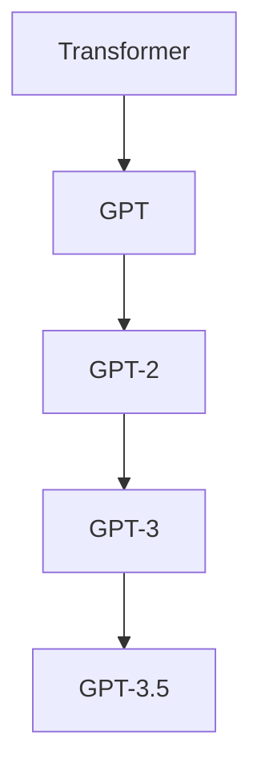

以下是对《GPT-3.5原理与代码实例讲解》这一主题的详细技术博文。

# GPT-3.5原理与代码实例讲解

## 1. 背景介绍

### 1.1 问题的由来

随着人工智能技术的快速发展,自然语言处理(NLP)领域取得了令人瞩目的进展。传统的NLP模型通常基于规则或统计方法,但在处理复杂语言任务时存在局限性。近年来,基于深度学习的语言模型凭借其强大的表示能力和泛化性能,成为NLP领域的主导范式。

作为新一代大型语言模型的代表,GPT-3(Generative Pre-trained Transformer 3)自其问世以来就引起了广泛关注。GPT-3是一种基于Transformer架构的自回归语言模型,通过在大规模语料库上进行预训练,获得了极为丰富的语言知识。它不仅能够生成高质量、连贯的自然语言文本,还可以在多种下游任务中表现出惊人的零샷(Zero-Shot)和少샷(Few-Shot)学习能力。

然而,GPT-3也存在一些缺陷和局限性。例如,它容易产生不合逻辑、不连贯或不合乎事实的输出;在某些特定领域缺乏专业知识;对于复杂的推理任务,其性能仍有待提高等。为了解决这些问题,研究人员提出了GPT-3.5,作为GPT-3的改进版本。

### 1.2 研究现状

GPT-3.5是OpenAI最新发布的大型语言模型,其架构和训练方式与GPT-3类似,但在模型规模、训练数据、微调策略等方面进行了优化和改进。GPT-3.5采用了更大的模型容量(约6.7B参数),并在更加多样化的高质量语料库上进行了预训练,从而获得了更丰富的知识表示。

除了提升模型规模和数据质量外,GPT-3.5还引入了一些新的训练技术,如对抗训练(Adversarial Training)、对比学习(Contrastive Learning)等,旨在提高模型的鲁棒性和推理能力。同时,GPT-3.5在微调(Fine-tuning)阶段采用了一些新的策略,如指令微调(Instruction Tuning)、链式思考(Chain-of-Thought)等,以增强模型在特定任务上的表现。

初步研究表明,GPT-3.5在多项基准测试中均显示出优于GPT-3的性能,尤其在推理、常识reasoning、事实一致性等方面有了明显提升。但GPT-3.5仍然存在一些局限性,如对于某些复杂任务的性能仍有待进一步改进,在特定领域的专业知识储备也有所欠缺等。

### 1.3 研究意义 

深入探究GPT-3.5的原理和实现细节,对于推动大型语言模型的发展具有重要意义。首先,剖析GPT-3.5的核心算法和训练策略,有助于我们更好地理解这一领先模型的优势所在,为进一步优化和创新奠定基础。其次,通过代码实践和案例分析,能够加深对GPT-3.5的理解和掌握,为将其应用于实际场景做好准备。

此外,研究GPT-3.5也将推动自然语言处理技术的发展,为解决一些长期困扰该领域的挑战提供新的思路和方法。例如,GPT-3.5在推理、常识reasoning、事实一致性等方面的改进,或许能够为构建更加通用、智能的对话系统提供借鉴。同时,GPT-3.5在特定领域知识的欠缺,也为将来整合领域知识和语言模型指明了一个重要方向。

总之,深入探讨GPT-3.5的原理与实现,不仅能够帮助我们掌握这一重要模型,更将为推动人工智能和自然语言处理技术的发展做出贡献。

### 1.4 本文结构

本文将全面介绍GPT-3.5的核心原理、算法细节、数学模型、代码实现和应用场景等内容。具体来说,第2部分将阐述GPT-3.5的核心概念和与其他模型的联系;第3部分将详细解析GPT-3.5的核心算法原理和操作步骤;第4部分将介绍GPT-3.5所采用的数学模型及公式推导过程;第5部分将提供GPT-3.5的代码实例并进行详细解释;第6部分将探讨GPT-3.5在实际应用中的场景;第7部分将推荐一些有助于学习和开发GPT-3.5的工具和资源;最后第8部分将总结GPT-3.5的研究成果,并展望其未来的发展趋势和面临的挑战。

## 2. 核心概念与联系

GPT-3.5作为一种大型语言模型,其核心概念和架构源自于Transformer模型。Transformer最初被提出用于机器翻译任务,后来也广泛应用于其他自然语言处理任务。GPT-3.5在Transformer的基础上进行了一些关键改进和创新。

上图展示了从Transformer到GPT-3.5的演进过程。Transformer模型引入了自注意力(Self-Attention)机制,能够更好地捕获输入序列中的长程依赖关系,从而显著提高了模型的表现。

GPT(Generative Pre-trained Transformer)是基于Transformer架构的自回归语言模型,通过在大规模语料库上进行预训练,获得了丰富的语言知识。GPT-2是GPT的后续版本,模型规模和训练数据都有所扩大,展现出更强的生成能力。

GPT-3则是一个真正的里程碑式模型,其规模高达1750亿参数,在自然语言生成、理解和推理等多个任务上表现出色。GPT-3.5作为GPT-3的改进版本,在模型规模、训练数据、训练策略等多个方面进行了优化,旨在进一步提升模型的性能和鲁棒性。

除了与Transformer和GPT系列模型的联系外,GPT-3.5也与其他一些重要的语言模型存在一定的关联,如BERT、XLNet、T5等。这些模型在架构、预训练目标、应用场景等方面各有侧重,共同推动了自然语言处理技术的发展。

## 3. 核心算法原理与具体操作步骤

### 3.1 算法原理概述

GPT-3.5的核心算法原理与GPT-3类似,都是基于Transformer的自回归语言模型。自回归语言模型的目标是最大化给定上文的条件下,预测正确的下一个词的概率。具体来说,对于一个长度为n的token序列 $X = (x_1, x_2, ..., x_n)$,模型需要学习条件概率分布:

$$P(x_n|x_1, x_2, ..., x_{n-1})$$

通过最大化该条件概率的对数似然,模型可以捕获输入序列中的潜在语义和上下文信息,从而生成自然、连贯的文本输出。

与GPT-3相比,GPT-3.5在以下几个方面进行了改进:

1. **模型规模扩大**:GPT-3.5的参数量约为6.7B,比GPT-3的1750B有所增加,赋予了模型更强的表示能力。

2. **训练数据扩充**:GPT-3.5在训练数据方面进行了扩充,包括更多高质量的网络语料、书籍等,使得模型获得了更丰富的知识。

3. **训练策略优化**:GPT-3.5采用了一些新的训练技术,如对抗训练、对比学习等,旨在提高模型的鲁棒性和推理能力。

4. **微调策略创新**:GPT-3.5在微调阶段引入了指令微调、链式思考等新策略,以增强模型在特定任务上的表现。

这些改进措施共同提升了GPT-3.5在自然语言生成、理解和推理等多个方面的能力。

### 3.2 算法步骤详解

GPT-3.5的训练过程可以分为两个主要阶段:预训练(Pre-training)和微调(Fine-tuning)。

#### 3.2.1 预训练阶段

预训练阶段的目标是在大规模语料库上训练模型,使其获得丰富的语言知识。GPT-3.5采用的是标准的自监督(Self-Supervised)方式,即基于自回归语言模型目标进行训练。具体步骤如下:

1. **数据预处理**:首先对训练语料进行标记化(Tokenization)、填充(Padding)等预处理,将其转换为模型可以接受的输入格式。

2. **前向传播**:将预处理后的输入序列 $X = (x_1, x_2, ..., x_{n-1})$ 输入到GPT-3.5模型,模型会基于当前参数计算出对下一个token $x_n$ 的预测概率分布 $P(x_n|x_1, x_2, ..., x_{n-1})$。

3. **计算损失**:将模型预测的概率分布与实际的标签 $x_n$ 进行比较,计算交叉熵损失(Cross-Entropy Loss)。

4. **反向传播**:基于计算得到的损失,利用优化算法(如AdamW)对模型参数进行更新,使得损失值最小化。

5. **重复训练**:重复上述步骤,对训练语料中的所有序列进行一次完整的遍历,即完成一个epoch。通常需要训练数百个epoch,以充分学习语料中的知识。

在预训练阶段,GPT-3.5还采用了一些特殊的训练技术,如对抗训练(Adversarial Training)和对比学习(Contrastive Learning)等,以提高模型的鲁棒性和泛化能力。

#### 3.2.2 微调阶段

预训练过后,GPT-3.5获得了通用的语言知识,但在特定的下游任务上表现并不理想。因此需要进行微调(Fine-tuning),也称为进一步预训练(Further Pre-training),以使模型适应特定任务。

微调的基本思路是:在保持大部分模型参数不变的情况下,只对一小部分参数(通常是最后几层)进行调整,使其适应目标任务的特征。具体步骤如下:

1. **构建微调数据集**:根据目标任务,构建相应的微调数据集。例如对于文本分类任务,需要准备带有标签的文本数据。

2. **数据预处理**:与预训练阶段类似,对微调数据集进行标记化、填充等预处理,以获得模型可接受的输入格式。

3. **微调训练**:将预处理后的数据输入到预训练好的GPT-3.5模型,计算相应的损失函数(如交叉熵损失),并对模型的一小部分参数进行微调,使损失值最小化。

在微调过程中,GPT-3.5引入了一些创新的策略,如指令微调(Instruction Tuning)和链式思考(Chain-of-Thought)等,以进一步提升模型在特定任务上的表现。

### 3.3 算法优缺点

#### 优点

1. **强大的生成能力**:GPT-3.5能够生成高质量、连贯、多样化的自然语言文本,在多种语言生成任务上表现出色。

2. **出色的迁移能力**:GPT-3.5展现出了优秀的零샷和少샷学习能力,能够快速适应新的下游任务,无需大量的标注数据。

3. **推理和常识reasoning能力增强**:相比GPT-3,GPT-3.5在推理、常识reasoning、事实一致性等方面有了明显的提升。

4. **模型规模和知识面扩大**:GPT-3.5的参数量和训练数据都有所增加,使其获得了更丰富的知识表示能力。

5. **训练策略创新**:GPT-3.5采用了一些新的训练技术和微调策略,提高了模型的鲁棒性和特定任务的表现。

#### 缺点

1. **计算资源需求高**:训练和推理GPT-3.5需要大量的计算资源,对硬件配置要求较高,成本也相对较大。

2. **存在事实不一致和偏差风险**:由于预训练数据的局限性,GPT-3.5有时会产生不合乎事实或带有偏差的输出。