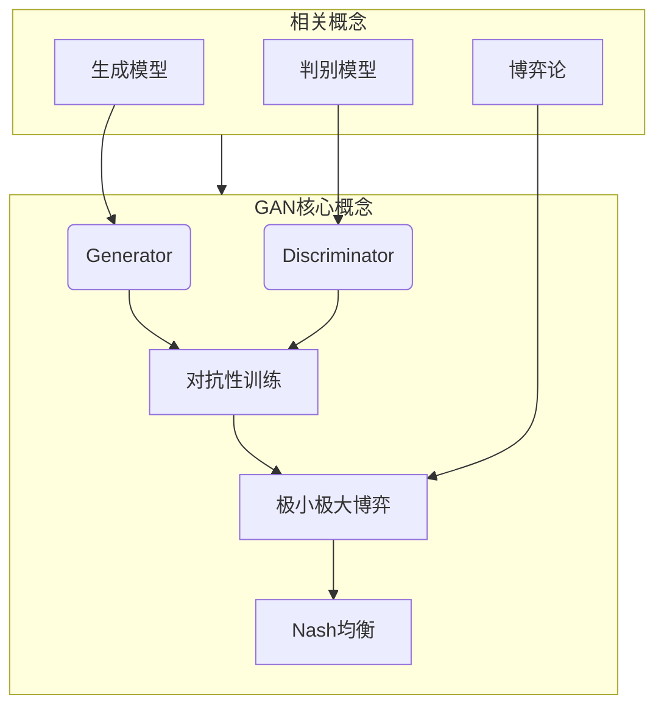

# Generative Adversarial Networks (GAN)原理与代码实例讲解

作者：禅与计算机程序设计艺术 / Zen and the Art of Computer Programming

## 1. 背景介绍

### 1.1 问题的由来

在机器学习和计算机视觉领域,生成式模型一直是一个具有挑战性的问题。传统的生成式模型如何能够学习到复杂数据的真实分布一直是研究的重点和难点。随着深度学习技术的兴起,生成对抗网络(Generative Adversarial Networks, GAN)应运而生,为解决这一困难问题提供了一种全新的思路。

### 1.2 研究现状

自2014年由伊恩·古德费洛等人提出GAN模型以来,GAN理论和应用研究就火热进行,取得了许多重要进展。GAN被广泛应用于图像生成、图像超分辨率重建、图像翻译、语音合成、机器人控制等诸多领域。目前,GAN依然是深度学习领域研究的前沿热点,新的GAN变体模型和改进算法层出不穷。

### 1.3 研究意义

GAN模型的提出为生成式模型注入了新的活力,开辟了一种全新的生成式建模范式。GAN能够直接从数据中学习到复杂分布的生成过程,而无需了解数据的显式概率分布或建模过程,这是传统生成模型所无法企及的。GAN模型的研究不仅在理论层面具有重要意义,更为实际应用提供了强大的新工具。

### 1.4 本文结构

本文将全面介绍GAN的基本原理、数学模型、算法实现细节、实际应用案例以及未来发展趋势。我们将从浅入深、由理论到实践地剖析GAN,为读者提供一个完整的GAN知识框架。

## 2. 核心概念与联系

GAN的核心思想是将生成模型和判别模型组合为一个动态的极小极大博弈框架,通过对抗性训练实现生成器和判别器的同步优化,最终达到Nash均衡状态。其中:

- 生成器(Generator)是一个生成模型,旨在从潜在空间的噪声分布中生成逼真的数据样本,以欺骗判别器。
- 判别器(Discriminator)是一个判别模型,用于区分生成器生成的假数据和真实数据,并反馈给生成器以指导其优化。
- 对抗性训练(Adversarial Training)是生成器和判别器相互对抗的过程,生成器努力生成越来越逼真的数据以欺骗判别器,而判别器则努力提高区分真伪数据的能力。
- 极小极大博弈(Minimax Game)描述了生成器和判别器的对抗关系,生成器希望最小化判别器的判别能力,而判别器则希望最大化其判别能力。
- Nash均衡(Nash Equilibrium)是GAN训练的理想收敛状态,当生成器生成的数据无法被判别器区分真伪时,整个系统达到平衡。

GAN模型将生成模型、判别模型和博弈论等概念有机结合,形成了一种全新的生成式建模范式,为解决复杂数据生成问题提供了有力工具。

## 3. 核心算法原理 & 具体操作步骤

### 3.1 算法原理概述

GAN算法的核心原理是通过生成器G和判别器D的对抗性训练,实现生成器从潜在空间噪声分布中生成逼真数据样本的能力。具体来说:

1. 生成器G将随机噪声z作为输入,经过一系列上采样和卷积运算,生成假数据样本G(z)。
2. 判别器D接收真实数据x和生成数据G(z)作为输入,经过一系列下采样和卷积运算,输出一个标量D(x)或D(G(z)),表示输入数据为真实数据或生成数据的概率。
3. G和D通过极小极大博弈的对抗性训练进行参数更新:
   - G的目标是最小化log(1-D(G(z))),即最大化D判定G(z)为真实数据的概率,以欺骗D。
   - D的目标是最大化log D(x) + log(1-D(G(z))),即最大化判别真实数据和生成数据的能力。
4. G和D相互对抗,不断优化参数,当G生成的数据无法被D区分真伪时,达到Nash均衡状态。

### 3.2 算法步骤详解

1. **初始化生成器G和判别器D**
   - G通常由全卷积网络或上采样网络构成,将噪声z映射为生成数据G(z)
   - D通常由卷积网络或下采样网络构成,将输入数据x映射为标量D(x)
2. **构建数据集并进行预处理**
   - 准备训练数据集,如图像、语音等
   - 对数据进行必要的预处理,如归一化等
3. **定义生成器G和判别器D的损失函数**
   - G损失函数:$L_G = \mathbb{E}_{z \sim p(z)}[\log(1 - D(G(z)))]$,目标是最小化该损失
   - D损失函数:$L_D = -\mathbb{E}_{x \sim p(x)}[\log D(x)] - \mathbb{E}_{z \sim p(z)}[\log(1 - D(G(z)))]$,目标是最大化该损失
4. **对抗性训练**
   - 每个训练迭代中,先固定G,优化D的参数,使D能够更好地区分真实数据和生成数据
   - 然后固定D,优化G的参数,使G生成的数据能够更好地欺骗D
   - 重复上述过程,直到达到Nash均衡
5. **生成样本**
   - 训练收敛后,将随机噪声z输入G,即可生成所需的样本数据G(z)

### 3.3 算法优缺点

**优点:**

1. 直接从数据中学习生成过程,无需建模数据分布
2. 生成质量高,能生成逼真的样本数据
3. 算法通用性强,可应用于各种数据类型
4. 理论基础坚实,具有博弈论理论支撑

**缺点:**

1. 训练过程不稳定,容易模式崩溃
2. 生成样本多样性有限,缺乏多样化
3. 评估生成质量无标准评价指标
4. 大量参数和高计算复杂度

### 3.4 算法应用领域

GAN算法可广泛应用于以下领域:

- 计算机视觉:图像生成、图像超分辨率、图像翻译等
- 自然语言处理:文本生成、机器翻译、对话系统等
- 语音信号处理:语音合成、语音增强等
- 机器人控制:机器人运动规划、控制策略生成等
- 金融:金融时间序列生成、交易信号生成等
- 艺术创作:图像、音乐、视频内容生成等

## 4. 数学模型和公式 & 详细讲解 & 举例说明

### 4.1 数学模型构建

GAN的数学模型可形式化为一个极小极大博弈问题:

$$\min_{G} \max_{D} V(D, G) = \mathbb{E}_{x \sim p(x)}[\log D(x)] + \mathbb{E}_{z \sim p(z)}[\log(1 - D(G(z)))]$$

其中:

- $G$是生成器,将潜在空间噪声$z \sim p(z)$映射为生成数据$G(z)$
- $D$是判别器,将真实数据$x \sim p(x)$或生成数据$G(z)$映射为标量$D(x)$或$D(G(z))$,表示输入为真实数据的概率
- $V(D, G)$是GAN的值函数,反映了$D$和$G$的对抗关系

我们可以将GAN的训练过程看作是在极小极大博弈中寻找一个Nash均衡解:

- 对于任意给定的生成器$G$,判别器$D$的最优策略是最大化$V(D, G)$
- 对于任意给定的判别器$D$,生成器$G$的最优策略是最小化$V(D, G)$

当达到Nash均衡时,生成数据$G(z)$的分布$p_g$与真实数据分布$p(x)$相同,判别器$D$无法区分真伪数据。

### 4.2 公式推导过程

我们可以通过最大似然估计的角度推导GAN的损失函数:

已知真实数据$x$服从分布$p(x)$,生成数据$G(z)$服从分布$p_g(x)$,我们希望$p_g(x)$逼近$p(x)$。

对数据$x$的概率密度函数取对数似然:

$$\begin{aligned}
\log p(x) &= \log \frac{p(x)}{p(x) + p_g(x)} + \log \big(p(x) + p_g(x)\big) \\
         &= \log D(x) + \log \big(p(x) + p_g(x)\big)
\end{aligned}$$

其中$D(x) = \frac{p(x)}{p(x) + p_g(x)}$是真实数据$x$的判别模型。

同理对生成数据$G(z)$有:

$$\log p_g(G(z)) = \log (1 - D(G(z))) + \log \big(p(G(z)) + p_g(G(z))\big)$$

我们的目标是最大化真实数据和生成数据的对数似然之和:

$$\begin{aligned}
\mathcal{L}(D, G) &= \mathbb{E}_{x \sim p(x)}[\log D(x)] + \mathbb{E}_{z \sim p(z)}[\log (1 - D(G(z)))] \\
                  &= \mathbb{E}_{x \sim p(x)}[\log D(x)] + \mathbb{E}_{z \sim p(z)}[\log (1 - D(G(z)))] + \text{const}
\end{aligned}$$

其中const是与$D$和$G$无关的常量项。

对于判别器$D$,我们最大化$\mathcal{L}(D, G)$;对于生成器$G$,我们最小化$\mathcal{L}(D, G)$,这就是GAN的极小极大博弈目标。

### 4.3 案例分析与讲解

我们以MNIST手写数字图像生成为例,具体分析GAN的工作过程。

**数据集**:MNIST手写数字图像数据集,包含60,000个训练图像和10,000个测试图像。

**生成器G**:
- 输入是100维的高斯噪声向量$z$
- 经过一系列全卷积和上采样层
- 输出是28x28的灰度图像$G(z)$

**判别器D**:
- 输入是28x28的图像,可以是真实MNIST图像或生成图像$G(z)$  
- 经过一系列卷积和下采样层
- 输出是标量$D(x)$或$D(G(z))$,表示输入图像为真实图像的概率

在训练过程中,我们交替优化G和D:

1. 固定G,更新D的参数,使D能够更好地区分真实图像和生成图像
2. 固定D,更新G的参数,使G生成的图像能够更好地欺骗D

下面是一些训练过程中G生成的手写数字图像示例:

<图像示例>

我们可以看到,随着训练的进行,G生成的图像质量不断提高,最终能够生成逼真的手写数字图像。

### 4.4 常见问题解答

**Q: GAN为什么容易出现模式崩溃(mode collapse)现象?**

A: 模式崩溃是指生成器G倾向于只生成少数几种模式的样本,缺乏多样性。主要原因有:

1. 生成器优化目标是固定的,无法根据判别器的判别能力动态调整。
2. 生成器和判别器的训练动态失衡,导致生成器无法得到足够的反馈信号。
3. 生成器的支撑集过小,只能生成有限种类的样本。

**Q: 如何评估GAN生成