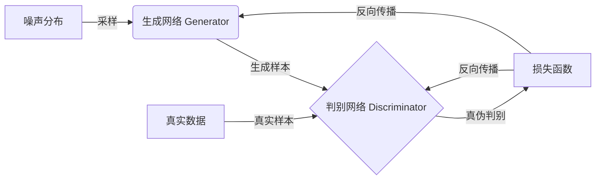

# Generative Adversarial Networks 原理与代码实战案例讲解

## 1. 背景介绍

### 1.1 问题的由来

在过去几十年中，机器学习和深度学习取得了长足的进步,但大多数模型都是基于判别式模型,即给定输入数据,学习对应的输出或标签。然而,生成式模型则需要从噪声分布中学习数据的潜在分布,这是一个更加具有挑战性的任务。生成式模型在计算机视觉、自然语言处理、语音合成等领域有着广泛的应用,但传统的生成模型如受限玻尔兹曼机(Restricted Boltzmann Machines, RBMs)和深度信念网络(Deep Belief Networks, DBNs)在训练过程中存在一些缺陷,如收敛慢、计算代价高等问题。

### 1.2 研究现状

2014年,伊恩·古德费洛(Ian Goodfellow)等人在著名论文"Generative Adversarial Networks"中提出了全新的生成对抗网络(Generative Adversarial Networks, GANs)模型,为生成式模型的发展带来了新的契机。GAN模型的核心思想是将模型的训练过程视为一个二人博弈的minimax游戏,由生成网络(Generator)和判别网络(Discriminator)相互对抗,最终达到生成网络能够生成逼真样本,判别网络无法区分真实样本和生成样本的平衡状态。

自GAN模型提出以来,它在图像生成、语音合成、机器翻译等领域展现出了巨大的潜力,成为深度学习领域的研究热点。然而,GAN模型在训练过程中也面临着一些挑战,如模型收敛不稳定、生成样本质量参差不齐、模式坍塌(mode collapse)等。因此,改进GAN模型的稳定性和生成质量成为了当前研究的重点方向。

### 1.3 研究意义

GAN模型的提出为生成式模型带来了新的发展机遇,它能够直接从噪声分布中生成逼真的样本数据,而无需显式地对数据分布进行建模。这种全新的生成式模型范式在计算机视觉、自然语言处理、语音合成等领域展现出了广阔的应用前景。

通过研究GAN模型的原理和算法细节,我们可以更好地理解和掌握这一强大的生成式模型,并探索其在各个领域的应用潜力。同时,分析GAN模型的优缺点和面临的挑战,有助于我们提出改进方案,推动模型的发展和完善。此外,代码实战案例的讲解将帮助读者更好地掌握GAN模型的实现细节,为将来的实践应用奠定基础。

### 1.4 本文结构

本文将从以下几个方面全面介绍GAN模型:

1. 背景介绍:阐述GAN模型提出的背景和动机,以及与传统生成模型的区别。
2. 核心概念与联系:详细解释GAN模型的核心思想,包括生成网络、判别网络和对抗训练过程。
3. 核心算法原理与具体操作步骤:深入探讨GAN模型的算法原理,包括目标函数、训练过程等,并给出具体的操作步骤。
4. 数学模型和公式详细讲解与举例说明:推导GAN模型的数学表达式,并通过具体案例解释公式的含义。
5. 项目实践:代码实例和详细解释说明:提供GAN模型的代码实现,并对关键部分进行解读和分析。
6. 实际应用场景:介绍GAN模型在图像生成、语音合成等领域的实际应用案例。
7. 工具和资源推荐:推荐相关的学习资源、开发工具和论文等。
8. 总结:未来发展趋势与挑战:总结GAN模型的研究成果,并展望其未来的发展方向和面临的挑战。
9. 附录:常见问题与解答:针对GAN模型的常见问题进行解答和说明。

## 2. 核心概念与联系

生成对抗网络(Generative Adversarial Networks, GANs)是一种全新的生成式模型,它由两个神经网络组成:生成网络(Generator)和判别网络(Discriminator)。这两个网络相互对抗,形成一个minimax博弈,目标是让生成网络能够生成逼真的样本数据,以至于判别网络无法区分生成样本和真实样本。

### 生成网络(Generator)

生成网络的目标是从一个噪声分布(通常是高斯分布或均匀分布)中采样,并将这些噪声输入映射到数据空间,生成逼真的样本数据。生成网络通常由上采样层(Upsampling layers)和卷积层(Convolutional layers)组成,用于从低维度的噪声向量生成高维度的数据样本。

在训练过程中,生成网络会不断尝试生成更加逼真的样本,以欺骗判别网络。生成网络的目标是最大化判别网络将生成样本误判为真实样本的概率,从而使得生成的样本质量不断提高。

### 判别网络(Discriminator)

判别网络的目标是区分输入的样本是真实数据还是生成网络生成的假样本。判别网络通常由卷积层和全连接层组成,对输入的样本进行二分类,输出一个0到1之间的概率值,表示样本为真实数据的可能性。

在训练过程中,判别网络会不断努力提高对真实样本和生成样本的区分能力。判别网络的目标是最大化对真实样本的正确分类概率,同时最小化对生成样本的错误分类概率。

### 对抗训练过程

生成网络和判别网络相互对抗,形成一个minimax博弈。生成网络的目标是最大化判别网络将生成样本误判为真实样本的概率,而判别网络的目标是最大化对真实样本的正确分类概率,同时最小化对生成样本的错误分类概率。

这种对抗训练过程可以用下面的公式表示:

$$\min_G \max_D V(D, G) = \mathbb{E}_{x \sim p_{\text{data}}(x)}[\log D(x)] + \mathbb{E}_{z \sim p_z(z)}[\log (1 - D(G(z)))]$$

其中,G是生成网络,D是判别网络,$p_{\text{data}}$是真实数据分布,$p_z$是噪声分布。

在理想情况下,生成网络和判别网络会达到一种平衡状态,即生成网络能够生成逼真的样本,以至于判别网络无法区分真实样本和生成样本。此时,判别网络的输出概率将趋近于0.5,表示它无法判断样本的真伪。

通过这种对抗训练机制,生成网络和判别网络相互促进,生成网络不断提高生成样本的质量,而判别网络也在不断提升区分能力,最终实现生成逼真样本的目标。

## 3. 核心算法原理与具体操作步骤

### 3.1 算法原理概述

GAN模型的核心算法原理可以概括为以下几个方面:

1. **对抗训练过程**:GAN模型由生成网络(Generator)和判别网络(Discriminator)组成,两个网络相互对抗,形成一个minimax博弈。生成网络的目标是生成逼真的样本以欺骗判别网络,而判别网络的目标是准确区分真实样本和生成样本。

2. **噪声采样**:生成网络从一个噪声分布(通常是高斯分布或均匀分布)中采样,将这些噪声输入映射到数据空间,生成样本数据。

3. **损失函数**:GAN模型的损失函数是生成网络和判别网络的对抗损失之和。生成网络的目标是最小化判别网络将生成样本判别为假的概率,而判别网络的目标是最大化对真实样本的正确分类概率,同时最小化对生成样本的错误分类概率。

4. **梯度下降优化**:通过反向传播算法计算损失函数相对于生成网络和判别网络参数的梯度,并使用梯度下降法更新网络参数,实现对抗训练过程。

5. **生成样本质量提升**:在训练过程中,生成网络和判别网络相互促进,生成网络不断提高生成样本的质量,而判别网络也在不断提升区分能力,最终实现生成逼真样本的目标。

### 3.2 算法步骤详解

GAN模型的训练过程可以分为以下几个步骤:

1. **初始化生成网络和判别网络**:根据具体任务和数据类型,选择合适的网络结构和参数初始化方式。

2. **采样噪声**:从噪声分布(如高斯分布或均匀分布)中采样一批噪声向量,作为生成网络的输入。

3. **生成样本**:将噪声向量输入生成网络,生成一批样本数据。

4. **计算判别网络损失**:将真实样本和生成样本输入判别网络,计算判别网络对真实样本的正确分类概率和对生成样本的错误分类概率,并计算判别网络的损失函数。

5. **更新判别网络参数**:通过反向传播算法计算判别网络损失函数相对于网络参数的梯度,并使用梯度下降法更新判别网络的参数,提高判别能力。

6. **计算生成网络损失**:计算判别网络将生成样本判别为真实样本的概率,并计算生成网络的损失函数。

7. **更新生成网络参数**:通过反向传播算法计算生成网络损失函数相对于网络参数的梯度,并使用梯度下降法更新生成网络的参数,提高生成样本的质量。

8. **重复训练**:重复执行步骤2到步骤7,直到达到停止条件(如最大迭代次数或损失函数收敛)。

在训练过程中,生成网络和判别网络相互对抗,生成网络不断提高生成样本的质量,以欺骗判别网络;而判别网络也在不断提升区分能力,准确识别真实样本和生成样本。通过这种对抗训练机制,最终实现生成逼真样本的目标。

### 3.3 算法优缺点

GAN模型具有以下优点:

1. **直接生成样本**:GAN模型能够直接从噪声分布中生成样本数据,而无需显式地对数据分布进行建模,这是传统生成模型所无法实现的。

2. **生成质量高**:在理想情况下,GAN模型能够生成与真实数据无法区分的逼真样本,生成质量非常高。

3. **应用广泛**:GAN模型可以应用于图像生成、语音合成、机器翻译等多个领域,展现出了广阔的应用前景。

4. **灵活性强**:GAN模型的生成网络和判别网络结构可以根据具体任务和数据类型进行灵活设计,具有很强的灵活性。

然而,GAN模型也存在一些缺点和挑战:

1. **训练不稳定**:GAN模型的训练过程容易出现不收敛、震荡等不稳定情况,导致生成样本质量参差不齐。

2. **模式坍塌**:在某些情况下,生成网络会倾向于只生成有限种类的样本,导致生成样本的多样性不足,出现模式坍塌(mode collapse)问题。

3. **评估指标缺乏**:目前还缺乏一个统一的、客观的评估指标来衡量生成样本的质量,这给GAN模型的评估带来了一定困难。

4. **计算资源需求高**:训练GAN模型通常需要大量的计算资源,尤其是在处理高维数据(如图像)时,对硬件要求较高。

5. **理论支持不足**:虽然GAN模型取得了实践上的成功,但其理论基础还不够完善,需要进一步的理论研究和分析。

### 3.4 算法应用领域

GAN模型作为一种强大的生成式模型,在多个领域展现出了广阔的应用